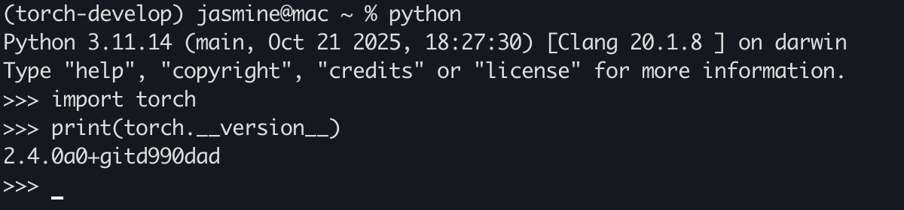

这里介绍如何在 macOS 上从源码编译和安装 PyTorch。

Windows 和 Linux 系统的安装请参考官方文档。

## 环境准备

### Miniconda 安装

```bash
mkdir -p ~/miniconda3
curl https://repo.anaconda.com/miniconda/Miniconda3-latest-MacOSX-arm64.sh -o ~/miniconda3/miniconda.sh
bash ~/miniconda3/miniconda.sh -b -u -p ~/miniconda3
rm ~/miniconda3/miniconda.sh
```

创建一个新的 conda 环境用于 PyTorch 编译和测试：

```bash
conda create -n torch-dev python=3.11
```

激活环境：

```bash
conda activate torch-dev
```

## PyTorch 源码编译安装

这里使用的是 PyTorch 2.4.0 版本作为示例（以后的源码解读也是以这个版本的源码为例）。

克隆 PyTorch 源码：

```bash
git clone -b v.2.4.0 --recursive https://github.com/pytorch/pytorch.git

cd pytorch
```

安装编译依赖：

```bash
conda install cmake=3.26 ninja

# 支持分布式需要安装 libuv
conda install pkg-config libuv

pip install -r requirements.txt
``` 

设置编译选项并编译安装：

```bash
export CMAKE_PREFIX_PATH=${CONDA_PREFIX:-"$(dirname $(which conda))/../"}
MACOSX_DEPLOYMENT_TARGET=11 CC=clang CXX=clang++ DEBUG=1 USE_DISTRIBUTED=1 USE_MPS=1 USE_MKLDNN=0 USE_CUDA=0 BUILD_TEST=0 USE_FBGEMM=0 USE_NNPACK=0 USE_QNNPACK=0 USE_XNNPACK=0 python setup.py develop
```

这里开启 DEBUG 模式，方便后续调试源码。

编译完成后，以下图片中打印的信息表示安装成功：
