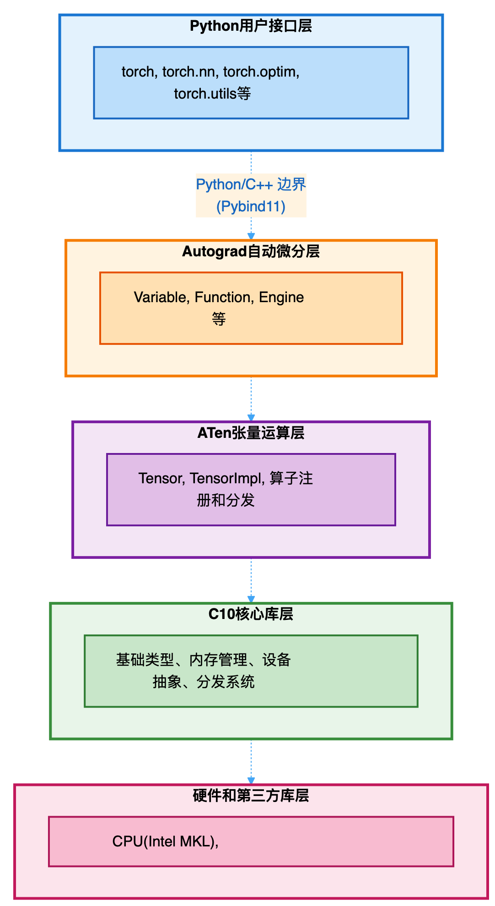
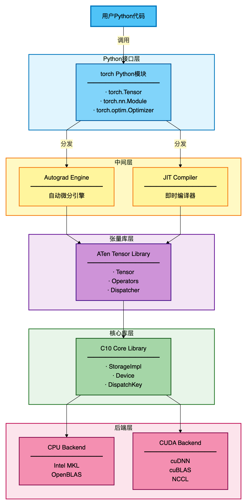
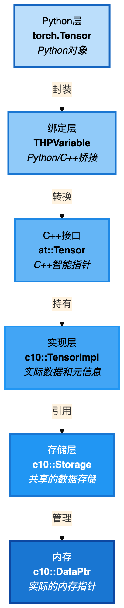
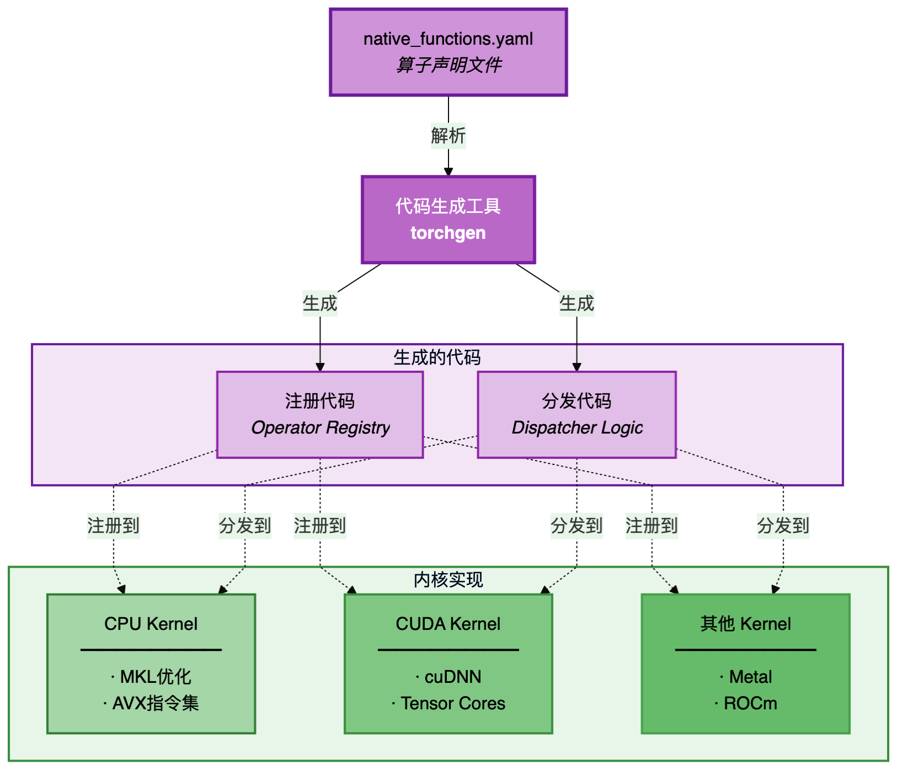
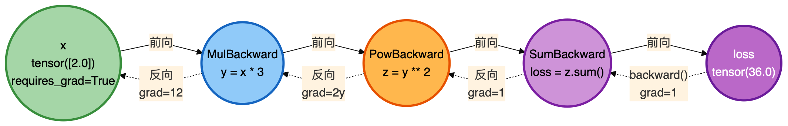
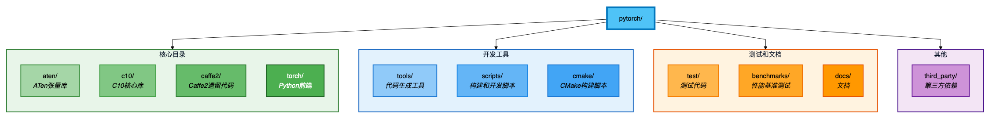
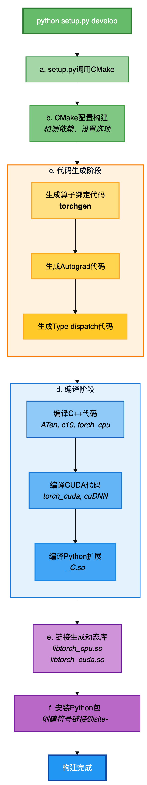
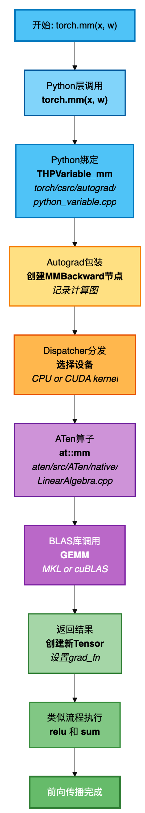
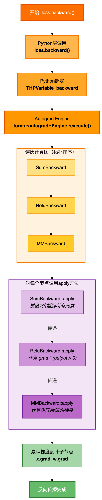
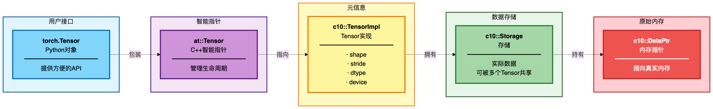

> 首先需要建立对 PyTorch 整体架构的全面认识，理解各个组件的职责和相互关系

## 1. PyTorch 是什么？

PyTorch 是一个开源的深度学习框架，由 Facebook AI Research (FAIR) 开发。它的核心特性包括：

1. **基于张量的计算**：提供类似 NumPy 的张量操作，但支持 GPU 加速
2. **动态计算图**：基于 tape 的自动微分系统，支持动态神经网络
3. **Python优先**：深度集成 Python，易于调试和使用
4. **高性能**：底层使用 C++/CUDA 实现，性能优异

### 1.1 PyTorch 的设计哲学

PyTorch 的设计遵循以下核心理念：

#### Python First
```python
# PyTorch 的 API 设计非常 Pythonic
import torch

# 创建张量就像使用 NumPy 一样自然
x = torch.tensor([[1, 2], [3, 4]], dtype=torch.float32)
y = torch.tensor([[5, 6], [7, 8]], dtype=torch.float32)

# 运算符重载使代码简洁直观
z = x + y
print(z)
```

PyTorch 不是一个 C++ 框架的 Python 绑定，而是从设计之初就深度集成 Python。这意味着：
- 可以使用 Python 的所有特性（动态类型、列表推导、装饰器等）
- 可以无缝使用 Python 生态系统（NumPy, SciPy, matplotlib等）

#### 命令式编程
```python
# 代码按照顺序立即执行，没有延迟
x = torch.randn(3, 4)
print(x)  # 立即可以看到 x 的值

# 可以使用 Python 的控制流
if x.sum() > 0:
    y = x * 2
else:
    y = x / 2
```

不同于 TensorFlow 1.x 的声明式编程（先定义图再执行），PyTorch 采用命令式编程：
- 代码立即执行，便于调试
- 支持 Python 原生控制流（if/for/while）
- 错误信息直接指向问题代码

#### 动态计算图
```python
# 每次前向传播都会构建新的计算图
for i in range(3):
    x = torch.randn(5, requires_grad=True)
    
    # 可以根据数据动态改变网络结构
    if x.sum() > 0:
        y = x.pow(2).sum()
    else:
        y = x.abs().sum()
    
    y.backward()
    print(f"Iteration {i}, gradient: {x.grad}")
    x.grad.zero_()
```

PyTorch 使用动态计算图：
- 计算图在前向传播时动态构建
- 每次迭代可以有不同的网络结构
- 更灵活，更容易实现复杂模型（如 RNN、Tree-RNN 等）

## 2. PyTorch 的层次架构

PyTorch 的架构可以看作是一个层次化的系统，从底层到上层分为以下几个主要层次：


### 2.1 各层详细说明

#### 第一层：Python 用户接口层

这是用户直接交互的层次，包括：

- **torch**：核心模块，提供张量操作、数学函数等
- **torch.nn**：神经网络模块，包含层、损失函数等
- **torch.optim**：优化器模块
- **torch.utils**：工具模块（数据加载、TensorBoard 等）
- **torch.autograd**：自动微分的 Python 接口
- **torch.jit**：JIT 编译器接口
    
**源码位置**：`torch/` 目录

示例：
```python
import torch
import torch.nn as nn
import torch.optim as optim

# 定义一个简单的神经网络
class SimpleNet(nn.Module):
    def __init__(self):
        super().__init__()
        self.fc1 = nn.Linear(10, 20)
        self.fc2 = nn.Linear(20, 1)
    
    def forward(self, x):
        x = torch.relu(self.fc1(x))
        x = self.fc2(x)
        return x

# 创建模型、优化器
model = SimpleNet()
optimizer = optim.SGD(model.parameters(), lr=0.01)
```

#### 第二层：Autograd自动微分层

这一层负责自动微分，是 PyTorch 的核心特性之一。

**核心组件**：
- **Variable**：已经被废弃，现在 Tensor 本身就支持autograd，或者说 Variable  是 Tensor 的一种历史遗留别名
- **Function**：表示一个可微分操作
- **Node**：计算图中的节点
- **Engine**：反向传播引擎

**源码位置**：`torch/csrc/autograd/`

工作原理：
```python
# 当 requires_grad=True 时，PyTorch 会记录操作历史
x = torch.tensor([1.0, 2.0, 3.0], requires_grad=True)
y = x * 2          # 记录：MulBackward
z = y.mean()       # 记录：MeanBackward

# 构建的计算图：
# x -> MulBackward -> y -> MeanBackward -> z

# 反向传播
z.backward()
print(x.grad)  # tensor([0.6667, 0.6667, 0.6667])
```

#### 第三层：ATen张量运算层

ATen (A Tensor Library) 是 PyTorch 的张量运算库，提供所有的张量操作。

**核心组件**：
- **Tensor**：张量的用户接口
- **TensorImpl**：张量的实际实现
- **Operator Registry**：算子注册系统
- **Dispatcher**：算子分发系统
- **Native Functions**：原生算子实现

**源码位置**：`aten/src/ATen/`

ATen的设计特点：
```cpp
// ATen提供统一的张量接口
at::Tensor x = at::randn({2, 3});
at::Tensor y = at::randn({2, 3});

// 算子自动根据设备类型分发到正确的实现
at::Tensor z = x + y;  // CPU加法

at::Tensor x_cuda = x.to(at::kCUDA);
at::Tensor y_cuda = y.to(at::kCUDA);
at::Tensor z_cuda = x_cuda + y_cuda;  // CUDA加法
```

#### 第四层：C10 核心库层

C10 是 "Caffe2 + Tensor" 的缩写，提供 PyTorch 的核心基础设施。

**核心组件**：
- **基础类型**：Scalar, Device, Layout, MemoryFormat等
- **存储管理**：Storage, StorageImpl, Allocator
- **类型系统**：ScalarType, TypeMeta
- **分发键**：DispatchKey, DispatchKeySet
- **工具类**：Optional, ArrayRef, IntArrayRef等

**源码位置**：`c10/`

设计理念：
- 体积小，依赖少（可用于移动端）
- 提供跨模块共享的基础设施
- 设计为 header-only 或最小化编译单元

#### 第五层：硬件和第三方库层

这一层与具体硬件和优化库交互：

- **CPU**：Intel MKL, OpenBLAS, Eigen
- **CUDA**：cuDNN（卷积等）, cuBLAS（矩阵运算）, NCCL（多GPU通信）
- **其他**：Metal（macOS）, ROCm（AMD）, XLA（Google TPU）

## 3. PyTorch 的核心组件

### 3.1 组件关系图



### 3.2 核心组件详解

#### 3.2.1 Tensor

Tensor 是 PyTorch 中最核心的数据结构。

**关键文件**：
- Python: `torch/_tensor.py`
- C++: `aten/src/ATen/core/TensorBase.h`
- Impl: `c10/core/TensorImpl.h`

Tensor的层次结构：



示例代码分析：
```python
import torch

# 创建一个张量
x = torch.randn(3, 4)

# 这个简单的语句背后发生了什么？
# 1. Python 调用 torch.randn
# 2. 通过 pybind11 绑定调用 C++ 的 at::randn
# 3. at::randn 创建 TensorImpl 并分配内存
# 4. 返回 at::Tensor 包装
# 5. 转换为 Python 的 torch.Tensor 对象
```

Tensor的关键属性：
```python
x = torch.randn(3, 4, device='cuda:0', dtype=torch.float32)

# 形状
print(x.shape)        # torch.Size([3, 4])
print(x.size())       # torch.Size([3, 4])

# 数据类型
print(x.dtype)        # torch.float32

# 设备
print(x.device)       # cuda:0

# 步长（内存布局）
print(x.stride())     # (4, 1) - 行优先存储

# 元素总数
print(x.numel())      # 12

# 是否需要梯度
print(x.requires_grad)  # False
```

#### 3.2.2 Storage

Storage 是实际存储数据的底层对象，多个 Tensor 可以共享同一个 Storage。

```python
# 创建张量
x = torch.tensor([1, 2, 3, 4, 5, 6])
print(f"x的storage: {x.data_ptr():#x}")

# 创建视图（共享存储）
y = x.view(2, 3)
print(f"y的storage: {y.data_ptr():#x}")

# 它们指向相同的内存！
print(f"共享存储: {x.data_ptr() == y.data_ptr()}")  # True

# 修改y会影响x
y[0, 0] = 100
print(x)  # tensor([100, 2, 3, 4, 5, 6])
```

Storage的设计优势：
1. **内存共享**：避免不必要的数据复制
2. **视图操作高效**：view, transpose等操作只需改变元数据
3. **引用计数**：自动管理内存生命周期

#### 3.2.3 Operator

算子是对张量进行操作的函数。PyTorch 有数千个算子。

算子的分类：
```python
# 1. 逐元素操作
z = torch.relu(x)
z = x + y
z = torch.sin(x)

# 2. 归约操作
z = x.sum()
z = x.mean(dim=1)
z = x.max()

# 3. 矩阵运算
z = torch.mm(x, y)      # 矩阵乘法
z = torch.matmul(x, y)  # 广播矩阵乘法

# 4. 形状操作
z = x.view(2, -1)
z = x.transpose(0, 1)
z = x.reshape(4, 3)

# 5. 索引和切片
z = x[0, :]
z = x[:, 1:3]
z = torch.index_select(x, 0, indices)
```

算子的实现方式：



#### 3.2.4 Dispatcher

Dispatcher负责根据张量的设备、数据类型等选择正确的算子实现。

```cpp
// 简化的分发过程
at::Tensor add(const at::Tensor& a, const at::Tensor& b) {
    // 1. 计算 dispatch key
    DispatchKeySet keys = a.key_set() | b.key_set();
    
    // 2. 查找对应的kernel
    // 如果是 CPU 张量 -> 调用 CPU add kernel
    // 如果是 CUDA 张量 -> 调用 CUDA add kernel
    // 如果 requires_grad=True -> 调用 Autograd kernel
    
    // 3. 调用 kernel
    return callKernel(keys, a, b);
}
```

DispatchKey的类型：
- **CPU**: CPU张量
- **CUDA**: CUDA张量  
- **AutogradCPU**: CPU张量且需要梯度
- **AutogradCUDA**: CUDA张量且需要梯度
- **Sparse**: 稀疏张量
- **Quantized**: 量化张量
- 等等...

#### 3.2.5 Autograd Engine

Autograd 引擎负责构建计算图和执行反向传播。

计算图的构建：
```python
# 前向传播
x = torch.tensor([2.0], requires_grad=True)
y = x * 3           # 创建MulBackward节点
z = y ** 2          # 创建PowBackward节点
loss = z.sum()      # 创建SumBackward节点

# 查看计算图
print(loss.grad_fn)  # <SumBackward0>
print(loss.grad_fn.next_functions)
# ((<PowBackward0>, 0),)
```

计算图可视化：



反向传播的执行：
```python
# 执行反向传播
loss.backward()

# 计算过程：
# 1. 从 loss 开始（梯度为1）
# 2. 调用 SumBackward 的 backward 方法
# 3. 传递梯度到 PowBackward
# 4. 调用 PowBackward 的 backward 方法
# 5. 传递梯度到 MulBackward
# 6. 调用 MulBackward 的 backward 方法
# 7. 累积梯度到 x.grad

print(x.grad)  # tensor([12.])
# 手动验证: dLoss/dx = dLoss/dz * dz/dy * dy/dx = 1 * 2y * 3 = 2*6*3 = 12
```

## 4. 源码目录结构

### 4.1 顶层目录



### 4.2 核心目录详解

#### c10/ - 核心库
```
c10/
├── core/              # 核心类型
│   ├── TensorImpl.h   # Tensor实现
│   ├── Storage.h      # 存储
│   ├── Device.h       # 设备抽象
│   └── ScalarType.h   # 标量类型
├── util/              # 工具类
│   ├── Optional.h     # 可选类型
│   ├── ArrayRef.h     # 数组引用
│   └── intrusive_ptr.h # 侵入式智能指针
└── cuda/              # CUDA相关
    └── CUDAStream.h   # CUDA流
```

#### aten/ - 张量库
```
aten/
└── src/
    └── ATen/
        ├── core/          # ATen核心
        ├── native/        # 原生算子实现
        │   ├── cpu/       # CPU算子
        │   ├── cuda/      # CUDA算子
        │   ├── sparse/    # 稀疏张量
        │   └── quantized/ # 量化算子
        ├── ops/           # 算子声明
        └── templates/     # 代码生成模板
```

#### torch/ - Python前端
```
torch/
├── __init__.py        # 主模块
├── _C/                # C++扩展（编译生成）
├── nn/                # 神经网络模块
│   ├── modules/       # 层定义
│   ├── functional.py  # 函数式API
│   └── parameter.py   # 参数
├── optim/             # 优化器
├── autograd/          # 自动微分
│   ├── function.py    # Function基类
│   └── grad_mode.py   # 梯度模式
├── utils/             # 工具
│   ├── data/          # 数据加载
│   └── tensorboard/   # TensorBoard
└── csrc/              # C++源码
    ├── autograd/      # Autograd C++实现
    ├── jit/           # JIT编译器
    └── api/           # C++ Frontend
```

#### tools/ - 工具
```
tools/
├── autograd/          # Autograd代码生成
├── codegen/           # 通用代码生成
└── setup_helpers/     # 构建辅助
```

## 5. 编译构建系统

### 5.1 构建流程

PyTorch 使用 CMake 作为主要构建系统，源码安装参考之前的文档。

构建流程详解：



### 5.2 重要的构建选项

```bash
# 禁用 CUDA
USE_CUDA=0 python setup.py develop

# 启用调试模式
DEBUG=1 python setup.py develop

# 禁用分布式
USE_DISTRIBUTED=0 python setup.py develop
```

### 5.3 生成的文件

编译后会生成以下重要文件：

```
build/
├── lib/
│   ├── libtorch_cpu.so    # CPU 算子库
│   ├── libtorch_cuda.so   # CUDA 算子库（如果启用）
│   ├── libtorch_python.so # Python 绑定
│   └── libc10.so          # C10 库
└── bin/
    └── torch_shm_manager  # 共享内存管理器

torch/
├── _C.cpython-*.so        # Python 扩展模块
└── lib/                   # 动态库符号链接
```

## 6. 数据流示例

通过一个完整的例子来看数据是如何在各个层次间流动的：

```python
import torch

# 创建输入张量
x = torch.tensor([[1.0, 2.0]], requires_grad=True)
w = torch.tensor([[3.0], [4.0]], requires_grad=True)

# 前向传播
y = torch.mm(x, w)  # 矩阵乘法
z = torch.relu(y)   # ReLU 激活
loss = z.sum()      # 求和得到标量

# 反向传播
loss.backward()

print(f"x.grad: {x.grad}")
print(f"w.grad: {w.grad}")
```

### 6.1 前向传播流程



### 6.2 反向传播流程



## 7. 关键概念

### 7.1 Tensor vs TensorImpl vs Storage



- **Tensor**: 用户接口，提供方便的API
- **TensorImpl**: 存储元信息（shape, stride, dtype等）
- **Storage**: 实际数据存储，可被多个 Tensor 共享

### 7.2 Operation vs Kernel

- **Operation（算子）**: 抽象的数学操作，如"矩阵乘法"
- **Kernel（核函数）**: 算子在特定后端的具体实现，如 "CPU 上的矩阵乘法"、"CUDA 上的矩阵乘法"

### 7.3 DispatchKey 的作用

DispatchKey 是一个枚举值，用于选择正确的 kernel：


## 8. 最后

到这里应该已经对 PyTorch 的整体架构有了全面的认识，后续会继续深入学习每个核心组件。

## 9. 思考

- 为什么PyTorch选择动态计算图而不是静态计算图？
- 引用计数机制的优缺点是什么？
- Dispatcher如何支持新的设备类型（如Apple Silicon的MPS）？

Answer：

1. PyTorch 选择动态计算图是因为它提供了更大的灵活性和易用性。动态计算图允许用户在运行时定义和修改网络结构，这对于处理复杂的模型（如递归神经网络）非常有用。此外，动态计算图使得调试更加直观，因为代码是按顺序执行的，错误信息可以直接指向问题所在。

2. 引用计数机制的优点包括自动内存管理，减少内存泄漏的风险，以及简化资源释放的过程。缺点是可能导致循环引用的问题，从而无法正确释放内存。此外，引用计数在多线程环境下可能需要额外的同步开销，影响性能。

3. Dispatcher 通过使用 DispatchKey 机制来支持新的设备类型。当引入新的设备（如MPS）时，只需为该设备定义相应的 DispatchKey，并实现对应的 kernel 函数。这样，Dispatcher 在运行时根据张量的 DispatchKey 选择正确的 kernel，从而实现对新设备的支持。

---
