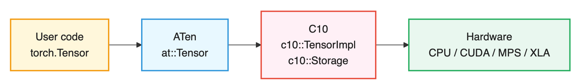
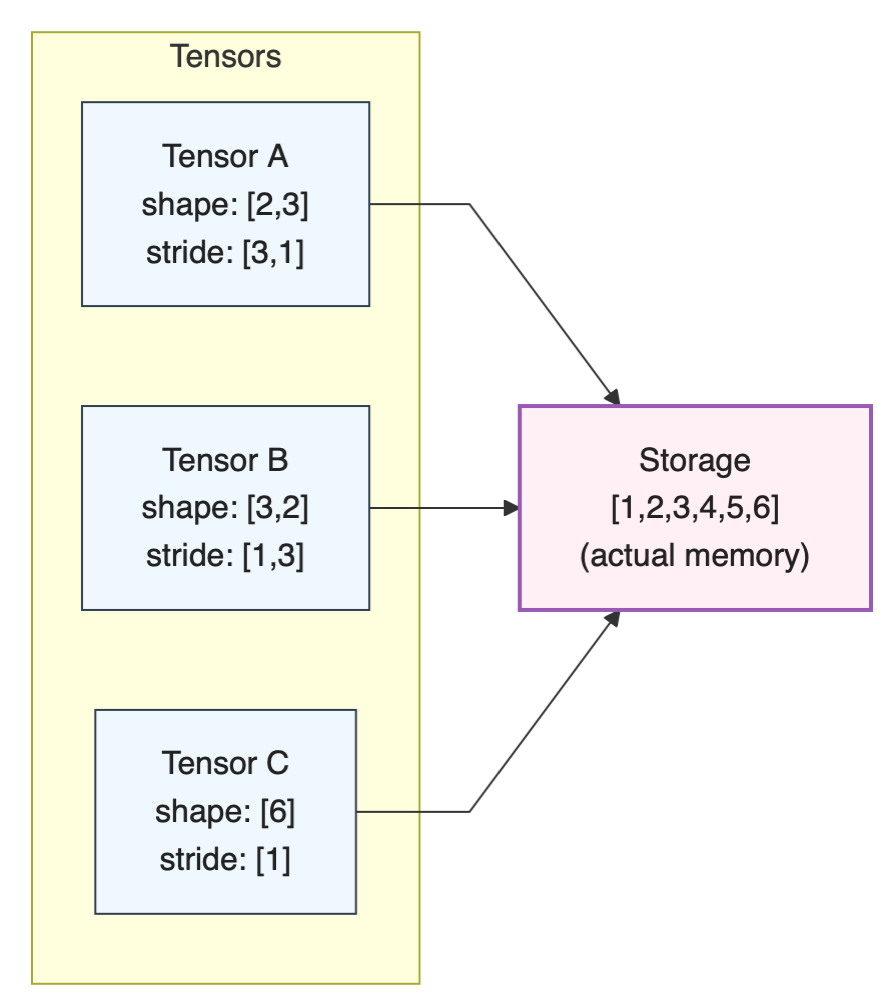
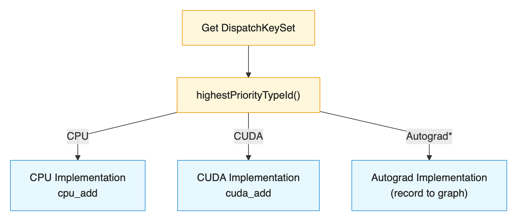
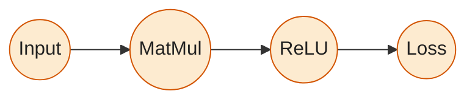

> 前面有了对 PyTorch 整体架构的了解，接下来继续理解 C10 核心库的设计理念和关键组件，掌握 PyTorch 的底层基础设施

## 1. C10是什么？

C10（Caffe2 + Tensor的缩写）是PyTorch的核心基础库，提供了PyTorch运行所需的最基本的数据结构和功能。

### 1.1 C10的设计目标

1. 轻量级：C10设计为一个轻量级的库，依赖最小，适合在移动端和嵌入式设备上运行。
2. 共享性：C10为PyTorch和Caffe2提供共享的基础设施，促进代码复用和一致性。
3. 性能：C10注重高效的内存管理和类型系统，以满足深度学习对性能的严格要求。
4. 可扩展：C10设计为易于扩展，支持新设备类型和数据类型的添加。

### 1.2 C10的层次结构

C10处于PyTorch架构的最底层，为上层提供：
- **基础数据类型**：Scalar, Device, Layout等
- **内存管理**：Storage, Allocator, DataPtr
- **类型系统**：ScalarType, TypeMeta
- **分发系统**：DispatchKey, DispatchKeySet
- **工具类**：Optional, ArrayRef, intrusive_ptr等

### 1.2 C10的层次结构



C10处于PyTorch架构的最底层，为上层提供：
- **基础数据类型**：Scalar, Device, Layout等
- **内存管理**：Storage, Allocator, DataPtr
- **类型系统**：ScalarType, TypeMeta
- **分发系统**：DispatchKey, DispatchKeySet
- **工具类**：Optional, ArrayRef, intrusive_ptr等

### 1.3 源码位置

```
c10/
├── core/              # 核心类型和数据结构
│   ├── TensorImpl.h   # 张量实现
│   ├── Storage.h      # 存储
│   ├── StorageImpl.h  # 存储实现
│   ├── Device.h       # 设备抽象
│   ├── DeviceType.h   # 设备类型枚举
│   ├── ScalarType.h   # 标量类型
│   ├── Layout.h       # 内存布局
│   ├── MemoryFormat.h # 内存格式
│   ├── Allocator.h    # 内存分配器
│   ├── DispatchKey.h  # 分发键
│   └── ...
├── util/              # 工具类
│   ├── Optional.h     # 可选类型
│   ├── ArrayRef.h     # 数组引用
│   ├── intrusive_ptr.h # 侵入式智能指针
│   ├── Exception.h    # 异常处理
│   └── ...
├── cuda/              # CUDA相关
│   ├── CUDAStream.h   # CUDA流
│   ├── CUDAGuard.h    # CUDA设备守卫
│   └── ...
└── macros/            # 宏定义
    └── Export.h       # 导出宏
```

## 2. 核心类型系统

### 2.1 Device

Device表示张量所在的计算设备，由设备类型和设备索引组成。

#### 源码解析：Device类

```cpp
// c10/core/Device.h
struct C10_API Device final {
  using Type = DeviceType;
  
  // 构造函数：从设备类型和索引创建
  Device(DeviceType type, DeviceIndex index = -1)
      : type_(type), index_(index) {
    validate();
  }
  
  // 从字符串创建，如 "cuda:0"
  Device(const std::string& device_string);
  
  // 获取设备类型
  DeviceType type() const noexcept { return type_; }
  
  // 获取设备索引
  DeviceIndex index() const noexcept { return index_; }
  
  // 是否是CUDA设备
  bool is_cuda() const noexcept { 
    return type_ == DeviceType::CUDA; 
  }
  
  // 是否是CPU设备
  bool is_cpu() const noexcept { 
    return type_ == DeviceType::CPU; 
  }
  
private:
  DeviceType type_;    // 设备类型
  DeviceIndex index_;  // 设备索引（-1表示当前设备）
};
```

#### Python使用示例

```python
import torch

# 创建不同设备上的张量
cpu_tensor = torch.randn(3, 4, device='cpu')
print(cpu_tensor.device)  # cpu

if torch.cuda.is_available():
    cuda_tensor = torch.randn(3, 4, device='cuda:0')
    print(cuda_tensor.device)  # cuda:0
    
    # 在多GPU环境下指定GPU
    cuda_tensor_1 = torch.randn(3, 4, device='cuda:1')
    print(cuda_tensor_1.device)  # cuda:1
```

#### DeviceType枚举

```cpp
// c10/core/DeviceType.h
enum class DeviceType : int8_t {
  CPU = 0,          // CPU设备
  CUDA = 1,         // NVIDIA CUDA
  MKLDNN = 2,       // Intel MKLDNN（保留）
  OPENGL = 3,       // OpenGL
  OPENCL = 4,       // OpenCL
  IDEEP = 5,        // Intel IDEEP
  HIP = 6,          // AMD HIP
  FPGA = 7,         // FPGA
  MAIA = 8,         // Microsoft MAIA
  XLA = 9,          // Google XLA/TPU
  Vulkan = 10,      // Vulkan
  Metal = 11,       // Apple Metal
  XPU = 12,         // Intel XPU
  MPS = 13,         // Apple Metal Performance Shaders
  Meta = 14,        // Meta设备（无实际数据）
  HPU = 15,         // Habana HPU
  VE = 16,          // NEC SX-Aurora
  Lazy = 17,        // 延迟张量
  IPU = 18,         // Graphcore IPU
  MTIA = 19,        // Meta训练和推理设备
  PrivateUse1 = 20, // 私有设备类型1（用于扩展）
  COMPILE_TIME_MAX_DEVICE_TYPES = 21,
};
```

**关键点**：
- 使用 `int8_t` 节省内存
- 支持20+种设备类型
- `PrivateUse1` 允许用户自定义设备类型
- `Meta` 设备用于元信息传递，不分配实际内存

#### 设备索引的含义

```python
# 设备索引示例
device1 = torch.device('cuda')      # index = -1（当前设备）
device2 = torch.device('cuda:0')    # index = 0（第0号GPU）
device3 = torch.device('cuda:1')    # index = 1（第1号GPU）

# CPU设备的索引必须是0或-1
device4 = torch.device('cpu')       # index = -1
device5 = torch.device('cpu:0')     # index = 0（合法但不常用）
```

### 2.2 ScalarType

ScalarType定义了张量元素的数据类型。

#### ScalarType枚举

```cpp
// c10/core/ScalarType.h
enum class ScalarType : int8_t {
  Byte = 0,          // uint8_t
  Char = 1,          // int8_t
  Short = 2,         // int16_t
  Int = 3,           // int32_t
  Long = 4,          // int64_t
  Half = 5,          // float16
  Float = 6,         // float32
  Double = 7,        // float64
  ComplexHalf = 8,   // complex<float16>
  ComplexFloat = 9,  // complex<float32>
  ComplexDouble = 10,// complex<float64>
  Bool = 11,         // bool
  QInt8 = 12,        // 量化int8
  QUInt8 = 13,       // 量化uint8
  QInt32 = 14,       // 量化int32
  BFloat16 = 15,     // bfloat16
  Float8_e5m2 = 23,  // float8（5位指数，2位尾数）
  Float8_e4m3fn = 24,// float8（4位指数，3位尾数）
  // ... 更多类型
};
```

#### Python中的数据类型

```python
import torch

# 创建不同类型的张量
x_float32 = torch.tensor([1.0, 2.0], dtype=torch.float32)
x_float64 = torch.tensor([1.0, 2.0], dtype=torch.float64)
x_int32 = torch.tensor([1, 2], dtype=torch.int32)
x_int64 = torch.tensor([1, 2], dtype=torch.int64)
x_bool = torch.tensor([True, False], dtype=torch.bool)

# 半精度浮点数（常用于深度学习）
x_float16 = torch.tensor([1.0, 2.0], dtype=torch.float16)
x_bfloat16 = torch.tensor([1.0, 2.0], dtype=torch.bfloat16)

# 复数类型
x_complex64 = torch.tensor([1+2j, 3+4j], dtype=torch.complex64)

print(f"float32 size: {x_float32.element_size()} bytes")  # 4
print(f"float64 size: {x_float64.element_size()} bytes")  # 8
print(f"float16 size: {x_float16.element_size()} bytes")  # 2
```

#### 类型转换

```python
# 类型转换
x = torch.randn(3, 4)
print(x.dtype)  # torch.float32

# 转换为不同类型
y = x.to(torch.float64)
z = x.to(torch.int32)
w = x.half()  # 等价于 x.to(torch.float16)

# 类型提升（自动）
a = torch.tensor([1], dtype=torch.int32)
b = torch.tensor([2.0], dtype=torch.float32)
c = a + b  # 结果自动提升为float32
print(c.dtype)  # torch.float32
```

### 2.3 Layout

Layout描述张量在内存中的组织方式。

```cpp
// c10/core/Layout.h
enum class Layout : int8_t {
  Strided = 0,      // 步长张量（密集或非密集）
  Sparse = 1,       // 稀疏张量（COO格式）
  Mkldnn = 2,       // MKLDNN专用布局
  SparseCsr = 3,    // 稀疏CSR格式
  SparseCsc = 4,    // 稀疏CSC格式
  SparseBsr = 5,    // 稀疏BSR格式
  SparseBsc = 6,    // 稀疏BSC格式
  // ...
};
```

#### Layout示例

```python
import torch

# 密集张量（默认，Strided layout）
dense = torch.randn(100, 100)
print(dense.layout)  # torch.strided

# 稀疏张量（Sparse COO格式）
indices = torch.tensor([[0, 1, 1], [2, 0, 2]])
values = torch.tensor([3.0, 4.0, 5.0])
sparse_coo = torch.sparse_coo_tensor(indices, values, (2, 3))
print(sparse_coo.layout)  # torch.sparse_coo

# 稀疏CSR张量
crow_indices = torch.tensor([0, 2, 4])
col_indices = torch.tensor([0, 1, 0, 1])
values = torch.tensor([1., 2., 3., 4.])
sparse_csr = torch.sparse_csr_tensor(crow_indices, col_indices, values)
print(sparse_csr.layout)  # torch.sparse_csr
```

### 2.4 MemoryFormat

MemoryFormat定义张量数据在内存中的排列顺序。

```cpp
// c10/core/MemoryFormat.h
enum class MemoryFormat : int8_t {
  Contiguous = 0,           // 连续内存（NCHW）
  Preserve = 1,             // 保持原有格式
  ChannelsLast = 2,         // 通道在最后（NHWC）
  ChannelsLast3d = 3,       // 3D通道在最后（NDHWC）
};
```

#### 内存格式对比

```python
import torch

# NCHW格式（默认，Contiguous）
x_nchw = torch.randn(2, 3, 4, 4)  # [Batch, Channel, Height, Width]
print(x_nchw.stride())  # (48, 16, 4, 1)
# 内存布局：N0C0H0W0, N0C0H0W1, ..., N0C0H1W0, ...

# NHWC格式（ChannelsLast，对某些GPU操作更友好）
x_nhwc = x_nchw.contiguous(memory_format=torch.channels_last)
print(x_nhwc.stride())  # (48, 1, 12, 3)
# 内存布局：N0H0W0C0, N0H0W0C1, N0H0W0C2, N0H0W1C0, ...

# 性能对比（某些卷积操作）
import time

x = torch.randn(64, 3, 224, 224, device='cuda')
conv = torch.nn.Conv2d(3, 64, 3, padding=1).cuda()

# NCHW格式
x_nchw = x.contiguous(memory_format=torch.contiguous_format)
start = time.time()
for _ in range(100):
    y = conv(x_nchw)
torch.cuda.synchronize()
print(f"NCHW time: {time.time() - start:.4f}s")

# NHWC格式（可能更快，取决于硬件）
x_nhwc = x.contiguous(memory_format=torch.channels_last)
conv_nhwc = conv.to(memory_format=torch.channels_last)
start = time.time()
for _ in range(100):
    y = conv_nhwc(x_nhwc)
torch.cuda.synchronize()
print(f"NHWC time: {time.time() - start:.4f}s")
```

## 3. 存储系统

### 3.1 Storage

Storage是实际存储张量数据的底层对象。

#### Storage的设计理念



#### Storage类结构

```cpp
// c10/core/Storage.h（简化版）
struct C10_API Storage {
  // 构造函数
  Storage(
      use_byte_size_t,
      size_t size_bytes,
      Allocator* allocator = nullptr,
      bool resizable = false);
  
  // 获取数据指针
  void* data() const { return storage_impl_->data(); }
  
  // 获取字节数
  size_t nbytes() const { return storage_impl_->nbytes(); }
  
  // 获取设备
  Device device() const { return storage_impl_->device(); }
  
  // 获取分配器
  Allocator* allocator() const { 
    return storage_impl_->allocator(); 
  }
  
  // 是否可调整大小
  bool resizable() const { 
    return storage_impl_->resizable(); 
  }
  
private:
  // 使用intrusive_ptr进行引用计数
  c10::intrusive_ptr<StorageImpl> storage_impl_;
};
```

#### Python中查看Storage

```python
import torch

# 创建张量
x = torch.tensor([1, 2, 3, 4, 5, 6])
print(f"x的data_ptr: {x.data_ptr():#x}")
print(f"x的storage大小: {x.storage().size()}")

# view操作共享存储
y = x.view(2, 3)
print(f"y的data_ptr: {y.data_ptr():#x}")
print(f"共享存储: {x.data_ptr() == y.data_ptr()}")  # True

# 修改y会影响x
y[0, 0] = 100
print(x)  # tensor([100, 2, 3, 4, 5, 6])

# clone会创建新存储
z = x.clone()
print(f"z的data_ptr: {z.data_ptr():#x}")
print(f"共享存储: {x.data_ptr() == z.data_ptr()}")  # False
```

### 3.2 StorageImpl

StorageImpl是Storage的实际实现，包含数据指针和元信息。

```cpp
// c10/core/StorageImpl.h（简化版）
struct C10_API StorageImpl : public c10::intrusive_ptr_target {
  StorageImpl(
      use_byte_size_t,
      SymInt size_bytes,
      DataPtr data_ptr,
      Allocator* allocator,
      bool resizable);
  
  // 数据指针
  void* data() const { return data_ptr_.get(); }
  
  // 获取字节数
  SymInt nbytes() const { return size_bytes_; }
  
  // 设备信息
  Device device() const { return data_ptr_.device(); }
  
  // 分配器
  Allocator* allocator() { return allocator_; }
  
  // 引用计数（继承自intrusive_ptr_target）
  // 使用原子操作保证线程安全
  
private:
  DataPtr data_ptr_;        // 智能指针，管理实际内存
  SymInt size_bytes_;       // 字节数
  Allocator* allocator_;    // 分配器
  bool resizable_;          // 是否可调整大小
};
```

### 3.3 DataPtr

DataPtr是一个智能指针，负责管理实际的内存。

```cpp
// c10/core/Allocator.h
class C10_API DataPtr {
public:
  DataPtr() = default;
  
  DataPtr(void* data, Device device)
      : ptr_(data), device_(device) {}
  
  DataPtr(void* data, void* ctx, DeleterFnPtr deleter, Device device)
      : ptr_(data), 
        ctx_(ctx, deleter),  // unique_ptr with custom deleter
        device_(device) {}
  
  void* get() const { return ptr_; }
  Device device() const { return device_; }
  
  // 移动语义
  DataPtr(DataPtr&&) = default;
  DataPtr& operator=(DataPtr&&) = default;
  
  // 禁止拷贝
  DataPtr(const DataPtr&) = delete;
  DataPtr& operator=(const DataPtr&) = delete;
  
private:
  void* ptr_ = nullptr;
  std::unique_ptr<void, DeleterFnPtr> ctx_;
  Device device_;
};
```

**关键设计**：
- 使用移动语义，避免拷贝
- 自定义删除器，支持不同的内存释放方式
- 包含设备信息，方便跨设备管理

### 3.4 Allocator

Allocator定义了内存分配和释放的接口。

```cpp
// c10/core/Allocator.h
class C10_API Allocator {
public:
  virtual ~Allocator() = default;
  
  // 分配内存
  virtual DataPtr allocate(size_t n) = 0;
  
  // 获取删除器
  virtual DeleterFnPtr raw_deleter() const {
    return nullptr;
  }
  
  // 复制数据（可选）
  virtual void copy_data(
      void* dest,
      const void* src,
      std::size_t count) const {
    std::memcpy(dest, src, count);
  }
};
```

#### PyTorch中的Allocator实现

```
Allocator（抽象接口）
    ↓
    ├── CPUAllocator          # CPU内存分配
    ├── CUDACachingAllocator  # CUDA缓存分配器
    ├── MPSAllocator          # Apple MPS
    └── 其他设备分配器...
```

#### CPU Allocator示例

```cpp
// c10/core/CPUAllocator.cpp（简化）
struct CPUAllocator : public Allocator {
  DataPtr allocate(size_t nbytes) override {
    void* data = aligned_alloc(64, nbytes);  // 64字节对齐
    return {data, data, &free, Device(DeviceType::CPU)};
  }
  
  DeleterFnPtr raw_deleter() const override {
    return &free;
  }
};
```

## 4. TensorImpl

TensorImpl是张量的核心实现类，包含所有元信息。

### 4.1 TensorImpl的组成

```
TensorImpl
├── Storage（存储）         # 实际数据
├── sizes（形状）           # [2, 3, 4]
├── strides（步长）         # [12, 4, 1]
├── storage_offset（偏移）  # 0
├── dtype（数据类型）       # float32
├── device（设备）          # cuda:0
├── is_contiguous（连续性） # true
├── requires_grad（梯度）   # false
└── AutogradMeta（自动微分）# grad_fn, grad等
```

### 4.2 TensorImpl类结构

```cpp
// c10/core/TensorImpl.h（大幅简化）
struct C10_API TensorImpl : public c10::intrusive_ptr_target {
  // 构造函数
  TensorImpl(
      Storage&& storage,
      DispatchKeySet key_set,
      const caffe2::TypeMeta data_type);
  
  // 形状相关
  IntArrayRef sizes() const { return sizes_and_strides_.sizes(); }
  IntArrayRef strides() const { return sizes_and_strides_.strides(); }
  int64_t dim() const { return sizes_and_strides_.size(); }
  int64_t size(int64_t d) const { return sizes()[d]; }
  int64_t stride(int64_t d) const { return strides()[d]; }
  
  // 元素总数
  int64_t numel() const {
    return multiply_integers(sizes());
  }
  
  // 存储相关
  const Storage& storage() const { return storage_; }
  int64_t storage_offset() const { return storage_offset_; }
  
  // 类型相关
  ScalarType scalar_type() const {
    return typeMetaToScalarType(dtype_);
  }
  const caffe2::TypeMeta& dtype() const { return dtype_; }
  
  // 设备相关
  Device device() const { return storage_.device(); }
  
  // 数据指针
  template <typename T>
  T* data_ptr() const {
    return static_cast<T*>(storage_.data()) + storage_offset_;
  }
  
  // 连续性
  bool is_contiguous() const {
    return is_contiguous_custom(MemoryFormat::Contiguous);
  }
  
  // Autograd相关
  bool requires_grad() const {
    return autograd_meta_ && autograd_meta_->requires_grad();
  }
  
  // 分发键
  DispatchKeySet key_set() const { return key_set_; }
  
private:
  Storage storage_;                  // 存储
  c10::impl::SizesAndStrides sizes_and_strides_;  // 形状和步长
  int64_t storage_offset_ = 0;       // 存储偏移
  int64_t numel_ = 1;                // 元素总数（缓存）
  caffe2::TypeMeta dtype_;           // 数据类型
  DispatchKeySet key_set_;           // 分发键集合
  
  // Autograd元数据（延迟分配）
  std::unique_ptr<c10::AutogradMetaInterface> autograd_meta_;
  
  // Python对象（如果从Python创建）
  c10::impl::PyObjectSlot pyobj_slot_;
};
```

### 4.3 SizesAndStrides

```cpp
// c10/core/impl/SizesAndStrides.h
class C10_API SizesAndStrides {
public:
  // 小张量优化：5维以内使用栈内存
  static constexpr size_t size_bytes = 5 * sizeof(int64_t);
  using sizes_type = SmallVector<int64_t, size_bytes>;
  
  IntArrayRef sizes() const { return sizes_; }
  IntArrayRef strides() const { return strides_; }
  
  void resize(size_t size) {
    sizes_.resize(size);
    strides_.resize(size);
  }
  
  void set_size(size_t dim, int64_t size) {
    sizes_[dim] = size;
  }
  
  void set_stride(size_t dim, int64_t stride) {
    strides_[dim] = stride;
  }
  
private:
  sizes_type sizes_;
  sizes_type strides_;
};
```

**SmallVector优化**：
- 小于等于5维的张量使用栈内存
- 大于5维的张量使用堆内存
- 避免小张量的内存分配开销

### 4.4 Stride 的含义

`Stride` 定义了在每个维度上移动一个元素需要跨越多少个元素。

```python
import torch

# 2D张量的步长
x = torch.tensor([[1, 2, 3],
                  [4, 5, 6]])
print(f"shape: {x.shape}")      # torch.Size([2, 3])
print(f"stride: {x.stride()}")  # (3, 1)

# stride[0] = 3: 第0维移动1步，需要跨越3个元素
# stride[1] = 1: 第1维移动1步，需要跨越1个元素

# 访问 x[1, 2] 的内存偏移 = 1 * stride[0] + 2 * stride[1] = 1*3 + 2*1 = 5
# 实际: x.storage()[5] = 6 ✓

# 转置后的步长
y = x.t()  # 转置
print(f"shape: {y.shape}")      # torch.Size([3, 2])
print(f"stride: {y.stride()}")  # (1, 3)
# 注意：转置只改变步长，不复制数据！

# 非连续张量
z = x[:, ::2]  # 每隔一列取一个
print(f"shape: {z.shape}")        # torch.Size([2, 2])
print(f"stride: {z.stride()}")    # (3, 2)
print(f"is_contiguous: {z.is_contiguous()}")  # False
```

### 4.5 Contiguous

`contiguous` 张量是指元素在内存中按照行优先顺序排列。

```python
# 判断连续性
x = torch.randn(2, 3, 4)
print(x.is_contiguous())  # True

# 转置破坏连续性
y = x.transpose(0, 1)
print(y.is_contiguous())  # False

# 恢复连续性
z = y.contiguous()
print(z.is_contiguous())  # True
print(y.data_ptr() == z.data_ptr())  # False（创建了新存储）

# 为什么需要连续性？
# 某些操作要求输入是连续的（如view）
x = torch.randn(2, 3)
y = x.t()  # 转置，非连续
try:
    z = y.view(6)  # 错误！
except RuntimeError as e:
    print(f"Error: {e}")
    # view size is not compatible with input tensor's size and stride

# 解决方法
z = y.contiguous().view(6)  # 正确
```

## 5. 分发系统

### 5.1 DispatchKey

DispatchKey用于选择正确的算子实现。

```cpp
// c10/core/DispatchKey.h（简化）
enum class DispatchKey : uint16_t {
  Undefined = 0,
  
  // 后端键
  CPU,
  CUDA,
  HIP,
  XLA,
  MPS,
  Meta,
  // ...
  
  // 功能键
  Autograd,
  AutogradCPU,
  AutogradCUDA,
  AutogradXLA,
  // ...
  
  // 其他键
  Sparse,
  SparseCPU,
  SparseCUDA,
  // ...
  
  Quantized,
  // ...
  
  // 最大值
  NumDispatchKeys,
};
```

### 5.2 DispatchKeySet

DispatchKeySet是DispatchKey的集合，用位集表示。

```cpp
// c10/core/DispatchKeySet.h（简化）
class DispatchKeySet final {
public:
  // 构造函数
  constexpr DispatchKeySet() : repr_(0) {}
  constexpr DispatchKeySet(DispatchKey k)
      : repr_(1ULL << static_cast<uint8_t>(k)) {}
  
  // 添加键
  DispatchKeySet add(DispatchKey k) const {
    return DispatchKeySet(repr_ | (1ULL << static_cast<uint8_t>(k)));
  }
  
  // 移除键
  DispatchKeySet remove(DispatchKey k) const {
    return DispatchKeySet(repr_ & ~(1ULL << static_cast<uint8_t>(k)));
  }
  
  // 检查是否包含
  bool has(DispatchKey k) const {
    return repr_ & (1ULL << static_cast<uint8_t>(k));
  }
  
  // 获取最高优先级的键
  DispatchKey highestPriorityTypeId() const;
  
private:
  uint64_t repr_;  // 位集表示
};
```

### 5.3 分发示例

```cpp
// 伪代码：算子分发过程
Tensor add(const Tensor& a, const Tensor& b) {
  // 1. 获取分发键集合
  DispatchKeySet keys = a.key_set() | b.key_set();
  
  // 2. 获取最高优先级的键
  DispatchKey key = keys.highestPriorityTypeId();
  
  // 3. 根据键分发到对应实现
  switch (key) {
    case DispatchKey::CPU:
      return cpu_add(a, b);
    case DispatchKey::CUDA:
      return cuda_add(a, b);
    case DispatchKey::AutogradCPU:
      return autograd_add(a, b);  // 会记录到计算图
    // ...
  }
}
```



## 6. 工具类

### 6.1 intrusive_ptr

PyTorch使用自定义的侵入式智能指针进行引用计数。

```cpp
// c10/util/intrusive_ptr.h（简化）
template <typename T>
class intrusive_ptr final {
public:
  // 构造函数
  intrusive_ptr() : target_(nullptr) {}
  intrusive_ptr(T* target) : target_(target) {
    retain_();
  }
  
  // 拷贝构造
  intrusive_ptr(const intrusive_ptr& rhs) : target_(rhs.target_) {
    retain_();
  }
  
  // 移动构造
  intrusive_ptr(intrusive_ptr&& rhs) noexcept : target_(rhs.target_) {
    rhs.target_ = nullptr;
  }
  
  // 析构函数
  ~intrusive_ptr() {
    reset_();
  }
  
  // 获取指针
  T* get() const { return target_; }
  T& operator*() const { return *target_; }
  T* operator->() const { return target_; }
  
private:
  void retain_() {
    if (target_) {
      target_->refcount_.fetch_add(1, std::memory_order_relaxed);
    }
  }
  
  void reset_() {
    if (target_) {
      if (target_->refcount_.fetch_sub(1, std::memory_order_acq_rel) == 1) {
        delete target_;
      }
    }
    target_ = nullptr;
  }
  
  T* target_;
};

// 基类：提供引用计数
struct intrusive_ptr_target {
  mutable std::atomic<size_t> refcount_{0};
  virtual ~intrusive_ptr_target() = default;
};
```

**侵入式vs非侵入式**：
- **非侵入式**（如`std::shared_ptr`）：控制块和对象分离
- **侵入式**：引用计数在对象内部，更高效

### 6.2 ArrayRef

ArrayRef是一个轻量级的数组视图，不拥有数据。

```cpp
// c10/util/ArrayRef.h（简化）
template <typename T>
class ArrayRef final {
public:
  // 从数组构造
  template <size_t N>
  constexpr ArrayRef(const std::array<T, N>& arr)
      : data_(arr.data()), length_(N) {}
  
  // 从vector构造
  ArrayRef(const std::vector<T>& vec)
      : data_(vec.data()), length_(vec.size()) {}
  
  // 从指针和长度构造
  constexpr ArrayRef(const T* data, size_t length)
      : data_(data), length_(length) {}
  
  // 访问元素
  const T& operator[](size_t index) const {
    return data_[index];
  }
  
  size_t size() const { return length_; }
  const T* data() const { return data_; }
  
  // 迭代器
  const T* begin() const { return data_; }
  const T* end() const { return data_ + length_; }
  
private:
  const T* data_;
  size_t length_;
};
```

**优势**：
- 零开销抽象
- 避免vector/array的拷贝
- 统一的接口

### 6.3 Optional

```cpp
// c10/util/Optional.h
template <typename T>
class optional {
public:
  optional() : init_(false) {}
  optional(const T& value) : init_(true) {
    new (&storage_) T(value);
  }
  
  bool has_value() const { return init_; }
  
  const T& value() const {
    TORCH_CHECK(init_, "optional has no value");
    return *reinterpret_cast<const T*>(&storage_);
  }
  
  T value_or(const T& default_value) const {
    return init_ ? value() : default_value;
  }
  
private:
  alignas(T) char storage_[sizeof(T)];
  bool init_;
};
```

## 7. 总结

### 7.1 C10核心概念总结

```mermaid
graph LR
  T[Tensor\n(用户接口)] --> TI[TensorImpl]
  TI --> S[Storage]
  TI --> M[Metadata\n(shape / stride / dtype)]
  TI --> DK[DispatchKey\n(分发键)]

  S --> DP[DataPtr]
  DP --> AL[Allocator]
  DK --> DISP[Dispatcher]
  DISP --> K[Kernel]
  AL --> DV[Device]

  class T topClass; class TI coreClass; class S storageClass; class M metaClass; class DK keyClass; class DISP dispClass; class K kernelClass; class DP dpClass; class AL allocClass; class DV devClass;

  classDef topClass fill:#fff7db,stroke:#f39c12,stroke-width:2px,color:#222;
  classDef coreClass fill:#fff0f6,stroke:#e74c3c,stroke-width:2px,color:#222;
  classDef storageClass fill:#fff0f5,stroke:#9b59b6,stroke-width:1px,color:#222;
  classDef metaClass fill:#f0f8ff,stroke:#2c3e50,stroke-width:1px,color:#222;
  classDef keyClass fill:#e8f8ff,stroke:#3498db,stroke-width:1px,color:#222;
  classDef dispClass fill:#e9f7ef,stroke:#27ae60,stroke-width:1px,color:#222;
  classDef kernelClass fill:#fff4e6,stroke:#d35400,stroke-width:1px,color:#222;
  classDef dpClass fill:#f7fcf5,stroke:#16a085,stroke-width:1px,color:#222;
  classDef allocClass fill:#fef5f7,stroke:#c0392b,stroke-width:1px,color:#222;
  classDef devClass fill:#ecf8ff,stroke:#1f618d,stroke-width:1px,color:#222;
```

#### 计算图示例（节点为圆形）

下面给出一个简单的计算图示例，节点使用圆形并带颜色：



### 7.2 关键要点

1. **Device**: 抽象计算设备，支持20+种设备类型
2. **ScalarType**: 定义数据类型，支持30+种类型
3. **Storage**: 实际数据存储，可被多个Tensor共享
4. **TensorImpl**: 张量实现，包含所有元信息
5. **DispatchKey**: 分发键，用于选择正确的kernel
6. **intrusive_ptr**: 高效的引用计数智能指针


## 8. 思考

- 为什么要使用intrusive_ptr而不是shared_ptr？
- Storage的设计如何支持zero-copy操作？
- DispatchKey如何实现可扩展性？

Answers:
1. intrusive_ptr将引用计数嵌入对象内部，减少内存开销和提高性能，适合高频率创建销毁的对象。
2. Storage通过DataPtr管理实际内存，可以共享数据指针，避免不必要的内存拷贝。
3. DispatchKey使用位集表示，允许动态添加新的键，支持用户自定义设备类型和功能键。

---