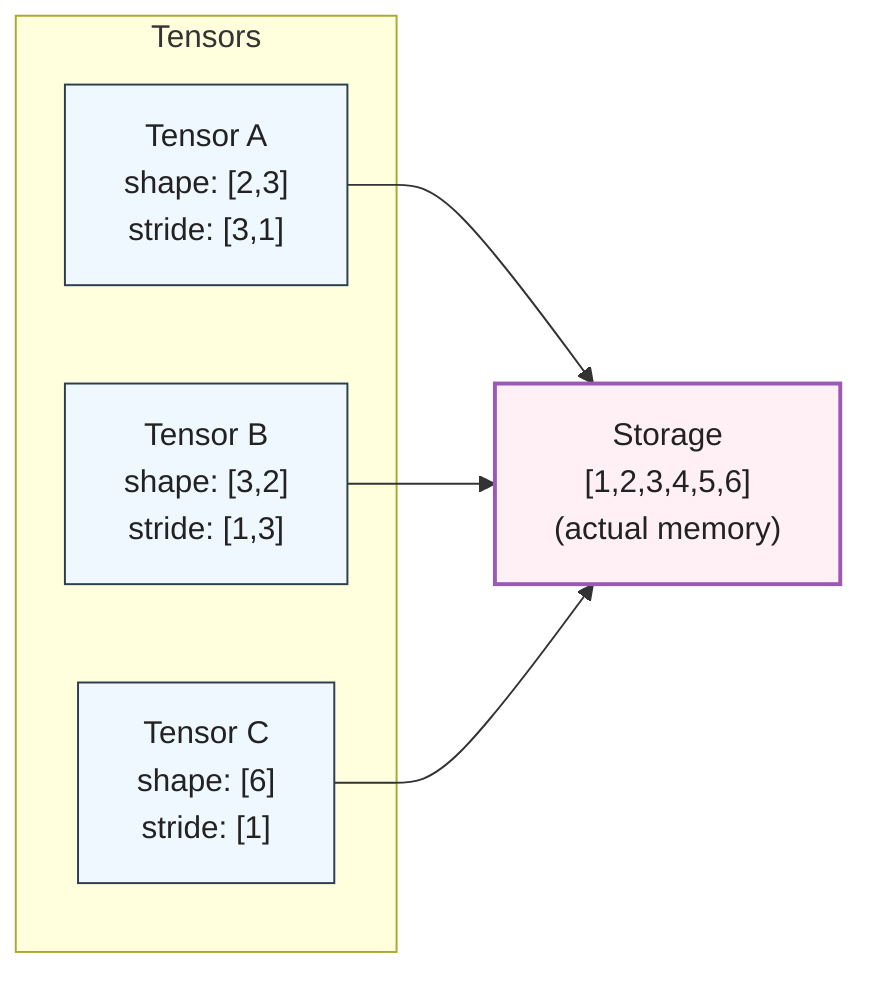
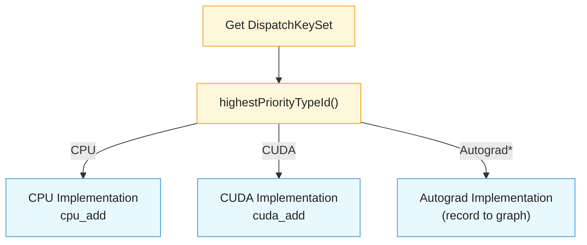
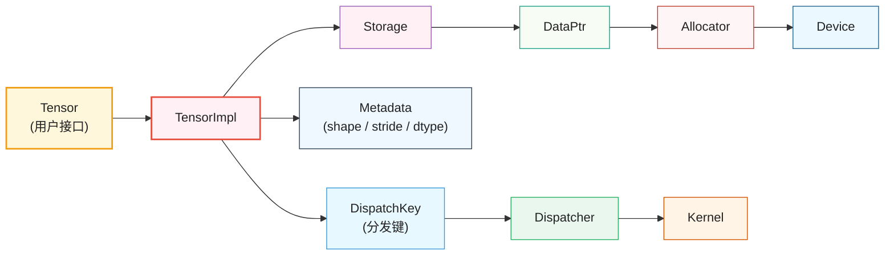

> 前面有了对 PyTorch 整体架构的了解，接下来继续理解 C10 核心库的设计理念和关键组件，掌握 PyTorch 的底层基础设施

## 1. C10是什么？

C10（Caffe2 + Tensor的缩写）是PyTorch的核心基础库，提供了PyTorch运行所需的最基本的数据结构和功能。

### 1.1 C10的设计目标

1. 轻量级：C10设计为一个轻量级的库，依赖最小，适合在移动端和嵌入式设备上运行。
2. 共享性：C10为PyTorch和Caffe2提供共享的基础设施，促进代码复用和一致性。
3. 性能：C10注重高效的内存管理和类型系统，以满足深度学习对性能的严格要求。
4. 可扩展：C10设计为易于扩展，支持新设备类型和数据类型的添加。

### 1.2 C10的层次结构


C10处于PyTorch架构的最底层，为上层提供：
- **基础数据类型**：Scalar, Device, Layout等
- **内存管理**：Storage, Allocator, DataPtr
- **类型系统**：ScalarType, TypeMeta
- **分发系统**：DispatchKey, DispatchKeySet
- **工具类**：Optional, ArrayRef, intrusive_ptr等

### 1.3 源码位置

```
c10/
├── core/              # 核心类型和数据结构
│   ├── TensorImpl.h   # 张量实现
│   ├── Storage.h      # 存储
│   ├── StorageImpl.h  # 存储实现
│   ├── Device.h       # 设备抽象
│   ├── DeviceType.h   # 设备类型枚举
│   ├── ScalarType.h   # 标量类型
│   ├── Layout.h       # 内存布局
│   ├── MemoryFormat.h # 内存格式
│   ├── Allocator.h    # 内存分配器
│   ├── DispatchKey.h  # 分发键
│   └── ...
├── util/              # 工具类
│   ├── Optional.h     # 可选类型
│   ├── ArrayRef.h     # 数组引用
│   ├── intrusive_ptr.h # 侵入式智能指针
│   ├── Exception.h    # 异常处理
│   └── ...
├── cuda/              # CUDA相关
│   ├── CUDAStream.h   # CUDA流
│   ├── CUDAGuard.h    # CUDA设备守卫
│   └── ...
└── macros/            # 宏定义
    └── Export.h       # 导出宏
```

## 2. 核心类型系统

### 2.1 Device

Device表示张量所在的计算设备，由设备类型和设备索引组成。

#### 源码解析：Device类

```cpp
// c10/core/Device.h
struct C10_API Device final {
  using Type = DeviceType;
  
  // 构造函数：从设备类型和索引创建
  Device(DeviceType type, DeviceIndex index = -1)
      : type_(type), index_(index) {
    validate();
  }
  
  // 从字符串创建，如 "cuda:0"
  Device(const std::string& device_string);
  
  // 获取设备类型
  DeviceType type() const noexcept { return type_; }
  
  // 获取设备索引
  DeviceIndex index() const noexcept { return index_; }
  
  // 是否是CUDA设备
  bool is_cuda() const noexcept { 
    return type_ == DeviceType::CUDA; 
  }
  
  // 是否是CPU设备
  bool is_cpu() const noexcept { 
    return type_ == DeviceType::CPU; 
  }
  
private:
  DeviceType type_;    // 设备类型
  DeviceIndex index_;  // 设备索引（-1表示当前设备）
};
```

#### Python使用示例

```python
import torch

# 创建不同设备上的张量
cpu_tensor = torch.randn(3, 4, device='cpu')
print(cpu_tensor.device)  # cpu

if torch.cuda.is_available():
    cuda_tensor = torch.randn(3, 4, device='cuda:0')
    print(cuda_tensor.device)  # cuda:0
    
    # 在多GPU环境下指定GPU
    cuda_tensor_1 = torch.randn(3, 4, device='cuda:1')
    print(cuda_tensor_1.device)  # cuda:1
```

#### DeviceType枚举

```cpp
// c10/core/DeviceType.h
enum class DeviceType : int8_t {
  CPU = 0,          // CPU设备
  CUDA = 1,         // NVIDIA CUDA
  MKLDNN = 2,       // Intel MKLDNN（保留）
  OPENGL = 3,       // OpenGL
  OPENCL = 4,       // OpenCL
  IDEEP = 5,        // Intel IDEEP
  HIP = 6,          // AMD HIP
  FPGA = 7,         // FPGA
  MAIA = 8,         // Microsoft MAIA
  XLA = 9,          // Google XLA/TPU
  Vulkan = 10,      // Vulkan
  Metal = 11,       // Apple Metal
  XPU = 12,         // Intel XPU
  MPS = 13,         // Apple Metal Performance Shaders
  Meta = 14,        // Meta设备（无实际数据）
  HPU = 15,         // Habana HPU
  VE = 16,          // NEC SX-Aurora
  Lazy = 17,        // 延迟张量
  IPU = 18,         // Graphcore IPU
  MTIA = 19,        // Meta训练和推理设备
  PrivateUse1 = 20, // 私有设备类型1（用于扩展）
  COMPILE_TIME_MAX_DEVICE_TYPES = 21,
};
```

**关键点**：
- 使用 `int8_t` 节省内存
- 支持20+种设备类型
- `PrivateUse1` 允许用户自定义设备类型
- `Meta` 设备用于元信息传递，不分配实际内存

#### 设备索引的含义

```python
# 设备索引示例
device1 = torch.device('cuda')      # index = -1（当前设备）
device2 = torch.device('cuda:0')    # index = 0（第0号GPU）
device3 = torch.device('cuda:1')    # index = 1（第1号GPU）

# CPU设备的索引必须是0或-1
device4 = torch.device('cpu')       # index = -1
device5 = torch.device('cpu:0')     # index = 0（合法但不常用）
```

### 2.2 ScalarType

ScalarType定义了张量元素的数据类型。

#### ScalarType枚举

```cpp
// c10/core/ScalarType.h
enum class ScalarType : int8_t {
  Byte = 0,          // uint8_t
  Char = 1,          // int8_t
  Short = 2,         // int16_t
  Int = 3,           // int32_t
  Long = 4,          // int64_t
  Half = 5,          // float16
  Float = 6,         // float32
  Double = 7,        // float64
  ComplexHalf = 8,   // complex<float16>
  ComplexFloat = 9,  // complex<float32>
  ComplexDouble = 10,// complex<float64>
  Bool = 11,         // bool
  QInt8 = 12,        // 量化int8
  QUInt8 = 13,       // 量化uint8
  QInt32 = 14,       // 量化int32
  BFloat16 = 15,     // bfloat16
  Float8_e5m2 = 23,  // float8（5位指数，2位尾数）
  Float8_e4m3fn = 24,// float8（4位指数，3位尾数）
  // ... 更多类型
};
```

#### Python中的数据类型

```python
import torch

# 创建不同类型的张量
x_float32 = torch.tensor([1.0, 2.0], dtype=torch.float32)
x_float64 = torch.tensor([1.0, 2.0], dtype=torch.float64)
x_int32 = torch.tensor([1, 2], dtype=torch.int32)
x_int64 = torch.tensor([1, 2], dtype=torch.int64)
x_bool = torch.tensor([True, False], dtype=torch.bool)

# 半精度浮点数（常用于深度学习）
x_float16 = torch.tensor([1.0, 2.0], dtype=torch.float16)
x_bfloat16 = torch.tensor([1.0, 2.0], dtype=torch.bfloat16)

# 复数类型
x_complex64 = torch.tensor([1+2j, 3+4j], dtype=torch.complex64)

print(f"float32 size: {x_float32.element_size()} bytes")  # 4
print(f"float64 size: {x_float64.element_size()} bytes")  # 8
print(f"float16 size: {x_float16.element_size()} bytes")  # 2
```

#### 类型转换

```python
# 类型转换
x = torch.randn(3, 4)
print(x.dtype)  # torch.float32

# 转换为不同类型
y = x.to(torch.float64)
z = x.to(torch.int32)
w = x.half()  # 等价于 x.to(torch.float16)

# 类型提升（自动）
a = torch.tensor([1], dtype=torch.int32)
b = torch.tensor([2.0], dtype=torch.float32)
c = a + b  # 结果自动提升为float32
print(c.dtype)  # torch.float32
```

### 2.3 Layout

Layout描述张量在内存中的组织方式。

```cpp
// c10/core/Layout.h
enum class Layout : int8_t {
  Strided,    // 密集张量
  Sparse,     // 稀疏张量（COO格式）
  SparseCsr,  // 稀疏CSR格式
  Mkldnn,     // MKLDNN布局
  SparseCsc,  // 稀疏CSC格式
  SparseBsr,  // 稀疏BSR格式
  SparseBsc,  // 稀疏BSC格式
  Jagged,
  NumOptions
};
```

#### Layout示例

```python
import torch

# 密集张量（默认，Strided layout）
dense = torch.randn(100, 100)
print(dense.layout)  # torch.strided

# 稀疏张量（Sparse COO格式）
indices = torch.tensor([[0, 1, 1], [2, 0, 2]])
values = torch.tensor([3.0, 4.0, 5.0])
sparse_coo = torch.sparse_coo_tensor(indices, values, (2, 3))
print(sparse_coo.layout)  # torch.sparse_coo

# 稀疏CSR张量
crow_indices = torch.tensor([0, 2, 4])
col_indices = torch.tensor([0, 1, 0, 1])
values = torch.tensor([1., 2., 3., 4.])
sparse_csr = torch.sparse_csr_tensor(crow_indices, col_indices, values)
print(sparse_csr.layout)  # torch.sparse_csr
```

### 2.4 MemoryFormat

MemoryFormat定义张量数据在内存中的排列顺序。

```cpp
// c10/core/MemoryFormat.h
enum class MemoryFormat : int8_t {
  Contiguous,       // 连续内存（NCHW）
  Preserve,         // 保持原有格式
  ChannelsLast,     // 通道在最后（NHWC）
  ChannelsLast3d,   // 3D通道在最后（NDHWC）
  NumOptions
};
```

#### 内存格式对比

```python
import torch

# NCHW格式（默认，Contiguous）
x_nchw = torch.randn(2, 3, 4, 4)  # [Batch, Channel, Height, Width]
print(x_nchw.stride())  # (48, 16, 4, 1)
# 内存布局：N0C0H0W0, N0C0H0W1, ..., N0C0H1W0, ...

# NHWC格式（ChannelsLast，对某些GPU操作更友好）
x_nhwc = x_nchw.contiguous(memory_format=torch.channels_last)
print(x_nhwc.stride())  # (48, 1, 12, 3)
# 内存布局：N0H0W0C0, N0H0W0C1, N0H0W0C2, N0H0W1C0, ...

# 性能对比（某些卷积操作）
import time

x = torch.randn(64, 3, 224, 224, device='cuda')
conv = torch.nn.Conv2d(3, 64, 3, padding=1).cuda()

# NCHW格式
x_nchw = x.contiguous(memory_format=torch.contiguous_format)
start = time.time()
for _ in range(100):
    y = conv(x_nchw)
torch.cuda.synchronize()
print(f"NCHW time: {time.time() - start:.4f}s")

# NHWC格式（可能更快，取决于硬件）
x_nhwc = x.contiguous(memory_format=torch.channels_last)
conv_nhwc = conv.to(memory_format=torch.channels_last)
start = time.time()
for _ in range(100):
    y = conv_nhwc(x_nhwc)
torch.cuda.synchronize()
print(f"NHWC time: {time.time() - start:.4f}s")
```

## 3. 存储系统

### 3.1 Storage

Storage是实际存储张量数据的底层对象。

#### Storage的设计理念



#### Storage类结构

```cpp
// c10/core/Storage.h（简化版）
struct C10_API Storage {
  // 构造函数
  Storage(
      use_byte_size_t,
      size_t size_bytes,
      Allocator* allocator = nullptr,
      bool resizable = false);
  
  // 获取数据指针
  void* data() const { return storage_impl_->data(); }
  
  // 获取字节数
  size_t nbytes() const { return storage_impl_->nbytes(); }
  
  // 获取设备
  Device device() const { return storage_impl_->device(); }
  
  // 获取分配器
  Allocator* allocator() const { 
    return storage_impl_->allocator(); 
  }
  
  // 是否可调整大小
  bool resizable() const { 
    return storage_impl_->resizable(); 
  }
  
private:
  // 使用intrusive_ptr进行引用计数
  c10::intrusive_ptr<StorageImpl> storage_impl_;
};
```

#### Python中查看Storage

```python
import torch

# 创建张量
x = torch.tensor([1, 2, 3, 4, 5, 6])
print(f"x的data_ptr: {x.data_ptr():#x}")
print(f"x的storage大小: {x.storage().size()}")

# view操作共享存储
y = x.view(2, 3)
print(f"y的data_ptr: {y.data_ptr():#x}")
print(f"共享存储: {x.data_ptr() == y.data_ptr()}")  # True

# 修改y会影响x
y[0, 0] = 100
print(x)  # tensor([100, 2, 3, 4, 5, 6])

# clone会创建新存储
z = x.clone()
print(f"z的data_ptr: {z.data_ptr():#x}")
print(f"共享存储: {x.data_ptr() == z.data_ptr()}")  # False
```

### 3.2 StorageImpl

StorageImpl是Storage的实际实现，包含数据指针和元信息。

```cpp
// c10/core/StorageImpl.h（简化版）
struct C10_API StorageImpl : public c10::intrusive_ptr_target {
  StorageImpl(
      use_byte_size_t,
      SymInt size_bytes,
      DataPtr data_ptr,
      Allocator* allocator,
      bool resizable);
  
  // 数据指针
  void* data() const { return data_ptr_.get(); }
  
  // 获取字节数
  SymInt nbytes() const { return size_bytes_; }
  
  // 设备信息
  Device device() const { return data_ptr_.device(); }
  
  // 分配器
  Allocator* allocator() { return allocator_; }
  
  // 引用计数（继承自intrusive_ptr_target）
  // 使用原子操作保证线程安全
  
private:
  DataPtr data_ptr_;        // 智能指针，管理实际内存
  SymInt size_bytes_;       // 字节数
  Allocator* allocator_;    // 分配器
  bool resizable_;          // 是否可调整大小
};
```

### 3.3 DataPtr

DataPtr是一个智能指针，负责管理实际的内存。

```cpp
// c10/core/Allocator.h

// A DataPtr is a unique pointer (with an attached deleter and some
// context for the deleter) to some memory, which also records what
// device is for its data.
//
// nullptr DataPtrs can still have a nontrivial device; this allows
// us to treat zero-size allocations uniformly with non-zero allocations.
//
class C10_API DataPtr {
 private:
  c10::detail::UniqueVoidPtr ptr_;
  Device device_;

 public:
  // Choice of CPU here is arbitrary; if there's an "undefined" device
  // we could use that too
  DataPtr() : device_(DeviceType::CPU) {}
  DataPtr(void* data, Device device) : ptr_(data), device_(device) {}
  DataPtr(void* data, void* ctx, DeleterFnPtr ctx_deleter, Device device)
      : ptr_(data, ctx, ctx_deleter), device_(device) {}
  void* operator->() const {
    return ptr_.get();
  }
  C10_ALWAYS_INLINE bool /* success */ unsafe_reset_data_and_ctx(
      void* new_data_and_ctx) {
    return ptr_.unsafe_reset_data_and_ctx(new_data_and_ctx);
  }
  void clear() {
    ptr_.clear();
  }
  void* get() const {
    return ptr_.get();
  }
  void* mutable_get() {
    return ptr_.get();
  }
  void* get_context() const {
    return ptr_.get_context();
  }
  void* release_context() {
    return ptr_.release_context();
  }
  std::unique_ptr<void, DeleterFnPtr>&& move_context() {
    return ptr_.move_context();
  }
  operator bool() const {
    return static_cast<bool>(ptr_);
  }
  template <typename T>
  T* cast_context(DeleterFnPtr expected_deleter) const {
    return ptr_.cast_context<T>(expected_deleter);
  }
  DeleterFnPtr get_deleter() const {
    return ptr_.get_deleter();
  }
  /**
   * Compare the deleter in a DataPtr to expected_deleter.
   * If it matches, replace the deleter with new_deleter
   * and return true; otherwise, does nothing and returns
   * false.
   *
   * In general, it is not safe to unconditionally set the
   * deleter on a DataPtr, because you don't know what
   * the deleter is, and thus will have a hard time properly
   * disposing of the deleter without storing the original
   * deleter (this is difficult to do, because DeleterFnPtr
   * is not a closure, and because the context on DataPtr is
   * only a single word, you generally don't have enough
   * space to store both the original deleter and its context).
   * However, in some cases, you know /exactly/ what the deleter
   * is, and you have a new deleter that manually wraps
   * the old one.  In this case, you can safely swap the deleter
   * after asserting that the deleters line up.
   *
   * What are the requirements on new_deleter?  It must still
   * properly dispose of the void* pointer passed in as its argument,
   * where void* is whatever the context of the original deleter
   * is.  So in general, you expect the new deleter to look something
   * like this:
   *
   *      [](void* ptr) {
   *        some_new_stuff(ptr);
   *        get_orig_allocator()->raw_deleter(ptr);
   *      }
   *
   * Note that it won't work to close over the original
   * allocator; you don't have enough space to do that!  Also,
   * it's unsafe to assume that the passed in pointer in
   * question is the memory pointer in question; it might not
   * be; be sure to read the source code of the Allocator
   * in question to confirm this.
   */
  [[nodiscard]] bool compare_exchange_deleter(
      DeleterFnPtr expected_deleter,
      DeleterFnPtr new_deleter) {
    return ptr_.compare_exchange_deleter(expected_deleter, new_deleter);
  }
  Device device() const {
    return device_;
  }
  // Unsafely mutates the device on a DataPtr.  Under normal use,
  // you should never actually need to call this function.
  // We need this for the implementation of the hack detailed
  // in Note [Masquerading as CUDA]
  void unsafe_set_device(Device device) {
    device_ = device;
  }
};
```

**关键设计**：
- 使用移动语义，避免拷贝
- 自定义删除器，支持不同的内存释放方式
- 包含设备信息，方便跨设备管理

### 3.4 Allocator

Allocator定义了内存分配和释放的接口。

```cpp
// c10/core/Allocator.h

// NOLINTNEXTLINE(cppcoreguidelines-special-member-functions)
struct C10_API Allocator {
  virtual ~Allocator() = default;

  virtual DataPtr allocate(size_t n) = 0;

  // Clones an allocation that came from this allocator.
  //
  // To perform the copy, this function calls `copy_data`, which
  // must be implemented by derived classes.
  //
  // Note that this explicitly ignores any context that may have been
  // attached to the input data.
  //
  // Requires: input data was allocated by the same allocator.
  DataPtr clone(const void* data, std::size_t n);

  // Checks if DataPtr has a simple context, not wrapped with any out of the
  // ordinary contexts.
  virtual bool is_simple_data_ptr(const DataPtr& data_ptr) const;

  // If this returns a non nullptr, it means that allocate()
  // is guaranteed to return a unique_ptr with this deleter attached;
  // it means the rawAllocate and rawDeallocate APIs are safe to use.
  // This function MUST always return the same BoundDeleter.
  virtual DeleterFnPtr raw_deleter() const {
    return nullptr;
  }
  void* raw_allocate(size_t n) {
    auto dptr = allocate(n);
    AT_ASSERT(dptr.get() == dptr.get_context());
    return dptr.release_context();
  }
  void raw_deallocate(void* ptr) {
    auto d = raw_deleter();
    AT_ASSERT(d);
    d(ptr);
  }

  // Copies data from one allocation to another.
  // Pure virtual, so derived classes must define behavior.
  // Derived class implementation can simply call `default_copy_data`
  // to use `std::memcpy`.
  //
  // Requires: src and dest were allocated by this allocator
  // Requires: src and dest both have length >= count
  virtual void copy_data(void* dest, const void* src, std::size_t count)
      const = 0;

 protected:
  // Uses `std::memcpy` to copy data.
  // Child classes can use this as `copy_data` when an alternative copy
  // API is not needed.
  void default_copy_data(void* dest, const void* src, std::size_t count) const;
};
```

#### PyTorch中的Allocator实现

```
Allocator（抽象接口）
    ↓
    ├── CPUAllocator          # CPU内存分配
    ├── CUDACachingAllocator  # CUDA缓存分配器
    ├── MPSAllocator          # Apple MPS
    └── 其他设备分配器...
```

#### CPU Allocator示例

```cpp
// c10/core/CPUAllocator.cpp

struct C10_API DefaultCPUAllocator final : at::Allocator {
  DefaultCPUAllocator() = default;
  at::DataPtr allocate(size_t nbytes) override {
    void* data = nullptr;
    try {
      data = c10::alloc_cpu(nbytes);
    } catch (c10::Error& e) {
      profiledCPUMemoryReporter().OutOfMemory(nbytes);
      throw e;
    }
    profiledCPUMemoryReporter().New(data, nbytes);
    return {data, data, &ReportAndDelete, at::Device(at::DeviceType::CPU)};
  }

  static void ReportAndDelete(void* ptr) {
    if (!ptr) {
      return;
    }
    profiledCPUMemoryReporter().Delete(ptr);
    free_cpu(ptr);
  }

  at::DeleterFnPtr raw_deleter() const override {
    return &ReportAndDelete;
  }

  void copy_data(void* dest, const void* src, std::size_t count) const final {
    default_copy_data(dest, src, count);
  }
};
```

## 4. TensorImpl

TensorImpl是张量的核心实现类，包含所有元信息。

### 4.1 TensorImpl的组成

```
TensorImpl
├── Storage（存储）         # 实际数据
├── sizes（形状）           # [2, 3, 4]
├── strides（步长）         # [12, 4, 1]
├── storage_offset（偏移）  # 0
├── dtype（数据类型）       # float32
├── device（设备）          # cuda:0
├── is_contiguous（连续性） # true
├── requires_grad（梯度）   # false
└── AutogradMeta（自动微分）# grad_fn, grad等
```

### 4.2 TensorImpl类结构

```cpp
// c10/core/TensorImpl.h（大幅简化）
struct C10_API TensorImpl : public c10::intrusive_ptr_target {
  // 构造函数
  TensorImpl(
      Storage&& storage,
      DispatchKeySet key_set,
      const caffe2::TypeMeta data_type);
  
  // 形状相关
  IntArrayRef sizes() const { return sizes_and_strides_.sizes(); }
  IntArrayRef strides() const { return sizes_and_strides_.strides(); }
  int64_t dim() const { return sizes_and_strides_.size(); }
  int64_t size(int64_t d) const { return sizes()[d]; }
  int64_t stride(int64_t d) const { return strides()[d]; }
  
  // 元素总数
  int64_t numel() const {
    return multiply_integers(sizes());
  }
  
  // 存储相关
  const Storage& storage() const { return storage_; }
  int64_t storage_offset() const { return storage_offset_; }
  
  // 类型相关
  ScalarType scalar_type() const {
    return typeMetaToScalarType(dtype_);
  }
  const caffe2::TypeMeta& dtype() const { return dtype_; }
  
  // 设备相关
  Device device() const { return storage_.device(); }
  
  // 数据指针
  template <typename T>
  T* data_ptr() const {
    return static_cast<T*>(storage_.data()) + storage_offset_;
  }
  
  // 连续性
  bool is_contiguous() const {
    return is_contiguous_custom(MemoryFormat::Contiguous);
  }
  
  // Autograd相关
  bool requires_grad() const {
    return autograd_meta_ && autograd_meta_->requires_grad();
  }
  
  // 分发键
  DispatchKeySet key_set() const { return key_set_; }
  
private:
  Storage storage_;                  // 存储
  c10::impl::SizesAndStrides sizes_and_strides_;  // 形状和步长
  int64_t storage_offset_ = 0;       // 存储偏移
  int64_t numel_ = 1;                // 元素总数（缓存）
  caffe2::TypeMeta dtype_;           // 数据类型
  DispatchKeySet key_set_;           // 分发键集合
  
  // Autograd元数据（延迟分配）
  std::unique_ptr<c10::AutogradMetaInterface> autograd_meta_;
  
  // Python对象（如果从Python创建）
  c10::impl::PyObjectSlot pyobj_slot_;
};
```

### 4.3 SizesAndStrides

```cpp
// c10/core/impl/SizesAndStrides.h

class C10_API SizesAndStrides {
 public:
  // TODO: different iterator types for sizes & strides to prevent
  // mixing the two accidentally.
  using sizes_iterator = int64_t*;
  using sizes_const_iterator = const int64_t*;
  using strides_iterator = int64_t*;
  using strides_const_iterator = const int64_t*;

  SizesAndStrides() {
    size_at_unchecked(0) = 0;
    stride_at_unchecked(0) = 1;
  }

  ~SizesAndStrides() {
    if (C10_UNLIKELY(!isInline())) {
      // NOLINTNEXTLINE(cppcoreguidelines-no-malloc)
      free(outOfLineStorage_);
    }
  }

  SizesAndStrides(const SizesAndStrides& rhs) : size_(rhs.size_) {
    if (C10_LIKELY(rhs.isInline())) {
      copyDataInline(rhs);
    } else {
      allocateOutOfLineStorage(size_);
      copyDataOutline(rhs);
    }
  }

  bool operator==(const SizesAndStrides& other) const {
    if (size_ != other.size_) {
      return false;
    }
    return !(
        isInline()
            ? std::memcmp(
                  inlineStorage_, other.inlineStorage_, sizeof(inlineStorage_))
            : std::memcmp(
                  outOfLineStorage_,
                  other.outOfLineStorage_,
                  storageBytes(size_)));
  }

  SizesAndStrides& operator=(const SizesAndStrides& rhs) {
    if (this == &rhs) {
      return *this;
    }
    if (C10_LIKELY(rhs.isInline())) {
      if (C10_UNLIKELY(!isInline())) {
        // NOLINTNEXTLINE(cppcoreguidelines-no-malloc)
        free(outOfLineStorage_);
      }
      copyDataInline(rhs);
    } else {
      if (isInline()) {
        allocateOutOfLineStorage(rhs.size_);
      } else {
        resizeOutOfLineStorage(rhs.size_);
      }
      copyDataOutline(rhs);
    }
    size_ = rhs.size_;
    return *this;
  }

  // Move from rhs. rhs.size() == 0 afterwards.
  SizesAndStrides(SizesAndStrides&& rhs) noexcept : size_(rhs.size_) {
    if (C10_LIKELY(isInline())) {
      memcpy(inlineStorage_, rhs.inlineStorage_, sizeof(inlineStorage_));
    } else {
      outOfLineStorage_ = rhs.outOfLineStorage_;
      rhs.outOfLineStorage_ = nullptr;
    }

    rhs.size_ = 0;
  }

  // Move from rhs. rhs.size() == 0 afterwards.
  SizesAndStrides& operator=(SizesAndStrides&& rhs) noexcept {
    if (this == &rhs) {
      return *this;
    }
    if (C10_LIKELY(rhs.isInline())) {
      if (C10_UNLIKELY(!isInline())) {
        // NOLINTNEXTLINE(cppcoreguidelines-no-malloc)
        free(outOfLineStorage_);
      }
      copyDataInline(rhs);
    } else {
      // They're outline. We're going to steal their vector.
      if (!isInline()) {
        // NOLINTNEXTLINE(cppcoreguidelines-no-malloc)
        free(outOfLineStorage_);
      }
      outOfLineStorage_ = rhs.outOfLineStorage_;
      rhs.outOfLineStorage_ = nullptr;
    }
    size_ = rhs.size_;
    rhs.size_ = 0;

    return *this;
  }

  size_t size() const noexcept {
    return size_;
  }

  const int64_t* sizes_data() const noexcept {
    if (C10_LIKELY(isInline())) {
      return &inlineStorage_[0];
    } else {
      return &outOfLineStorage_[0];
    }
  }

  int64_t* sizes_data() noexcept {
    if (C10_LIKELY(isInline())) {
      return &inlineStorage_[0];
    } else {
      return &outOfLineStorage_[0];
    }
  }

  sizes_const_iterator sizes_begin() const noexcept {
    return sizes_data();
  }

  sizes_iterator sizes_begin() noexcept {
    return sizes_data();
  }

  sizes_const_iterator sizes_end() const noexcept {
    return sizes_begin() + size();
  }

  sizes_iterator sizes_end() noexcept {
    return sizes_begin() + size();
  }

  IntArrayRef sizes_arrayref() const noexcept {
    return IntArrayRef{sizes_data(), size()};
  }

  void set_sizes(IntArrayRef newSizes) {
    resize(newSizes.size());
    std::copy(newSizes.begin(), newSizes.end(), sizes_begin());
  }

  void set_strides(IntArrayRef strides) {
    TORCH_INTERNAL_ASSERT(strides.size() == size());
    std::copy(strides.begin(), strides.end(), strides_begin());
  }

  const int64_t* strides_data() const noexcept {
    if (C10_LIKELY(isInline())) {
      return &inlineStorage_[C10_SIZES_AND_STRIDES_MAX_INLINE_SIZE];
    } else {
      return &outOfLineStorage_[size()];
    }
  }

  int64_t* strides_data() noexcept {
    if (C10_LIKELY(isInline())) {
      return &inlineStorage_[C10_SIZES_AND_STRIDES_MAX_INLINE_SIZE];
    } else {
      return &outOfLineStorage_[size()];
    }
  }

  strides_const_iterator strides_begin() const noexcept {
    if (C10_LIKELY(isInline())) {
      return &inlineStorage_[C10_SIZES_AND_STRIDES_MAX_INLINE_SIZE];
    } else {
      return &outOfLineStorage_[size()];
    }
  }

  strides_iterator strides_begin() noexcept {
    if (C10_LIKELY(isInline())) {
      return &inlineStorage_[C10_SIZES_AND_STRIDES_MAX_INLINE_SIZE];
    } else {
      return &outOfLineStorage_[size()];
    }
  }

  strides_const_iterator strides_end() const noexcept {
    return strides_begin() + size();
  }

  strides_iterator strides_end() noexcept {
    return strides_begin() + size();
  }

  IntArrayRef strides_arrayref() const noexcept {
    return IntArrayRef{strides_data(), size()};
  }

  // Size accessors.
  int64_t size_at(size_t idx) const noexcept {
    assert(idx < size());
    return sizes_data()[idx];
  }

  int64_t& size_at(size_t idx) noexcept {
    assert(idx < size());
    return sizes_data()[idx];
  }

  int64_t size_at_unchecked(size_t idx) const noexcept {
    return sizes_data()[idx];
  }

  int64_t& size_at_unchecked(size_t idx) noexcept {
    return sizes_data()[idx];
  }

  // Size accessors.
  int64_t stride_at(size_t idx) const noexcept {
    assert(idx < size());
    return strides_data()[idx];
  }

  int64_t& stride_at(size_t idx) noexcept {
    assert(idx < size());
    return strides_data()[idx];
  }

  int64_t stride_at_unchecked(size_t idx) const noexcept {
    return strides_data()[idx];
  }

  int64_t& stride_at_unchecked(size_t idx) noexcept {
    return strides_data()[idx];
  }

  void resize(size_t newSize) {
    const auto oldSize = size();
    if (newSize == oldSize) {
      return;
    }
    if (C10_LIKELY(
            newSize <= C10_SIZES_AND_STRIDES_MAX_INLINE_SIZE && isInline())) {
      if (oldSize < newSize) {
        const auto bytesToZero =
            (newSize - oldSize) * sizeof(inlineStorage_[0]);
        memset(&inlineStorage_[oldSize], 0, bytesToZero);
        memset(
            &inlineStorage_[C10_SIZES_AND_STRIDES_MAX_INLINE_SIZE + oldSize],
            0,
            bytesToZero);
      }
      size_ = newSize;
    } else {
      resizeSlowPath(newSize, oldSize);
    }
  }

  void resizeSlowPath(size_t newSize, size_t oldSize);

 private:
  bool isInline() const noexcept {
    return size_ <= C10_SIZES_AND_STRIDES_MAX_INLINE_SIZE;
  }

  void copyDataInline(const SizesAndStrides& rhs) {
    TORCH_INTERNAL_ASSERT_DEBUG_ONLY(rhs.isInline());
    memcpy(inlineStorage_, rhs.inlineStorage_, sizeof(inlineStorage_));
  }

  static size_t storageBytes(size_t size) noexcept {
    return size * 2 * sizeof(int64_t);
  }

  void allocateOutOfLineStorage(size_t size) {
    // NOLINTNEXTLINE(cppcoreguidelines-no-malloc)
    outOfLineStorage_ = static_cast<int64_t*>(malloc(storageBytes(size)));
    TORCH_CHECK(
        outOfLineStorage_,
        "Could not allocate memory for Tensor SizesAndStrides!");
  }

  void resizeOutOfLineStorage(size_t newSize) {
    TORCH_INTERNAL_ASSERT_DEBUG_ONLY(!isInline());
    outOfLineStorage_ = static_cast<int64_t*>(
        // NOLINTNEXTLINE(cppcoreguidelines-no-malloc)
        realloc(outOfLineStorage_, storageBytes(newSize)));
    TORCH_CHECK(
        outOfLineStorage_,
        "Could not allocate memory for Tensor SizesAndStrides!");
  }

  void copyDataOutline(const SizesAndStrides& rhs) noexcept {
    memcpy(outOfLineStorage_, rhs.outOfLineStorage_, storageBytes(rhs.size_));
  }

  size_t size_{1};
  union {
    int64_t* outOfLineStorage_;
    // NOLINTNEXTLINE(*c-array*)
    int64_t inlineStorage_[C10_SIZES_AND_STRIDES_MAX_INLINE_SIZE * 2]{};
  };
};
```

### 4.4 Stride 的含义

`Stride` 定义了在每个维度上移动一个元素需要跨越多少个元素。

```python
import torch

# 2D张量的步长
x = torch.tensor([[1, 2, 3],
                  [4, 5, 6]])
print(f"shape: {x.shape}")      # torch.Size([2, 3])
print(f"stride: {x.stride()}")  # (3, 1)

# stride[0] = 3: 第0维移动1步，需要跨越3个元素
# stride[1] = 1: 第1维移动1步，需要跨越1个元素

# 访问 x[1, 2] 的内存偏移 = 1 * stride[0] + 2 * stride[1] = 1*3 + 2*1 = 5
# 实际: x.storage()[5] = 6 ✓

# 转置后的步长
y = x.t()  # 转置
print(f"shape: {y.shape}")      # torch.Size([3, 2])
print(f"stride: {y.stride()}")  # (1, 3)
# 注意：转置只改变步长，不复制数据！

# 非连续张量
z = x[:, ::2]  # 每隔一列取一个
print(f"shape: {z.shape}")        # torch.Size([2, 2])
print(f"stride: {z.stride()}")    # (3, 2)
print(f"is_contiguous: {z.is_contiguous()}")  # False
```

### 4.5 Contiguous

`contiguous` 张量是指元素在内存中按照行优先顺序排列。

```python
# 判断连续性
x = torch.randn(2, 3, 4)
print(x.is_contiguous())  # True

# 转置破坏连续性
y = x.transpose(0, 1)
print(y.is_contiguous())  # False

# 恢复连续性
z = y.contiguous()
print(z.is_contiguous())  # True
print(y.data_ptr() == z.data_ptr())  # False（创建了新存储）

# 为什么需要连续性？
# 某些操作要求输入是连续的（如view）
x = torch.randn(2, 3)
y = x.t()  # 转置，非连续
try:
    z = y.view(6)  # 错误！
except RuntimeError as e:
    print(f"Error: {e}")
    # view size is not compatible with input tensor's size and stride

# 解决方法
z = y.contiguous().view(6)  # 正确
```

## 5. 分发系统

### 5.1 DispatchKey

DispatchKey用于选择正确的算子实现。

```cpp
// c10/core/DispatchKey.h（简化）
enum class DispatchKey : uint16_t {
  Undefined = 0,
  
  // 后端键
  CPU,
  CUDA,
  HIP,
  XLA,
  MPS,
  Meta,
  // ...
  
  // 功能键
  Autograd,
  AutogradCPU,
  AutogradCUDA,
  AutogradXLA,
  // ...
  
  // 其他键
  Sparse,
  SparseCPU,
  SparseCUDA,
  // ...
  
  Quantized,
  // ...
  
  // 最大值
  NumDispatchKeys,
};
```

### 5.2 DispatchKeySet

DispatchKeySet是DispatchKey的集合，用位集表示。

```cpp
// c10/core/DispatchKeySet.h

class DispatchKeySet final {
 public:
  enum Full { FULL };
  enum FullAfter { FULL_AFTER };
  enum Raw { RAW };

  // NB: default constructor representation as zero is MANDATORY as
  // use of DispatchKeySet in TLS requires this.
  constexpr DispatchKeySet() = default;

  constexpr DispatchKeySet(Full)
      : repr_((1ULL << (num_backends + num_functionality_keys - 1)) - 1) {}

  constexpr DispatchKeySet(FullAfter, DispatchKey t)
      // LSB after t are OK, but not t itself.
      // "functionalities" have a notion of ordering (e.g. Autograd > Sparse >
      // Quantized > Dense). But backends don't really have an ordering.
      // Therefore, we're enforcing that FullAfter can only be used on
      // "functionality" keys.
      : repr_(
            (1ULL
             << (num_backends + static_cast<uint8_t>(toFunctionalityKey(t)) -
                 1)) -
            1) {
    *this = add(DispatchKey::PythonDispatcher);
  }

  // Public version of DispatchKeySet(uint64_t) API; external users
  // must be explicit when they do this!
  constexpr DispatchKeySet(Raw, uint64_t x) : repr_(x) {}

  constexpr explicit DispatchKeySet(BackendComponent k) {
    if (k == BackendComponent::InvalidBit) {
      repr_ = 0;
    } else {
      repr_ = 1ULL << (static_cast<uint8_t>(k) - 1);
    }
  }

  constexpr explicit DispatchKeySet(DispatchKey k) {
    // NOLINTNEXTLINE(bugprone-branch-clone)
    if (k == DispatchKey::Undefined) {
      // Case 1: handle Undefined specifically
      repr_ = 0;
    } else if (k <= DispatchKey::EndOfFunctionalityKeys) {
      // Case 2: handle "functionality-only" keys
      // These keys have a functionality bit set, but no backend bits
      // These can technically be either:
      // - valid runtime keys (e.g. DispatchKey::AutogradOther,
      // DispatchKey::FuncTorchBatched, etc)
      // - "building block" keys that aren't actual runtime keys (e.g.
      // DispatchKey::Dense or Sparse)
      uint64_t functionality_val = 1ULL
          << (num_backends + static_cast<uint8_t>(k) - 1);
      repr_ = functionality_val;
    } else if (k <= DispatchKey::EndOfRuntimeBackendKeys) {
      // Case 3: "runtime" keys that have a functionality bit AND a backend bit.
      // First compute which bit to flip for the functionality.
      auto functionality_k = toFunctionalityKey(k);
      // The - 1 is because Undefined is technically a "functionality" that
      // doesn't show up in the bitset. So e.g. Dense is technically the second
      // functionality, but the lowest functionality bit.
      uint64_t functionality_val = 1ULL
          << (num_backends + static_cast<uint8_t>(functionality_k) - 1);

      // then compute which bit to flip for the backend
      // Case 4a: handle the runtime instances of "per-backend functionality"
      // keys For example, given DispatchKey::CPU, we should set:
      // - the Dense functionality bit
      // - the CPUBit backend bit
      // first compute which bit to flip for the backend
      auto backend_k = toBackendComponent(k);
      uint64_t backend_val = backend_k == BackendComponent::InvalidBit
          ? 0
          : 1ULL << (static_cast<uint8_t>(backend_k) - 1);
      repr_ = functionality_val + backend_val;
    } else {
      // At this point, we should have covered every case except for alias keys.
      // Technically it would be possible to add alias dispatch keys to a
      // DispatchKeySet, but the semantics are a little confusing and this
      // currently isn't needed anywhere.
      repr_ = 0;
    }
  }

  constexpr uint64_t keys_to_repr(std::initializer_list<DispatchKey> ks) {
    uint64_t repr = 0;
    for (auto k : ks) {
      repr |= DispatchKeySet(k).repr_;
    }
    return repr;
  }

  constexpr uint64_t backend_bits_to_repr(
      std::initializer_list<BackendComponent> ks) {
    uint64_t repr = 0;
    for (auto k : ks) {
      repr |= DispatchKeySet(k).repr_;
    }
    return repr;
  }

  explicit constexpr DispatchKeySet(std::initializer_list<DispatchKey> ks)
      : repr_(keys_to_repr(ks)) {}

  explicit constexpr DispatchKeySet(std::initializer_list<BackendComponent> ks)
      // Note: for some reason, putting this logic directly in the constructor
      // appears to fail to compile on CUDA 10.1.
      // See an example internal failure at
      // https://www.internalfb.com/intern/skycastle/run/76561193669136035/artifact/actionlog.76561193742069401.stderr
      : repr_(backend_bits_to_repr(ks)) {}

  // Test if a DispatchKey is in the set
  inline bool has(DispatchKey t) const {
    TORCH_INTERNAL_ASSERT_DEBUG_ONLY(t != DispatchKey::Undefined);
    return has_all(DispatchKeySet(t));
  }
  constexpr bool has_backend(BackendComponent t) const {
    return has_all(DispatchKeySet(t));
  }

  // Test if a DispatchKey is in the set
  // Given a DispatchKeySet of functionality keys and (potentially) backend
  // keys, tests if all of them are in the current set.
  constexpr bool has_all(DispatchKeySet ks) const {
    return static_cast<bool>((repr_ & ks.repr_) == ks.repr_);
  }

  // Given a DispatchKeySet of functionality keys and (potentially) backend
  // keys, tests if any of them are in the current set. This could technically
  // be pretty easily implemented using has(). It is strictly a perf
  // optimization though. There are many places in the code base where we want
  // to test for multiple functionality keys together. HOWEVER, runtime
  // per-backend functionality keys aren't allowed to be used with this
  // function, because you can end up with weird results. e.g.
  // DispatchKeySet(DispatchKey::AutogradCPU).has_any(DispatchKeySet(DispatchKey::CPU))
  // would return true.
  inline bool has_any(DispatchKeySet ks) const {
    TORCH_INTERNAL_ASSERT_DEBUG_ONLY(
        // Either there are no backend bits in the input keyset
        ((ks.repr_ & full_backend_mask) == 0) ||
        // or there are no per-backend-functionality bits
        // See [Note: Per-Backend Functionality Dispatch Keys]
        ((ks &
          DispatchKeySet({
                             DispatchKey::Dense,
                             DispatchKey::Quantized,
                             DispatchKey::Sparse,
                             DispatchKey::SparseCsr,
                             DispatchKey::AutogradFunctionality,
                         })
              .repr_) == 0));
    return static_cast<bool>((repr_ & ks.repr_) != 0);
  }
  // Test if DispatchKeySet is a superset of ks.
  bool isSupersetOf(DispatchKeySet ks) const {
    return (repr_ & ks.repr_) == ks.repr_;
  }
  // Perform set union
  constexpr DispatchKeySet operator|(DispatchKeySet other) const {
    return DispatchKeySet(repr_ | other.repr_);
  }
  // Perform set intersection
  constexpr DispatchKeySet operator&(DispatchKeySet other) const {
    return DispatchKeySet(repr_ & other.repr_);
  }
  // Compute the set difference self - other,
  // but ONLY for the functionality keys.
  // Any backend bits set on self will remain unchanged.
  // See Note [Removing keys from DispatchKeySet Only Affects Functionality
  // Keys]
  constexpr DispatchKeySet operator-(DispatchKeySet other) const {
    return DispatchKeySet(repr_ & (full_backend_mask | ~other.repr_));
  }

  // Compute self ^ other
  constexpr DispatchKeySet operator^(DispatchKeySet other) const {
    return DispatchKeySet(repr_ ^ other.repr_);
  }
  bool operator==(DispatchKeySet other) const {
    return repr_ == other.repr_;
  }
  bool operator!=(DispatchKeySet other) const {
    return repr_ != other.repr_;
  }
  // Add a DispatchKey to the DispatchKey set.  Does NOT mutate,
  // returns the extended DispatchKeySet!
  [[nodiscard]] constexpr DispatchKeySet add(DispatchKey t) const {
    return *this | DispatchKeySet(t);
  }
  [[nodiscard]] constexpr DispatchKeySet add(DispatchKeySet ks) const {
    return *this | ks;
  }

  // Remove a DispatchKey from the DispatchKey set.
  // This is generally not an operation you should be doing
  // (it's used to implement the printing overload, operator<<)
  //
  // Note [Removing keys from DispatchKeySet Only Affects Functionality Keys]
  // Only functionality bits are allowed to be removed from a keyset.
  // For now, we're only allowing removal of "functionality bits" from the
  // keyset, which is specifically needed by the fallthrough key calculation
  // logic. Why is removing backend bits problematic? Consider this example:
  //
  // DispatchKeySet([DispatchKey.CPU, DispatchKey.AutogradCUDA,
  // DispatchKey.CUDA]).remove(DispatchKey.AutogradCUDA)
  // DispatchKeySet([DispatchKey.CPU,
  // DispatchKey.AutogradCUDA]).remove(DispatchKey.AutogradCUDA)
  //
  // What do we want to happen?
  // Technically, we'd like it to be true that after removal,
  // the first keyset still has the CUDA dispatch key while the second doesn't.
  // Unfortunately there's no way to represent that, because the two keysets are
  // represented the same way internally: functionality bits: Autograd, Dense
  // backend bits: CPU, CUDA
  //
  // Instead, remove(DispatchKey.AutogradCPU) will only remove the "Autograd"
  // bit from the bitset.
  [[nodiscard]] constexpr DispatchKeySet remove(DispatchKey t) const {
    return DispatchKeySet(
        repr_ & ~(DispatchKeySet(t).repr_ & ~full_backend_mask));
  }
  // You're allowed to remove a backend bit from a DispatchKeySet,
  // but you have to be explicit about it (remove_backend() instead of
  // remove()).
  constexpr DispatchKeySet remove_backend(BackendComponent b) const {
    return DispatchKeySet(repr_ & ~(DispatchKeySet(b).repr_));
  }
  // Is the set empty?  (AKA undefined tensor)
  bool empty() const {
    return repr_ == 0;
  }
  uint64_t raw_repr() const {
    return repr_;
  }

  static DispatchKeySet from_raw_repr(uint64_t x) {
    return DispatchKeySet(RAW, x);
  }

  DispatchKey highestFunctionalityKey() const {
    auto functionality_idx = indexOfHighestBit();
    // This means that none of the functionality bits were set.
    if (functionality_idx < num_backends)
      return DispatchKey::Undefined;
    // The first num_backend bits in the keyset don't correspond to real
    // dispatch keys.
    return static_cast<DispatchKey>(functionality_idx - num_backends);
  }

  // This is similar like toBackendComponent(DispatchKey), but less restrictive.
  // toBackendComponent() errors out if the key that it was passed has no
  // backend bits, which is useful for error checking. We need a version of that
  // here that can also handle "fake" backends like FPGA, because they need to
  // map to the AutogradOther key. For those backends, we return
  // BackendComponent::InvalidBit.
  BackendComponent highestBackendKey() const {
    // mask to mask out functionality bits
    auto backend_idx =
        DispatchKeySet(repr_ & full_backend_mask).indexOfHighestBit();
    // all zeros across the backend bits means that no backend bits are set.
    if (backend_idx == 0)
      return BackendComponent::InvalidBit;
    return static_cast<BackendComponent>(backend_idx);
  }

  // returns the DispatchKey of highest priority in the set.
  DispatchKey highestPriorityTypeId() const {
    auto functionality_k = highestFunctionalityKey();
    if (isPerBackendFunctionalityKey(functionality_k)) {
      return toRuntimePerBackendFunctionalityKey(
          functionality_k, highestBackendKey());
    }
    return functionality_k;
  }

  // Returns the index of the most-significant bit in the keyset.
  // This is used to as part of the calculation into the operator table to get:
  // - the highest "functionality" bit in the keyset.
  // - the highest "backend" bit in the keyset.
  uint8_t indexOfHighestBit() const {
    return 64 - llvm::countLeadingZeros(repr_);
  }

#if defined(C10_MOBILE_TRIM_DISPATCH_KEYS)
  // [Note: Trimmed Mobile Dispatch Keys]
  /**
   * The method below maps the dispatch key in the enum DispatchKey to an
   * integer index in the dispatchTable_ array in OperatorEntry. The array
   * is trimmed for mobile to reduce peak memory usage since it's
   * unnecessary to reserve additional space for dispatch keys that will
   * never be used on mobile.
   */
  int getDispatchTableIndexForDispatchKeySet() const {
    auto dk = highestPriorityTypeId();
    switch (dk) {
      case DispatchKey::Undefined:
        return 0;
      case DispatchKey::CPU:
        return 1;
      case DispatchKey::QuantizedCPU:
        return 2;
      case DispatchKey::SparseCPU:
        return 3;
      case DispatchKey::BackendSelect:
        return 4;
      case DispatchKey::ADInplaceOrView:
        return 5;
      case DispatchKey::AutogradOther:
        return 6;
      case DispatchKey::AutogradCPU:
        return 7;
      default:
        return -1;
    }
  }
#else
  // returns the index in the operator table of highest priority key in the the
  // keyset Note that we could in theory implement this using
  // highestPriorityTypeId(), but this code is very hotpath and we can do it
  // faster without it.
  int getDispatchTableIndexForDispatchKeySet() const {
    auto functionality_idx =
        DispatchKeySet(repr_ >> num_backends).indexOfHighestBit();
    auto offset_and_mask = offsetsAndMasks()[functionality_idx];
    // Mask the functionality bits out first, then right-shift by 1.
    // right-shifting by 1 because everything is zero-indexed.
    // E.g. 000001 (CPU) should give us an offset of 0, 000010 (CUDA) should
    // give us an offset of 1, etc.
    auto backend_idx =
        DispatchKeySet((repr_ & offset_and_mask.mask) >> 1).indexOfHighestBit();
    return offset_and_mask.offset + backend_idx;
  }
#endif

  // returns the "index" of the highest priority backend in the keyset.
  // This is pretty similar to getBackendKey(), but:
  // - It's hotpath code (part of the runtime bitset calculation)
  // - I's returns an integer index, not an enum value
  // - Everything is shifted to the right by 1.
  //   BackendComponent::InvalidBit is technically the lowest enum value,
  //   but it isn't included in the runtime table. So CPUBit = 1, CUDABit = 2,
  //   etc.
  uint64_t getBackendIndex() const {
    return DispatchKeySet((repr_ & full_backend_mask) >> 1).indexOfHighestBit();
  }

 private:
  constexpr DispatchKeySet(uint64_t repr) : repr_(repr) {}
  uint64_t repr_ = 0;

 public:
  // STL iterator for DispatchKeySet. Iterates through all runtime DispatchKeys
  // in the set. The iterator is only invalidated by the destruction of the
  // underlying DispatchKeySet as the iterator stores a pointer to the raw
  // representation of the DispatchKeySet. Note: When we encounter a per-backend
  // functionality (e.g. Dense or Sparse), we will iterate through EVERY backend
  // in the keyset, for that functionality. For example, if the next
  // functionality key to iterate over is Autograd, and the backend bits in the
  // keyset correspond to [BackendComponent::CPUBit, BackendComponent::CUDABit],
  // then the next two keys we return will be DispatchKey::AutogradCPU,
  // DispatchKey::AutogradCUDA (CPU first because it has lower precedence than
  // CUDA in DispatchKey.h).
  class iterator {
   public:
    using self_type = iterator;
    using iterator_category = std::input_iterator_tag;
    using value_type = DispatchKey;
    using difference_type = ptrdiff_t;
    using reference = value_type&;
    using pointer = value_type*;
    // final mask value should mask out the entire keyset
    static const uint8_t end_iter_mask_val =
        num_backends + num_functionality_keys;
    // final key value should be the last DispatchKey
    static const uint8_t end_iter_key_val = num_functionality_keys;

    // current_dispatchkey_idx_ will iterate through all functionality bits.
    // current_backendcomponent_idx_ will iterate through all backend bits.
    explicit iterator(
        const uint64_t* data_ptr,
        uint8_t next_functionality = num_backends,
        uint8_t next_backend = 0)
        : data_ptr_(data_ptr),
          next_functionality_(next_functionality),
          next_backend_(next_backend),
          // These are in an invalid state at construction time, and set by the
          // first increment call
          current_dispatchkey_idx_(end_iter_key_val),
          current_backendcomponent_idx_(end_iter_key_val) {
      // Go to the first key in the set
      TORCH_INTERNAL_ASSERT(
          next_functionality_ >= num_backends,
          "num_backends=",
          static_cast<uint32_t>(num_backends),
          "next_functionality_=",
          static_cast<uint32_t>(next_functionality_));
      ++(*this);
    }

    C10_API self_type& operator++();

    self_type operator++(int) {
      self_type previous_iterator = *this;
      ++(*this);
      return previous_iterator;
    }

    bool operator==(const self_type& rhs) const {
      return next_functionality_ == rhs.next_functionality_ &&
          current_dispatchkey_idx_ == rhs.current_dispatchkey_idx_ &&
          next_backend_ == rhs.next_backend_ &&
          current_backendcomponent_idx_ == rhs.current_backendcomponent_idx_;
    }
    bool operator!=(const self_type& rhs) const {
      return next_functionality_ != rhs.next_functionality_ ||
          current_dispatchkey_idx_ != rhs.current_dispatchkey_idx_ ||
          next_backend_ != rhs.next_backend_ ||
          current_backendcomponent_idx_ != rhs.current_backendcomponent_idx_;
    }
    DispatchKey operator*() const {
      auto functionality_key =
          static_cast<DispatchKey>(current_dispatchkey_idx_);
      if (isPerBackendFunctionalityKey(functionality_key)) {
        auto next_key = toRuntimePerBackendFunctionalityKey(
            functionality_key,
            static_cast<BackendComponent>(current_backendcomponent_idx_));
        // We expect all of the Dense, Sparse, Quantized, and Autograd keys to
        // be ordered the same way with respect to their backends
        TORCH_INTERNAL_ASSERT(
            toBackendComponent(next_key) ==
                static_cast<BackendComponent>(current_backendcomponent_idx_),
            "Tried to map functionality key ",
            toString(functionality_key),
            " and backend bit ",
            toString(
                static_cast<BackendComponent>(current_backendcomponent_idx_)),
            " to a runtime key, but ended up with ",
            toString(next_key),
            ". This can happen if the order of the backend dispatch keys in DispatchKey.h isn't consistent.",
            " Please double check that enum for inconsistencies.");
        return next_key;
      } else {
        return functionality_key;
      }
    }

   private:
    const uint64_t* data_ptr_;
    uint8_t next_functionality_;
    uint8_t next_backend_;
    uint8_t current_dispatchkey_idx_;
    uint8_t current_backendcomponent_idx_;
  };

 public:
  iterator begin() const {
    return iterator(&repr_);
  }

  iterator end() const {
    return iterator(&repr_, iterator::end_iter_mask_val);
  }
};
```

### 5.3 分发示例

```cpp
// 伪代码：算子分发过程
Tensor add(const Tensor& a, const Tensor& b) {
  // 1. 获取分发键集合
  DispatchKeySet keys = a.key_set() | b.key_set();
  
  // 2. 获取最高优先级的键
  DispatchKey key = keys.highestPriorityTypeId();
  
  // 3. 根据键分发到对应实现
  switch (key) {
    case DispatchKey::CPU:
      return cpu_add(a, b);
    case DispatchKey::CUDA:
      return cuda_add(a, b);
    case DispatchKey::AutogradCPU:
      return autograd_add(a, b);  // 会记录到计算图
    // ...
  }
}
```



## 6. 工具类

### 6.1 intrusive_ptr

PyTorch使用自定义的侵入式智能指针进行引用计数。

```cpp
// c10/util/intrusive_ptr.h

// 基类：提供引用计数
struct intrusive_ptr_target {
  mutable std::atomic<size_t> refcount_{0};
  virtual ~intrusive_ptr_target() = default;
};

template <
    class TTarget,
    class NullType = detail::intrusive_target_default_null_type<TTarget>>
class intrusive_ptr final {
 private:
//  the following static assert would be nice to have but it requires
//  the target class T to be fully defined when intrusive_ptr<T> is instantiated
//  this is a problem for classes that contain pointers to themselves
//  static_assert(
//      std::is_base_of_v<intrusive_ptr_target, TTarget>,
//      "intrusive_ptr can only be used for classes that inherit from
//      intrusive_ptr_target.");
#ifndef _WIN32
  // This static_assert triggers on MSVC
  //  error C2131: expression did not evaluate to a constant
  static_assert(
      // NOLINTNEXTLINE(misc-redundant-expression)
      NullType::singleton() == NullType::singleton(),
      "NullType must have a constexpr singleton() method");
#endif
  static_assert(
      std::is_base_of_v<
          TTarget,
          std::remove_pointer_t<decltype(NullType::singleton())>>,
      "NullType::singleton() must return a element_type* pointer");

  TTarget* target_;

  template <typename T>
  friend struct ExclusivelyOwnedTensorTraits;
  template <class TTarget2, class NullType2>
  friend class intrusive_ptr;
  friend class weak_intrusive_ptr<TTarget, NullType>;

  // Make pybind11::class_ be a friend class of intrusive_ptr, so that custom
  // smart holder in pybind11 could access the private constructor of
  // intrusive_ptr(T*) which took the ownership of the object. This is required
  // by customer holder macro PYBIND11_DECLARE_HOLDER_TYPE, where it uses
  // intrusive_ptr(TTarget*) to initialize and take ownership of the object. For
  // details, see
  // https://pybind11.readthedocs.io/en/stable/advanced/smart_ptrs.html#custom-smart-pointers
  template <typename, typename...>
  friend class pybind11::class_;

  void retain_() {
    if (target_ != NullType::singleton()) {
      uint32_t new_refcount =
          detail::atomic_refcount_increment(target_->refcount_);
      TORCH_INTERNAL_ASSERT_DEBUG_ONLY(
          new_refcount != 1,
          "intrusive_ptr: Cannot increase refcount after it reached zero.");
    }
  }

  void reset_() noexcept {
    if (target_ != NullType::singleton() &&
        detail::atomic_refcount_decrement(target_->refcount_) == 0) {
      // See comment above about weakcount. As long as refcount>0,
      // weakcount is one larger than the actual number of weak references.
      // So we need to decrement it here.
      bool should_delete =
          target_->weakcount_.load(std::memory_order_acquire) == 1;
      if (!should_delete) {
        // justification for const_cast: release_resources is basically a
        // destructor and a destructor always mutates the object, even for const
        // objects. NOLINTNEXTLINE(cppcoreguidelines-pro-type-const-cast)
        const_cast<std::remove_const_t<TTarget>*>(target_)->release_resources();
        should_delete =
            detail::atomic_weakcount_decrement(target_->weakcount_) == 0;
      }
      if (should_delete) {
        delete target_;
      }
    }
  }

  // raw pointer constructors are not public because we shouldn't make
  // intrusive_ptr out of raw pointers except from inside the make_intrusive(),
  // reclaim() and weak_intrusive_ptr::lock() implementations.

  // This constructor will increase the ref counter for you.
  // This constructor will be used by the make_intrusive(), and also pybind11,
  // which wrap the intrusive_ptr holder around the raw pointer and incref
  // correspondingly (pybind11 requires raw pointer constructor to incref by
  // default).
  explicit intrusive_ptr(TTarget* target)
      : intrusive_ptr(target, raw::DontIncreaseRefcount{}) {
    if (target_ != NullType::singleton()) {
      // We just created result.target_, so we know no other thread has
      // access to it, so we know we needn't care about memory ordering.
      // (On x86_64, a store with memory_order_relaxed generates a plain old
      // `mov`, whereas an atomic increment does a lock-prefixed `add`, which is
      // much more expensive: https://godbolt.org/z/eKPzj8.)
      TORCH_INTERNAL_ASSERT_DEBUG_ONLY(
          target_->refcount_ == 0 && target_->weakcount_ == 0,
          "intrusive_ptr: Newly-created target had non-zero refcounts. Does its "
          "constructor do something strange like incref or create an "
          "intrusive_ptr from `this`?");
      target_->refcount_.store(1, std::memory_order_relaxed);
      target_->weakcount_.store(1, std::memory_order_relaxed);
    }
  }

 public:
  using element_type = TTarget;

  intrusive_ptr() noexcept
      : intrusive_ptr(NullType::singleton(), raw::DontIncreaseRefcount{}) {}

  intrusive_ptr(std::nullptr_t) noexcept
      : intrusive_ptr(NullType::singleton(), raw::DontIncreaseRefcount{}) {}

  // This constructor will not increase the ref counter for you.
  // We use the tagged dispatch mechanism to explicitly mark this constructor
  // to not increase the refcount
  explicit intrusive_ptr(TTarget* target, raw::DontIncreaseRefcount) noexcept
      : target_(target) {}

  explicit intrusive_ptr(std::unique_ptr<TTarget> rhs) noexcept
      : intrusive_ptr(rhs.release()) {}

  intrusive_ptr(intrusive_ptr&& rhs) noexcept : target_(rhs.target_) {
    rhs.target_ = NullType::singleton();
  }

  template <class From, class FromNullType>
  // NOLINTNEXTLINE(cppcoreguidelines-rvalue-reference-param-not-moved)
  /* implicit */ intrusive_ptr(intrusive_ptr<From, FromNullType>&& rhs) noexcept
      : target_(
            detail::assign_ptr_<TTarget, NullType, FromNullType>(rhs.target_)) {
    static_assert(
        std::is_convertible_v<From*, TTarget*>,
        "Type mismatch. intrusive_ptr move constructor got pointer of wrong type.");
    rhs.target_ = FromNullType::singleton();
  }

  intrusive_ptr(const intrusive_ptr& rhs) : target_(rhs.target_) {
    retain_();
  }

  template <class From, class FromNullType>
  /* implicit */ intrusive_ptr(const intrusive_ptr<From, FromNullType>& rhs)
      : target_(
            detail::assign_ptr_<TTarget, NullType, FromNullType>(rhs.target_)) {
    static_assert(
        std::is_convertible_v<From*, TTarget*>,
        "Type mismatch. intrusive_ptr copy constructor got pointer of wrong type.");
    retain_();
  }

  ~intrusive_ptr() noexcept {
    reset_();
  }

  intrusive_ptr& operator=(intrusive_ptr&& rhs) & noexcept {
    // NOLINTNEXTLINE(*assign*)
    return this->template operator= <TTarget, NullType>(std::move(rhs));
  }

  template <class From, class FromNullType>
  intrusive_ptr& operator=(intrusive_ptr<From, FromNullType>&& rhs) & noexcept {
    static_assert(
        std::is_convertible_v<From*, TTarget*>,
        "Type mismatch. intrusive_ptr move assignment got pointer of wrong type.");
    intrusive_ptr tmp = std::move(rhs);
    swap(tmp);
    return *this;
  }

  // Assignment is implemented using copy and swap. That's safe for self
  // assignment.
  // NOLINTNEXTLINE(bugprone-unhandled-self-assignment)
  intrusive_ptr& operator=(const intrusive_ptr& rhs) & noexcept {
    // NOLINTNEXTLINE(*assign-operator, *assignment-signature)
    return this->template operator= <TTarget, NullType>(rhs);
  }

  template <class From, class FromNullType>
  intrusive_ptr& operator=(
      const intrusive_ptr<From, NullType>& rhs) & noexcept {
    static_assert(
        std::is_convertible_v<From*, TTarget*>,
        "Type mismatch. intrusive_ptr copy assignment got pointer of wrong type.");
    intrusive_ptr tmp = rhs;
    swap(tmp);
    return *this;
  }

  TTarget* get() const noexcept {
    return target_;
  }

  TTarget& operator*() const noexcept {
    return *target_;
  }

  TTarget* operator->() const noexcept {
    return target_;
  }

  operator bool() const noexcept {
    return target_ != NullType::singleton();
  }

  void reset() noexcept {
    reset_();
    target_ = NullType::singleton();
  }

  void swap(intrusive_ptr& rhs) noexcept {
    std::swap(target_, rhs.target_);
  }

  // We do a lot of null-pointer checks in our code, good to have this be cheap.
  bool defined() const noexcept {
    return target_ != NullType::singleton();
  }

  uint32_t use_count() const noexcept {
    if (target_ == NullType::singleton()) {
      return 0;
    }
    return target_->refcount_.load(std::memory_order_acquire);
  }

  uint32_t weak_use_count() const noexcept {
    if (target_ == NullType::singleton()) {
      return 0;
    }
    return target_->weakcount_.load(std::memory_order_acquire);
  }

  bool unique() const noexcept {
    return use_count() == 1;
  }

  /**
   * Returns an owning (!) pointer to the underlying object and makes the
   * intrusive_ptr instance invalid. That means the refcount is not decreased.
   * You *must* put the returned pointer back into a intrusive_ptr using
   * intrusive_ptr::reclaim(ptr) to properly destruct it.
   * This is helpful for C APIs.
   */
  TTarget* release() noexcept {
    // NOLINTNEXTLINE(clang-analyzer-core.uninitialized.Assign)
    TTarget* result = target_;
    target_ = NullType::singleton();
    return result;
  }

  /**
   * Takes an owning pointer to TTarget* and creates an intrusive_ptr that takes
   * over ownership. That means the refcount is not increased.
   * This is the counter-part to intrusive_ptr::release() and the pointer
   * passed in *must* have been created using intrusive_ptr::release().
   */
  static intrusive_ptr reclaim(TTarget* owning_ptr) {
    TORCH_INTERNAL_ASSERT_DEBUG_ONLY(
        owning_ptr == NullType::singleton() ||
            owning_ptr->refcount_.load() == 0 || owning_ptr->weakcount_.load(),
        "TTarget violates the invariant that refcount > 0  =>  weakcount > 0");
    return intrusive_ptr(owning_ptr, raw::DontIncreaseRefcount{});
  }

  /**
   * Takes an owning pointer to TTarget* and creates an intrusive_ptr
   * representing a new reference, i.e. the raw pointer retains
   * ownership.
   */
  static intrusive_ptr reclaim_copy(TTarget* owning_ptr) {
    auto ret = reclaim(owning_ptr);
    ret.retain_();
    return ret;
  }

  /**
   * Allocate a heap object with args and wrap it inside a intrusive_ptr and
   * incref. This is a helper function to let make_intrusive() access private
   * intrusive_ptr constructors.
   */
  template <class... Args>
  static intrusive_ptr make(Args&&... args) {
    return intrusive_ptr(new TTarget(std::forward<Args>(args)...));
  }

  /**
   * Turn a new instance of TTarget (e.g., literally allocated
   * using new TTarget(...) into an intrusive_ptr.  If possible,
   * use intrusive_ptr::make instead which statically guarantees
   * that the allocation was done properly.
   *
   * At the moment, the only reason this method exists is because
   * pybind11 holder types expect to be able to allocate in
   * this way (because pybind11 handles the new allocation itself).
   */
  static intrusive_ptr unsafe_steal_from_new(TTarget* raw_ptr) {
    return intrusive_ptr(raw_ptr);
  }

  /**
   * Turn an instance of TTarget that should not be reference counted
   * (e.g., allocated into an arena with placement new) into an
   * intrusive_ptr. This is gratuitously unsafe and should only be
   * used if you can guarantee that the pointer will not escape and be
   * refcounted as normal.
   *
   * `expected_decrefs` is a debugging parameter: it indicates the
   * number of strong owners the intrusive_ptr_target in question is
   * expected to get. In most use cases, this will likely be 1.
   *
   * The reason this method exists is for manually sharing
   * StorageImpls across Tensors in the static runtime. It needs
   * access to private intrusive_ptr members so that the refcounts can
   * be initialized to custom values.
   */
  static intrusive_ptr unsafe_adapt_non_heap_allocated(
      TTarget* raw_ptr,
      uint32_t expected_decrefs) {
    intrusive_ptr result(raw_ptr, raw::DontIncreaseRefcount{});
    // kImpracticallyHugeReferenceCount is impractically huge for a reference
    // count, while being in no danger of overflowing uint32_t. We actually only
    // need to initialize the refcount to 2 -- we are just doing an unbalanced
    // incref to prevent the non-heap-allocated target from being
    // freed, and we are optimizing that incref by directly
    // initializing the refcounts rather than doing an expensive
    // atomic increment. The reason to use kImpracticallyHugeReferenceCount is
    // to accommodate the debug assertions in ~intrusive_ptr_target.
#ifdef NDEBUG
    expected_decrefs = 0;
#endif
    result.target_->refcount_.store(
        detail::kImpracticallyHugeReferenceCount + expected_decrefs,
        std::memory_order_relaxed);
    result.target_->weakcount_.store(
        detail::kImpracticallyHugeReferenceCount, std::memory_order_relaxed);
    return result;
  }

  /**
   * Turn a **non-owning raw pointer** to an intrusive_ptr.  It is
   * the moral equivalent of enable_shared_from_this on a shared pointer.
   *
   * This method is only valid for objects that are already live.  If
   * you are looking for the moral equivalent of unique_ptr<T>(T*)
   * constructor, see steal_from_new.
   *
   * TODO: https://github.com/pytorch/pytorch/issues/56482
   */
  static intrusive_ptr unsafe_reclaim_from_nonowning(TTarget* raw_ptr) {
    // See Note [Stack allocated intrusive_ptr_target safety]
    TORCH_INTERNAL_ASSERT_DEBUG_ONLY(
        raw_ptr == NullType::singleton() || raw_ptr->refcount_.load() > 0,
        "intrusive_ptr: Can only reclaim pointers that are owned by someone");
    auto ptr = reclaim(raw_ptr); // doesn't increase refcount
    ptr.retain_();
    return ptr;
  }
};
```

**侵入式vs非侵入式**：
- **非侵入式**（如`std::shared_ptr`）：控制块和对象分离
- **侵入式**：引用计数在对象内部，更高效

### 6.2 ArrayRef

ArrayRef是一个轻量级的数组视图，不拥有数据。

```cpp
// c10/util/ArrayRef.h

template <typename T>
class ArrayRef final {
 public:
  using iterator = const T*;
  using const_iterator = const T*;
  using size_type = size_t;
  using value_type = T;

  using reverse_iterator = std::reverse_iterator<iterator>;

 private:
  /// The start of the array, in an external buffer.
  const T* Data;

  /// The number of elements.
  size_type Length;

  void debugCheckNullptrInvariant() {
    TORCH_INTERNAL_ASSERT_DEBUG_ONLY(
        Data != nullptr || Length == 0,
        "created ArrayRef with nullptr and non-zero length! std::optional relies on this being illegal");
  }

 public:
  /// @name Constructors
  /// @{

  /// Construct an empty ArrayRef.
  /* implicit */ constexpr ArrayRef() : Data(nullptr), Length(0) {}

  /// Construct an ArrayRef from a single element.
  // TODO Make this explicit
  constexpr ArrayRef(const T& OneElt) : Data(&OneElt), Length(1) {}

  /// Construct an ArrayRef from a pointer and length.
  constexpr ArrayRef(const T* data, size_t length)
      : Data(data), Length(length) {
    debugCheckNullptrInvariant();
  }

  /// Construct an ArrayRef from a range.
  constexpr ArrayRef(const T* begin, const T* end)
      : Data(begin), Length(end - begin) {
    debugCheckNullptrInvariant();
  }

  /// Construct an ArrayRef from a SmallVector. This is templated in order to
  /// avoid instantiating SmallVectorTemplateCommon<T> whenever we
  /// copy-construct an ArrayRef.
  template <typename U>
  /* implicit */ ArrayRef(const SmallVectorTemplateCommon<T, U>& Vec)
      : Data(Vec.data()), Length(Vec.size()) {
    debugCheckNullptrInvariant();
  }

  template <
      typename Container,
      typename U = decltype(std::declval<Container>().data()),
      typename = std::enable_if_t<
          (std::is_same_v<U, T*> || std::is_same_v<U, T const*>)>>
  /* implicit */ ArrayRef(const Container& container)
      : Data(container.data()), Length(container.size()) {
    debugCheckNullptrInvariant();
  }

  /// Construct an ArrayRef from a std::vector.
  // The enable_if stuff here makes sure that this isn't used for
  // std::vector<bool>, because ArrayRef can't work on a std::vector<bool>
  // bitfield.
  template <typename A>
  /* implicit */ ArrayRef(const std::vector<T, A>& Vec)
      : Data(Vec.data()), Length(Vec.size()) {
    static_assert(
        !std::is_same_v<T, bool>,
        "ArrayRef<bool> cannot be constructed from a std::vector<bool> bitfield.");
  }

  /// Construct an ArrayRef from a std::array
  template <size_t N>
  /* implicit */ constexpr ArrayRef(const std::array<T, N>& Arr)
      : Data(Arr.data()), Length(N) {}

  /// Construct an ArrayRef from a C array.
  template <size_t N>
  // NOLINTNEXTLINE(*c-arrays*)
  /* implicit */ constexpr ArrayRef(const T (&Arr)[N]) : Data(Arr), Length(N) {}

  /// Construct an ArrayRef from a std::initializer_list.
  /* implicit */ constexpr ArrayRef(const std::initializer_list<T>& Vec)
      : Data(
            std::begin(Vec) == std::end(Vec) ? static_cast<T*>(nullptr)
                                             : std::begin(Vec)),
        Length(Vec.size()) {}

  /// @}
  /// @name Simple Operations
  /// @{

  constexpr iterator begin() const {
    return Data;
  }
  constexpr iterator end() const {
    return Data + Length;
  }

  // These are actually the same as iterator, since ArrayRef only
  // gives you const iterators.
  constexpr const_iterator cbegin() const {
    return Data;
  }
  constexpr const_iterator cend() const {
    return Data + Length;
  }

  constexpr reverse_iterator rbegin() const {
    return reverse_iterator(end());
  }
  constexpr reverse_iterator rend() const {
    return reverse_iterator(begin());
  }

  /// Check if all elements in the array satisfy the given expression
  constexpr bool allMatch(const std::function<bool(const T&)>& pred) const {
    return std::all_of(cbegin(), cend(), pred);
  }

  /// empty - Check if the array is empty.
  constexpr bool empty() const {
    return Length == 0;
  }

  constexpr const T* data() const {
    return Data;
  }

  /// size - Get the array size.
  constexpr size_t size() const {
    return Length;
  }

  /// front - Get the first element.
  constexpr const T& front() const {
    TORCH_CHECK(
        !empty(), "ArrayRef: attempted to access front() of empty list");
    return Data[0];
  }

  /// back - Get the last element.
  constexpr const T& back() const {
    TORCH_CHECK(!empty(), "ArrayRef: attempted to access back() of empty list");
    return Data[Length - 1];
  }

  /// equals - Check for element-wise equality.
  constexpr bool equals(ArrayRef RHS) const {
    return Length == RHS.Length && std::equal(begin(), end(), RHS.begin());
  }

  /// slice(n, m) - Take M elements of the array starting at element N
  constexpr ArrayRef<T> slice(size_t N, size_t M) const {
    TORCH_CHECK(
        N + M <= size(),
        "ArrayRef: invalid slice, N = ",
        N,
        "; M = ",
        M,
        "; size = ",
        size());
    return ArrayRef<T>(data() + N, M);
  }

  /// slice(n) - Chop off the first N elements of the array.
  constexpr ArrayRef<T> slice(size_t N) const {
    TORCH_CHECK(
        N <= size(), "ArrayRef: invalid slice, N = ", N, "; size = ", size());
    return slice(N, size() - N);
  }

  /// @}
  /// @name Operator Overloads
  /// @{
  constexpr const T& operator[](size_t Index) const {
    return Data[Index];
  }

  /// Vector compatibility
  constexpr const T& at(size_t Index) const {
    TORCH_CHECK(
        Index < Length,
        "ArrayRef: invalid index Index = ",
        Index,
        "; Length = ",
        Length);
    return Data[Index];
  }

  /// Disallow accidental assignment from a temporary.
  ///
  /// The declaration here is extra complicated so that "arrayRef = {}"
  /// continues to select the move assignment operator.
  template <typename U>
  std::enable_if_t<std::is_same_v<U, T>, ArrayRef<T>>& operator=(
      // NOLINTNEXTLINE(cppcoreguidelines-missing-std-forward)
      U&& Temporary) = delete;

  /// Disallow accidental assignment from a temporary.
  ///
  /// The declaration here is extra complicated so that "arrayRef = {}"
  /// continues to select the move assignment operator.
  template <typename U>
  std::enable_if_t<std::is_same_v<U, T>, ArrayRef<T>>& operator=(
      std::initializer_list<U>) = delete;

  /// @}
  /// @name Expensive Operations
  /// @{
  std::vector<T> vec() const {
    return std::vector<T>(Data, Data + Length);
  }

  /// @}
};
```

**优势**：
- 零开销抽象
- 避免vector/array的拷贝
- 统一的接口

### 6.3 Optional

使用 std 的 optional 实现。
```cpp
// c10/util/Optional.h

#if !defined(FBCODE_CAFFE2) && !defined(C10_NODEPRECATED)
// NOLINTNEXTLINE(misc-unused-using-decls)
using std::bad_optional_access;
// NOLINTNEXTLINE(misc-unused-using-decls)
using std::make_optional;
// NOLINTNEXTLINE(misc-unused-using-decls)
using std::nullopt;
// NOLINTNEXTLINE(misc-unused-using-decls)
using std::nullopt_t;
// NOLINTNEXTLINE(misc-unused-using-decls)
using std::optional;
#endif
```

## 7. 总结

### 7.1 C10核心概念总结



## 8. 思考

- 为什么要使用intrusive_ptr而不是shared_ptr？
- Storage的设计如何支持zero-copy操作？
- DispatchKey如何实现可扩展性？

Answers:
1. intrusive_ptr将引用计数嵌入对象内部，减少内存开销和提高性能，适合高频率创建销毁的对象。
2. Storage通过DataPtr管理实际内存，可以共享数据指针，避免不必要的内存拷贝。
3. DispatchKey使用位集表示，允许动态添加新的键，支持用户自定义设备类型和功能键。

---