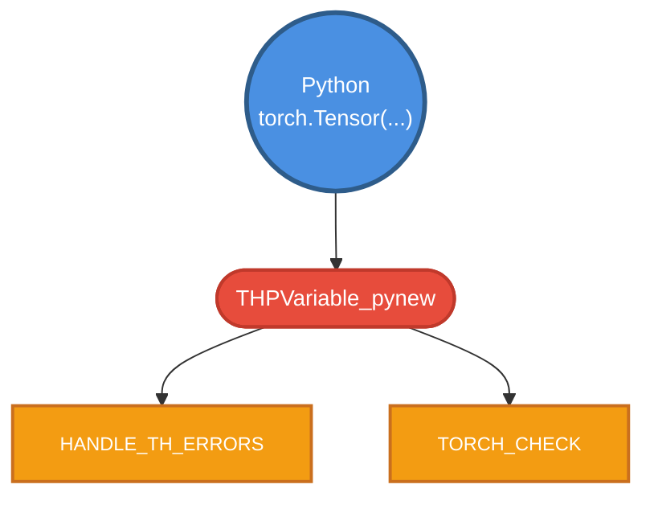
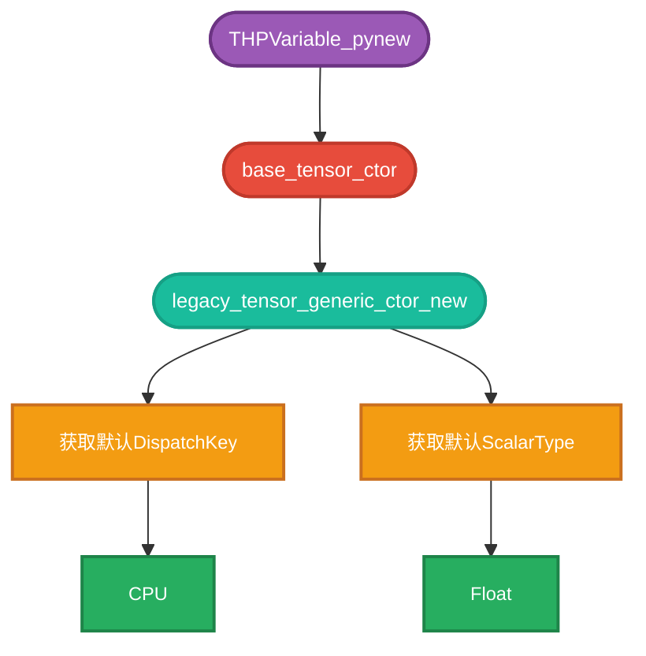
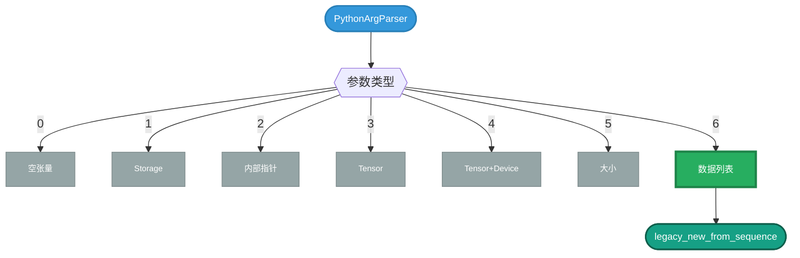
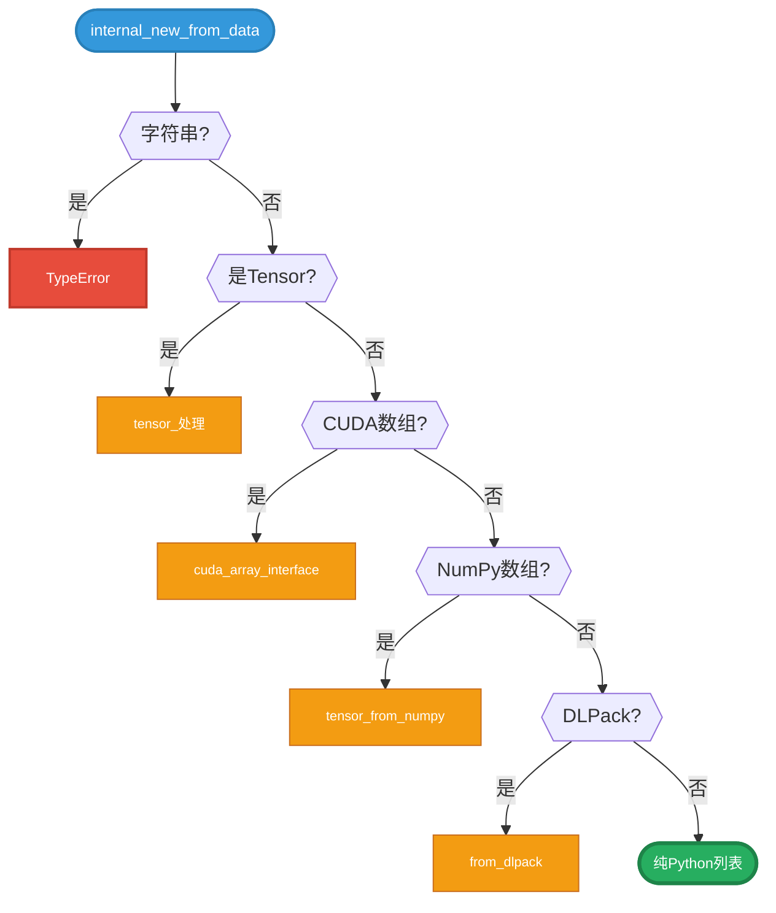
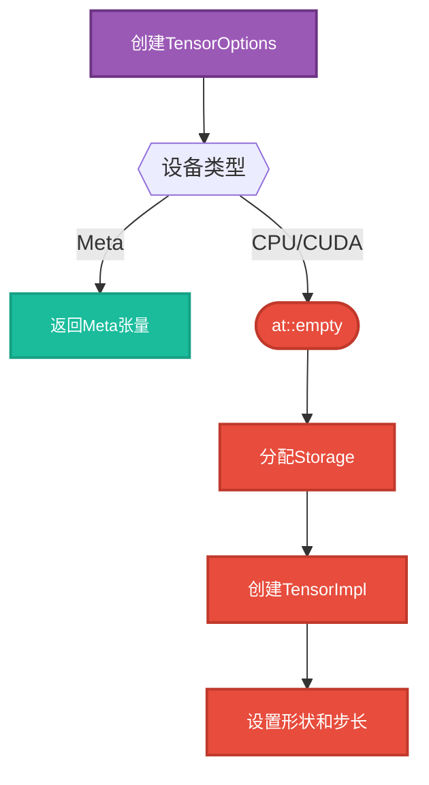
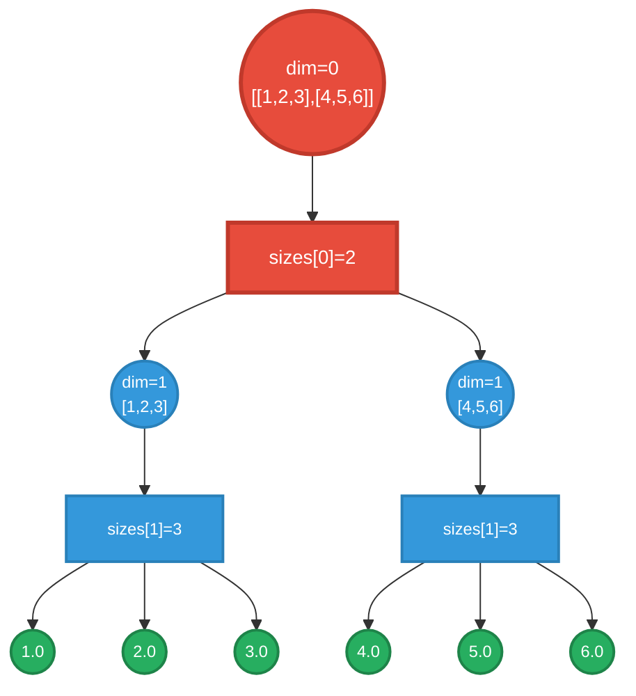
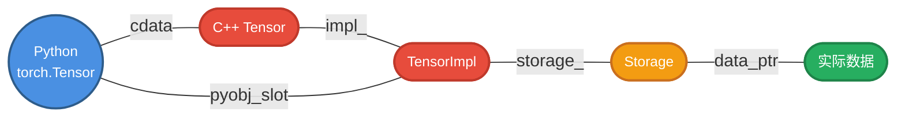
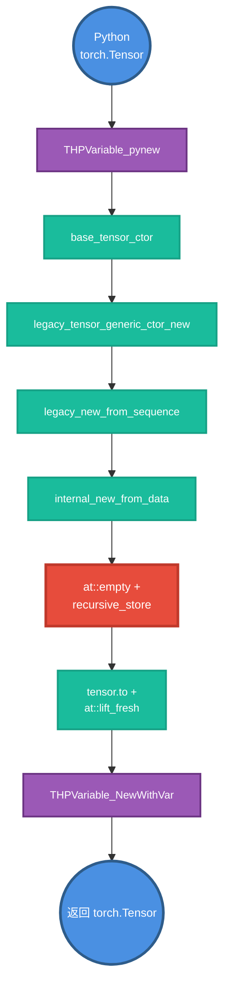
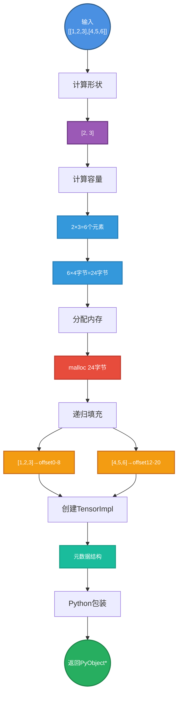
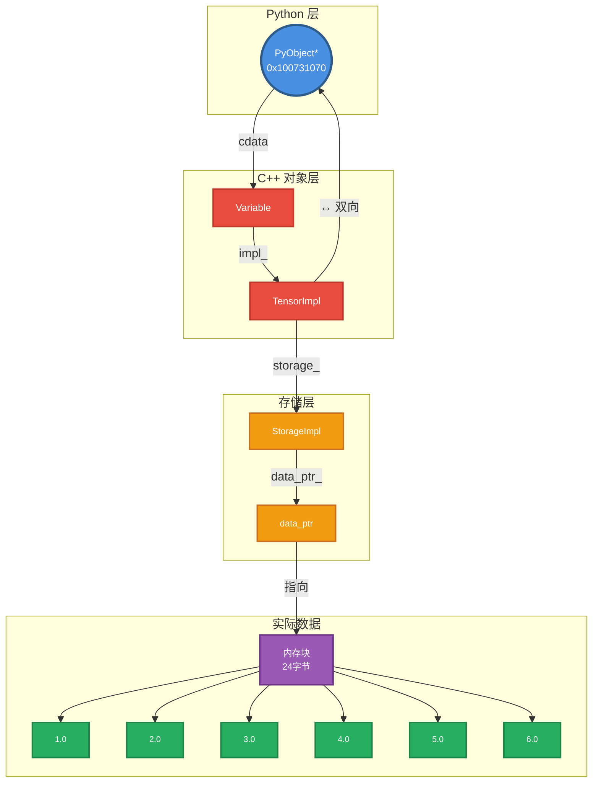

> 本章通过实战调试 `torch.Tensor([[1, 2, 3], [4, 5, 6]])` 的构造过程，帮助你掌握LLDB调试技巧，并深入理解PyTorch的内部实现机制。

## 1. 准备工作

### 1.1 环境要求

- macOS/Linux系统（本教程基于macOS）
- 已安装PyTorch（建议源码编译版本，包含调试符号）
- LLDB调试器

根据前面的源码安装文档可以安装带有 DEBUG 信息的 PyTorch。

### 1.2 测试脚本

创建测试文件 `lldb_tensor.py`：

```python
import torch

x = torch.Tensor([[1, 2, 3], [4, 5, 6]])
print(x)
```

### 1.3 启动LLDB

```bash
lldb -- $(which python) lldb_tensor.py
```

启动后会看到：

```lldb
(lldb) target create "/Users/jasmine/miniconda3/envs/torch/bin/python"
Current executable set to '/Users/jasmine/miniconda3/envs/torch/bin/python' (arm64).
(lldb) settings set -- target.run-args  "lldb_tensor.py"
```

## 2. 第一阶段：Python层入口

### 2.1 设置断点

在Tensor构造函数入口设置断点：

```lldb
(lldb) breakpoint set -n "THPVariable_pynew"
Breakpoint 1: no locations (pending).
WARNING:  Unable to resolve breakpoint to any actual locations.
```

**说明**：断点暂时无法解析是正常的，因为动态库尚未加载。

### 2.2 运行程序

```lldb
(lldb) run
Process 37663 launched: '/Users/jasmine/miniconda3/envs/torch/bin/python' (arm64)
2 locations added to breakpoint 1
Process 37663 stopped
```

程序在断点处停下：

```cpp
frame #0: THPVariable_pynew(type=0x000000011d40a980, args=0x00000001006d0df0, kwargs=0x0000000000000000)
   at python_variable.cpp:1810:3
   1807     PyTypeObject* type,
   1808     PyObject* args,
   1809     PyObject* kwargs) {
-> 1810   HANDLE_TH_ERRORS
   1811   TORCH_CHECK(
   1812       type != &THPVariableType,
   1813       "Cannot directly construct TensorBase; subclass it and then construct that");
```

**关键信息**：
- 函数：`THPVariable_pynew` - Python到C++的桥接函数
- 参数：
  - `type`: Python类型对象
  - `args`: 位置参数（列表 `[[1,2,3],[4,5,6]]`）
  - `kwargs`: 关键字参数（本例为空）

### 2.3 理解调用流程



### 2.4 单步调试

```lldb
(lldb) n  # 跳过HANDLE_TH_ERRORS
(lldb) n  # 跳过TORCH_CHECK
```

到达核心调用：

```cpp
-> 1815   auto tensor = torch::utils::base_tensor_ctor(args, kwargs);
```

## 3. 第二阶段：张量构造器选择

### 3.1 进入base_tensor_ctor

```lldb
(lldb) s  # step into
frame #0: torch::utils::base_tensor_ctor(args=0x..., kwargs=0x...) at tensor_new.cpp:817:7
   815  Tensor base_tensor_ctor(PyObject* args, PyObject* kwargs) {
   816    return legacy_tensor_generic_ctor_new(
-> 817        torch::tensors::get_default_dispatch_key(),    // 获取默认设备类型：CPU
   818        torch::tensors::get_default_scalar_type(),     // 获取默认数据类型：Float
   819        args,
   820        kwargs,
   821        CtorOrNew::BASE_CTOR);
```

**关键概念**：
- `dispatch_key`: 决定在哪个设备上创建张量（CPU/CUDA）
- `scalar_type`: 数据类型（Float/Int/Double等）
- `CtorOrNew::BASE_CTOR`: 标识这是基类构造器

### 3.2 调用层次



## 4. 第三阶段：参数解析

### 4.1 进入legacy_tensor_generic_ctor_new

```lldb
(lldb) s
frame #0: legacy_tensor_generic_ctor_new(dispatch_key=CPU, scalar_type=Float, ...) 
   at tensor_new.cpp:713:45
-> 713    auto options = dispatchKeyToTensorOptions(dispatch_key);
```

### 4.2 构建参数解析器

```cpp
714    static PythonArgParser parser({
715        "new(*, Device? device=None)",              // 选项0: 空张量
716        "new(Storage storage)",                     // 选项1: 从存储创建
717        "new(*, int64_t cdata)|hidden",            // 选项2: 内部使用
718        "new(Tensor other)",                       // 选项3: 从其他张量
719        "new(Tensor other, *, Device? device=None)|hidden",  // 选项4
720        "new(SymIntArrayRef size, *, Device? device=None)",  // 选项5: 指定大小
721        "new(PyObject* data, *, Device? device=None)",       // 选项6: 从数据创建 ✓
722    });
```

**输入匹配选项6**：`PyObject* data` 对应Python列表。

### 4.3 参数匹配过程

```lldb
(lldb) n  # 跳过parser构造（已是静态变量）
-> 738    auto r = parser.parse(args, kwargs, parsed_args);
(lldb) n
-> 739    if (r.idx == 0) {
(lldb) p r.idx
(int) 6  # 匹配到选项6
```

### 4.4 分发流程



### 4.5 执行分支

```cpp
802    } else if (r.idx == 6) {
803      auto deviceOptional = r.deviceOptional(1);
804      check_legacy_ctor_device(dispatch_key, deviceOptional);
-> 805      return legacy_new_from_sequence(
806          options, scalar_type, deviceOptional, r.pyobject(0));  // [[1,2,3],[4,5,6]]
807    }
```

## 5. 第四阶段：从序列创建张量

### 5.1 进入legacy_new_from_sequence

```lldb
(lldb) s
frame #0: legacy_new_from_sequence(options=..., scalar_type=Float, device=..., 
   data=0x00000001045ff640) at tensor_new.cpp:511:3
-> 511    TORCH_CHECK_TYPE(
512        PySequence_Check(data),
513        "new(): data must be a sequence (got ...");
```

**验证**：确保输入是Python序列类型（list/tuple）。

### 5.2 调用internal_new_from_data

```cpp
516    return internal_new_from_data(
517        options,
518        scalar_type,
519        device,
520        data,                        // 我们的Python列表
521        /*copy_variables=*/false,    // 不复制已有张量
522        /*copy_numpy=*/false,         // 不复制numpy数组
523        /*type_inference=*/false);    // 不推断类型（已指定Float）
```

## 6. 第五阶段：数据类型检测

### 6.1 进入internal_new_from_data

```lldb
(lldb) s
frame #0: internal_new_from_data(...) at tensor_new.cpp:274:3
```

### 6.2 类型检测链

```cpp
280    if (THPVariable_Check(data)) {      // 是否已是Tensor？
       // ... 处理Tensor输入
303    if (PyObject_HasAttrString(data, "__cuda_array_interface__")) {  // CUDA数组？
       // ... 处理CUDA数组
330    if (is_numpy_available() && PyArray_Check(data)) {  // NumPy数组？
       // ... 处理NumPy数组
347    if (PyObject_HasAttrString(data, "__dlpack__")) {  // DLPack？
       // ... 处理DLPack
```

**路径**：都不匹配，继续往下走到纯Python数据处理。

### 6.3 类型检测流程



## 7. 第六阶段：计算张量形状

### 7.1 获取设备和计算尺寸

```cpp
364    auto device = device_opt.has_value() ? *device_opt : options.device();
365
366    auto sizes = compute_sizes(data, scalar_type);  // 计算形状：[2, 3]
367
368    ScalarType inferred_scalar_type =
369        type_inference ? infer_scalar_type(data) : scalar_type;  // Float
```

**compute_sizes** 会递归遍历嵌套列表：
- `[[1,2,3],[4,5,6]]` → shape: `[2, 3]`

### 7.2 形状推断过程

```python
# compute_sizes的逻辑（伪代码）
def compute_sizes(data):
    if not is_sequence(data):
        return []  # 标量
    
    size = len(data)  # 2（外层列表长度）
    if size > 0:
        inner_sizes = compute_sizes(data[0])  # [3]（内层列表长度）
        return [size] + inner_sizes  # [2, 3]
    return [0]
```

## 8. 第七阶段：分配内存

### 8.1 创建空张量

```cpp
379    Tensor tensor;
380    {
381      at::AutoDispatchBelowADInplaceOrView guard;  // 禁用自动微分
       // ... 更多guard（禁用各种hook）
       
430      TensorOptions opts = at::initialTensorOptions().dtype(inferred_scalar_type);
434      if (device == at::kMeta) {
435        return at::empty(sizes, opts.device(device));  // Meta设备快捷路径
436      }
-> 437    tensor = at::empty(sizes, opts.pinned_memory(pin_memory));  // 分配内存
```

**at::empty([2, 3], float32)** 创建：
- 形状：`[2, 3]`
- 数据类型：`Float (32-bit)`
- 内存：未初始化（随机值）
- 总大小：2 × 3 × 4字节 = 24字节

### 8.2 内存分配流程



## 9. 第八阶段：数据填充

### 9.1 检查并填充数据

```cpp
438    if (c10::multiply_integers(tensor.sizes()) != 0) {  // 元素数量 > 0?
439      recursive_store(
440          (char*)tensor.data_ptr(),  // 内存地址
441          tensor.sizes(),             // [2, 3]
442          tensor.strides(),           // [3, 1]
443          0,                          // dim=0（当前维度）
444          inferred_scalar_type,       // Float
445          tensor.dtype().itemsize(),  // 4字节
446          data);                      // Python列表
447    }
```

### 9.2 进入recursive_store

```lldb
(lldb) s
frame #0: recursive_store(data="", sizes=[2,3], strides=[3,1], dim=0, ...)
   at tensor_new.cpp:211:3
```

### 9.3 递归填充算法

```cpp
213    int64_t ndim = static_cast<int64_t>(sizes.size());  // 2
214    bool is_symfloat = torch::is_symfloat(obj);
215    bool is_symint = torch::is_symint(obj);
216    if (dim == ndim) {  // 到达叶子节点？
       // ... 存储单个值
230      return;
231    }
232
233    auto n = sizes[dim];  // sizes[0] = 2
234    auto seq = THPObjectPtr(PySequence_Fast(obj, "not a sequence"));
238    auto seq_size = PySequence_Fast_GET_SIZE(seq.get());  // 2
239    TORCH_CHECK_VALUE(seq_size == n, ...);  // 验证长度匹配
```

### 9.4 递归存储流程



### 9.5 内存布局

```
内存地址    值      对应元素
───────────────────────────
0x000       1.0     [0, 0]
0x004       2.0     [0, 1]
0x008       3.0     [0, 2]
0x00C       4.0     [1, 0]
0x010       5.0     [1, 1]
0x014       6.0     [1, 2]

步长(stride) = [3, 1]
访问 tensor[i,j] = base_ptr + i*3*4 + j*1*4
```

### 9.6 循环遍历代码

```cpp
249    PyObject** items = PySequence_Fast_ITEMS(seq.get());
250    for (const auto i : c10::irange(n)) {  // 遍历n个元素
259      recursive_store(
260          data, sizes, strides, dim + 1, scalarType, elementSize, items[i]);
261      data += strides[dim] * elementSize;  // 移动指针
262    }
```

**关键**：`data += strides[dim] * elementSize`
- dim=0: 每次移动 3 × 4 = 12字节（一整行）
- dim=1: 每次移动 1 × 4 = 4字节（一个元素）

## 10. 第九阶段：设备转换

### 10.1 数据填充完成后

```lldb
(lldb) finish  # recursive_store完成
-> 465    tensor = tensor.to(
466        device, inferred_scalar_type, /*non_blocking=*/false, /*copy=*/false);
```

**作用**：
- 如果目标设备与当前不同，执行设备间拷贝
- 本例CPU→CPU，无需拷贝

### 10.2 Lift操作

```cpp
472    at::tracer::impl::NoTracerDispatchMode tracer_guard;
473    {
477      at::AutoDispatchBelowADInplaceOrView guard;
-> 478    tensor = at::lift_fresh(tensor);  // "提升"张量到正式状态
479    }
```

**lift_fresh**：标记张量已完全构造，可被autograd系统追踪。

## 11. 第十阶段：Python对象包装

### 11.1 返回到THPVariable_pynew

```lldb
(lldb) finish  # internal_new_from_data完成
(lldb) finish  # legacy_new_from_sequence完成
(lldb) finish  # legacy_tensor_generic_ctor_new完成
(lldb) finish  # base_tensor_ctor完成

frame #0: THPVariable_pynew(...) at python_variable.cpp:1815:17
-> 1815   auto tensor = torch::utils::base_tensor_ctor(args, kwargs);  # 完成
   1821   return THPVariable_NewWithVar(
   1822       type,
   1823       tensor,  // C++ Tensor对象
   1824       c10::impl::PyInterpreterStatus::MAYBE_UNINITIALIZED,
   1825       /*allow_preexisting_pyobj=*/true);
```

### 11.2 进入THPVariable_NewWithVar

```lldb
(lldb) s
frame #0: THPVariable_NewWithVar(type=..., _var=..., status=MAYBE_UNINITIALIZED, ...)
   at python_variable.cpp:2063:3
```

### 11.3 创建Python对象

```cpp
2132   PyObject* obj = type->tp_alloc(type, 0);  // 分配Python对象
2133   if (obj) {
2134     auto v = (THPVariable*)obj;
2136     new (&v->cdata) MaybeOwned<Variable>();  // placement new
2151     v->cdata = MaybeOwned<Variable>::owned(Variable(_var));  // 关联C++Tensor
2152     const auto& var = THPVariable_Unpack(v);
2153     var.unsafeGetTensorImpl()->pyobj_slot()->init_pyobj(
2154         getPyInterpreter(), obj, status);  // 双向绑定
```

**关键机制**：
- Python对象 `obj` 持有 C++ Tensor
- C++ TensorImpl 通过 `pyobj_slot` 持有 Python对象
- 实现双向引用，支持垃圾回收

### 11.4 Python-C++绑定结构



## 12. 完整调用栈

### 12.1 层次结构总览



### 12.2 完整计算图流程



## 13. 关键数据结构

### 13.1 TensorImpl结构

```cpp
struct TensorImpl {
    Storage storage_;           // 数据存储
    int64_t numel_;            // 元素总数: 6
    IntArrayRef sizes_;        // 形状: [2, 3]
    IntArrayRef strides_;      // 步长: [3, 1]
    ScalarType dtype_;         // 数据类型: Float
    Device device_;            // 设备: CPU
    DispatchKeySet key_set_;   // 分发键集合
    PyObject* pyobj_;          // Python对象指针（通过pyobj_slot）
    // ... 更多字段
};
```

### 13.2 Storage结构

```cpp
struct StorageImpl {
    void* data_ptr_;           // 实际数据指针
    size_t size_bytes_;        // 字节数: 24
    Allocator* allocator_;     // 内存分配器
    bool resizable_;           // 是否可调整大小
    std::atomic<int> refcount_; // 引用计数
};
```

### 13.3 内存关系图



## 14. 调试技巧总结

### 14.1 常用LLDB命令

```lldb
# 断点管理
breakpoint set -n "function_name"      # 函数名断点
breakpoint set -f file.cpp -l 100      # 文件行号断点
breakpoint list                        # 列出所有断点
breakpoint delete 1                    # 删除断点1

# 执行控制
run (r)                                # 运行程序
continue (c)                           # 继续执行
next (n)                               # 单步跳过
step (s)                               # 单步进入
finish                                 # 执行到函数返回

# 查看信息
frame variable (v)                     # 查看局部变量
print (p) variable_name                # 打印变量
expression (expr) variable_name        # 求值表达式
backtrace (bt)                         # 查看调用栈
frame select 2                         # 切换到栈帧2

# 内存查看
memory read address                    # 读取内存
memory read --size 4 --format x --count 10 address  # 十六进制查看
```

## 15. 常见问题

### Q1: 为什么需要这么多层函数调用？

**A**: 每一层都有特定职责：
- **Python绑定层**：类型转换和错误处理
- **参数解析层**：根据输入类型选择不同路径
- **数据处理层**：支持多种数据源（list/numpy/tensor）
- **内存分配层**：设备无关的内存管理
- **填充层**：递归处理嵌套结构

### Q2: recursive_store如何处理不规则数组？

**A**: `compute_sizes`会先验证所有维度一致：

```python
# 错误示例
torch.Tensor([[1,2,3], [4,5]])  # ValueError: expected sequence of length 3 (got 2)
```

### Q3: 为什么使用intrusive_ptr而不是shared_ptr？

**A**: 
- **intrusive_ptr**：引用计数在对象内部，节省内存
- 支持从原始指针安全转换
- 与Python的PyObject引用计数模型兼容

### Q4: lift_fresh的作用是什么？

**A**:
- 标记张量为"新鲜"状态
- 使能autograd追踪
- 在functionalization模式下正确处理

## 16. 扩展练习

### 练习1：调试不同输入类型

尝试调试以下代码，观察调用路径差异：

```python
# 1. 从NumPy创建
import numpy as np
x = torch.Tensor(np.array([[1,2,3],[4,5,6]]))

# 2. 指定大小创建
y = torch.Tensor(2, 3)

# 3. 从另一个Tensor创建
z = torch.Tensor(x)
```

### 练习2：观察CUDA张量创建

```python
if torch.cuda.is_available():
    x = torch.Tensor([[1,2,3]]).cuda()
    # 观察：设备转换在哪一层发生？
```

### 练习3：追踪梯度设置

```python
x = torch.Tensor([[1,2,3]], requires_grad=True)
# 观察：requires_grad如何传递到TensorImpl？
```

## 17. 总结

通过这次LLDB调试，我们深入理解了：

1. **Python到C++的桥接机制**
   - PyObject到C++函数的调用
   - 参数解析和类型检查

2. **张量构造的完整流程**
   - 设备和数据类型选择
   - 内存分配策略
   - 递归数据填充算法

3. **PyTorch的分层架构**
   - 每一层的职责明确
   - 可扩展性设计（支持多种输入类型）

4. **内存管理机制**
   - Storage和TensorImpl的分离
   - Python-C++双向绑定
   - 引用计数和生命周期

## 18. 完整执行时间线

### 18.1 事件流


### 18.2 各阶段功能总结表

| 阶段 | 函数 | 主要功能 | 耗时 |
|------|------|---------|------|
| T0 | `THPVariable_pynew` | Python绑定和类型检查 | 极短 |
| T1 | `PythonArgParser` | 参数匹配和路由 | 极短 |
| T2 | `compute_sizes` | 递归计算张量形状 | 短 |
| T3 | `at::empty` | 分配内存并创建TensorImpl | 中等 |
| T4 | `recursive_store` | 递归填充Python数据到内存 | 较长 |
| T5 | `at::lift_fresh` | 标记张量为有效状态 | 极短 |
| T6 | `THPVariable_NewWithVar` | 创建Python对象并建立双向绑定 | 短 |
| T7 | 返回 | 将Python对象返回给用户 | 极短 |

---

完整的 lldb 调试步骤如下：
```lldb
(lldb) target create "/Users/jasmine/miniconda3/envs/torch/bin/python"
Current executable set to '/Users/jasmine/miniconda3/envs/torch/bin/python' (arm64).
(lldb) settings set -- target.run-args  "lldb_tensor.py"
(lldb) breakpoint set -n "THPVariable_pynew"
Breakpoint 1: no locations (pending).
WARNING:  Unable to resolve breakpoint to any actual locations.
(lldb) run
Process 37663 launched: '/Users/jasmine/miniconda3/envs/torch/bin/python' (arm64)
2 locations added to breakpoint 1
Process 37663 stopped
* thread #1, queue = 'com.apple.main-thread', stop reason = breakpoint 1.2
    frame #0: 0x0000000106babed0 libtorch_python.dylib`THPVariable_pynew(type=0x000000011d40a980, args=0x00000001006d0df0, kwargs=0x0000000000000000) at python_variable.cpp:1810:3
   1807     PyTypeObject* type,
   1808     PyObject* args,
   1809     PyObject* kwargs) {
-> 1810   HANDLE_TH_ERRORS
   1811   TORCH_CHECK(
   1812       type != &THPVariableType,
   1813       "Cannot directly construct TensorBase; subclass it and then construct that");
Target 0: (python) stopped.
(lldb) n
Process 37663 stopped
* thread #1, queue = 'com.apple.main-thread', stop reason = step over
    frame #0: 0x0000000106babed8 libtorch_python.dylib`THPVariable_pynew(type=0x000000011d40a980, args=0x00000001006d0df0, kwargs=0x0000000000000000) at python_variable.cpp:1811:3
   1808     PyObject* args,
   1809     PyObject* kwargs) {
   1810   HANDLE_TH_ERRORS
-> 1811   TORCH_CHECK(
   1812       type != &THPVariableType,
   1813       "Cannot directly construct TensorBase; subclass it and then construct that");
   1814   jit::tracer::warn("torch.Tensor", jit::tracer::WARN_CONSTRUCTOR);
Target 0: (python) stopped.
(lldb) n
Process 37663 stopped
* thread #1, queue = 'com.apple.main-thread', stop reason = step over
    frame #0: 0x0000000106babf3c libtorch_python.dylib`THPVariable_pynew(type=0x000000011d40a980, args=0x00000001006d0df0, kwargs=0x0000000000000000) at python_variable.cpp:1814:37
   1811   TORCH_CHECK(
   1812       type != &THPVariableType,
   1813       "Cannot directly construct TensorBase; subclass it and then construct that");
-> 1814   jit::tracer::warn("torch.Tensor", jit::tracer::WARN_CONSTRUCTOR);
   1815   auto tensor = torch::utils::base_tensor_ctor(args, kwargs);
   1816   // WARNING: tensor is NOT guaranteed to be a fresh tensor; e.g., if it was
   1817   // given a raw pointer that will refcount bump
Target 0: (python) stopped.
(lldb) n
Process 37663 stopped
* thread #1, queue = 'com.apple.main-thread', stop reason = step over
    frame #0: 0x0000000106babf58 libtorch_python.dylib`THPVariable_pynew(type=0x000000011d40a980, args=0x00000001006d0df0, kwargs=0x0000000000000000) at python_variable.cpp:1815:48
   1812       type != &THPVariableType,
   1813       "Cannot directly construct TensorBase; subclass it and then construct that");
   1814   jit::tracer::warn("torch.Tensor", jit::tracer::WARN_CONSTRUCTOR);
-> 1815   auto tensor = torch::utils::base_tensor_ctor(args, kwargs);
   1816   // WARNING: tensor is NOT guaranteed to be a fresh tensor; e.g., if it was
   1817   // given a raw pointer that will refcount bump
   1818   // NB: base_tensor_ctor can call into dispatched ATen functions (e.g.,
Target 0: (python) stopped.
(lldb) s
Process 37663 stopped
* thread #1, queue = 'com.apple.main-thread', stop reason = step in
    frame #0: 0x00000001077490c0 libtorch_python.dylib`torch::utils::base_tensor_ctor(args=0x00000001006d0df0, kwargs=0x0000000000000000) at tensor_new.cpp:817:7
   814  // match the default)
   815  Tensor base_tensor_ctor(PyObject* args, PyObject* kwargs) {
   816    return legacy_tensor_generic_ctor_new(
-> 817        torch::tensors::get_default_dispatch_key(),
   818        torch::tensors::get_default_scalar_type(),
   819        args,
   820        kwargs,
Target 0: (python) stopped.
(lldb) n
Process 37663 stopped
* thread #1, queue = 'com.apple.main-thread', stop reason = step over
    frame #0: 0x00000001077490c8 libtorch_python.dylib`torch::utils::base_tensor_ctor(args=0x00000001006d0df0, kwargs=0x0000000000000000) at tensor_new.cpp:818:7
   815  Tensor base_tensor_ctor(PyObject* args, PyObject* kwargs) {
   816    return legacy_tensor_generic_ctor_new(
   817        torch::tensors::get_default_dispatch_key(),
-> 818        torch::tensors::get_default_scalar_type(),
   819        args,
   820        kwargs,
   821        CtorOrNew::BASE_CTOR);
Target 0: (python) stopped.
(lldb) n
Process 37663 stopped
* thread #1, queue = 'com.apple.main-thread', stop reason = step over
    frame #0: 0x00000001077490d8 libtorch_python.dylib`torch::utils::base_tensor_ctor(args=0x00000001006d0df0, kwargs=0x0000000000000000) at tensor_new.cpp:819:7
   816    return legacy_tensor_generic_ctor_new(
   817        torch::tensors::get_default_dispatch_key(),
   818        torch::tensors::get_default_scalar_type(),
-> 819        args,
   820        kwargs,
   821        CtorOrNew::BASE_CTOR);
   822  }
Target 0: (python) stopped.
(lldb) n
Process 37663 stopped
* thread #1, queue = 'com.apple.main-thread', stop reason = step over
    frame #0: 0x00000001077490dc libtorch_python.dylib`torch::utils::base_tensor_ctor(args=0x00000001006d0df0, kwargs=0x0000000000000000) at tensor_new.cpp:820:7
   817        torch::tensors::get_default_dispatch_key(),
   818        torch::tensors::get_default_scalar_type(),
   819        args,
-> 820        kwargs,
   821        CtorOrNew::BASE_CTOR);
   822  }
   823
Target 0: (python) stopped.
(lldb) n
Process 37663 stopped
* thread #1, queue = 'com.apple.main-thread', stop reason = step over
    frame #0: 0x00000001077490e0 libtorch_python.dylib`torch::utils::base_tensor_ctor(args=0x00000001006d0df0, kwargs=0x0000000000000000) at tensor_new.cpp:816:10
   813  // relaxed to accept any device/dtype input tensor (even if it doesn't
   814  // match the default)
   815  Tensor base_tensor_ctor(PyObject* args, PyObject* kwargs) {
-> 816    return legacy_tensor_generic_ctor_new(
   817        torch::tensors::get_default_dispatch_key(),
   818        torch::tensors::get_default_scalar_type(),
   819        args,
Target 0: (python) stopped.
(lldb) s
Process 37663 stopped
* thread #1, queue = 'com.apple.main-thread', stop reason = step in
    frame #0: 0x0000000107749140 libtorch_python.dylib`torch::utils::legacy_tensor_generic_ctor_new(dispatch_key=CPU, scalar_type=Float, args=0x00000001006d0df0, kwargs=0x0000000000000000, ctor_or_new=BASE_CTOR) at tensor_new.cpp:713:45
   710      PyObject* args,
   711      PyObject* kwargs,
   712      CtorOrNew ctor_or_new) {
-> 713    auto options = dispatchKeyToTensorOptions(dispatch_key);
   714    static PythonArgParser parser({
   715        "new(*, Device? device=None)",
   716        "new(Storage storage)",
Target 0: (python) stopped.
(lldb) n
Process 37663 stopped
* thread #1, queue = 'com.apple.main-thread', stop reason = step over
    frame #0: 0x000000010774915c libtorch_python.dylib`torch::utils::legacy_tensor_generic_ctor_new(dispatch_key=CPU, scalar_type=Float, args=0x00000001006d0df0, kwargs=0x0000000000000000, ctor_or_new=BASE_CTOR) at tensor_new.cpp:714:3
   711      PyObject* kwargs,
   712      CtorOrNew ctor_or_new) {
   713    auto options = dispatchKeyToTensorOptions(dispatch_key);
-> 714    static PythonArgParser parser({
   715        "new(*, Device? device=None)",
   716        "new(Storage storage)",
   717        "new(*, int64_t cdata)|hidden",
Target 0: (python) stopped.
(lldb)
Process 37663 stopped
* thread #1, queue = 'com.apple.main-thread', stop reason = step over
    frame #0: 0x00000001077491a4 libtorch_python.dylib`torch::utils::legacy_tensor_generic_ctor_new(dispatch_key=CPU, scalar_type=Float, args=0x00000001006d0df0, kwargs=0x0000000000000000, ctor_or_new=BASE_CTOR) at tensor_new.cpp:715:7
   712      CtorOrNew ctor_or_new) {
   713    auto options = dispatchKeyToTensorOptions(dispatch_key);
   714    static PythonArgParser parser({
-> 715        "new(*, Device? device=None)",
   716        "new(Storage storage)",
   717        "new(*, int64_t cdata)|hidden",
   718        // This constructor is no longer legacy, it will also be usable for
Target 0: (python) stopped.
(lldb)
Process 37663 stopped
* thread #1, queue = 'com.apple.main-thread', stop reason = step over
    frame #0: 0x00000001077491b4 libtorch_python.dylib`torch::utils::legacy_tensor_generic_ctor_new(dispatch_key=CPU, scalar_type=Float, args=0x00000001006d0df0, kwargs=0x0000000000000000, ctor_or_new=BASE_CTOR) at tensor_new.cpp:714:33
   711      PyObject* kwargs,
   712      CtorOrNew ctor_or_new) {
   713    auto options = dispatchKeyToTensorOptions(dispatch_key);
-> 714    static PythonArgParser parser({
   715        "new(*, Device? device=None)",
   716        "new(Storage storage)",
   717        "new(*, int64_t cdata)|hidden",
Target 0: (python) stopped.
(lldb)
Process 37663 stopped
* thread #1, queue = 'com.apple.main-thread', stop reason = step over
    frame #0: 0x00000001077491c4 libtorch_python.dylib`torch::utils::legacy_tensor_generic_ctor_new(dispatch_key=CPU, scalar_type=Float, args=0x00000001006d0df0, kwargs=0x0000000000000000, ctor_or_new=BASE_CTOR) at tensor_new.cpp:716:7
   713    auto options = dispatchKeyToTensorOptions(dispatch_key);
   714    static PythonArgParser parser({
   715        "new(*, Device? device=None)",
-> 716        "new(Storage storage)",
   717        "new(*, int64_t cdata)|hidden",
   718        // This constructor is no longer legacy, it will also be usable for
   719        // subclass initialization
Target 0: (python) stopped.
(lldb)
Process 37663 stopped
* thread #1, queue = 'com.apple.main-thread', stop reason = step over
    frame #0: 0x00000001077491d4 libtorch_python.dylib`torch::utils::legacy_tensor_generic_ctor_new(dispatch_key=CPU, scalar_type=Float, args=0x00000001006d0df0, kwargs=0x0000000000000000, ctor_or_new=BASE_CTOR) at tensor_new.cpp:714:33
   711      PyObject* kwargs,
   712      CtorOrNew ctor_or_new) {
   713    auto options = dispatchKeyToTensorOptions(dispatch_key);
-> 714    static PythonArgParser parser({
   715        "new(*, Device? device=None)",
   716        "new(Storage storage)",
   717        "new(*, int64_t cdata)|hidden",
Target 0: (python) stopped.
(lldb)
Process 37663 stopped
* thread #1, queue = 'com.apple.main-thread', stop reason = step over
    frame #0: 0x00000001077491e4 libtorch_python.dylib`torch::utils::legacy_tensor_generic_ctor_new(dispatch_key=CPU, scalar_type=Float, args=0x00000001006d0df0, kwargs=0x0000000000000000, ctor_or_new=BASE_CTOR) at tensor_new.cpp:717:7
   714    static PythonArgParser parser({
   715        "new(*, Device? device=None)",
   716        "new(Storage storage)",
-> 717        "new(*, int64_t cdata)|hidden",
   718        // This constructor is no longer legacy, it will also be usable for
   719        // subclass initialization
   720        "new(Tensor other)",
Target 0: (python) stopped.
(lldb)
Process 37663 stopped
* thread #1, queue = 'com.apple.main-thread', stop reason = step over
    frame #0: 0x00000001077491f4 libtorch_python.dylib`torch::utils::legacy_tensor_generic_ctor_new(dispatch_key=CPU, scalar_type=Float, args=0x00000001006d0df0, kwargs=0x0000000000000000, ctor_or_new=BASE_CTOR) at tensor_new.cpp:714:33
   711      PyObject* kwargs,
   712      CtorOrNew ctor_or_new) {
   713    auto options = dispatchKeyToTensorOptions(dispatch_key);
-> 714    static PythonArgParser parser({
   715        "new(*, Device? device=None)",
   716        "new(Storage storage)",
   717        "new(*, int64_t cdata)|hidden",
Target 0: (python) stopped.
(lldb)
Process 37663 stopped
* thread #1, queue = 'com.apple.main-thread', stop reason = step over
    frame #0: 0x0000000107749204 libtorch_python.dylib`torch::utils::legacy_tensor_generic_ctor_new(dispatch_key=CPU, scalar_type=Float, args=0x00000001006d0df0, kwargs=0x0000000000000000, ctor_or_new=BASE_CTOR) at tensor_new.cpp:720:7
   717        "new(*, int64_t cdata)|hidden",
   718        // This constructor is no longer legacy, it will also be usable for
   719        // subclass initialization
-> 720        "new(Tensor other)",
   721        "new(Tensor other, *, Device? device=None)|hidden", // prevent Tensor
   722                                                            // matching with
   723                                                            // IntArrayRef,
Target 0: (python) stopped.
(lldb)
Process 37663 stopped
* thread #1, queue = 'com.apple.main-thread', stop reason = step over
    frame #0: 0x0000000107749214 libtorch_python.dylib`torch::utils::legacy_tensor_generic_ctor_new(dispatch_key=CPU, scalar_type=Float, args=0x00000001006d0df0, kwargs=0x0000000000000000, ctor_or_new=BASE_CTOR) at tensor_new.cpp:714:33
   711      PyObject* kwargs,
   712      CtorOrNew ctor_or_new) {
   713    auto options = dispatchKeyToTensorOptions(dispatch_key);
-> 714    static PythonArgParser parser({
   715        "new(*, Device? device=None)",
   716        "new(Storage storage)",
   717        "new(*, int64_t cdata)|hidden",
Target 0: (python) stopped.
(lldb)
Process 37663 stopped
* thread #1, queue = 'com.apple.main-thread', stop reason = step over
    frame #0: 0x0000000107749224 libtorch_python.dylib`torch::utils::legacy_tensor_generic_ctor_new(dispatch_key=CPU, scalar_type=Float, args=0x00000001006d0df0, kwargs=0x0000000000000000, ctor_or_new=BASE_CTOR) at tensor_new.cpp:721:7
   718        // This constructor is no longer legacy, it will also be usable for
   719        // subclass initialization
   720        "new(Tensor other)",
-> 721        "new(Tensor other, *, Device? device=None)|hidden", // prevent Tensor
   722                                                            // matching with
   723                                                            // IntArrayRef,
   724                                                            // PyObject*
Target 0: (python) stopped.
(lldb)
Process 37663 stopped
* thread #1, queue = 'com.apple.main-thread', stop reason = step over
    frame #0: 0x0000000107749234 libtorch_python.dylib`torch::utils::legacy_tensor_generic_ctor_new(dispatch_key=CPU, scalar_type=Float, args=0x00000001006d0df0, kwargs=0x0000000000000000, ctor_or_new=BASE_CTOR) at tensor_new.cpp:714:33
   711      PyObject* kwargs,
   712      CtorOrNew ctor_or_new) {
   713    auto options = dispatchKeyToTensorOptions(dispatch_key);
-> 714    static PythonArgParser parser({
   715        "new(*, Device? device=None)",
   716        "new(Storage storage)",
   717        "new(*, int64_t cdata)|hidden",
Target 0: (python) stopped.
(lldb)
Process 37663 stopped
* thread #1, queue = 'com.apple.main-thread', stop reason = step over
    frame #0: 0x0000000107749244 libtorch_python.dylib`torch::utils::legacy_tensor_generic_ctor_new(dispatch_key=CPU, scalar_type=Float, args=0x00000001006d0df0, kwargs=0x0000000000000000, ctor_or_new=BASE_CTOR) at tensor_new.cpp:725:7
   722                                                            // matching with
   723                                                            // IntArrayRef,
   724                                                            // PyObject*
-> 725        "new(SymIntArrayRef size, *, Device? device=None)",
   726        "new(PyObject* data, *, Device? device=None)",
   727    });
   728
Target 0: (python) stopped.
(lldb)
Process 37663 stopped
* thread #1, queue = 'com.apple.main-thread', stop reason = step over
    frame #0: 0x0000000107749254 libtorch_python.dylib`torch::utils::legacy_tensor_generic_ctor_new(dispatch_key=CPU, scalar_type=Float, args=0x00000001006d0df0, kwargs=0x0000000000000000, ctor_or_new=BASE_CTOR) at tensor_new.cpp:714:33
   711      PyObject* kwargs,
   712      CtorOrNew ctor_or_new) {
_C.cpython-311-darwin.so`PyInit__C:
    frame #0: 0x0000000100df3f64 _C.cpython-311-darwin.so`PyInit__C
pytorch                        2.4.1        py3.10_0  pytorch
pytorch                        2.4.1        py3.11_0  pytorch
pytorch                        2.4.1        py3.12_0  pytorch
pytorch                        2.4.1         py3.8_0  pytorch
pytorch                        2.4.1         py3.9_0  pytorch
(base) jasmine@mac ~ % conda env create -n torch-develop python=3.11
usage: conda [-h] [-v] [--no-plugins] [-V] COMMAND ...
   713    auto options = dispatchKeyToTensorOptions(dispatch_key);
-> 714    static PythonArgParser parser({
   715        "new(*, Device? device=None)",
   716        "new(Storage storage)",
   717        "new(*, int64_t cdata)|hidden",
Target 0: (python) stopped.
(lldb)
Process 37663 stopped
* thread #1, queue = 'com.apple.main-thread', stop reason = step over
    frame #0: 0x0000000107749264 libtorch_python.dylib`torch::utils::legacy_tensor_generic_ctor_new(dispatch_key=CPU, scalar_type=Float, args=0x00000001006d0df0, kwargs=0x0000000000000000, ctor_or_new=BASE_CTOR) at tensor_new.cpp:726:7
   723                                                            // IntArrayRef,
   724                                                            // PyObject*
   725        "new(SymIntArrayRef size, *, Device? device=None)",
-> 726        "new(PyObject* data, *, Device? device=None)",
   727    });
   728
   729    if (isSparse(dispatchKeyToBackend(dispatch_key))) {
Target 0: (python) stopped.
(lldb)
Process 37663 stopped
* thread #1, queue = 'com.apple.main-thread', stop reason = step over
    frame #0: 0x0000000107749274 libtorch_python.dylib`torch::utils::legacy_tensor_generic_ctor_new(dispatch_key=CPU, scalar_type=Float, args=0x00000001006d0df0, kwargs=0x0000000000000000, ctor_or_new=BASE_CTOR) at tensor_new.cpp:714:33
   711      PyObject* kwargs,
   712      CtorOrNew ctor_or_new) {
   713    auto options = dispatchKeyToTensorOptions(dispatch_key);
-> 714    static PythonArgParser parser({
   715        "new(*, Device? device=None)",
   716        "new(Storage storage)",
   717        "new(*, int64_t cdata)|hidden",
Target 0: (python) stopped.
(lldb)
Process 37663 stopped
* thread #1, queue = 'com.apple.main-thread', stop reason = step over
    frame #0: 0x0000000107749324 libtorch_python.dylib`torch::utils::legacy_tensor_generic_ctor_new(dispatch_key=CPU, scalar_type=Float, args=0x00000001006d0df0, kwargs=0x0000000000000000, ctor_or_new=BASE_CTOR) at tensor_new.cpp:729:37
   726        "new(PyObject* data, *, Device? device=None)",
   727    });
   728
-> 729    if (isSparse(dispatchKeyToBackend(dispatch_key))) {
   730      return legacy_sparse_tensor_generic_ctor_new(
   731          dispatch_key, scalar_type, args, kwargs, ctor_or_new);
   732    }
Target 0: (python) stopped.
(lldb)
Process 37663 stopped
* thread #1, queue = 'com.apple.main-thread', stop reason = step over
    frame #0: 0x0000000107749438 libtorch_python.dylib`torch::utils::legacy_tensor_generic_ctor_new(dispatch_key=CPU, scalar_type=Float, args=0x00000001006d0df0, kwargs=0x0000000000000000, ctor_or_new=BASE_CTOR) at tensor_new.cpp:734:7
   731          dispatch_key, scalar_type, args, kwargs, ctor_or_new);
   732    }
   733
-> 734    if (ctor_or_new == CtorOrNew::NEW)
   735      check_base_legacy_new(dispatch_key, c10::kStrided);
   736
   737    ParsedArgs<2> parsed_args;
Target 0: (python) stopped.
(lldb) n
Process 37663 stopped
* thread #1, queue = 'com.apple.main-thread', stop reason = step over
    frame #0: 0x0000000107749460 libtorch_python.dylib`torch::utils::legacy_tensor_generic_ctor_new(dispatch_key=CPU, scalar_type=Float, args=0x00000001006d0df0, kwargs=0x0000000000000000, ctor_or_new=BASE_CTOR) at tensor_new.cpp:737:17
   734    if (ctor_or_new == CtorOrNew::NEW)
   735      check_base_legacy_new(dispatch_key, c10::kStrided);
   736
-> 737    ParsedArgs<2> parsed_args;
   738    auto r = parser.parse(args, kwargs, parsed_args);
   739    if (r.idx == 0) {
   740      auto deviceOptional = r.deviceOptional(0);
Target 0: (python) stopped.
(lldb)
Process 37663 stopped
* thread #1, queue = 'com.apple.main-thread', stop reason = step over
    frame #0: 0x000000010774946c libtorch_python.dylib`torch::utils::legacy_tensor_generic_ctor_new(dispatch_key=CPU, scalar_type=Float, args=0x00000001006d0df0, kwargs=0x0000000000000000, ctor_or_new=BASE_CTOR) at tensor_new.cpp:738:25
   735      check_base_legacy_new(dispatch_key, c10::kStrided);
   736
   737    ParsedArgs<2> parsed_args;
-> 738    auto r = parser.parse(args, kwargs, parsed_args);
   739    if (r.idx == 0) {
   740      auto deviceOptional = r.deviceOptional(0);
   741      check_legacy_ctor_device(dispatch_key, deviceOptional);
Target 0: (python) stopped.
(lldb)
Process 37663 stopped
* thread #1, queue = 'com.apple.main-thread', stop reason = step over
    frame #0: 0x000000010774948c libtorch_python.dylib`torch::utils::legacy_tensor_generic_ctor_new(dispatch_key=CPU, scalar_type=Float, args=0x00000001006d0df0, kwargs=0x0000000000000000, ctor_or_new=BASE_CTOR) at tensor_new.cpp:739:9
   736
   737    ParsedArgs<2> parsed_args;
   738    auto r = parser.parse(args, kwargs, parsed_args);
-> 739    if (r.idx == 0) {
   740      auto deviceOptional = r.deviceOptional(0);
   741      check_legacy_ctor_device(dispatch_key, deviceOptional);
   742      at::OptionalDeviceGuard device_guard(deviceOptional);
Target 0: (python) stopped.
(lldb)
Process 37663 stopped
* thread #1, queue = 'com.apple.main-thread', stop reason = step over
    frame #0: 0x0000000107749600 libtorch_python.dylib`torch::utils::legacy_tensor_generic_ctor_new(dispatch_key=CPU, scalar_type=Float, args=0x00000001006d0df0, kwargs=0x0000000000000000, ctor_or_new=BASE_CTOR) at tensor_new.cpp:744:16
   741      check_legacy_ctor_device(dispatch_key, deviceOptional);
   742      at::OptionalDeviceGuard device_guard(deviceOptional);
   743      return at::empty({0}, build_options(options, scalar_type));
-> 744    } else if (r.idx == 1) {
   745      at::ScalarType storage_scalar_type{at::ScalarType::Undefined};
   746      bool is_typed_storage = false;
   747      at::Storage storage = r.storage(0, storage_scalar_type, is_typed_storage);
Target 0: (python) stopped.
(lldb)
Process 37663 stopped
* thread #1, queue = 'com.apple.main-thread', stop reason = step over
    frame #0: 0x0000000107749774 libtorch_python.dylib`torch::utils::legacy_tensor_generic_ctor_new(dispatch_key=CPU, scalar_type=Float, args=0x00000001006d0df0, kwargs=0x0000000000000000, ctor_or_new=BASE_CTOR) at tensor_new.cpp:758:16
   755            " for argument 1 'storage'");
   756      }
   757      return new_with_storage(options, scalar_type, storage);
-> 758    } else if (r.idx == 2) {
   759      // NOLINTNEXTLINE(performance-no-int-to-ptr)
   760      auto cdata = reinterpret_cast<void*>(r.toInt64(0));
   761      return at::unsafeTensorFromTH(cdata, true);
Target 0: (python) stopped.
(lldb)
Process 37663 stopped
* thread #1, queue = 'com.apple.main-thread', stop reason = step over
    frame #0: 0x00000001077497c8 libtorch_python.dylib`torch::utils::legacy_tensor_generic_ctor_new(dispatch_key=CPU, scalar_type=Float, args=0x00000001006d0df0, kwargs=0x0000000000000000, ctor_or_new=BASE_CTOR) at tensor_new.cpp:762:16
   759      // NOLINTNEXTLINE(performance-no-int-to-ptr)
   760      auto cdata = reinterpret_cast<void*>(r.toInt64(0));
   761      return at::unsafeTensorFromTH(cdata, true);
-> 762    } else if (r.idx == 3) {
   763      const auto& other = r.tensor(0);
   764      // BASE_CTOR (aka torch.Tensor) is now relaxed to accept any
   765      // dtype; previously it was "float" biased
Target 0: (python) stopped.
(lldb)
Process 37663 stopped
* thread #1, queue = 'com.apple.main-thread', stop reason = step over
    frame #0: 0x00000001077499d8 libtorch_python.dylib`torch::utils::legacy_tensor_generic_ctor_new(dispatch_key=CPU, scalar_type=Float, args=0x00000001006d0df0, kwargs=0x0000000000000000, ctor_or_new=BASE_CTOR) at tensor_new.cpp:777:16
   774            ")");
   775      }
   776      return other.alias();
-> 777    } else if (r.idx == 4) {
   778      if (ctor_or_new == CtorOrNew::CTOR || ctor_or_new == CtorOrNew::BASE_CTOR) {
   779        TORCH_CHECK(
   780            false,
Target 0: (python) stopped.
(lldb)
Process 37663 stopped
* thread #1, queue = 'com.apple.main-thread', stop reason = step over
    frame #0: 0x0000000107749a94 libtorch_python.dylib`torch::utils::legacy_tensor_generic_ctor_new(dispatch_key=CPU, scalar_type=Float, args=0x00000001006d0df0, kwargs=0x0000000000000000, ctor_or_new=BASE_CTOR) at tensor_new.cpp:789:16
   786            "Legacy tensor new of the form tensor.new(tensor, device=device) "
   787            "is not supported.  Use torch.as_tensor(...) instead.");
   788      }
-> 789    } else if (r.idx == 5) {
   790      PyObject* arg = r.pyobject(0);
   791      auto deviceOptional = r.deviceOptional(1);
   792      check_legacy_ctor_device(dispatch_key, deviceOptional);
Target 0: (python) stopped.
(lldb)
Process 37663 stopped
* thread #1, queue = 'com.apple.main-thread', stop reason = step over
    frame #0: 0x0000000107749cf4 libtorch_python.dylib`torch::utils::legacy_tensor_generic_ctor_new(dispatch_key=CPU, scalar_type=Float, args=0x00000001006d0df0, kwargs=0x0000000000000000, ctor_or_new=BASE_CTOR) at tensor_new.cpp:802:16
   799      }
   800      return new_with_sizes(
   801          options, scalar_type, deviceOptional, r.symintlist(0));
-> 802    } else if (r.idx == 6) {
   803      auto deviceOptional = r.deviceOptional(1);
   804      check_legacy_ctor_device(dispatch_key, deviceOptional);
   805      return legacy_new_from_sequence(
Target 0: (python) stopped.
(lldb)
Process 37663 stopped
* thread #1, queue = 'com.apple.main-thread', stop reason = step over
    frame #0: 0x0000000107749d08 libtorch_python.dylib`torch::utils::legacy_tensor_generic_ctor_new(dispatch_key=CPU, scalar_type=Float, args=0x00000001006d0df0, kwargs=0x0000000000000000, ctor_or_new=BASE_CTOR) at tensor_new.cpp:803:29
   800      return new_with_sizes(
   801          options, scalar_type, deviceOptional, r.symintlist(0));
   802    } else if (r.idx == 6) {
-> 803      auto deviceOptional = r.deviceOptional(1);
   804      check_legacy_ctor_device(dispatch_key, deviceOptional);
   805      return legacy_new_from_sequence(
   806          options, scalar_type, deviceOptional, r.pyobject(0));
Target 0: (python) stopped.
(lldb)
Process 37663 stopped
* thread #1, queue = 'com.apple.main-thread', stop reason = step over
    frame #0: 0x0000000107749d3c libtorch_python.dylib`torch::utils::legacy_tensor_generic_ctor_new(dispatch_key=CPU, scalar_type=Float, args=0x00000001006d0df0, kwargs=0x0000000000000000, ctor_or_new=BASE_CTOR) at tensor_new.cpp:804:30
   801          options, scalar_type, deviceOptional, r.symintlist(0));
   802    } else if (r.idx == 6) {
   803      auto deviceOptional = r.deviceOptional(1);
-> 804      check_legacy_ctor_device(dispatch_key, deviceOptional);
   805      return legacy_new_from_sequence(
   806          options, scalar_type, deviceOptional, r.pyobject(0));
   807    }
Target 0: (python) stopped.
(lldb)
Process 37663 stopped
* thread #1, queue = 'com.apple.main-thread', stop reason = step over
    frame #0: 0x0000000107749d70 libtorch_python.dylib`torch::utils::legacy_tensor_generic_ctor_new(dispatch_key=CPU, scalar_type=Float, args=0x00000001006d0df0, kwargs=0x0000000000000000, ctor_or_new=BASE_CTOR) at tensor_new.cpp:806:9
   803      auto deviceOptional = r.deviceOptional(1);
   804      check_legacy_ctor_device(dispatch_key, deviceOptional);
   805      return legacy_new_from_sequence(
-> 806          options, scalar_type, deviceOptional, r.pyobject(0));
   807    }
   808    throw std::runtime_error("new(): invalid arguments");
   809  }
Target 0: (python) stopped.
(lldb)
Process 37663 stopped
* thread #1, queue = 'com.apple.main-thread', stop reason = step over
    frame #0: 0x0000000107749db0 libtorch_python.dylib`torch::utils::legacy_tensor_generic_ctor_new(dispatch_key=CPU, scalar_type=Float, args=0x00000001006d0df0, kwargs=0x0000000000000000, ctor_or_new=BASE_CTOR) at tensor_new.cpp:805:12
   802    } else if (r.idx == 6) {
   803      auto deviceOptional = r.deviceOptional(1);
   804      check_legacy_ctor_device(dispatch_key, deviceOptional);
-> 805      return legacy_new_from_sequence(
   806          options, scalar_type, deviceOptional, r.pyobject(0));
   807    }
   808    throw std::runtime_error("new(): invalid arguments");
Target 0: (python) stopped.
(lldb) s
Process 37663 stopped
* thread #1, queue = 'com.apple.main-thread', stop reason = step in
    frame #0: 0x00000001077547ac libtorch_python.dylib`torch::utils::(anonymous namespace)::legacy_new_from_sequence(options=TensorOptions @ 0x000000016fdfe2d0, scalar_type=Float, device= Has Value=false , data=0x00000001045ff640) at tensor_new.cpp:511:3
   508      at::ScalarType scalar_type,
   509      std::optional<Device> device,
   510      PyObject* data) {
-> 511    TORCH_CHECK_TYPE(
   512        PySequence_Check(data),
   513        "new(): data must be a sequence (got ",
   514        Py_TYPE(data)->tp_name,
Target 0: (python) stopped.
(lldb) n
Process 37663 stopped
* thread #1, queue = 'com.apple.main-thread', stop reason = step over
    frame #0: 0x00000001077548b8 libtorch_python.dylib`torch::utils::(anonymous namespace)::legacy_new_from_sequence(options=TensorOptions @ 0x000000016fdfe2d0, scalar_type=Float, device= Has Value=false , data=0x00000001045ff640) at tensor_new.cpp:517:7
   514        Py_TYPE(data)->tp_name,
   515        ")");
   516    return internal_new_from_data(
-> 517        options,
   518        scalar_type,
   519        device,
   520        data,
Target 0: (python) stopped.
(lldb)
Process 37663 stopped
* thread #1, queue = 'com.apple.main-thread', stop reason = step over
    frame #0: 0x00000001077548c0 libtorch_python.dylib`torch::utils::(anonymous namespace)::legacy_new_from_sequence(options=TensorOptions @ 0x000000016fdfe2d0, scalar_type=Float, device= Has Value=false , data=0x00000001045ff640) at tensor_new.cpp:518:7
   515        ")");
   516    return internal_new_from_data(
   517        options,
-> 518        scalar_type,
   519        device,
   520        data,
   521        /*copy_variables=*/false,
Target 0: (python) stopped.
(lldb)
Process 37663 stopped
* thread #1, queue = 'com.apple.main-thread', stop reason = step over
    frame #0: 0x00000001077548c4 libtorch_python.dylib`torch::utils::(anonymous namespace)::legacy_new_from_sequence(options=TensorOptions @ 0x000000016fdfe2d0, scalar_type=Float, device= Has Value=false , data=0x00000001045ff640) at tensor_new.cpp:519:7
   516    return internal_new_from_data(
   517        options,
   518        scalar_type,
-> 519        device,
   520        data,
   521        /*copy_variables=*/false,
   522        /*copy_numpy=*/false,
Target 0: (python) stopped.
(lldb)
Process 37663 stopped
* thread #1, queue = 'com.apple.main-thread', stop reason = step over
    frame #0: 0x00000001077548d4 libtorch_python.dylib`torch::utils::(anonymous namespace)::legacy_new_from_sequence(options=TensorOptions @ 0x000000016fdfe2d0, scalar_type=Float, device= Has Value=false , data=0x00000001045ff640) at tensor_new.cpp:520:7
   517        options,
   518        scalar_type,
   519        device,
-> 520        data,
   521        /*copy_variables=*/false,
   522        /*copy_numpy=*/false,
   523        /*type_inference=*/false);
Target 0: (python) stopped.
(lldb)
Process 37663 stopped
* thread #1, queue = 'com.apple.main-thread', stop reason = step over
    frame #0: 0x00000001077548d8 libtorch_python.dylib`torch::utils::(anonymous namespace)::legacy_new_from_sequence(options=TensorOptions @ 0x000000016fdfe2d0, scalar_type=Float, device= Has Value=false , data=0x00000001045ff640) at tensor_new.cpp:516:10
   513        "new(): data must be a sequence (got ",
   514        Py_TYPE(data)->tp_name,
   515        ")");
-> 516    return internal_new_from_data(
   517        options,
   518        scalar_type,
   519        device,
Target 0: (python) stopped.
(lldb) s
Process 37663 stopped
* thread #1, queue = 'com.apple.main-thread', stop reason = step in
    frame #0: 0x000000010774a8ac libtorch_python.dylib`torch::utils::(anonymous namespace)::internal_new_from_data(options=TensorOptions @ 0x000000016fdfe1a0, scalar_type=Float, device_opt= Has Value=false , data=0x00000001045ff640, copy_variables=false, copy_numpy=false, type_inference=false, pin_memory=false) at tensor_new.cpp:274:3
   271      bool copy_numpy,
   272      bool type_inference,
   273      bool pin_memory = false) {
-> 274    TORCH_CHECK_TYPE(
   275        !THPUtils_checkString(data),
   276        "new(): invalid data type '",
   277        Py_TYPE(data)->tp_name,
Target 0: (python) stopped.
(lldb) n
Process 37663 stopped
* thread #1, queue = 'com.apple.main-thread', stop reason = step over
    frame #0: 0x000000010774a9ac libtorch_python.dylib`torch::utils::(anonymous namespace)::internal_new_from_data(options=TensorOptions @ 0x000000016fdfe1a0, scalar_type=Float, device_opt= Has Value=false , data=0x00000001045ff640, copy_variables=false, copy_numpy=false, type_inference=false, pin_memory=false) at tensor_new.cpp:280:25
   277        Py_TYPE(data)->tp_name,
   278        "'");
   279
-> 280    if (THPVariable_Check(data)) {
   281      TORCH_CHECK(!pin_memory, "Can't pin tensor constructed from a variable");
   282      // TODO: use MaybeOwned
   283      auto var = THPVariable_Unpack(data);
Target 0: (python) stopped.
(lldb)
Process 37663 stopped
* thread #1, queue = 'com.apple.main-thread', stop reason = step over
    frame #0: 0x000000010774abb0 libtorch_python.dylib`torch::utils::(anonymous namespace)::internal_new_from_data(options=TensorOptions @ 0x000000016fdfe1a0, scalar_type=Float, device_opt= Has Value=false , data=0x00000001045ff640, copy_variables=false, copy_numpy=false, type_inference=false, pin_memory=false) at tensor_new.cpp:303:30
   300    }
   301
   302  #ifdef USE_NUMPY
-> 303    if (PyObject_HasAttrString(data, "__cuda_array_interface__")) {
   304      TORCH_CHECK(
   305          !pin_memory,
   306          "Can't pin tensor constructed from __cuda_array_interface__");
Target 0: (python) stopped.
(lldb)
Process 37663 stopped
* thread #1, queue = 'com.apple.main-thread', stop reason = step over
    frame #0: 0x000000010774ad7c libtorch_python.dylib`torch::utils::(anonymous namespace)::internal_new_from_data(options=TensorOptions @ 0x000000016fdfe1a0, scalar_type=Float, device_opt= Has Value=false , data=0x00000001045ff640, copy_variables=false, copy_numpy=false, type_inference=false, pin_memory=false) at tensor_new.cpp:330:7
   327          /*copy=*/copy_numpy);
   328    }
   329
-> 330    if (is_numpy_available() && PyArray_Check(data)) {
   331      TORCH_CHECK(!pin_memory, "Can't pin tensor constructed from numpy");
   332      auto tensor =
   333          tensor_from_numpy(data, /*warn_if_not_writeable=*/!copy_numpy);
Target 0: (python) stopped.
(lldb)
Process 37663 stopped
* thread #1, queue = 'com.apple.main-thread', stop reason = step over
    frame #0: 0x000000010774af64 libtorch_python.dylib`torch::utils::(anonymous namespace)::internal_new_from_data(options=TensorOptions @ 0x000000016fdfe1a0, scalar_type=Float, device_opt= Has Value=false , data=0x00000001045ff640, copy_variables=false, copy_numpy=false, type_inference=false, pin_memory=false) at tensor_new.cpp:347:30
   344    }
   345  #endif
   346
-> 347    if (PyObject_HasAttrString(data, "__dlpack__")) {
   348      py::object tensor_o =
   349          py::module::import("torch").attr("utils").attr("dlpack").attr(
   350              "from_dlpack")(py::handle(data));
Target 0: (python) stopped.
(lldb)
Process 37663 stopped
* thread #1, queue = 'com.apple.main-thread', stop reason = step over
    frame #0: 0x000000010774b21c libtorch_python.dylib`torch::utils::(anonymous namespace)::internal_new_from_data(options=TensorOptions @ 0x000000016fdfe1a0, scalar_type=Float, device_opt= Has Value=false , data=0x00000001045ff640, copy_variables=false, copy_numpy=false, type_inference=false, pin_memory=false) at tensor_new.cpp:364:28
   361          /*copy=*/copy_variables);
   362    }
   363
-> 364    auto device = device_opt.has_value() ? *device_opt : options.device();
   365
   366    auto sizes = compute_sizes(data, scalar_type);
   367
Target 0: (python) stopped.
(lldb)
Process 37663 stopped
* thread #1, queue = 'com.apple.main-thread', stop reason = step over
    frame #0: 0x000000010774b250 libtorch_python.dylib`torch::utils::(anonymous namespace)::internal_new_from_data(options=TensorOptions @ 0x000000016fdfe1a0, scalar_type=Float, device_opt= Has Value=false , data=0x00000001045ff640, copy_variables=false, copy_numpy=false, type_inference=false, pin_memory=false) at tensor_new.cpp:366:30
   363
   364    auto device = device_opt.has_value() ? *device_opt : options.device();
   365
-> 366    auto sizes = compute_sizes(data, scalar_type);
   367
   368    ScalarType inferred_scalar_type =
   369        type_inference ? infer_scalar_type(data) : scalar_type;
Target 0: (python) stopped.
(lldb)
Process 37663 stopped
* thread #1, queue = 'com.apple.main-thread', stop reason = step over
    frame #0: 0x000000010774b264 libtorch_python.dylib`torch::utils::(anonymous namespace)::internal_new_from_data(options=TensorOptions @ 0x000000016fdfe1a0, scalar_type=Float, device_opt= Has Value=false , data=0x00000001045ff640, copy_variables=false, copy_numpy=false, type_inference=false, pin_memory=false) at tensor_new.cpp:369:7
   366    auto sizes = compute_sizes(data, scalar_type);
   367
   368    ScalarType inferred_scalar_type =
-> 369        type_inference ? infer_scalar_type(data) : scalar_type;
   370    // This exists to prevent us from tracing the call to empty().  The actual
   371    // autograd code doesn't really matter, because requires_grad is always false
   372    // here.
Target 0: (python) stopped.
(lldb)
Process 37663 stopped
* thread #1, queue = 'com.apple.main-thread', stop reason = step over
    frame #0: 0x000000010774b29c libtorch_python.dylib`torch::utils::(anonymous namespace)::internal_new_from_data(options=TensorOptions @ 0x000000016fdfe1a0, scalar_type=Float, device_opt= Has Value=false , data=0x00000001045ff640, copy_variables=false, copy_numpy=false, type_inference=false, pin_memory=false) at tensor_new.cpp:368:14
   365
   366    auto sizes = compute_sizes(data, scalar_type);
   367
-> 368    ScalarType inferred_scalar_type =
   369        type_inference ? infer_scalar_type(data) : scalar_type;
   370    // This exists to prevent us from tracing the call to empty().  The actual
   371    // autograd code doesn't really matter, because requires_grad is always false
Target 0: (python) stopped.
(lldb)
Process 37663 stopped
* thread #1, queue = 'com.apple.main-thread', stop reason = step over
    frame #0: 0x000000010774b2a0 libtorch_python.dylib`torch::utils::(anonymous namespace)::internal_new_from_data(options=TensorOptions @ 0x000000016fdfe1a0, scalar_type=Float, device_opt= Has Value=false , data=0x00000001045ff640, copy_variables=false, copy_numpy=false, type_inference=false, pin_memory=false) at tensor_new.cpp:379:10
   376    // some cases, like when we're performing a functorch transform or running
   377    // functionalization. The exclude guards are all to ensure that extra logic
   378    // doesn't run when we're constructing the raw tensor.
-> 379    Tensor tensor;
   380    {
   381      at::AutoDispatchBelowADInplaceOrView guard;
   382      c10::impl::ExcludeDispatchKeyGuard torchdispatchmode_guard(
Target 0: (python) stopped.
(lldb)
Process 37663 stopped
* thread #1, queue = 'com.apple.main-thread', stop reason = step over
    frame #0: 0x000000010774b2a8 libtorch_python.dylib`torch::utils::(anonymous namespace)::internal_new_from_data(options=TensorOptions @ 0x000000016fdfe1a0, scalar_type=Float, device_opt= Has Value=false , data=0x00000001045ff640, copy_variables=false, copy_numpy=false, type_inference=false, pin_memory=false) at tensor_new.cpp:381:42
   378    // doesn't run when we're constructing the raw tensor.
   379    Tensor tensor;
   380    {
-> 381      at::AutoDispatchBelowADInplaceOrView guard;
   382      c10::impl::ExcludeDispatchKeyGuard torchdispatchmode_guard(
   383          c10::DispatchKey::Python);
   384      c10::impl::ExcludeDispatchKeyGuard torchdispatchmode_snapshot_guard(
Target 0: (python) stopped.
(lldb)
Process 37663 stopped
* thread #1, queue = 'com.apple.main-thread', stop reason = step over
    frame #0: 0x000000010774b2b4 libtorch_python.dylib`torch::utils::(anonymous namespace)::internal_new_from_data(options=TensorOptions @ 0x000000016fdfe1a0, scalar_type=Float, device_opt= Has Value=false , data=0x00000001045ff640, copy_variables=false, copy_numpy=false, type_inference=false, pin_memory=false) at tensor_new.cpp:382:40
   379    Tensor tensor;
   380    {
   381      at::AutoDispatchBelowADInplaceOrView guard;
-> 382      c10::impl::ExcludeDispatchKeyGuard torchdispatchmode_guard(
   383          c10::DispatchKey::Python);
   384      c10::impl::ExcludeDispatchKeyGuard torchdispatchmode_snapshot_guard(
   385          c10::DispatchKey::PythonTLSSnapshot);
Target 0: (python) stopped.
(lldb)
Process 37663 stopped
* thread #1, queue = 'com.apple.main-thread', stop reason = step over
    frame #0: 0x000000010774b2c4 libtorch_python.dylib`torch::utils::(anonymous namespace)::internal_new_from_data(options=TensorOptions @ 0x000000016fdfe1a0, scalar_type=Float, device_opt= Has Value=false , data=0x00000001045ff640, copy_variables=false, copy_numpy=false, type_inference=false, pin_memory=false) at tensor_new.cpp:384:40
   381      at::AutoDispatchBelowADInplaceOrView guard;
   382      c10::impl::ExcludeDispatchKeyGuard torchdispatchmode_guard(
   383          c10::DispatchKey::Python);
-> 384      c10::impl::ExcludeDispatchKeyGuard torchdispatchmode_snapshot_guard(
   385          c10::DispatchKey::PythonTLSSnapshot);
   386      // functorch uses FuncTorchDynamicLayerBackMode as a mode key to wrap all
   387      // tensors returned from operators in special TensorWrapper tensor extension
Target 0: (python) stopped.
(lldb)
Process 37663 stopped
* thread #1, queue = 'com.apple.main-thread', stop reason = step over
    frame #0: 0x000000010774b2d4 libtorch_python.dylib`torch::utils::(anonymous namespace)::internal_new_from_data(options=TensorOptions @ 0x000000016fdfe1a0, scalar_type=Float, device_opt= Has Value=false , data=0x00000001045ff640, copy_variables=false, copy_numpy=false, type_inference=false, pin_memory=false) at tensor_new.cpp:388:40
   385          c10::DispatchKey::PythonTLSSnapshot);
   386      // functorch uses FuncTorchDynamicLayerBackMode as a mode key to wrap all
   387      // tensors returned from operators in special TensorWrapper tensor extension
-> 388      c10::impl::ExcludeDispatchKeyGuard functorch_front_guard(
   389          c10::DispatchKey::FuncTorchDynamicLayerFrontMode);
   390      c10::impl::ExcludeDispatchKeyGuard functorch_back_guard(
   391          c10::DispatchKey::FuncTorchDynamicLayerBackMode);
Target 0: (python) stopped.
(lldb)
Process 37663 stopped
* thread #1, queue = 'com.apple.main-thread', stop reason = step over
    frame #0: 0x000000010774b2e4 libtorch_python.dylib`torch::utils::(anonymous namespace)::internal_new_from_data(options=TensorOptions @ 0x000000016fdfe1a0, scalar_type=Float, device_opt= Has Value=false , data=0x00000001045ff640, copy_variables=false, copy_numpy=false, type_inference=false, pin_memory=false) at tensor_new.cpp:390:40
   387      // tensors returned from operators in special TensorWrapper tensor extension
   388      c10::impl::ExcludeDispatchKeyGuard functorch_front_guard(
   389          c10::DispatchKey::FuncTorchDynamicLayerFrontMode);
-> 390      c10::impl::ExcludeDispatchKeyGuard functorch_back_guard(
   391          c10::DispatchKey::FuncTorchDynamicLayerBackMode);
   392      // We disable Fake and DeferredInit handlers for similar reasons as
   393      // functorch.
Target 0: (python) stopped.
(lldb)
Process 37663 stopped
* thread #1, queue = 'com.apple.main-thread', stop reason = step over
    frame #0: 0x000000010774b2f8 libtorch_python.dylib`torch::utils::(anonymous namespace)::internal_new_from_data(options=TensorOptions @ 0x000000016fdfe1a0, scalar_type=Float, device_opt= Has Value=false , data=0x00000001045ff640, copy_variables=false, copy_numpy=false, type_inference=false, pin_memory=false) at tensor_new.cpp:395:28
   392      // We disable Fake and DeferredInit handlers for similar reasons as
   393      // functorch.
   394      c10::impl::ExcludeDispatchKeyGuard fake_and_deferred_init_guard(
-> 395          c10::DispatchKeySet{
   396              c10::DispatchKey::Fake, c10::DispatchKey::DeferredInit});
   397      // Note [Functionalization <> torch.Tensor constructor]
   398      // Functionalization "lifts" the newly constructed tensor into a wrapper
Target 0: (python) stopped.
(lldb)
Process 37663 stopped
* thread #1, queue = 'com.apple.main-thread', stop reason = step over
    frame #0: 0x000000010774b328 libtorch_python.dylib`torch::utils::(anonymous namespace)::internal_new_from_data(options=TensorOptions @ 0x000000016fdfe1a0, scalar_type=Float, device_opt= Has Value=false , data=0x00000001045ff640, copy_variables=false, copy_numpy=false, type_inference=false, pin_memory=false) at tensor_new.cpp:394:40
   391          c10::DispatchKey::FuncTorchDynamicLayerBackMode);
   392      // We disable Fake and DeferredInit handlers for similar reasons as
   393      // functorch.
-> 394      c10::impl::ExcludeDispatchKeyGuard fake_and_deferred_init_guard(
   395          c10::DispatchKeySet{
   396              c10::DispatchKey::Fake, c10::DispatchKey::DeferredInit});
   397      // Note [Functionalization <> torch.Tensor constructor]
Target 0: (python) stopped.
(lldb)
Process 37663 stopped
* thread #1, queue = 'com.apple.main-thread', stop reason = step over
    frame #0: 0x000000010774b338 libtorch_python.dylib`torch::utils::(anonymous namespace)::internal_new_from_data(options=TensorOptions @ 0x000000016fdfe1a0, scalar_type=Float, device_opt= Has Value=false , data=0x00000001045ff640, copy_variables=false, copy_numpy=false, type_inference=false, pin_memory=false) at tensor_new.cpp:400:40
   397      // Note [Functionalization <> torch.Tensor constructor]
   398      // Functionalization "lifts" the newly constructed tensor into a wrapper
   399      // using aten::lift().
-> 400      c10::impl::ExcludeDispatchKeyGuard functionalize_guard(
   401          c10::DispatchKey::Functionalize);
   402      {
   403        // Tracing should probably also use the "lift" operator to add the tensor
Target 0: (python) stopped.
(lldb)
Process 37663 stopped
* thread #1, queue = 'com.apple.main-thread', stop reason = step over
    frame #0: 0x000000010774b348 libtorch_python.dylib`torch::utils::(anonymous namespace)::internal_new_from_data(options=TensorOptions @ 0x000000016fdfe1a0, scalar_type=Float, device_opt= Has Value=false , data=0x00000001045ff640, copy_variables=false, copy_numpy=false, type_inference=false, pin_memory=false) at tensor_new.cpp:406:46
   403        // Tracing should probably also use the "lift" operator to add the tensor
   404        // to a trace, but it's technically BC-breaking to do that, since we
   405        // currently trace .to() calls.
-> 406        at::tracer::impl::NoTracerDispatchMode tracer_guard;
   407
   408        if (isStorage(data)) {
   409          auto [storage, storage_scalar_type, is_typed_storage] =
Target 0: (python) stopped.
(lldb)
Process 37663 stopped
* thread #1, queue = 'com.apple.main-thread', stop reason = step over
    frame #0: 0x000000010774b354 libtorch_python.dylib`torch::utils::(anonymous namespace)::internal_new_from_data(options=TensorOptions @ 0x000000016fdfe1a0, scalar_type=Float, device_opt= Has Value=false , data=0x00000001045ff640, copy_variables=false, copy_numpy=false, type_inference=false, pin_memory=false) at tensor_new.cpp:408:21
   405        // currently trace .to() calls.
   406        at::tracer::impl::NoTracerDispatchMode tracer_guard;
   407
-> 408        if (isStorage(data)) {
   409          auto [storage, storage_scalar_type, is_typed_storage] =
   410              createStorageGetType(data);
   411
Target 0: (python) stopped.
(lldb)
Process 37663 stopped
* thread #1, queue = 'com.apple.main-thread', stop reason = step over
    frame #0: 0x000000010774b67c libtorch_python.dylib`torch::utils::(anonymous namespace)::internal_new_from_data(options=TensorOptions @ 0x000000016fdfe1a0, scalar_type=Float, device_opt= Has Value=false , data=0x00000001045ff640, copy_variables=false, copy_numpy=false, type_inference=false, pin_memory=false) at tensor_new.cpp:430:13
   427
   428        } else {
   429          TensorOptions opts =
-> 430              at::initialTensorOptions().dtype(inferred_scalar_type);
   431
   432          // If the device is Meta, take the shortcut. We don't want to allocate
   433          // an empty CPU tensor which would break our contract for meta tensors.
Target 0: (python) stopped.
(lldb)
Process 37663 stopped
* thread #1, queue = 'com.apple.main-thread', stop reason = step over
    frame #0: 0x000000010774b6b8 libtorch_python.dylib`torch::utils::(anonymous namespace)::internal_new_from_data(options=TensorOptions @ 0x000000016fdfe1a0, scalar_type=Float, device_opt= Has Value=false , data=0x00000001045ff640, copy_variables=false, copy_numpy=false, type_inference=false, pin_memory=false) at tensor_new.cpp:434:23
   431
   432          // If the device is Meta, take the shortcut. We don't want to allocate
   433          // an empty CPU tensor which would break our contract for meta tensors.
-> 434          if (device == at::kMeta) {
   435            return at::empty(sizes, opts.device(device));
   436          }
   437          tensor = at::empty(sizes, opts.pinned_memory(pin_memory));
Target 0: (python) stopped.
(lldb)
Process 37663 stopped
* thread #1, queue = 'com.apple.main-thread', stop reason = step over
    frame #0: 0x000000010774b738 libtorch_python.dylib`torch::utils::(anonymous namespace)::internal_new_from_data(options=TensorOptions @ 0x000000016fdfe1a0, scalar_type=Float, device_opt= Has Value=false , data=0x00000001045ff640, copy_variables=false, copy_numpy=false, type_inference=false, pin_memory=false) at tensor_new.cpp:437:28
   434          if (device == at::kMeta) {
   435            return at::empty(sizes, opts.device(device));
   436          }
-> 437          tensor = at::empty(sizes, opts.pinned_memory(pin_memory));
   438          if (c10::multiply_integers(tensor.sizes()) != 0) {
   439            recursive_store(
   440                (char*)tensor.data_ptr(),
Target 0: (python) stopped.
(lldb)
Process 37663 stopped
* thread #1, queue = 'com.apple.main-thread', stop reason = step over
    frame #0: 0x000000010774b7bc libtorch_python.dylib`torch::utils::(anonymous namespace)::internal_new_from_data(options=TensorOptions @ 0x000000016fdfe1a0, scalar_type=Float, device_opt= Has Value=false , data=0x00000001045ff640, copy_variables=false, copy_numpy=false, type_inference=false, pin_memory=false) at tensor_new.cpp:438:43
   435            return at::empty(sizes, opts.device(device));
   436          }
   437          tensor = at::empty(sizes, opts.pinned_memory(pin_memory));
-> 438          if (c10::multiply_integers(tensor.sizes()) != 0) {
   439            recursive_store(
   440                (char*)tensor.data_ptr(),
   441                tensor.sizes(),
Target 0: (python) stopped.
(lldb)
Process 37663 stopped
* thread #1, queue = 'com.apple.main-thread', stop reason = step over
    frame #0: 0x000000010774b800 libtorch_python.dylib`torch::utils::(anonymous namespace)::internal_new_from_data(options=TensorOptions @ 0x000000016fdfe1a0, scalar_type=Float, device_opt= Has Value=false , data=0x00000001045ff640, copy_variables=false, copy_numpy=false, type_inference=false, pin_memory=false) at tensor_new.cpp:440:29
   437          tensor = at::empty(sizes, opts.pinned_memory(pin_memory));
   438          if (c10::multiply_integers(tensor.sizes()) != 0) {
   439            recursive_store(
-> 440                (char*)tensor.data_ptr(),
   441                tensor.sizes(),
   442                tensor.strides(),
   443                0,
Target 0: (python) stopped.
(lldb)
Process 37663 stopped
* thread #1, queue = 'com.apple.main-thread', stop reason = step over
    frame #0: 0x000000010774b810 libtorch_python.dylib`torch::utils::(anonymous namespace)::internal_new_from_data(options=TensorOptions @ 0x000000016fdfe1a0, scalar_type=Float, device_opt= Has Value=false , data=0x00000001045ff640, copy_variables=false, copy_numpy=false, type_inference=false, pin_memory=false) at tensor_new.cpp:441:22
   438          if (c10::multiply_integers(tensor.sizes()) != 0) {
   439            recursive_store(
   440                (char*)tensor.data_ptr(),
-> 441                tensor.sizes(),
   442                tensor.strides(),
   443                0,
   444                inferred_scalar_type,
Target 0: (python) stopped.
(lldb)
Process 37663 stopped
* thread #1, queue = 'com.apple.main-thread', stop reason = step over
    frame #0: 0x000000010774b834 libtorch_python.dylib`torch::utils::(anonymous namespace)::internal_new_from_data(options=TensorOptions @ 0x000000016fdfe1a0, scalar_type=Float, device_opt= Has Value=false , data=0x00000001045ff640, copy_variables=false, copy_numpy=false, type_inference=false, pin_memory=false) at tensor_new.cpp:442:22
   439            recursive_store(
   440                (char*)tensor.data_ptr(),
   441                tensor.sizes(),
-> 442                tensor.strides(),
   443                0,
   444                inferred_scalar_type,
   445                tensor.dtype().itemsize(),
Target 0: (python) stopped.
(lldb)
Process 37663 stopped
* thread #1, queue = 'com.apple.main-thread', stop reason = step over
    frame #0: 0x000000010774b858 libtorch_python.dylib`torch::utils::(anonymous namespace)::internal_new_from_data(options=TensorOptions @ 0x000000016fdfe1a0, scalar_type=Float, device_opt= Has Value=false , data=0x00000001045ff640, copy_variables=false, copy_numpy=false, type_inference=false, pin_memory=false) at tensor_new.cpp:444:15
   441                tensor.sizes(),
   442                tensor.strides(),
   443                0,
-> 444                inferred_scalar_type,
   445                tensor.dtype().itemsize(),
   446                data);
   447          }
Target 0: (python) stopped.
(lldb)
Process 37663 stopped
* thread #1, queue = 'com.apple.main-thread', stop reason = step over
    frame #0: 0x000000010774b860 libtorch_python.dylib`torch::utils::(anonymous namespace)::internal_new_from_data(options=TensorOptions @ 0x000000016fdfe1a0, scalar_type=Float, device_opt= Has Value=false , data=0x00000001045ff640, copy_variables=false, copy_numpy=false, type_inference=false, pin_memory=false) at tensor_new.cpp:445:22
   442                tensor.strides(),
   443                0,
   444                inferred_scalar_type,
-> 445                tensor.dtype().itemsize(),
   446                data);
   447          }
   448        }
Target 0: (python) stopped.
(lldb)
Process 37663 stopped
* thread #1, queue = 'com.apple.main-thread', stop reason = step over
    frame #0: 0x000000010774b88c libtorch_python.dylib`torch::utils::(anonymous namespace)::internal_new_from_data(options=TensorOptions @ 0x000000016fdfe1a0, scalar_type=Float, device_opt= Has Value=false , data=0x00000001045ff640, copy_variables=false, copy_numpy=false, type_inference=false, pin_memory=false) at tensor_new.cpp:446:15
   443                0,
   444                inferred_scalar_type,
   445                tensor.dtype().itemsize(),
-> 446                data);
   447          }
   448        }
   449      }
Target 0: (python) stopped.
(lldb)
Process 37663 stopped
* thread #1, queue = 'com.apple.main-thread', stop reason = step over
    frame #0: 0x000000010774b890 libtorch_python.dylib`torch::utils::(anonymous namespace)::internal_new_from_data(options=TensorOptions @ 0x000000016fdfe1a0, scalar_type=Float, device_opt= Has Value=false , data=0x00000001045ff640, copy_variables=false, copy_numpy=false, type_inference=false, pin_memory=false) at tensor_new.cpp:439:11
   436          }
   437          tensor = at::empty(sizes, opts.pinned_memory(pin_memory));
   438          if (c10::multiply_integers(tensor.sizes()) != 0) {
-> 439            recursive_store(
   440                (char*)tensor.data_ptr(),
   441                tensor.sizes(),
   442                tensor.strides(),
Target 0: (python) stopped.
(lldb) s
Process 37663 stopped
* thread #1, queue = 'com.apple.main-thread', stop reason = step in
    frame #0: 0x0000000107756414 libtorch_python.dylib`torch::utils::(anonymous namespace)::recursive_store(data="", sizes=at::IntArrayRef @ 0x000000016fdfdb80, strides=at::IntArrayRef @ 0x000000016fdfdb70, dim=0, scalarType=Float, elementSize=4, obj=0x00000001045ff640) at tensor_new.cpp:211:3
   208      ScalarType scalarType,
   209      size_t elementSize,
   210      PyObject* obj) {
-> 211    TORCH_INTERNAL_ASSERT_DEBUG_ONLY(data != nullptr);
   212
   213    int64_t ndim = static_cast<int64_t>(sizes.size());
   214    bool is_symfloat = torch::is_symfloat(obj);
Target 0: (python) stopped.
(lldb) n
Process 37663 stopped
* thread #1, queue = 'com.apple.main-thread', stop reason = step over
    frame #0: 0x000000010775644c libtorch_python.dylib`torch::utils::(anonymous namespace)::recursive_store(data="", sizes=at::IntArrayRef @ 0x000000016fdfdb80, strides=at::IntArrayRef @ 0x000000016fdfdb70, dim=0, scalarType=Float, elementSize=4, obj=0x00000001045ff640) at tensor_new.cpp:213:45
   210      PyObject* obj) {
   211    TORCH_INTERNAL_ASSERT_DEBUG_ONLY(data != nullptr);
   212
-> 213    int64_t ndim = static_cast<int64_t>(sizes.size());
   214    bool is_symfloat = torch::is_symfloat(obj);
   215    bool is_symint = torch::is_symint(obj);
   216    if (dim == ndim) {
Target 0: (python) stopped.
(lldb)
Process 37663 stopped
* thread #1, queue = 'com.apple.main-thread', stop reason = step over
    frame #0: 0x0000000107756458 libtorch_python.dylib`torch::utils::(anonymous namespace)::recursive_store(data="", sizes=at::IntArrayRef @ 0x000000016fdfdb80, strides=at::IntArrayRef @ 0x000000016fdfdb70, dim=0, scalarType=Float, elementSize=4, obj=0x00000001045ff640) at tensor_new.cpp:214:41
   211    TORCH_INTERNAL_ASSERT_DEBUG_ONLY(data != nullptr);
   212
   213    int64_t ndim = static_cast<int64_t>(sizes.size());
-> 214    bool is_symfloat = torch::is_symfloat(obj);
   215    bool is_symint = torch::is_symint(obj);
   216    if (dim == ndim) {
   217      if (is_symfloat) {
Target 0: (python) stopped.
(lldb)
Process 37663 stopped
* thread #1, queue = 'com.apple.main-thread', stop reason = step over
    frame #0: 0x000000010775647c libtorch_python.dylib`torch::utils::(anonymous namespace)::recursive_store(data="", sizes=at::IntArrayRef @ 0x000000016fdfdb80, strides=at::IntArrayRef @ 0x000000016fdfdb70, dim=0, scalarType=Float, elementSize=4, obj=0x00000001045ff640) at tensor_new.cpp:215:37
   212
   213    int64_t ndim = static_cast<int64_t>(sizes.size());
   214    bool is_symfloat = torch::is_symfloat(obj);
-> 215    bool is_symint = torch::is_symint(obj);
   216    if (dim == ndim) {
   217      if (is_symfloat) {
   218        auto new_obj = py::reinterpret_borrow<py::object>(obj);
Target 0: (python) stopped.
(lldb)
Process 37663 stopped
* thread #1, queue = 'com.apple.main-thread', stop reason = step over
    frame #0: 0x000000010775649c libtorch_python.dylib`torch::utils::(anonymous namespace)::recursive_store(data="", sizes=at::IntArrayRef @ 0x000000016fdfdb80, strides=at::IntArrayRef @ 0x000000016fdfdb70, dim=0, scalarType=Float, elementSize=4, obj=0x00000001045ff640) at tensor_new.cpp:216:7
   213    int64_t ndim = static_cast<int64_t>(sizes.size());
   214    bool is_symfloat = torch::is_symfloat(obj);
   215    bool is_symint = torch::is_symint(obj);
-> 216    if (dim == ndim) {
   217      if (is_symfloat) {
   218        auto new_obj = py::reinterpret_borrow<py::object>(obj);
   219        auto val = new_obj.cast<c10::SymFloat>();
Target 0: (python) stopped.
(lldb)
Process 37663 stopped
* thread #1, queue = 'com.apple.main-thread', stop reason = step over
    frame #0: 0x0000000107756660 libtorch_python.dylib`torch::utils::(anonymous namespace)::recursive_store(data="", sizes=at::IntArrayRef @ 0x000000016fdfdb80, strides=at::IntArrayRef @ 0x000000016fdfdb70, dim=0, scalarType=Float, elementSize=4, obj=0x00000001045ff640) at tensor_new.cpp:233:18
   230      return;
   231    }
   232
-> 233    auto n = sizes[dim];
   234    auto seq = THPObjectPtr(PySequence_Fast(obj, "not a sequence"));
   235    if (!seq)
   236      throw python_error();
Target 0: (python) stopped.
(lldb)
Process 37663 stopped
* thread #1, queue = 'com.apple.main-thread', stop reason = step over
    frame #0: 0x0000000107756674 libtorch_python.dylib`torch::utils::(anonymous namespace)::recursive_store(data="", sizes=at::IntArrayRef @ 0x000000016fdfdb80, strides=at::IntArrayRef @ 0x000000016fdfdb70, dim=0, scalarType=Float, elementSize=4, obj=0x00000001045ff640) at tensor_new.cpp:234:43
   231    }
   232
   233    auto n = sizes[dim];
-> 234    auto seq = THPObjectPtr(PySequence_Fast(obj, "not a sequence"));
   235    if (!seq)
   236      throw python_error();
   237    // NOLINTNEXTLINE(bugprone-branch-clone)
Target 0: (python) stopped.
(lldb)
Process 37663 stopped
* thread #1, queue = 'com.apple.main-thread', stop reason = step over
    frame #0: 0x0000000107756698 libtorch_python.dylib`torch::utils::(anonymous namespace)::recursive_store(data="", sizes=at::IntArrayRef @ 0x000000016fdfdb80, strides=at::IntArrayRef @ 0x000000016fdfdb70, dim=0, scalarType=Float, elementSize=4, obj=0x00000001045ff640) at tensor_new.cpp:235:8
   232
   233    auto n = sizes[dim];
   234    auto seq = THPObjectPtr(PySequence_Fast(obj, "not a sequence"));
-> 235    if (!seq)
   236      throw python_error();
   237    // NOLINTNEXTLINE(bugprone-branch-clone)
   238    auto seq_size = PySequence_Fast_GET_SIZE(seq.get());
Target 0: (python) stopped.
(lldb)
Process 37663 stopped
* thread #1, queue = 'com.apple.main-thread', stop reason = step over
    frame #0: 0x00000001077566fc libtorch_python.dylib`torch::utils::(anonymous namespace)::recursive_store(data="", sizes=at::IntArrayRef @ 0x000000016fdfdb80, strides=at::IntArrayRef @ 0x000000016fdfdb70, dim=0, scalarType=Float, elementSize=4, obj=0x00000001045ff640) at tensor_new.cpp:238:19
   235    if (!seq)
   236      throw python_error();
   237    // NOLINTNEXTLINE(bugprone-branch-clone)
-> 238    auto seq_size = PySequence_Fast_GET_SIZE(seq.get());
   239    TORCH_CHECK_VALUE(
   240        seq_size == n,
   241        "expected sequence of length ",
Target 0: (python) stopped.
(lldb)
Process 37663 stopped
* thread #1, queue = 'com.apple.main-thread', stop reason = step over
    frame #0: 0x000000010775678c libtorch_python.dylib`torch::utils::(anonymous namespace)::recursive_store(data="", sizes=at::IntArrayRef @ 0x000000016fdfdb80, strides=at::IntArrayRef @ 0x000000016fdfdb70, dim=0, scalarType=Float, elementSize=4, obj=0x00000001045ff640) at tensor_new.cpp:239:3
   236      throw python_error();
   237    // NOLINTNEXTLINE(bugprone-branch-clone)
   238    auto seq_size = PySequence_Fast_GET_SIZE(seq.get());
-> 239    TORCH_CHECK_VALUE(
   240        seq_size == n,
   241        "expected sequence of length ",
   242        n,
Target 0: (python) stopped.
(lldb)
Process 37663 stopped
* thread #1, queue = 'com.apple.main-thread', stop reason = step over
    frame #0: 0x00000001077568a4 libtorch_python.dylib`torch::utils::(anonymous namespace)::recursive_store(data="", sizes=at::IntArrayRef @ 0x000000016fdfdb80, strides=at::IntArrayRef @ 0x000000016fdfdb70, dim=0, scalarType=Float, elementSize=4, obj=0x00000001045ff640) at tensor_new.cpp:249:22
   246        seq_size,
   247        ")");
   248
-> 249    PyObject** items = PySequence_Fast_ITEMS(seq.get());
   250    for (const auto i : c10::irange(n)) {
   251  #ifdef USE_NUMPY
   252      if (is_numpy_available() && PyArray_Check(items[i])) {
Target 0: (python) stopped.
(lldb)
Process 37663 stopped
* thread #1, queue = 'com.apple.main-thread', stop reason = step over
    frame #0: 0x000000010775691c libtorch_python.dylib`torch::utils::(anonymous namespace)::recursive_store(data="", sizes=at::IntArrayRef @ 0x000000016fdfdb80, strides=at::IntArrayRef @ 0x000000016fdfdb70, dim=0, scalarType=Float, elementSize=4, obj=0x00000001045ff640) at tensor_new.cpp:250:35
   247        ")");
   248
   249    PyObject** items = PySequence_Fast_ITEMS(seq.get());
-> 250    for (const auto i : c10::irange(n)) {
   251  #ifdef USE_NUMPY
   252      if (is_numpy_available() && PyArray_Check(items[i])) {
   253        TORCH_WARN_ONCE(
Target 0: (python) stopped.
(lldb)
Process 37663 stopped
* thread #1, queue = 'com.apple.main-thread', stop reason = step over
    frame #0: 0x00000001077569b4 libtorch_python.dylib`torch::utils::(anonymous namespace)::recursive_store(data="", sizes=at::IntArrayRef @ 0x000000016fdfdb80, strides=at::IntArrayRef @ 0x000000016fdfdb70, dim=0, scalarType=Float, elementSize=4, obj=0x00000001045ff640) at tensor_new.cpp:252:9
   249    PyObject** items = PySequence_Fast_ITEMS(seq.get());
   250    for (const auto i : c10::irange(n)) {
   251  #ifdef USE_NUMPY
-> 252      if (is_numpy_available() && PyArray_Check(items[i])) {
   253        TORCH_WARN_ONCE(
   254            "Creating a tensor from a list of numpy.ndarrays is extremely slow. "
   255            "Please consider converting the list to a single numpy.ndarray with "
Target 0: (python) stopped.
(lldb)
Process 37663 stopped
* thread #1, queue = 'com.apple.main-thread', stop reason = step over
    frame #0: 0x0000000107756b30 libtorch_python.dylib`torch::utils::(anonymous namespace)::recursive_store(data="", sizes=at::IntArrayRef @ 0x000000016fdfdb80, strides=at::IntArrayRef @ 0x000000016fdfdb70, dim=0, scalarType=Float, elementSize=4, obj=0x00000001045ff640) at tensor_new.cpp:260:9
   257      }
   258  #endif
   259      recursive_store(
-> 260          data, sizes, strides, dim + 1, scalarType, elementSize, items[i]);
   261      data += strides[dim] * elementSize;
   262    }
   263  }
Target 0: (python) stopped.
(lldb) finish
Process 37663 stopped
* thread #1, queue = 'com.apple.main-thread', stop reason = step out
    frame #0: 0x000000010774b8b0 libtorch_python.dylib`torch::utils::(anonymous namespace)::internal_new_from_data(options=TensorOptions @ 0x000000016fdfe1a0, scalar_type=Float, device_opt= Has Value=false , data=0x00000001045ff640, copy_variables=false, copy_numpy=false, type_inference=false, pin_memory=false) at tensor_new.cpp:439:11
   436          }
   437          tensor = at::empty(sizes, opts.pinned_memory(pin_memory));
   438          if (c10::multiply_integers(tensor.sizes()) != 0) {
-> 439            recursive_store(
   440                (char*)tensor.data_ptr(),
   441                tensor.sizes(),
   442                tensor.strides(),
Target 0: (python) stopped.
(lldb) n
Process 37663 stopped
* thread #1, queue = 'com.apple.main-thread', stop reason = step over
    frame #0: 0x000000010774b8b4 libtorch_python.dylib`torch::utils::(anonymous namespace)::internal_new_from_data(options=TensorOptions @ 0x000000016fdfe1a0, scalar_type=Float, device_opt= Has Value=false , data=0x00000001045ff640, copy_variables=false, copy_numpy=false, type_inference=false, pin_memory=false) at tensor_new.cpp:447:9
   444                inferred_scalar_type,
   445                tensor.dtype().itemsize(),
   446                data);
-> 447          }
   448        }
   449      }
   450      pybind11::gil_scoped_release no_gil;
Target 0: (python) stopped.
(lldb)
Process 37663 stopped
* thread #1, queue = 'com.apple.main-thread', stop reason = step over
    frame #0: 0x000000010774b8bc libtorch_python.dylib`torch::utils::(anonymous namespace)::internal_new_from_data(options=TensorOptions @ 0x000000016fdfe1a0, scalar_type=Float, device_opt= Has Value=false , data=0x00000001045ff640, copy_variables=false, copy_numpy=false, type_inference=false, pin_memory=false) at tensor_new.cpp:449:5
   446                data);
   447          }
   448        }
-> 449      }
   450      pybind11::gil_scoped_release no_gil;
   451      maybe_initialize_device(device);
   452      // However, it is VERY important that we trace the to() call here (even
Target 0: (python) stopped.
(lldb)
Process 37663 stopped
* thread #1, queue = 'com.apple.main-thread', stop reason = step over
    frame #0: 0x000000010774b8e0 libtorch_python.dylib`torch::utils::(anonymous namespace)::internal_new_from_data(options=TensorOptions @ 0x000000016fdfe1a0, scalar_type=Float, device_opt= Has Value=false , data=0x00000001045ff640, copy_variables=false, copy_numpy=false, type_inference=false, pin_memory=false) at tensor_new.cpp:450:34
   447          }
   448        }
   449      }
-> 450      pybind11::gil_scoped_release no_gil;
   451      maybe_initialize_device(device);
   452      // However, it is VERY important that we trace the to() call here (even
   453      // though the reason this is important is a hack).  Without *some* factory
Target 0: (python) stopped.
(lldb)
Process 37663 stopped
* thread #1, queue = 'com.apple.main-thread', stop reason = step over
    frame #0: 0x000000010774b8f4 libtorch_python.dylib`torch::utils::(anonymous namespace)::internal_new_from_data(options=TensorOptions @ 0x000000016fdfe1a0, scalar_type=Float, device_opt= Has Value=false , data=0x00000001045ff640, copy_variables=false, copy_numpy=false, type_inference=false, pin_memory=false) at tensor_new.cpp:451:5
   448        }
   449      }
   450      pybind11::gil_scoped_release no_gil;
-> 451      maybe_initialize_device(device);
   452      // However, it is VERY important that we trace the to() call here (even
   453      // though the reason this is important is a hack).  Without *some* factory
   454      // function call that is traced at construction time, we will consider
Target 0: (python) stopped.
(lldb)
Process 37663 stopped
* thread #1, queue = 'com.apple.main-thread', stop reason = step over
    frame #0: 0x000000010774b900 libtorch_python.dylib`torch::utils::(anonymous namespace)::internal_new_from_data(options=TensorOptions @ 0x000000016fdfe1a0, scalar_type=Float, device_opt= Has Value=false , data=0x00000001045ff640, copy_variables=false, copy_numpy=false, type_inference=false, pin_memory=false) at tensor_new.cpp:460:9
   457      // "no observable data dependence".  In an ideal world, we wouldn't trace
   458      // a to() call but I need to think harder about what exactly we should trace
   459      // in this case.
-> 460      if (only_lift_cpu_tensors()) {
   461        tensor = tensor.to(
   462            inferred_scalar_type, /*non_blocking=*/false, /*copy=*/false);
   463
Target 0: (python) stopped.
(lldb)
Process 37663 stopped
* thread #1, queue = 'com.apple.main-thread', stop reason = step over
    frame #0: 0x000000010774b988 libtorch_python.dylib`torch::utils::(anonymous namespace)::internal_new_from_data(options=TensorOptions @ 0x000000016fdfe1a0, scalar_type=Float, device_opt= Has Value=false , data=0x00000001045ff640, copy_variables=false, copy_numpy=false, type_inference=false, pin_memory=false) at tensor_new.cpp:466:11
   463
   464      } else {
   465        tensor = tensor.to(
-> 466            device, inferred_scalar_type, /*non_blocking=*/false, /*copy=*/false);
   467      }
   468    }
   469
Target 0: (python) stopped.
(lldb)
Process 37663 stopped
* thread #1, queue = 'com.apple.main-thread', stop reason = step over
    frame #0: 0x000000010774b99c libtorch_python.dylib`torch::utils::(anonymous namespace)::internal_new_from_data(options=TensorOptions @ 0x000000016fdfe1a0, scalar_type=Float, device_opt= Has Value=false , data=0x00000001045ff640, copy_variables=false, copy_numpy=false, type_inference=false, pin_memory=false) at tensor_new.cpp:465:23
   462            inferred_scalar_type, /*non_blocking=*/false, /*copy=*/false);
   463
   464      } else {
-> 465        tensor = tensor.to(
   466            device, inferred_scalar_type, /*non_blocking=*/false, /*copy=*/false);
   467      }
   468    }
Target 0: (python) stopped.
(lldb)
Process 37663 stopped
* thread #1, queue = 'com.apple.main-thread', stop reason = step over
    frame #0: 0x000000010774b9f4 libtorch_python.dylib`torch::utils::(anonymous namespace)::internal_new_from_data(options=TensorOptions @ 0x000000016fdfe1a0, scalar_type=Float, device_opt= Has Value=false , data=0x00000001045ff640, copy_variables=false, copy_numpy=false, type_inference=false, pin_memory=false) at tensor_new.cpp:468:3
   465        tensor = tensor.to(
   466            device, inferred_scalar_type, /*non_blocking=*/false, /*copy=*/false);
   467      }
-> 468    }
   469
   470    // torch.jit.trace will continue to trace out `.to()` instead of `.lift()`,
   471    // since changing it is BC-breaking.
Target 0: (python) stopped.
(lldb)
Process 37663 stopped
* thread #1, queue = 'com.apple.main-thread', stop reason = step over
    frame #0: 0x000000010774ba50 libtorch_python.dylib`torch::utils::(anonymous namespace)::internal_new_from_data(options=TensorOptions @ 0x000000016fdfe1a0, scalar_type=Float, device_opt= Has Value=false , data=0x00000001045ff640, copy_variables=false, copy_numpy=false, type_inference=false, pin_memory=false) at tensor_new.cpp:472:42
   469
   470    // torch.jit.trace will continue to trace out `.to()` instead of `.lift()`,
   471    // since changing it is BC-breaking.
-> 472    at::tracer::impl::NoTracerDispatchMode tracer_guard;
   473    {
   474      // lift has no autograd implementation, so we need to make sure we don't try
   475      // to dispatch to it.
Target 0: (python) stopped.
(lldb)
Process 37663 stopped
* thread #1, queue = 'com.apple.main-thread', stop reason = step over
    frame #0: 0x000000010774ba5c libtorch_python.dylib`torch::utils::(anonymous namespace)::internal_new_from_data(options=TensorOptions @ 0x000000016fdfe1a0, scalar_type=Float, device_opt= Has Value=false , data=0x00000001045ff640, copy_variables=false, copy_numpy=false, type_inference=false, pin_memory=false) at tensor_new.cpp:477:42
   474      // lift has no autograd implementation, so we need to make sure we don't try
   475      // to dispatch to it.
   476      // TODO: arguably it should have an autograd implementation that noops
-> 477      at::AutoDispatchBelowADInplaceOrView guard;
   478      tensor = at::lift_fresh(tensor);
   479    }
   480    if (only_lift_cpu_tensors() && device.type() != DeviceType::CPU) {
Target 0: (python) stopped.
(lldb)
Process 37663 stopped
* thread #1, queue = 'com.apple.main-thread', stop reason = step over
    frame #0: 0x000000010774ba68 libtorch_python.dylib`torch::utils::(anonymous namespace)::internal_new_from_data(options=TensorOptions @ 0x000000016fdfe1a0, scalar_type=Float, device_opt= Has Value=false , data=0x00000001045ff640, copy_variables=false, copy_numpy=false, type_inference=false, pin_memory=false) at tensor_new.cpp:478:14
   475      // to dispatch to it.
   476      // TODO: arguably it should have an autograd implementation that noops
   477      at::AutoDispatchBelowADInplaceOrView guard;
-> 478      tensor = at::lift_fresh(tensor);
   479    }
   480    if (only_lift_cpu_tensors() && device.type() != DeviceType::CPU) {
   481      if (!device.has_index() &&
Target 0: (python) stopped.
(lldb)
Process 37663 stopped
* thread #1, queue = 'com.apple.main-thread', stop reason = step over
    frame #0: 0x000000010774ba90 libtorch_python.dylib`torch::utils::(anonymous namespace)::internal_new_from_data(options=TensorOptions @ 0x000000016fdfe1a0, scalar_type=Float, device_opt= Has Value=false , data=0x00000001045ff640, copy_variables=false, copy_numpy=false, type_inference=false, pin_memory=false) at tensor_new.cpp:479:3
   476      // TODO: arguably it should have an autograd implementation that noops
   477      at::AutoDispatchBelowADInplaceOrView guard;
   478      tensor = at::lift_fresh(tensor);
-> 479    }
   480    if (only_lift_cpu_tensors() && device.type() != DeviceType::CPU) {
   481      if (!device.has_index() &&
   482          !torch::utils::is_device_initialized(device.type())) {
Target 0: (python) stopped.
(lldb)
Process 37663 stopped
* thread #1, queue = 'com.apple.main-thread', stop reason = step over
    frame #0: 0x000000010774ba98 libtorch_python.dylib`torch::utils::(anonymous namespace)::internal_new_from_data(options=TensorOptions @ 0x000000016fdfe1a0, scalar_type=Float, device_opt= Has Value=false , data=0x00000001045ff640, copy_variables=false, copy_numpy=false, type_inference=false, pin_memory=false) at tensor_new.cpp:480:7
   477      at::AutoDispatchBelowADInplaceOrView guard;
   478      tensor = at::lift_fresh(tensor);
   479    }
-> 480    if (only_lift_cpu_tensors() && device.type() != DeviceType::CPU) {
   481      if (!device.has_index() &&
   482          !torch::utils::is_device_initialized(device.type())) {
   483        // Infer device 0 to avoid device init
Target 0: (python) stopped.
(lldb)
Process 37663 stopped
* thread #1, queue = 'com.apple.main-thread', stop reason = step over
    frame #0: 0x000000010774bbfc libtorch_python.dylib`torch::utils::(anonymous namespace)::internal_new_from_data(options=TensorOptions @ 0x000000016fdfe1a0, scalar_type=Float, device_opt= Has Value=false , data=0x00000001045ff640, copy_variables=false, copy_numpy=false, type_inference=false, pin_memory=false) at tensor_new.cpp:488:10
   485      }
   486      tensor = tensor.to(device, /*non_blocking=*/false, /*copy=*/false);
   487    }
-> 488    return tensor;
   489  }
   490
   491  Tensor new_from_data_copy(
Target 0: (python) stopped.
(lldb)
Process 37663 stopped
* thread #1, queue = 'com.apple.main-thread', stop reason = step over
    frame #0: 0x000000010774bc0c libtorch_python.dylib`torch::utils::(anonymous namespace)::internal_new_from_data(options=TensorOptions @ 0x000000016fdfe1a0, scalar_type=Float, device_opt= Has Value=false , data=0x00000001045ff640, copy_variables=false, copy_numpy=false, type_inference=false, pin_memory=false) at tensor_new.cpp:489:1
   486      tensor = tensor.to(device, /*non_blocking=*/false, /*copy=*/false);
   487    }
   488    return tensor;
-> 489  }
   490
   491  Tensor new_from_data_copy(
   492      c10::TensorOptions options,
Target 0: (python) stopped.
(lldb)
Process 37663 stopped
* thread #1, queue = 'com.apple.main-thread', stop reason = step over
    frame #0: 0x0000000107754908 libtorch_python.dylib`torch::utils::(anonymous namespace)::legacy_new_from_sequence(options=TensorOptions @ 0x000000016fdfe2d0, scalar_type=Float, device= Has Value=false , data=0x00000001045ff640) at tensor_new.cpp:516:3
   513        "new(): data must be a sequence (got ",
   514        Py_TYPE(data)->tp_name,
   515        ")");
-> 516    return internal_new_from_data(
   517        options,
   518        scalar_type,
   519        device,
Target 0: (python) stopped.
(lldb) finish
Process 37663 stopped
* thread #1, queue = 'com.apple.main-thread', stop reason = step out
Return value: (at::Tensor) $0 = {
  at::TensorBase = {
    impl_ = {
      target_ = 0x000000016fdfdff8
    }
  }
}

    frame #0: 0x0000000107749dcc libtorch_python.dylib`torch::utils::legacy_tensor_generic_ctor_new(dispatch_key=CPU, scalar_type=Float, args=0x00000001006d0df0, kwargs=0x0000000000000000, ctor_or_new=BASE_CTOR) at tensor_new.cpp:805:12
   802    } else if (r.idx == 6) {
   803      auto deviceOptional = r.deviceOptional(1);
   804      check_legacy_ctor_device(dispatch_key, deviceOptional);
-> 805      return legacy_new_from_sequence(
   806          options, scalar_type, deviceOptional, r.pyobject(0));
   807    }
   808    throw std::runtime_error("new(): invalid arguments");
Target 0: (python) stopped.
(lldb) finish
Process 37663 stopped
* thread #1, queue = 'com.apple.main-thread', stop reason = step out
Return value: (at::Tensor) $1 = {
  at::TensorBase = {
    impl_ = {
      target_ = 0x000000016fdfe5e8
    }
  }
}

    frame #0: 0x00000001077490f0 libtorch_python.dylib`torch::utils::base_tensor_ctor(args=0x00000001006d0df0, kwargs=0x0000000000000000) at tensor_new.cpp:816:3
   813  // relaxed to accept any device/dtype input tensor (even if it doesn't
   814  // match the default)
   815  Tensor base_tensor_ctor(PyObject* args, PyObject* kwargs) {
-> 816    return legacy_tensor_generic_ctor_new(
   817        torch::tensors::get_default_dispatch_key(),
   818        torch::tensors::get_default_scalar_type(),
   819        args,
Target 0: (python) stopped.
(lldb)
Process 37663 stopped
* thread #1, queue = 'com.apple.main-thread', stop reason = step out
Return value: (at::Tensor) $2 = {
  at::TensorBase = {
    impl_ = {
      target_ = 0x000000016fdfe5e8
    }
  }
}

    frame #0: 0x0000000106babf68 libtorch_python.dylib`THPVariable_pynew(type=0x000000011d40a980, args=0x00000001006d0df0, kwargs=0x0000000000000000) at python_variable.cpp:1815:17
   1812       type != &THPVariableType,
   1813       "Cannot directly construct TensorBase; subclass it and then construct that");
   1814   jit::tracer::warn("torch.Tensor", jit::tracer::WARN_CONSTRUCTOR);
-> 1815   auto tensor = torch::utils::base_tensor_ctor(args, kwargs);
   1816   // WARNING: tensor is NOT guaranteed to be a fresh tensor; e.g., if it was
   1817   // given a raw pointer that will refcount bump
   1818   // NB: base_tensor_ctor can call into dispatched ATen functions (e.g.,
Target 0: (python) stopped.
(lldb) n
Process 37663 stopped
* thread #1, queue = 'com.apple.main-thread', stop reason = step over
    frame #0: 0x0000000106babf6c libtorch_python.dylib`THPVariable_pynew(type=0x000000011d40a980, args=0x00000001006d0df0, kwargs=0x0000000000000000) at python_variable.cpp:1822:7
   1819   // alias(), lift_fresh()) which can return Tensor subclasses.  We allow
   1820   // these to be passed on directly.
   1821   return THPVariable_NewWithVar(
-> 1822       type,
   1823       tensor,
   1824       c10::impl::PyInterpreterStatus::MAYBE_UNINITIALIZED,
   1825       /*allow_preexisting_pyobj=*/true);
Target 0: (python) stopped.
(lldb) n
Process 37663 stopped
* thread #1, queue = 'com.apple.main-thread', stop reason = step over
    frame #0: 0x0000000106babf70 libtorch_python.dylib`THPVariable_pynew(type=0x000000011d40a980, args=0x00000001006d0df0, kwargs=0x0000000000000000) at python_variable.cpp:1821:10
   1818   // NB: base_tensor_ctor can call into dispatched ATen functions (e.g.,
   1819   // alias(), lift_fresh()) which can return Tensor subclasses.  We allow
   1820   // these to be passed on directly.
-> 1821   return THPVariable_NewWithVar(
   1822       type,
   1823       tensor,
   1824       c10::impl::PyInterpreterStatus::MAYBE_UNINITIALIZED,
Target 0: (python) stopped.
(lldb) s
Process 37663 stopped
* thread #1, queue = 'com.apple.main-thread', stop reason = step in
    frame #0: 0x0000000106b9c96c libtorch_python.dylib`THPVariable_NewWithVar(type=0x000000011d40a980, _var=0x000000016fdfe7d8, status=MAYBE_UNINITIALIZED, allow_preexisting_pyobj=true) at python_variable.cpp:2063:3
   2060     c10::impl::PyInterpreterStatus status,
   2061     bool allow_preexisting_pyobj) {
   2062   // Make sure that the reinterpret into a THPVariable* will be valid
-> 2063   TORCH_CHECK(
   2064       PyType_IsSubtype(type, &THPVariableType),
   2065       "Creating a Tensor subclass from a class ",
   2066       "that does not inherit from Tensor is not possible. Make sure your class inherits from Tensor.");
Target 0: (python) stopped.
(lldb) n
Process 37663 stopped
* thread #1, queue = 'com.apple.main-thread', stop reason = step over
    frame #0: 0x0000000106b9c9ec libtorch_python.dylib`THPVariable_NewWithVar(type=0x000000011d40a980, _var=0x000000016fdfe7d8, status=MAYBE_UNINITIALIZED, allow_preexisting_pyobj=true) at python_variable.cpp:2070:17
   2067
   2068   // This function overwrite the Tensor's pyobj field without extra checks
   2069   // Make sure it is not set otherwise we would leak memory
-> 2070   auto mb_obj = _var.unsafeGetTensorImpl()->pyobj_slot()->check_pyobj(
   2071       getPyInterpreter(), /*ignore_hermetic_tls=*/false);
   2072
   2073   // Under some circumstances, we may attempt to create a new Python
Target 0: (python) stopped.
(lldb)
Process 37663 stopped
* thread #1, queue = 'com.apple.main-thread', stop reason = step over
    frame #0: 0x0000000106b9c9fc libtorch_python.dylib`THPVariable_NewWithVar(type=0x000000011d40a980, _var=0x000000016fdfe7d8, status=MAYBE_UNINITIALIZED, allow_preexisting_pyobj=true) at python_variable.cpp:2071:7
   2068   // This function overwrite the Tensor's pyobj field without extra checks
   2069   // Make sure it is not set otherwise we would leak memory
   2070   auto mb_obj = _var.unsafeGetTensorImpl()->pyobj_slot()->check_pyobj(
-> 2071       getPyInterpreter(), /*ignore_hermetic_tls=*/false);
   2072
   2073   // Under some circumstances, we may attempt to create a new Python
   2074   // object for a variable that already has a Python object.  The most common
Target 0: (python) stopped.
(lldb)
Process 37663 stopped
* thread #1, queue = 'com.apple.main-thread', stop reason = step over
    frame #0: 0x0000000106b9ca0c libtorch_python.dylib`THPVariable_NewWithVar(type=0x000000011d40a980, _var=0x000000016fdfe7d8, status=MAYBE_UNINITIALIZED, allow_preexisting_pyobj=true) at python_variable.cpp:2070:59
   2067
   2068   // This function overwrite the Tensor's pyobj field without extra checks
   2069   // Make sure it is not set otherwise we would leak memory
-> 2070   auto mb_obj = _var.unsafeGetTensorImpl()->pyobj_slot()->check_pyobj(
   2071       getPyInterpreter(), /*ignore_hermetic_tls=*/false);
   2072
   2073   // Under some circumstances, we may attempt to create a new Python
Target 0: (python) stopped.
(lldb)
Process 37663 stopped
* thread #1, queue = 'com.apple.main-thread', stop reason = step over
    frame #0: 0x0000000106b9ca24 libtorch_python.dylib`THPVariable_NewWithVar(type=0x000000011d40a980, _var=0x000000016fdfe7d8, status=MAYBE_UNINITIALIZED, allow_preexisting_pyobj=true) at python_variable.cpp:2102:14
   2099   // it's valid for us to return it in place of a Tensor.  So this is what we
   2100   // do.
   2101
-> 2102   if (mb_obj.has_value() && mb_obj.value()) {
   2103     TORCH_CHECK(
   2104         allow_preexisting_pyobj,
   2105         "Creating a new Tensor subclass ",
Target 0: (python) stopped.
(lldb)
Process 37663 stopped
* thread #1, queue = 'com.apple.main-thread', stop reason = step over
    frame #0: 0x0000000106b9cbec libtorch_python.dylib`THPVariable_NewWithVar(type=0x000000011d40a980, _var=0x000000016fdfe7d8, status=MAYBE_UNINITIALIZED, allow_preexisting_pyobj=true) at python_variable.cpp:2132:19
   2129     return THPVariable_Wrap(_var);
   2130   }
   2131
-> 2132   PyObject* obj = type->tp_alloc(type, 0);
   2133   if (obj) {
   2134     auto v = (THPVariable*)obj;
   2135     // TODO: named constructor to avoid default initialization
Target 0: (python) stopped.
(lldb)
Process 37663 stopped
* thread #1, queue = 'com.apple.main-thread', stop reason = step over
    frame #0: 0x0000000106b9cc04 libtorch_python.dylib`THPVariable_NewWithVar(type=0x000000011d40a980, _var=0x000000016fdfe7d8, status=MAYBE_UNINITIALIZED, allow_preexisting_pyobj=true) at python_variable.cpp:2133:7
   2130   }
   2131
   2132   PyObject* obj = type->tp_alloc(type, 0);
-> 2133   if (obj) {
   2134     auto v = (THPVariable*)obj;
   2135     // TODO: named constructor to avoid default initialization
   2136     new (&v->cdata) MaybeOwned<Variable>();
Target 0: (python) stopped.
(lldb)
Process 37663 stopped
* thread #1, queue = 'com.apple.main-thread', stop reason = step over
    frame #0: 0x0000000106b9cc18 libtorch_python.dylib`THPVariable_NewWithVar(type=0x000000011d40a980, _var=0x000000016fdfe7d8, status=MAYBE_UNINITIALIZED, allow_preexisting_pyobj=true) at python_variable.cpp:2134:28
   2131
   2132   PyObject* obj = type->tp_alloc(type, 0);
   2133   if (obj) {
-> 2134     auto v = (THPVariable*)obj;
   2135     // TODO: named constructor to avoid default initialization
   2136     new (&v->cdata) MaybeOwned<Variable>();
   2137     if (c10::impl::HermeticPyObjectTLS::get_state()) {
Target 0: (python) stopped.
(lldb)
Process 37663 stopped
* thread #1, queue = 'com.apple.main-thread', stop reason = step over
    frame #0: 0x0000000106b9cc20 libtorch_python.dylib`THPVariable_NewWithVar(type=0x000000011d40a980, _var=0x000000016fdfe7d8, status=MAYBE_UNINITIALIZED, allow_preexisting_pyobj=true) at python_variable.cpp:2136:11
   2133   if (obj) {
   2134     auto v = (THPVariable*)obj;
   2135     // TODO: named constructor to avoid default initialization
-> 2136     new (&v->cdata) MaybeOwned<Variable>();
   2137     if (c10::impl::HermeticPyObjectTLS::get_state()) {
   2138       // Do NOT initialize pyobj field on the tensor, you own the C++
   2139       v->cdata = MaybeOwned<Variable>::owned(Variable(_var));
Target 0: (python) stopped.
(lldb)
Process 37663 stopped
* thread #1, queue = 'com.apple.main-thread', stop reason = step over
    frame #0: 0x0000000106b9cc2c libtorch_python.dylib`THPVariable_NewWithVar(type=0x000000011d40a980, _var=0x000000016fdfe7d8, status=MAYBE_UNINITIALIZED, allow_preexisting_pyobj=true) at python_variable.cpp:2137:9
   2134     auto v = (THPVariable*)obj;
   2135     // TODO: named constructor to avoid default initialization
   2136     new (&v->cdata) MaybeOwned<Variable>();
-> 2137     if (c10::impl::HermeticPyObjectTLS::get_state()) {
   2138       // Do NOT initialize pyobj field on the tensor, you own the C++
   2139       v->cdata = MaybeOwned<Variable>::owned(Variable(_var));
   2140       TORCH_INTERNAL_ASSERT(
Target 0: (python) stopped.
(lldb)
Process 37663 stopped
* thread #1, queue = 'com.apple.main-thread', stop reason = step over
    frame #0: 0x0000000106b9ccbc libtorch_python.dylib`THPVariable_NewWithVar(type=0x000000011d40a980, _var=0x000000016fdfe7d8, status=MAYBE_UNINITIALIZED, allow_preexisting_pyobj=true) at python_variable.cpp:2151:55
   2148           "Python op registration.");
   2149     } else {
   2150       // Normal codepath
-> 2151       v->cdata = MaybeOwned<Variable>::owned(Variable(_var));
   2152       const auto& var = THPVariable_Unpack(v);
   2153       var.unsafeGetTensorImpl()->pyobj_slot()->init_pyobj(
   2154           getPyInterpreter(), obj, status);
Target 0: (python) stopped.
(lldb)
Process 37663 stopped
* thread #1, queue = 'com.apple.main-thread', stop reason = step over
    frame #0: 0x0000000106b9ccfc libtorch_python.dylib`THPVariable_NewWithVar(type=0x000000011d40a980, _var=0x000000016fdfe7d8, status=MAYBE_UNINITIALIZED, allow_preexisting_pyobj=true) at python_variable.cpp:2152:44
   2149     } else {
   2150       // Normal codepath
   2151       v->cdata = MaybeOwned<Variable>::owned(Variable(_var));
-> 2152       const auto& var = THPVariable_Unpack(v);
   2153       var.unsafeGetTensorImpl()->pyobj_slot()->init_pyobj(
   2154           getPyInterpreter(), obj, status);
   2155       if (check_has_torch_dispatch(obj)) {
Target 0: (python) stopped.
(lldb)
Process 37663 stopped
* thread #1, queue = 'com.apple.main-thread', stop reason = step over
    frame #0: 0x0000000106b9cd08 libtorch_python.dylib`THPVariable_NewWithVar(type=0x000000011d40a980, _var=0x000000016fdfe7d8, status=MAYBE_UNINITIALIZED, allow_preexisting_pyobj=true) at python_variable.cpp:2153:7
   2150       // Normal codepath
   2151       v->cdata = MaybeOwned<Variable>::owned(Variable(_var));
   2152       const auto& var = THPVariable_Unpack(v);
-> 2153       var.unsafeGetTensorImpl()->pyobj_slot()->init_pyobj(
   2154           getPyInterpreter(), obj, status);
   2155       if (check_has_torch_dispatch(obj)) {
   2156         var.unsafeGetTensorImpl()->set_python_dispatch(true);
Target 0: (python) stopped.
(lldb)
Process 37663 stopped
* thread #1, queue = 'com.apple.main-thread', stop reason = step over
    frame #0: 0x0000000106b9cd18 libtorch_python.dylib`THPVariable_NewWithVar(type=0x000000011d40a980, _var=0x000000016fdfe7d8, status=MAYBE_UNINITIALIZED, allow_preexisting_pyobj=true) at python_variable.cpp:2154:11
   2151       v->cdata = MaybeOwned<Variable>::owned(Variable(_var));
   2152       const auto& var = THPVariable_Unpack(v);
   2153       var.unsafeGetTensorImpl()->pyobj_slot()->init_pyobj(
-> 2154           getPyInterpreter(), obj, status);
   2155       if (check_has_torch_dispatch(obj)) {
   2156         var.unsafeGetTensorImpl()->set_python_dispatch(true);
   2157       }
Target 0: (python) stopped.
(lldb)
Process 37663 stopped
* thread #1, queue = 'com.apple.main-thread', stop reason = step over
    frame #0: 0x0000000106b9cd2c libtorch_python.dylib`THPVariable_NewWithVar(type=0x000000011d40a980, _var=0x000000016fdfe7d8, status=MAYBE_UNINITIALIZED, allow_preexisting_pyobj=true) at python_variable.cpp:2153:48
   2150       // Normal codepath
   2151       v->cdata = MaybeOwned<Variable>::owned(Variable(_var));
   2152       const auto& var = THPVariable_Unpack(v);
-> 2153       var.unsafeGetTensorImpl()->pyobj_slot()->init_pyobj(
   2154           getPyInterpreter(), obj, status);
   2155       if (check_has_torch_dispatch(obj)) {
   2156         var.unsafeGetTensorImpl()->set_python_dispatch(true);
Target 0: (python) stopped.
(lldb)
Process 37663 stopped
* thread #1, queue = 'com.apple.main-thread', stop reason = step over
    frame #0: 0x0000000106b9cd30 libtorch_python.dylib`THPVariable_NewWithVar(type=0x000000011d40a980, _var=0x000000016fdfe7d8, status=MAYBE_UNINITIALIZED, allow_preexisting_pyobj=true) at python_variable.cpp:2155:36
   2152       const auto& var = THPVariable_Unpack(v);
   2153       var.unsafeGetTensorImpl()->pyobj_slot()->init_pyobj(
   2154           getPyInterpreter(), obj, status);
-> 2155       if (check_has_torch_dispatch(obj)) {
   2156         var.unsafeGetTensorImpl()->set_python_dispatch(true);
   2157       }
   2158     }
Target 0: (python) stopped.
(lldb)
Process 37663 stopped
* thread #1, queue = 'com.apple.main-thread', stop reason = step over
    frame #0: 0x0000000106b9cd5c libtorch_python.dylib`THPVariable_NewWithVar(type=0x000000011d40a980, _var=0x000000016fdfe7d8, status=MAYBE_UNINITIALIZED, allow_preexisting_pyobj=true) at python_variable.cpp:2159:3
   2156         var.unsafeGetTensorImpl()->set_python_dispatch(true);
   2157       }
   2158     }
-> 2159   }
   2160   return obj;
   2161 }
   2162
Target 0: (python) stopped.
(lldb)
Process 37663 stopped
* thread #1, queue = 'com.apple.main-thread', stop reason = step over
    frame #0: 0x0000000106b9cd60 libtorch_python.dylib`THPVariable_NewWithVar(type=0x000000011d40a980, _var=0x000000016fdfe7d8, status=MAYBE_UNINITIALIZED, allow_preexisting_pyobj=true) at python_variable.cpp:2160:10
   2157       }
   2158     }
   2159   }
-> 2160   return obj;
   2161 }
   2162
   2163 /// NOTE [ PyObject Traversal ]
Target 0: (python) stopped.
(lldb)
Process 37663 stopped
* thread #1, queue = 'com.apple.main-thread', stop reason = step over
    frame #0: 0x0000000106b9cd6c libtorch_python.dylib`THPVariable_NewWithVar(type=0x000000011d40a980, _var=0x000000016fdfe7d8, status=MAYBE_UNINITIALIZED, allow_preexisting_pyobj=true) at python_variable.cpp:2161:1
   2158     }
   2159   }
   2160   return obj;
-> 2161 }
   2162
   2163 /// NOTE [ PyObject Traversal ]
   2164 ///
Target 0: (python) stopped.
(lldb)
Process 37663 stopped
* thread #1, queue = 'com.apple.main-thread', stop reason = step over
    frame #0: 0x0000000106babf84 libtorch_python.dylib`THPVariable_pynew(type=0x000000011d40a980, args=0x00000001006d0df0, kwargs=0x0000000000000000) at python_variable.cpp:1821:10
   1818   // NB: base_tensor_ctor can call into dispatched ATen functions (e.g.,
   1819   // alias(), lift_fresh()) which can return Tensor subclasses.  We allow
   1820   // these to be passed on directly.
-> 1821   return THPVariable_NewWithVar(
   1822       type,
   1823       tensor,
   1824       c10::impl::PyInterpreterStatus::MAYBE_UNINITIALIZED,
Target 0: (python) stopped.
(lldb) finish
Process 37663 stopped
* thread #1, queue = 'com.apple.main-thread', stop reason = step out
Return value: (PyObject *) $3 = 0x0000000100731070

    frame #0: 0x00000001000f6380 python`type_call + 84
python`type_call:
->  0x1000f6380 <+84>: ldr    x8, [x23, #0x60]
    0x1000f6384 <+88>: cbz    x0, 0x1000f640c ; <+224>
    0x1000f6388 <+92>: mov    x19, x0
    0x1000f638c <+96>: cbnz   x8, 0x1000f64ec ; <+448>
Target 0: (python) stopped.
(lldb) continue
Process 37663 resuming
tensor([[1., 2., 3.],
        [4., 5., 6.]])
Process 37663 exited with status = 0 (0x00000000)
(lldb)
```