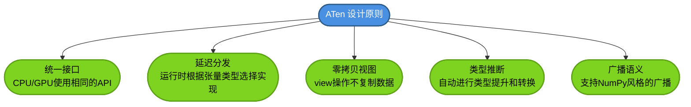
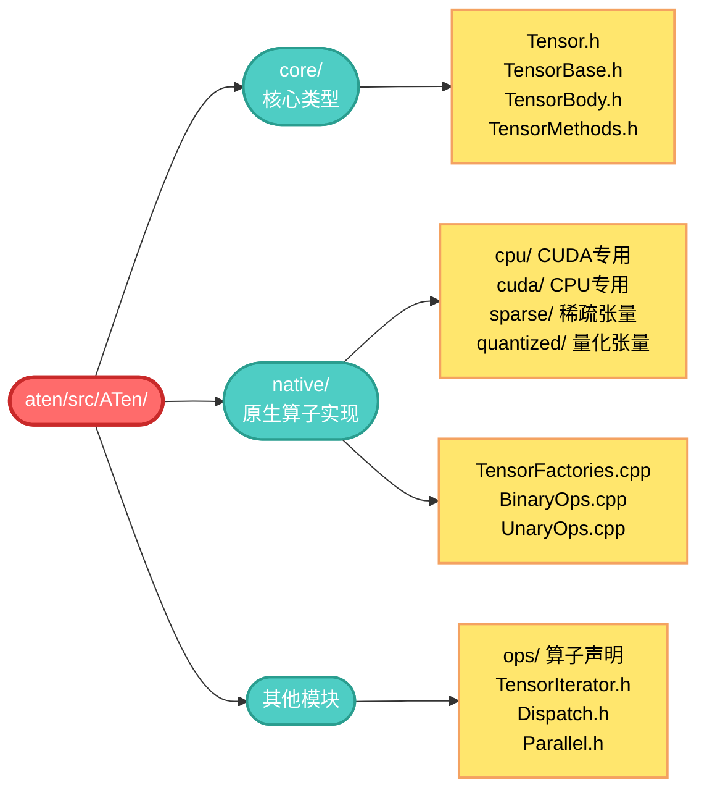
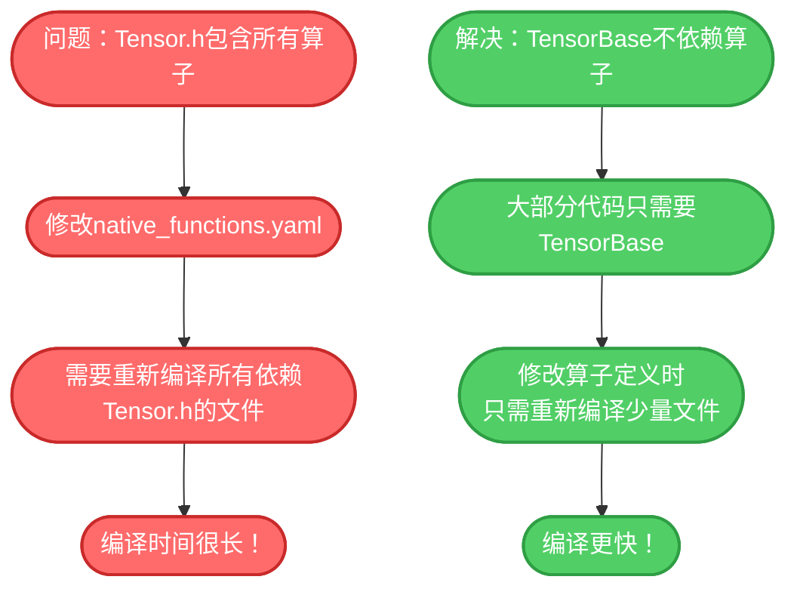
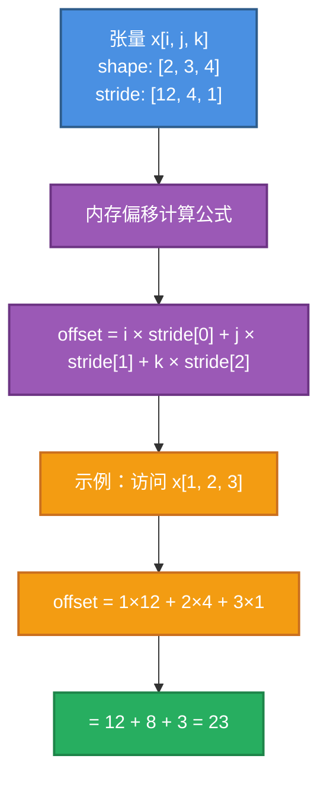
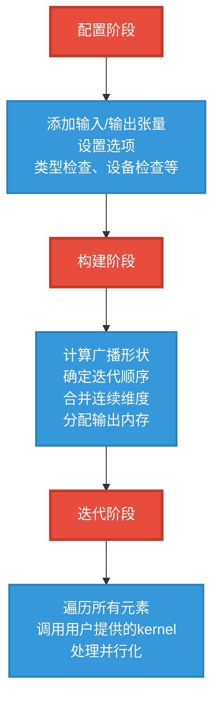
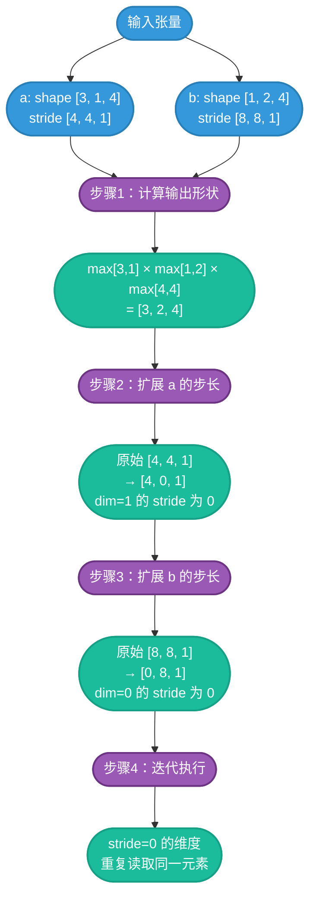
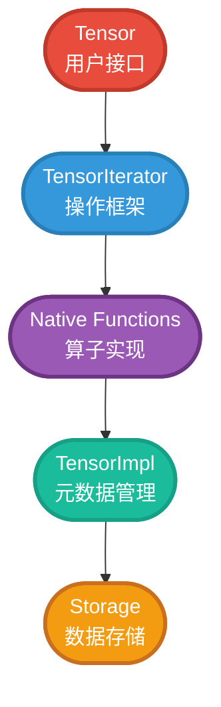

> 继续学习ATen张量库的设计与实现，掌握张量的创建、内存布局、视图操作和生命周期管理

## 1. ATen简介

ATen（A Tensor Library）是PyTorch的C++张量库，提供了所有的张量操作。它是PyTorch的核心计算引擎。


### 1.1 ATen的设计理念



### 1.2 ATen目录结构



## 2. Tensor类详解

### 2.1 Tensor vs TensorBase

PyTorch有两个主要的张量类：

```cpp
// ATen/core/TensorBase.h
class TensorBase {
  // 基础接口，不包含算子方法
  // 用于减少编译依赖
};

// ATen/core/Tensor.h  
class Tensor : public TensorBase {
  // 继承TensorBase，添加所有算子方法
  // 这些方法是自动生成的
};
```

**为什么需要TensorBase？**



### 2.2 Tensor的结构

```cpp
// ATen/core/Tensor.h（简化）
class TORCH_API Tensor : public TensorBase {
public:
  // 继承TensorBase的构造函数
  using TensorBase::TensorBase;
  
  // 自动生成的算子方法（来自native_functions.yaml）
  Tensor abs() const;
  Tensor& abs_();
  Tensor add(const Tensor& other, const Scalar& alpha=1) const;
  Tensor& add_(const Tensor& other, const Scalar& alpha=1);
  // ... 数千个方法
  
  // 友元函数（全局操作符）
  friend Tensor operator+(const Tensor& self, const Tensor& other);
  friend Tensor operator+(const Tensor& self, const Scalar& other);
  // ...
};
```

### 2.3 Tensor的创建

#### 2.3.1 空张量创建

```python
import torch

# 创建未初始化的张量（内存中是随机值）
x = torch.empty(2, 3)
print(x)
# tensor([[6.9126e-39, 1.0561e-38, 1.0653e-38],
#         [4.1327e-39, 8.9082e-39, 9.8265e-39]])

# 在GPU上创建
if torch.cuda.is_available():
    x_cuda = torch.empty(2, 3, device='cuda')
    
# 指定数据类型
x_int = torch.empty(2, 3, dtype=torch.int32)
x_float16 = torch.empty(2, 3, dtype=torch.float16)
```

**C++实现**：

```cpp
// aten/src/ATen/native/TensorFactories.cpp
Tensor empty(
    IntArrayRef size,
    std::optional<ScalarType> dtype,
    std::optional<Layout> layout,
    std::optional<Device> device,
    std::optional<bool> pin_memory,
    std::optional<MemoryFormat> memory_format) {
  
  // 构建TensorOptions
  auto options = TensorOptions()
    .dtype(dtype)
    .layout(layout)
    .device(device)
    .pinned_memory(pin_memory);
  
  // 推断数据类型（如果未指定）
  auto dtype_inferred = options.dtype().value_or(torch::get_default_dtype());
  
  // 分配内存
  auto allocator = GetAllocator(options.device().type());
  auto size_bytes = computeStorageSize(size, dtype_inferred);
  auto storage = c10::make_intrusive<StorageImpl>(
      StorageImpl::use_byte_size_t(),
      size_bytes,
      allocator,
      /*resizable=*/true);
  
  // 创建TensorImpl
  auto tensor_impl = c10::make_intrusive<TensorImpl>(
      std::move(storage),
      computeDispatchKey(options),
      scalarTypeToTypeMeta(dtype_inferred));
  
  // 设置尺寸和步长
  tensor_impl->set_sizes_and_strides(size, computeStride(size));
  
  return Tensor(std::move(tensor_impl));
}
```

#### 2.3.2 初始化张量创建

```python
# 全零张量
zeros = torch.zeros(2, 3)
print(zeros)
# tensor([[0., 0., 0.],
#         [0., 0., 0.]])

# 全一张量
ones = torch.ones(2, 3)

# 填充特定值
full = torch.full((2, 3), 3.14)
print(full)
# tensor([[3.1400, 3.1400, 3.1400],
#         [3.1400, 3.1400, 3.1400]])

# 单位矩阵
eye = torch.eye(3)
print(eye)
# tensor([[1., 0., 0.],
#         [0., 1., 0.],
#         [0., 0., 1.]])
```

**zeros的实现**：

```cpp
// aten/src/ATen/native/TensorFactories.cpp
Tensor zeros(
    IntArrayRef size,
    std::optional<ScalarType> dtype,
    std::optional<Layout> layout,
    std::optional<Device> device,
    std::optional<bool> pin_memory) {
  
  // 先创建空张量
  auto result = at::empty(size, dtype, layout, device, pin_memory);
  
  // 填充为0
  return result.zero_();
}

// zero_的实现
Tensor& zero_(Tensor& self) {
  // 使用memset或GPU kernel将内存置零
  return self.fill_(0);
}
```

#### 2.3.3 随机张量创建

```python
# 标准正态分布
randn = torch.randn(2, 3)
print(randn)
# tensor([[-0.4126,  0.7425, -1.3213],
#         [ 0.2347, -0.1234,  1.5342]])

# 均匀分布 [0, 1)
rand = torch.rand(2, 3)

# 随机整数 [low, high)
randint = torch.randint(0, 10, (2, 3))
print(randint)
# tensor([[3, 7, 2],
#         [9, 1, 4]])

# 设置随机种子（可复现）
torch.manual_seed(42)
x1 = torch.randn(2, 3)
torch.manual_seed(42)
x2 = torch.randn(2, 3)
print(torch.equal(x1, x2))  # True
```

**randn的实现流程**：

```cpp
// aten/src/ATen/native/TensorFactories.cpp
Tensor randn(
    IntArrayRef size,
    std::optional<Generator> generator,
    std::optional<ScalarType> dtype,
    std::optional<Layout> layout,
    std::optional<Device> device,
    std::optional<bool> pin_memory) {
  
  // 1. 创建空张量
  auto result = at::empty(size, dtype, layout, device, pin_memory);
  
  // 2. 填充随机数
  return result.normal_(0, 1, generator);
}

// normal_的分发过程
Tensor& normal_(
    Tensor& self,
    double mean,
    double std,
    std::optional<Generator> gen) {
  
  // 分发到对应的实现
  return at::native::normal_(self, mean, std, gen);
}

// CPU实现
Tensor& normal_cpu_(Tensor& self, double mean, double std, ...) {
  auto iter = TensorIterator::nullary_op(self);
  
  // 使用CPU随机数生成器
  cpu_kernel(iter, [&](void* out_ptr) {
    auto gen = get_generator();
    *static_cast<float*>(out_ptr) = 
        normal_distribution(gen, mean, std);
  });
  
  return self;
}

// CUDA实现（在cuda/TensorFactories.cu中）
Tensor& normal_cuda_(Tensor& self, double mean, double std, ...) {
  // 启动CUDA kernel
  launch_normal_kernel<<<blocks, threads>>>(
      self.data_ptr(), self.numel(), mean, std, seed);
  return self;
}
```

#### 2.3.4 从数据创建

```python
# 从Python列表
x = torch.tensor([[1, 2, 3], [4, 5, 6]])
print(x)
# tensor([[1, 2, 3],
#         [4, 5, 6]])

# 从NumPy数组（共享内存！）
import numpy as np
np_array = np.array([[1, 2], [3, 4]])
x = torch.from_numpy(np_array)
print(x)
# tensor([[1, 2],
#         [3, 4]], dtype=torch.int64)

# 修改NumPy数组会影响Tensor
np_array[0, 0] = 100
print(x)
# tensor([[100,   2],
#         [  3,   4]], dtype=torch.int64)

# 从Tensor创建（拷贝数据）
y = x.clone()
y[0, 0] = 999
print(x[0, 0])  # 100（未受影响）
print(y[0, 0])  # 999
```

**from_numpy的实现**：

```cpp
// torch/csrc/utils/tensor_numpy.cpp（简化）
Tensor tensor_from_numpy(PyObject* obj) {
  // 获取NumPy数组信息
  auto array = (PyArrayObject*)obj;
  auto dtype = numpy_dtype_to_torch(PyArray_TYPE(array));
  auto sizes = numpy_shape_to_vector(array);
  auto strides = numpy_strides_to_vector(array);
  
  // 创建Storage（共享NumPy的内存）
  void* data_ptr = PyArray_DATA(array);
  auto storage = Storage(
      Storage::use_byte_size_t(),
      compute_nbytes(sizes, dtype),
      DataPtr(
          data_ptr,
          array,  // context（持有NumPy数组引用）
          [](void* ctx) {  // deleter
            Py_DECREF((PyObject*)ctx);
          },
          Device(kCPU)),
      /*allocator=*/nullptr,
      /*resizable=*/false);
  
  // 创建Tensor
  auto tensor = at::empty({0});  // 占位
  tensor.set_(storage, 0, sizes, strides);
  return tensor;
}
```

#### 2.3.5 序列生成

```python
# 等差数列
arange = torch.arange(0, 10, 2)
print(arange)
# tensor([0, 2, 4, 6, 8])

# 线性空间
linspace = torch.linspace(0, 1, 5)
print(linspace)
# tensor([0.0000, 0.2500, 0.5000, 0.7500, 1.0000])

# 对数空间
logspace = torch.logspace(0, 3, 4)  # 10^0 到 10^3
print(logspace)
# tensor([   1.,   10.,  100., 1000.])
```

### 2.4 张量属性

```python
x = torch.randn(2, 3, 4, device='cuda:0', dtype=torch.float32)

# 形状
print(x.shape)        # torch.Size([2, 3, 4])
print(x.size())       # torch.Size([2, 3, 4])
print(x.size(0))      # 2（第0维大小）
print(x.dim())        # 3（维度数）

# 元素总数
print(x.numel())      # 24（2*3*4）

# 数据类型
print(x.dtype)        # torch.float32
print(x.type())       # torch.cuda.FloatTensor

# 设备
print(x.device)       # cuda:0
print(x.is_cuda)      # True
print(x.is_cpu)       # False

# 步长（内存布局）
print(x.stride())     # (12, 4, 1)

# 存储
print(x.storage().size())      # 24
print(f"{x.data_ptr():#x}")   # 内存地址

# 梯度相关
x_grad = torch.randn(2, 3, requires_grad=True)
print(x_grad.requires_grad)    # True
print(x_grad.grad_fn)          # None（叶子节点）

# 命名维度（实验性功能）
x_named = torch.randn(2, 3, names=['batch', 'features'])
print(x_named.names)           # ('batch', 'features')
```

## 3. 内存布局详解

### 3.1 Stride（步长）的深入理解

步长定义了在内存中如何遍历张量。

#### 概念说明



#### 行优先 vs 列优先

```python
# 行优先（C风格，PyTorch默认）
x = torch.arange(12).reshape(3, 4)
print(x)
# tensor([[ 0,  1,  2,  3],
#         [ 4,  5,  6,  7],
#         [ 8,  9, 10, 11]])
print(x.stride())  # (4, 1)
# 内存布局：[0, 1, 2, 3, 4, 5, 6, 7, 8, 9, 10, 11]

# 列优先（Fortran风格）
# PyTorch不直接支持，但可以通过转置模拟
y = x.t().contiguous().t()
print(y.stride())  # (1, 3)
# 内存布局：[0, 4, 8, 1, 5, 9, 2, 6, 10, 3, 7, 11]
```

### 3.2 连续性（Contiguity）

#### 什么是连续张量？

```python
# 连续张量：元素在内存中按照行优先顺序排列
x = torch.randn(2, 3)
print(x.is_contiguous())  # True

# 计算预期步长
def compute_contiguous_stride(sizes):
    stride = [1]
    for size in reversed(sizes[1:]):
        stride.insert(0, stride[0] * size)
    return tuple(stride)

print(compute_contiguous_stride([2, 3]))  # (3, 1)
print(x.stride())                          # (3, 1) ✓
```

#### 破坏连续性的操作

```python
x = torch.arange(12).reshape(3, 4)
print(f"x连续: {x.is_contiguous()}")        # True
print(f"x步长: {x.stride()}")                # (4, 1)

# 1. 转置
y = x.t()
print(f"y连续: {y.is_contiguous()}")        # False
print(f"y步长: {y.stride()}")                # (1, 4)
print(f"y的shape: {y.shape}")               # torch.Size([4, 3])
# 预期步长: (3, 1), 实际步长: (1, 4) → 非连续

# 2. 切片
z = x[:, ::2]  # 每隔一列
print(f"z连续: {z.is_contiguous()}")        # False
print(f"z步长: {z.stride()}")                # (4, 2)
print(f"z的shape: {z.shape}")               # torch.Size([3, 2])
# 预期步长: (2, 1), 实际步长: (4, 2) → 非连续

# 3. narrow（窄化）
w = x.narrow(1, 1, 2)  # 选择列1和列2
print(f"w连续: {w.is_contiguous()}")        # True（恰好连续）
print(f"w步长: {w.stride()}")                # (4, 1)
```

#### 恢复连续性

```python
x = torch.arange(12).reshape(3, 4)
y = x.t()  # 非连续

# 方法1：contiguous()
z1 = y.contiguous()
print(z1.is_contiguous())      # True
print(z1.data_ptr() == y.data_ptr())  # False（创建了新存储）

# 方法2：clone()（总是创建连续的副本）
z2 = y.clone()
print(z2.is_contiguous())      # True
print(z2.data_ptr() == y.data_ptr())  # False
```

**contiguous()的C++实现**：

```cpp
// aten/src/ATen/native/TensorConversions.cpp
Tensor contiguous(const Tensor& self, MemoryFormat memory_format) {
  // 如果已经连续，直接返回
  if (self.is_contiguous(memory_format)) {
    return self;
  }
  
  // 创建新的连续张量
  auto result = at::empty_like(self, memory_format);
  
  // 拷贝数据
  result.copy_(self);
  
  return result;
}

// copy_的实现使用TensorIterator高效拷贝
Tensor& copy_(Tensor& self, const Tensor& src) {
  auto iter = TensorIteratorConfig()
      .add_output(self)
      .add_input(src)
      .check_all_same_dtype(false)
      .build();
  
  // 分发到对应的kernel
  copy_stub(iter.device_type(), iter);
  return self;
}
```

### 3.3 内存格式（Memory Format）

#### NCHW vs NHWC

```python
# NCHW格式（默认，适合大多数操作）
x_nchw = torch.randn(2, 3, 4, 4)  # [Batch, Channel, Height, Width]
print(x_nchw.stride())  # (48, 16, 4, 1)
# 访问x[n, c, h, w]: 偏移 = n*48 + c*16 + h*4 + w*1

# 转换为NHWC格式（某些GPU操作更快）
x_nhwc = x_nchw.contiguous(memory_format=torch.channels_last)
print(x_nhwc.stride())  # (48, 1, 12, 3)
# 访问x[n, h, w, c]: 偏移 = n*48 + h*12 + w*3 + c*1

# 检查内存格式
print(x_nchw.is_contiguous(memory_format=torch.contiguous_format))   # True
print(x_nchw.is_contiguous(memory_format=torch.channels_last))       # False
print(x_nhwc.is_contiguous(memory_format=torch.channels_last))       # True
```

#### 性能对比

```python
import torch
import time

# 准备数据
x = torch.randn(64, 3, 224, 224, device='cuda')
conv = torch.nn.Conv2d(3, 64, 3, padding=1).cuda()

# NCHW格式
x_nchw = x.contiguous(memory_format=torch.contiguous_format)
conv_nchw = conv

torch.cuda.synchronize()
start = time.time()
for _ in range(100):
    y = conv_nchw(x_nchw)
torch.cuda.synchronize()
time_nchw = time.time() - start

# NHWC格式
x_nhwc = x.contiguous(memory_format=torch.channels_last)
conv_nhwc = conv.to(memory_format=torch.channels_last)

torch.cuda.synchronize()
start = time.time()
for _ in range(100):
    y = conv_nhwc(x_nhwc)
torch.cuda.synchronize()
time_nhwc = time.time() - start

print(f"NCHW: {time_nchw:.4f}s")
print(f"NHWC: {time_nhwc:.4f}s")
print(f"加速比: {time_nchw/time_nhwc:.2f}x")
```

### 3.4 视图操作（View Operations）

#### view vs reshape

```python
x = torch.arange(12).reshape(3, 4)

# view：要求输入是连续的，返回视图
y = x.view(4, 3)
print(y.data_ptr() == x.data_ptr())  # True（共享存储）

# reshape：输入可以不连续，可能返回副本
z1 = x.reshape(4, 3)
print(z1.data_ptr() == x.data_ptr())  # True（恰好连续）

x_t = x.t()  # 非连续
z2 = x_t.reshape(4, 3)
print(z2.data_ptr() == x_t.data_ptr())  # False（创建了副本）

# view会报错
try:
    x_t.view(4, 3)
except RuntimeError as e:
    print(f"Error: {e}")
    # view size is not compatible with input tensor's size and stride
```

**view的C++实现**：

```cpp
// aten/src/ATen/native/TensorShape.cpp
Tensor view(const Tensor& self, IntArrayRef size) {
  // 检查是否连续
  TORCH_CHECK(
      self.is_contiguous(),
      "view size is not compatible with input tensor's size and stride "
      "(at least one dimension spans across two contiguous subspaces). "
      "Use reshape instead.");
  
  // 推断-1维度
  auto inferred_size = infer_size(size, self.numel());
  
  // 创建新的TensorImpl（共享存储）
  auto result = self.as_strided(inferred_size, compute_stride(inferred_size));
  
  return result;
}

// as_strided：底层视图创建函数
Tensor as_strided(
    const Tensor& self,
    IntArrayRef size,
    IntArrayRef stride,
    optional<int64_t> storage_offset) {
  
  // 创建新TensorImpl
  auto impl = c10::make_intrusive<TensorImpl>(
      self.storage(),  // 共享存储！
      self.key_set(),
      self.dtype());
  
  // 设置新的尺寸和步长
  impl->set_sizes_and_strides(size, stride);
  impl->set_storage_offset(storage_offset.value_or(self.storage_offset()));
  
  return Tensor(std::move(impl));
}
```

#### 常见视图操作

```python
x = torch.arange(24).reshape(2, 3, 4)

# 1. squeeze：删除大小为1的维度
y = x[:, :, 0:1]  # shape: [2, 3, 1]
z = y.squeeze()    # shape: [2, 3]
print(z.shape)

# 2. unsqueeze：添加大小为1的维度
w = z.unsqueeze(0)  # shape: [1, 2, 3]
print(w.shape)

# 3. transpose：交换两个维度
t = x.transpose(0, 2)  # shape: [4, 3, 2]
print(t.shape)
print(t.is_contiguous())  # False

# 4. permute：任意重排维度
p = x.permute(2, 0, 1)  # shape: [4, 2, 3]
print(p.shape)
print(p.is_contiguous())  # False

# 5. flatten：展平
f = x.flatten()  # shape: [24]
print(f.shape)

# 6. unflatten：反展平
u = f.unflatten(0, (2, 3, 4))  # shape: [2, 3, 4]
print(u.shape)
```

## 4. 张量索引和切片

### 4.1 基本索引

```python
x = torch.arange(24).reshape(2, 3, 4)

# 单个元素
print(x[0, 1, 2])  # tensor(6)

# 切片
print(x[0])        # shape: [3, 4]
print(x[:, 1])     # shape: [2, 4]
print(x[:, :, ::2])  # 步长为2，shape: [2, 3, 2]

# 范围
print(x[0:1])      # shape: [1, 3, 4]
print(x[:, 1:3])   # shape: [2, 2, 4]

# 负索引
print(x[-1])       # 最后一个元素，shape: [3, 4]
print(x[:, :-1])   # 除了最后一个，shape: [2, 2, 4]
```

### 4.2 高级索引

```python
x = torch.arange(12).reshape(3, 4)

# 1. 布尔索引
mask = x > 5
print(mask)
# tensor([[False, False, False, False],
#         [False, False,  True,  True],
#         [ True,  True,  True,  True]])

selected = x[mask]
print(selected)  # tensor([ 6,  7,  8,  9, 10, 11])

# 2. 整数数组索引
indices = torch.tensor([0, 2])
print(x[indices])  # 选择第0行和第2行
# tensor([[ 0,  1,  2,  3],
#         [ 8,  9, 10, 11]])

# 3. 多维索引
row_indices = torch.tensor([0, 1, 2])
col_indices = torch.tensor([1, 2, 3])
print(x[row_indices, col_indices])  # tensor([1, 6, 11])

# 4. where条件索引
result = torch.where(x > 5, x, torch.zeros_like(x))
print(result)
# tensor([[ 0,  0,  0,  0],
#         [ 0,  0,  6,  7],
#         [ 8,  9, 10, 11]])
```

### 4.3 索引的C++实现

```cpp
// torch/csrc/autograd/python_variable_indexing.cpp（简化）
Tensor applySelect(
    const Tensor& self,
    int64_t dim,
    int64_t index) {
  
  // select等价于：self.narrow(dim, index, 1).squeeze(dim)
  return self.select(dim, index);
}

// aten/src/ATen/native/TensorAdvancedIndexing.cpp
Tensor select(const Tensor& self, int64_t dim, int64_t index) {
  // 处理负索引
  auto ndim = self.dim();
  dim = maybe_wrap_dim(dim, ndim);
  auto size = self.size(dim);
  index = maybe_wrap_dim(index, size);
  
  // 计算新的尺寸和步长
  auto new_sizes = self.sizes().vec();
  new_sizes.erase(new_sizes.begin() + dim);
  
  auto new_strides = self.strides().vec();
  auto stride_at_dim = new_strides[dim];
  new_strides.erase(new_strides.begin() + dim);
  
  // 计算新的存储偏移
  auto new_offset = self.storage_offset() + index * stride_at_dim;
  
  // 创建视图
  return self.as_strided(new_sizes, new_strides, new_offset);
}
```

## 5. 张量操作分类

### 5.1 逐元素操作（Element-wise）

```python
x = torch.randn(2, 3)
y = torch.randn(2, 3)

# 算术运算
z = x + y
z = x - y
z = x * y
z = x / y
z = x ** 2

# 比较运算
z = x > y
z = x == y
z = torch.max(x, y)  # 逐元素最大值

# 数学函数
z = torch.abs(x)
z = torch.sqrt(x.abs())
z = torch.exp(x)
z = torch.log(x.abs())
z = torch.sin(x)

# 就地操作（以_结尾）
x.add_(y)  # x = x + y
x.mul_(2)  # x = x * 2
```

**逐元素操作的实现（TensorIterator）**：

```cpp
// aten/src/ATen/native/BinaryOps.cpp
Tensor add(const Tensor& self, const Tensor& other, const Scalar& alpha) {
  // 创建输出张量
  Tensor result = at::empty_like(self);
  
  // 使用TensorIterator处理广播和类型转换
  auto iter = TensorIteratorConfig()
      .add_output(result)
      .add_input(self)
      .add_input(other)
      .build();
  
  // 分发到对应的kernel
  add_stub(iter.device_type(), iter, alpha);
  
  return result;
}

// CPU kernel（aten/src/ATen/native/cpu/BinaryOpsKernel.cpp）
void add_kernel(TensorIterator& iter, const Scalar& alpha) {
  AT_DISPATCH_ALL_TYPES(iter.dtype(), "add_cpu", [&] {
    cpu_kernel(iter, [alpha](scalar_t a, scalar_t b) -> scalar_t {
      return a + alpha.to<scalar_t>() * b;
    });
  });
}
```

### 5.2 归约操作（Reduction）

```python
x = torch.randn(2, 3, 4)

# 全局归约
s = x.sum()     # 标量
m = x.mean()
mx = x.max()
mn = x.min()
p = x.prod()    # 乘积

# 沿某个维度归约
s = x.sum(dim=1)      # shape: [2, 4]
m = x.mean(dim=1)     # shape: [2, 4]
mx = x.max(dim=1)     # 返回(values, indices)

# 保持维度
s = x.sum(dim=1, keepdim=True)  # shape: [2, 1, 4]

# 多维度归约
s = x.sum(dim=[0, 2])  # shape: [3]

# 累积归约
cumsum = x.cumsum(dim=1)   # 累加
cumprod = x.cumprod(dim=1) # 累乘
```

### 5.3 线性代数操作

```python
# 矩阵乘法
a = torch.randn(3, 4)
b = torch.randn(4, 5)
c = torch.mm(a, b)  # 或 a @ b，shape: [3, 5]

# 批量矩阵乘法
a = torch.randn(10, 3, 4)
b = torch.randn(10, 4, 5)
c = torch.bmm(a, b)  # shape: [10, 3, 5]

# 通用矩阵乘法（支持广播）
a = torch.randn(10, 3, 4)
b = torch.randn(4, 5)
c = torch.matmul(a, b)  # shape: [10, 3, 5]

# 点积
a = torch.randn(10)
b = torch.randn(10)
c = torch.dot(a, b)  # 标量

# 外积
c = torch.outer(a, b)  # shape: [10, 10]

# 矩阵分解
a = torch.randn(3, 3)
q, r = torch.linalg.qr(a)      # QR分解
u, s, v = torch.linalg.svd(a)  # SVD分解

# 求逆
inv = torch.inverse(a)
```

### 5.4 形状操作

```python
x = torch.randn(2, 3, 4)

# 改变形状
y = x.reshape(6, 4)
y = x.view(6, 4)
y = x.flatten()
y = x.flatten(start_dim=1)  # 从第1维开始展平

# 转置
y = x.transpose(0, 1)  # shape: [3, 2, 4]
y = x.permute(2, 0, 1)  # shape: [4, 2, 3]
y = x.T  # 仅适用于2D，等价于transpose(0, 1)

# 增加/删除维度
y = x.unsqueeze(0)  # shape: [1, 2, 3, 4]
y = x.squeeze()     # 删除所有大小为1的维度

# 拼接
a = torch.randn(2, 3)
b = torch.randn(2, 3)
c = torch.cat([a, b], dim=0)  # shape: [4, 3]
c = torch.stack([a, b], dim=0)  # shape: [2, 2, 3]

# 分割
a, b, c = torch.chunk(x, 3, dim=1)  # 沿dim=1分成3块
a, b = torch.split(x, [1, 2], dim=1)  # 分成大小为1和2的块
```

## 6. TensorIterator深入

### 6.1 TensorIterator的作用

TensorIterator是ATen中用于高效实现逐元素操作的关键工具。

**解决的问题**：
1. **广播**：自动处理不同形状张量的广播
2. **类型转换**：自动进行数据类型转换
3. **设备处理**：统一CPU/GPU代码
4. **内存优化**：合并维度，优化内存访问

### 6.2 TensorIterator使用示例

```cpp
// 实现一个自定义的add函数
Tensor my_add(const Tensor& a, const Tensor& b) {
  // 创建输出张量
  Tensor result = at::empty_like(a);
  
  // 配置TensorIterator
  auto iter = TensorIteratorConfig()
      .add_output(result)     // 输出
      .add_input(a)           // 输入1
      .add_input(b)           // 输入2
      .build();               // 构建
  
  // 定义kernel
  AT_DISPATCH_ALL_TYPES(iter.dtype(), "my_add", [&] {
    cpu_kernel(iter, [](scalar_t a, scalar_t b) -> scalar_t {
      return a + b;
    });
  });
  
  return result;
}
```

### 6.3 TensorIterator的工作流程



**广播示例**：

```python
a = torch.randn(3, 1, 4)
b = torch.randn(1, 2, 4)
c = a + b  # shape: [3, 2, 4]
```



## 7. 引用计数和生命周期

### 7.1 引用计数机制

```python
import torch
import sys

# 创建张量
x = torch.randn(2, 3)
print(sys.getrefcount(x) - 1)  # 1（减1是因为getrefcount本身增加了引用）

# 创建引用
y = x
print(sys.getrefcount(x) - 1)  # 2

# view操作也增加引用（共享存储）
z = x.view(6)
print(sys.getrefcount(x) - 1)  # 3

# clone不增加原张量引用（新存储）
w = x.clone()
print(sys.getrefcount(x) - 1)  # 3

# 删除引用
del y
print(sys.getrefcount(x) - 1)  # 2
```

### 7.2 Storage的引用计数

```cpp
// c10/core/StorageImpl.h
struct StorageImpl : public c10::intrusive_ptr_target {
  // intrusive_ptr_target提供引用计数
  // 使用原子操作保证线程安全
  
  // 当引用计数降为0时，自动释放内存
  ~StorageImpl() {
    if (data_ptr_) {
      // 调用DataPtr的删除器
      // 对于CPU：free()
      // 对于CUDA：cudaFree()
    }
  }
};
```

### 7.3 循环引用问题

```python
# PyTorch通过弱引用避免循环引用

# 场景：计算图
x = torch.randn(2, 3, requires_grad=True)
y = x * 2
z = y.sum()

# 关系：
# x.grad_fn = None（叶子节点）
# y.grad_fn = MulBackward（持有x的弱引用）
# z.grad_fn = SumBackward（持有y的弱引用）

# backward后，计算图自动释放
z.backward()

# 此时grad_fn仍然存在，但不持有中间结果
print(y.grad_fn)  # <MulBackward0>
```

## 8. 总结

### 8.1 核心概念回顾



### 8.2 关键要点

1. **Tensor创建**：empty, zeros, ones, randn, tensor, from_numpy
2. **内存布局**：stride, contiguous, memory_format
3. **视图操作**：view, reshape, transpose, permute（零拷贝）
4. **索引切片**：基本索引、高级索引、布尔索引
5. **操作分类**：逐元素、归约、线性代数、形状操作
6. **TensorIterator**：统一处理广播、类型转换、并行化
7. **生命周期**：引用计数、共享存储、自动释放

## 9. 思考

### 练习1：内存布局实验

```python
# 创建张量并观察内存布局
x = torch.arange(24).reshape(2, 3, 4)

# 问题：
# 1. x的stride是什么？
# 2. x.transpose(0, 2)的stride是什么？
# 3. 转置后的张量是否连续？
# 4. 如何验证stride的计算？

# 实现一个函数，根据索引和stride计算内存偏移
def compute_offset(indices, strides, base_offset=0):
    offset = base_offset
    for idx, stride in zip(indices, strides):
        offset += idx * stride
    return offset

# 验证
print(x[1, 2, 3])  # 获取元素值
offset = compute_offset([1, 2, 3], x.stride())
print(x.storage()[offset])  # 应该相等
```

### 练习2：实现自定义操作

```python
# 使用TensorIterator实现一个自定义的ReLU
import torch
from torch.utils.cpp_extension import load_inline

cpp_source = """
#include <torch/extension.h>

torch::Tensor my_relu(torch::Tensor input) {
    auto output = torch::empty_like(input);
    auto iter = at::TensorIteratorConfig()
        .add_output(output)
        .add_input(input)
        .build();
    
    AT_DISPATCH_FLOATING_TYPES(iter.dtype(), "my_relu", [&] {
        at::cpu_kernel(iter, [](scalar_t a) -> scalar_t {
            return a > 0 ? a : 0;
        });
    });
    
    return output;
}

PYBIND11_MODULE(TORCH_EXTENSION_NAME, m) {
    m.def("my_relu", &my_relu, "Custom ReLU");
}
"""

# 编译并加载
my_ops = load_inline(
    name='my_ops',
    cpp_sources=[cpp_source],
    functions=['my_relu']
)

# 测试
x = torch.randn(3, 4)
y1 = torch.relu(x)
y2 = my_ops.my_relu(x)
print(torch.allclose(y1, y2))  # True
```

### 思考题

1. **为什么transpose不复制数据？**
   - 提示：思考stride的作用

2. **view为什么要求输入连续？**
   - 提示：考虑内存地址的计算

3. **TensorIterator如何处理广播？**
   - 提示：观察stride=0的含义

4. **什么时候应该使用contiguous()？**
   - 提示：考虑操作的要求和性能

5. **from_numpy为什么能零拷贝？**
   - 提示：思考Storage和DataPtr的设计

---