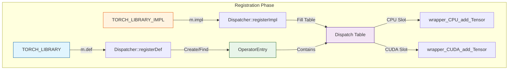
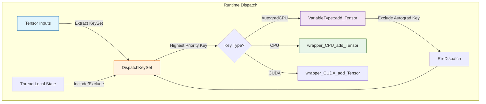
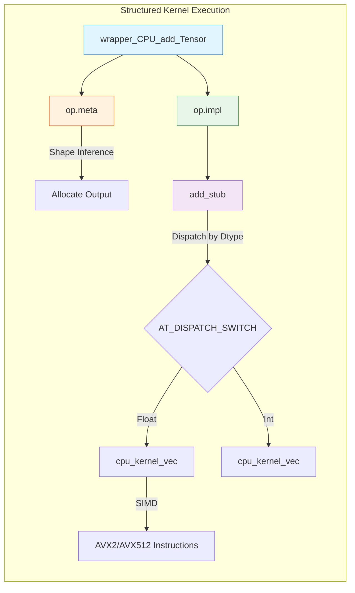

本文档结合 PyTorch 2.8 源码与 LLDB 调试记录，详细解析 PyTorch 的 Dispatcher 分发机制。将从算子调用入口开始，一步步追踪到最终的 Kernel 执行，并深入探讨算子注册、DispatchKeySet 计算以及 Structured Kernel 的实现细节。

## 1. 算子调用入口

当执行 `c = a + b` 时，Python 层会调用 `torch.add`，最终进入 C++ 层的 `at::Tensor::add`。

### 1.1 C++ API 入口

在 `aten/src/ATen/core/TensorBody.h` 中，`add` 方法被定义为：

```cpp
// TensorBody.h:1669
inline at::Tensor Tensor::add(const at::Tensor & other, const at::Scalar & alpha) const {
    return at::_ops::add_Tensor::call(const_cast<Tensor&>(*this), other, alpha);
}
```

这里调用了 `at::_ops::add_Tensor::call`。这是一个由代码生成工具（`torchgen`）生成的静态包装函数。

### 1.2 自动生成的算子包装器

在构建目录下的 `Operators_2.cpp`中，可以找到其实现：

```cpp
// aten::add.Tensor(Tensor self, Tensor other, *, Scalar alpha=1) -> Tensor
static C10_NOINLINE c10::TypedOperatorHandle<add_Tensor::schema> create_add_Tensor_typed_handle() {
  return c10::Dispatcher::singleton()
      .findSchemaOrThrow(add_Tensor::name, add_Tensor::overload_name)
      .typed<add_Tensor::schema>();
}

// aten::add.Tensor(Tensor self, Tensor other, *, Scalar alpha=1) -> Tensor
at::Tensor add_Tensor::call(const at::Tensor & self, const at::Tensor & other, const at::Scalar & alpha) {
    // 查找并缓存 OperatorHandle
    static auto op = create_add_Tensor_typed_handle();
    // 调用 Dispatcher
    return op.call(self, other, alpha);
}
```

`create_add_Tensor_typed_handle` 负责从 `Dispatcher` 单例中查找名为 `aten::add` 的算子句柄（`OperatorHandle`）。

## 2. 算子注册机制

Dispatcher 能够查找到 Kernel，是因为在库加载时进行了注册。这一过程主要涉及 `native_functions.yaml` 定义和 `TORCH_LIBRARY` 宏。

### 2.1 Schema 定义

在 `aten/src/ATen/native/native_functions.yaml` 中定义了算子 Schema：

```yaml
- func: add.Tensor(Tensor self, Tensor other, *, Scalar alpha=1) -> Tensor
  device_check: NoCheck
  structured_delegate: add.out
  variants: function, method
  dispatch:
    SparseCPU, SparseCUDA, SparseMeta: add_sparse
    # ...
```

### 2.2 注册流程

PyTorch 使用宏来实现算子的自动注册。

```cpp
// build/aten/src/ATen/RegisterSchema.cpp

TORCH_LIBRARY(aten, m) {
  // ...
  m.def("add.Tensor(Tensor self, Tensor other, *, Scalar alpha=1) -> Tensor", tags_6);
  // ...
}
```

`m.def` 最终会调用 `Dispatcher::registerDef`：

```cpp
// aten/src/ATen/core/dispatch/Dispatcher.cpp
RegistrationHandleRAII Dispatcher::registerDef(FunctionSchema schema, ...) {
  OperatorName op_name = schema.operator_name(); // 得到 "aten::add", "Tensor"
  
  // 关键点：查找或创建 OperatorHandle
  auto op = findOrRegisterName_(op_name); 

  // 将 Schema 注册到这个 OperatorHandle 指向的 OperatorEntry 中
  op.operatorDef_->op.registerSchema(std::move(schema), ...);
  // ...
}
```

### 2.3 Kernel 实现注册

具体的 Kernel 实现（如 CPU 版本）通过 `TORCH_LIBRARY_IMPL` 注册：

```cpp
// build/aten/src/ATen/RegisterCPU_0.cpp
TORCH_LIBRARY_IMPL(aten, CPU, m) {
    m.impl("add.Tensor", TORCH_FN(wrapper_CPU_add_Tensor));
    m.impl("add.out", TORCH_FN(wrapper_CPU_add_out_out));
    // ...
}
```

这会将 `wrapper_CPU_add_Tensor` 函数指针填入 `add.Tensor` 算子的 Dispatch Table 的 `CPU` 槽位。



## 3. Dispatcher 分发核心 (Runtime)

`op.call(...)` 最终会调用 `c10::Dispatcher::call`。这是分发机制的核心。

### 3.1 DispatchKeySet 的计算

在 `Dispatcher::call` 中，首先要确定本次调用的 `DispatchKeySet`。

```cpp
// Dispatcher.h
template <class Return, class... Args>
Return Dispatcher::call(const TypedOperatorHandle<Return(Args...)>& op, Args... args) const {
  // 1. 提取 KeySet
  auto dispatchKeySet = op.operatorDef_->op.dispatchKeyExtractor()
          .template getDispatchKeySetUnboxed<Args...>(args...);
  
  // 2. 查找 Kernel
  const KernelFunction& kernel = op.operatorDef_->op.lookup(dispatchKeySet);
  
  // 3. 执行 Kernel
  return kernel.call(op, dispatchKeySet, std::forward<Args>(args)...);
}
```

### 3.2 LLDB 分析：DispatchKeySet 的构成

通过 LLDB 调试，可以清晰地看到 `DispatchKeySet` 是如何构建的。

```lldb
(lldb) breakpoint set -n "TensorImpl::TensorImpl"
(lldb) run
...
(lldb) continue
Process 35257 stopped
* thread #1, queue = 'com.apple.main-thread', stop reason = breakpoint 3.4
    frame #0: 0x00000001014ee13c libc10.dylib`c10::TensorImpl::TensorImpl(this=0x0000600003a84a80, storage=0x000000016fdfc6a8, key_set=(repr_ = 65537), data_type=(index_ = 4)) at TensorImpl.cpp:84:28
```

**分析 `key_set=(repr_ = 65537)`：**

1.  **数值解析**：`65537` 的二进制是 `10000000000000001`。
2.  **低位 (Bit 0)**：对应 `DispatchKey::CPU`。这表明这是一个 CPU Tensor。
3.  **高位 (Bit 16)**：对应 `DispatchKey::AutogradCPU`。这表明该 Tensor 支持自动微分（即使 `requires_grad=False`，Autograd Key 通常也会存在，只是不记录历史）。
4.  **data_type=(index_ = 4)**：对应 `ScalarType::Float`。

**DispatchKeySet 计算逻辑：**

1.  **遍历参数**：`getDispatchKeySetUnboxed` 展开参数包，提取所有 Tensor 参数的 `key_set()`。
2.  **合并 (Bitwise OR)**：`DispatchKeySet = self.key_set() | other.key_set()`。
3.  **应用 TLS**：结合线程局部存储（TLS）中的 `included` 和 `excluded` 集合。
    *   例如在 `InferenceMode` 下，`Autograd` 相关的 Key 会被排除。
    *   **最终结果**：得到一个纯净的 `DispatchKeySet`，其中最高优先级的 Key 决定了下一步的去向。

### 3.3 查找 Kernel (Lookup)

`OperatorEntry::lookup` 使用计算出的 `DispatchKeySet` 中的**最高优先级 Key** 来查找对应的 Kernel。

```cpp
// OperatorEntry.h
const KernelFunction& lookup(DispatchKeySet ks) const {
    const auto idx = ks.getDispatchTableIndexForDispatchKeySet();
    // ...
    return dispatchTable_[idx];
}
```

PyTorch 维护了一个预计算的 `dispatchTable_` 数组，通过 Key 的索引直接获取函数指针，实现了 O(1) 的查找开销。



## 4. 底层实现：Structured Kernel 与 Stub

当 Dispatcher 路由到 `CPU` 后端时，会调用 `wrapper_CPU_add_Tensor`。这是 PyTorch 的 **Structured Kernel** 机制。

### 4.1 Wrapper 函数

`wrapper_CPU_add_Tensor` 是自动生成的，它将计算分为 **Meta**（元数据处理）和 **Impl**（实际计算）两部分。

```cpp
at::Tensor wrapper_CPU_add_Tensor(const at::Tensor & self, const at::Tensor & other, const at::Scalar & alpha) {
    structured_ufunc_add_CPU_functional op;
    op.meta(self, other, alpha); // 1. 计算输出形状、类型等元数据
    op.impl(self, other, alpha, op.outputs_[0]); // 2. 执行实际计算
    return std::move(op.outputs_[0]);
}
```

### 4.2 Structured Kernel 类结构

```cpp
struct structured_ufunc_add_CPU_functional final : public at::native::structured_ufunc_add_CPU {
    // ... 负责管理输出 Tensor 的内存分配 ...
    std::array<Tensor, 1> outputs_;
};

struct TORCH_API structured_ufunc_add_CPU : public at::meta::structured_add_Tensor {
    void impl(const at::Tensor & self, const at::Tensor & other, const at::Scalar & alpha, const at::Tensor & out);
};
```

### 4.3 Stub 与 Vectorization

`impl` 方法最终会调用 `add_stub`，这是一个Dispatch Stub，用于根据 CPU 指令集（AVX2, AVX512 等）选择最优的 Kernel 实现。

```cpp
// BinaryOps.cpp
DEFINE_DISPATCH(add_stub);

TORCH_IMPL_FUNC(ufunc_add_CPU)(const at::Tensor & self, const at::Tensor & other, const at::Scalar & alpha, const at::Tensor & out) {
  add_stub(device_type(), *this, alpha);
}
```

`add_stub` 的具体实现使用了 `AT_DISPATCH_SWITCH` 宏：

```cpp
// build/aten/src/ATen/UfuncCPUKernel_add.cpp
void add_kernel(TensorIteratorBase& iter, const Scalar& alpha) {
    // 使用 AT_DISPATCH_ALL_TYPES 宏根据数据类型（float, int等）分发
    AT_DISPATCH_ALL_TYPES_AND_COMPLEX_AND2(...) {
        // cpu_kernel_vec 会处理向量化 (SIMD) 优化
        cpu_kernel_vec(iter,
            [=](scalar_t a, scalar_t b) { return ufunc::add(a, b, alpha_val); }, // 标量实现
            [=](Vectorized<scalar_t> a, Vectorized<scalar_t> b) { ... }          // 向量化实现
        );
    }
}
```

`cpu_kernel_vec` 利用 `TensorIterator` 进行并行化（OpenMP/TBB）和向量化循环，确保了计算的高效性。



## 5. 总结

PyTorch 的 Dispatcher 机制是一个高度优化且灵活的分发系统：

1.  **注册阶段**：通过 `TORCH_LIBRARY` 宏将算子 Schema 和 Kernel 实现注册到 `Dispatcher` 中。
2.  **运行时分发**：
    *   从输入 Tensor 提取 `DispatchKeySet`。
    *   结合 TLS 状态确定最高优先级 Key。
    *   通过 `dispatchTable_` 快速查找到对应的 Kernel。
3.  **Autograd 集成**：`Autograd` Key 优先级高于 `CPU/CUDA`，确保了自动微分逻辑的优先执行。
4.  **Structured Kernel**：将元数据计算与数值计算分离，提高了代码复用性和可维护性。
5.  **Stub 机制**：实现了针对不同硬件指令集的动态分发，保证了最佳性能。
