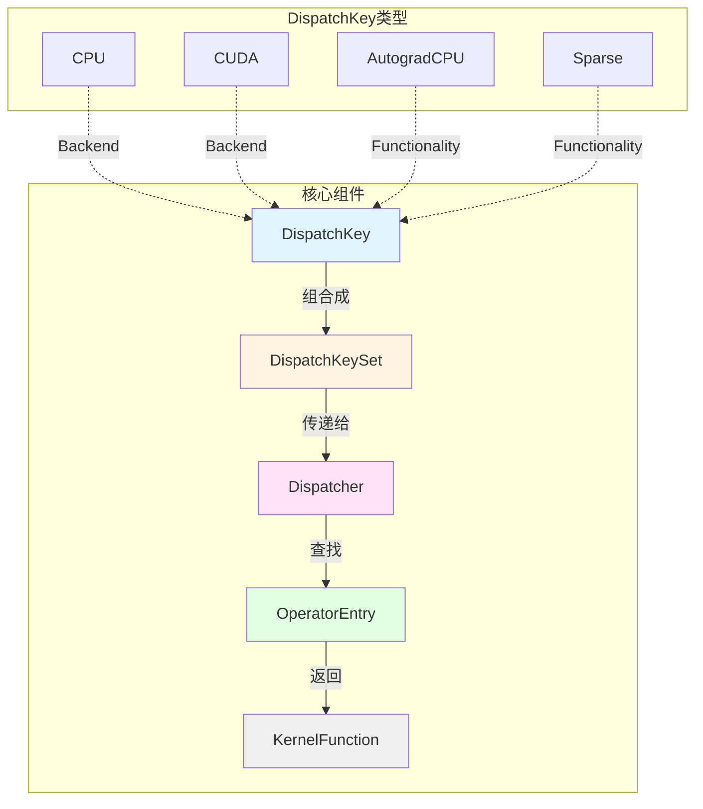
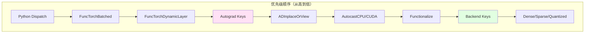
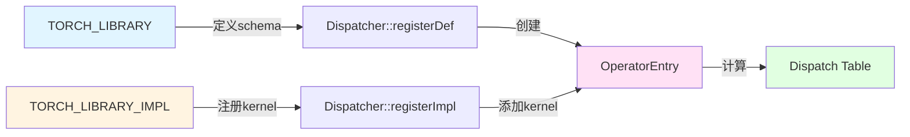
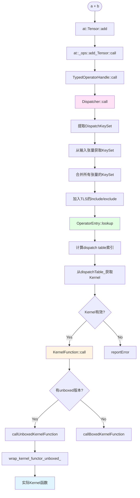
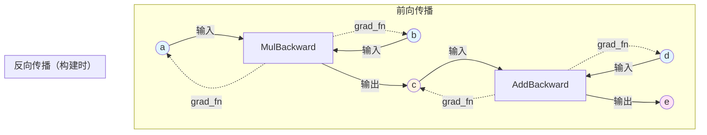
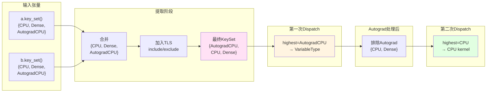
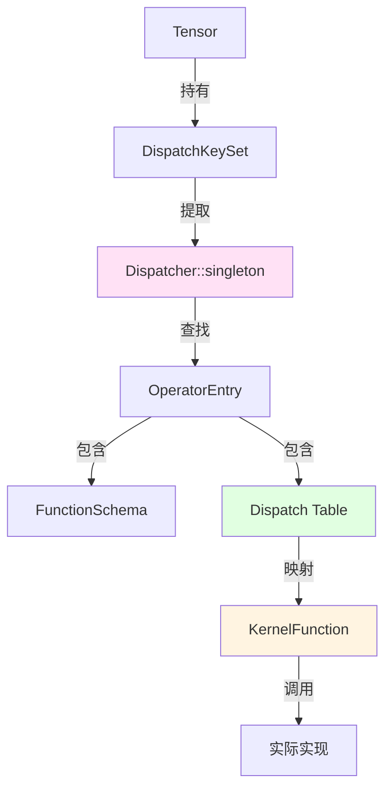

## 1. 概述

PyTorch的Dispatch机制是其核心架构的基石，负责将算子调用路由到正确的Kernel实现。本文基于PyTorch 2.8源码和LLDB调试，深入剖析从Python `a + b` 到底层CUDA/CPU Kernel的完整调用链。

完整的 LLDB 调试记录放在最后。

### 1.1 示例代码

```python
import torch

a = torch.tensor([1, 2, 3])
b = torch.tensor([2, 3, 4])
c = a + b  # 触发Dispatch机制
print(c)
```

这个简单的张量加法操作，背后经历了：
- **Python绑定层**：`__add__` → `Tensor.add`
- **C++ API层**：`at::Tensor::add`
- **算子注册层**：`at::_ops::add_Tensor::call`
- **分发器层**：`c10::Dispatcher::call`
- **Kernel选择层**：根据`DispatchKeySet`查找Kernel
- **自动微分层**：`torch::autograd::VariableType::add_Tensor`
- **底层实现层**：CPU/CUDA Kernel

---

## 2. Dispatch机制的核心概念

### 2.1 什么是Dispatch？

**Dispatch**（分发）是指根据张量的类型、设备、是否需要梯度等属性，动态选择正确的算子实现的过程。PyTorch使用**多重分发**（Multiple Dispatch）机制，支持：

- **设备分发**：CPU、CUDA、XLA等
- **功能分发**：稠密张量、稀疏张量、量化张量
- **Autograd分发**：是否需要梯度计算
- **自定义分发**：用户自定义Backend

### 2.2 核心数据结构



---

## 3. LLDB调试追踪分析

### 3.1 调用栈概览

基于提供的LLDB调试记录，我们追踪`a + b`的完整调用链：

```
Python层
  └─> at::Tensor::add                          [TensorBody.h:1669]
       └─> at::_ops::add_Tensor::call          [Operators_2.cpp:1027]
            └─> TypedOperatorHandle::call      [Dispatcher.h:608]
                 └─> c10::Dispatcher::call     [Dispatcher.h:772]
                      ├─> 提取DispatchKeySet
                      ├─> op.lookup(dispatchKeySet)
                      └─> kernel.call           [KernelFunction_impl.h:143]
                           └─> callUnboxedKernelFunction
                                └─> wrap_kernel_functor_unboxed_::call
                                     └─> torch::autograd::VariableType::add_Tensor
                                          ├─> 创建AddBackward0节点
                                          ├─> 保存反向传播所需数据
                                          └─> 调用下一层Kernel
```

### 3.2 关键断点分析

#### 断点1：算子入口 (`at::Tensor::add`)

```cpp
// TensorBody.h:1669
inline at::Tensor Tensor::add(const at::Tensor & other, const at::Scalar & alpha) const {
    return at::_ops::add_Tensor::call(const_cast<Tensor&>(*this), other, alpha);
}
```

**分析**：
- 这是C++ Tensor API的入口
- 将成员函数调用转换为静态函数调用
- 传递给代码生成的算子包装器 `at::_ops::add_Tensor`

#### 断点2：算子注册表查找 (`create_add_Tensor_typed_handle`)

```cpp
// Operators_2.cpp:1027
static auto op = create_add_Tensor_typed_handle();
return op.call(self, other, alpha);
```

**分析**：
- `create_add_Tensor_typed_handle()` 是编译期生成的静态函数
- 返回 `TypedOperatorHandle<Tensor(Tensor, Tensor, Scalar)>`
- 该Handle包含算子元数据（schema、name）

#### 断点3：Dispatcher核心逻辑 (`c10::Dispatcher::call`)

```cpp
// Dispatcher.h:772-773
auto dispatchKeySet =
    op.operatorDef_->op.dispatchKeyExtractor()
        .template getDispatchKeySetUnboxed<Args...>(args...);
```

**关键步骤**：

1. **提取DispatchKeySet**
   ```cpp
   // 从输入张量中提取DispatchKey
   // repr_ = 137439019009 (二进制表示)
   // 这个64位整数编码了所有相关的DispatchKey
   ```

2. **查找Kernel**
   ```cpp
   // Dispatcher.h:781
   const KernelFunction& kernel = op.operatorDef_->op.lookup(dispatchKeySet);
   ```

3. **调用Kernel**
   ```cpp
   // Dispatcher.h:815-816
   return kernel.template call<Return, Args...>(
       op, dispatchKeySet, std::forward<Args>(args)...);
   ```

### 3.3 DispatchKeySet解析

从调试记录中看到：`dispatchKeySet=(repr_ = 137439019009)`

**二进制分解**：
```
137439019009 = 0x2000004001 (十六进制)
             = 0b10000000000000000000000100000000001 (二进制)
```

这个64位整数编码了多个DispatchKey（从高到低优先级）：
- Bit 37: **AutogradCPU** (自动微分)
- Bit 14: **CPU** (CPU backend)
- Bit 0: **Undefined** (默认位)

---

## 4. DispatchKey与DispatchKeySet

### 4.1 DispatchKey枚举

```cpp
// c10/core/DispatchKey.h
enum class BackendComponent : uint8_t {
  InvalidBit = 0,
  CPUBit,        // CPU后端
  CUDABit,       // CUDA后端
  XLABit,        // XLA后端
  MPSBit,        // Metal Performance Shaders
  // ... 更多后端
  MetaBit,       // Meta张量（无数据）
};

// 功能性DispatchKey
#define C10_FORALL_FUNCTIONALITY_KEYS(_) \
  _(Dense, )                             \
  _(Quantized, Quantized)                \
  _(Sparse, Sparse)                      \
  _(SparseCsr, SparseCsr)                \
  _(NestedTensor, NestedTensor)          \
  _(AutogradFunctionality, Autograd)
```

### 4.2 DispatchKeySet结构

```cpp
// c10/core/DispatchKeySet.h
class DispatchKeySet {
private:
  uint64_t repr_;  // 64位掩码

public:
  // 从张量中提取DispatchKeySet
  static DispatchKeySet fromTensor(const Tensor& t) {
    return t.key_set();
  }
  
  // 获取最高优先级的DispatchKey
  DispatchKey highestPriorityTypeId() const {
    return static_cast<DispatchKey>(
        64 - llvm::countLeadingZeros(repr_));
  }
  
  // 计算dispatch table索引
  int64_t getDispatchTableIndexForDispatchKeySet() const;
};
```

### 4.3 DispatchKey优先级



**关键点**：
- **Autograd Keys** 优先级高于 **Backend Keys**
- 这保证了梯度计算逻辑先于实际计算执行
- 每个Backend都有对应的Autograd Key（如`AutogradCPU`、`AutogradCUDA`）

---

## 5. Dispatcher单例与算子注册

### 5.1 Dispatcher单例模式

```cpp
// aten/src/ATen/core/dispatch/Dispatcher.h
class TORCH_API Dispatcher final {
public:
  static Dispatcher& singleton() {
#if !defined C10_MOBILE
    static Dispatcher& s = realSingleton();
    return s;
#else
    return realSingleton();
#endif
  }

private:
  struct OperatorDef final {
    explicit OperatorDef(OperatorName&& op_name) 
      : op(std::move(op_name)) {}
    
    impl::OperatorEntry op;
    size_t def_count = 0;
    size_t def_and_impl_count = 0;
  };
  
  // 算子查找表：operator_name -> OperatorDef
  ska::flat_hash_map<OperatorName, OperatorDef> operatorLookupTable_;
  
  // 后端fallback kernels
  std::array<std::optional<KernelFunction>, num_runtime_entries> backendFallbackKernels_;
};
```

### 5.2 算子注册流程



#### 示例：add算子的注册

```cpp
// aten/src/ATen/native/native_functions.yaml
- func: add.Tensor(Tensor self, Tensor other, *, Scalar alpha=1) -> Tensor
  device_check: NoCheck
  variants: function, method
  dispatch:
    CPU: add_cpu
    CUDA: add_cuda
    Meta: add_meta

// 生成的注册代码 (build/aten/src/ATen/Operators_2.cpp)
TORCH_LIBRARY(aten, m) {
  m.def("add.Tensor", /* schema */);
}

TORCH_LIBRARY_IMPL(aten, CPU, m) {
  m.impl("add.Tensor", TORCH_FN(add_cpu));
}

TORCH_LIBRARY_IMPL(aten, Autograd, m) {
  m.impl("add.Tensor", 
    torch::autograd::VariableType::add_Tensor);
}
```

### 5.3 OperatorEntry结构

```cpp
// aten/src/ATen/core/dispatch/OperatorEntry.h
class TORCH_API OperatorEntry final {
private:
  OperatorName name_;
  std::optional<AnnotatedSchema> schema_;
  
  // Dispatch table: DispatchKey索引 -> KernelFunction
  std::array<KernelFunction, num_runtime_entries> dispatchTable_;
  
  // DispatchKey提取器
  DispatchKeyExtractor dispatchKeyExtractor_;
  
  // 已注册的kernels
  ska::flat_hash_map<DispatchKey, AnnotatedKernelContainer> kernels_;

public:
  // 查找kernel的核心函数
  const KernelFunction& lookup(DispatchKeySet ks) const {
    const auto idx = ks.getDispatchTableIndexForDispatchKeySet();
    if (C10_UNLIKELY(idx == -1)) {
      reportError(ks.highestPriorityTypeId());
    }
    const auto& kernel = dispatchTable_[idx];
    if (C10_UNLIKELY(!kernel.isValidUnboxed())) {
      if (!kernel.isValid()) {
        reportError(ks.highestPriorityTypeId());
      }
    }
    return kernel;
  }
};
```

---

## 6. 算子查找与分发流程

### 6.1 完整分发流程



### 6.2 DispatchKeySet提取详解

```cpp
// aten/src/ATen/core/dispatch/DispatchKeyExtractor.h
class DispatchKeyExtractor final {
public:
  template<class... Args>
  DispatchKeySet getDispatchKeySetUnboxed(const Args&... args) const {
    auto ks = c10::DispatchKeySet();
    
    // 从每个Tensor参数中提取DispatchKeySet
    c10::guts::tuple_map(
      std::forward_as_tuple(args...),
      [&](const auto& arg) {
        if constexpr (std::is_same_v<
            std::decay_t<decltype(arg)>, at::Tensor>) {
          ks = ks | arg.key_set();
        }
      }
    );
    
    // 加入thread-local的include/exclude
    auto local_keyset = c10::impl::tls_local_dispatch_key_set();
    ks = (ks | local_keyset.included_) - local_keyset.excluded_;
    
    return ks;
  }
};
```

**示例计算**：
```cpp
// 假设：
// a.key_set() = {CPU, Dense, AutogradCPU}
// b.key_set() = {CPU, Dense, AutogradCPU}
// TLS.included = {Python}
// TLS.excluded = {}

// 结果：
// ks = {CPU, Dense, AutogradCPU, Python}
```

### 6.3 Dispatch Table索引计算

```cpp
// c10/core/DispatchKeySet.h
int64_t getDispatchTableIndexForDispatchKeySet() const {
  // 获取最高优先级的DispatchKey
  DispatchKey highest = highestPriorityTypeId();
  
  // 计算索引
  // 对于"per-backend"的功能（如Autograd），需要结合backend信息
  if (isPerBackendFunctionality(highest)) {
    // 提取backend bits
    auto backend_key = getBackendKey(*this);
    return calcRuntimeIndex(highest, backend_key);
  } else {
    return toRuntimeIndex(highest);
  }
}
```

**Dispatch Table结构**：
```
dispatchTable_[0]   -> Undefined Kernel
dispatchTable_[1]   -> CPU Kernel
dispatchTable_[2]   -> CUDA Kernel
...
dispatchTable_[20]  -> AutogradCPU Kernel
dispatchTable_[21]  -> AutogradCUDA Kernel
...
dispatchTable_[N-1] -> Python Kernel
```

---

## 7. Kernel函数调用机制

### 7.1 KernelFunction结构

```cpp
// aten/src/ATen/core/boxing/KernelFunction.h
class KernelFunction final {
private:
  // Boxed调用：通过IValue参数栈
  c10::OperatorKernel* boxed_kernel_func_;
  
  // Unboxed调用：直接的C++函数指针
  void* unboxed_kernel_func_;

public:
  template<class Return, class... Args>
  C10_ALWAYS_INLINE Return call(
      const OperatorHandle& opHandle,
      DispatchKeySet dispatchKeySet,
      Args... args) const {
    
    // 优先使用unboxed调用（性能更好）
    if (C10_LIKELY(unboxed_kernel_func_ != nullptr)) {
      auto* functor = boxed_kernel_func_->getFunctor();
      return callUnboxedKernelFunction<Return, Args...>(
          unboxed_kernel_func_,
          functor,
          dispatchKeySet,
          std::forward<Args>(args)...);
    }
    
    // 回退到boxed调用
    return callBoxedKernelFunction<Return, Args...>(
        opHandle, dispatchKeySet, std::forward<Args>(args)...);
  }
};
```

### 7.2 Unboxed调用路径

```cpp
// c10/core/boxing/impl/make_boxed_from_unboxed_functor.h
template<class KernelFunctor, class Return, class... Args>
Return wrap_kernel_functor_unboxed_<...>::call(
    c10::OperatorKernel* functor,
    DispatchKeySet dispatchKeySet,
    Args... args) {
  
  KernelFunctor* functor_ = static_cast<KernelFunctor*>(functor);
  
  // 直接调用kernel functor
  return (*functor_)(dispatchKeySet, std::forward<Args>(args)...);
}
```

**关键优化**：
- **Unboxed调用**：零开销的直接函数调用
- **Inlining**：`C10_ALWAYS_INLINE` 确保内联
- **Type Safety**：编译期类型检查

### 7.3 从函数指针到实际Kernel

```cpp
// 调试记录中的关键步骤
// KernelFunction_impl.h:75-76
ActualSignature* func = 
    reinterpret_cast<ActualSignature*>(unboxed_kernel_func_);
return (*func)(functor, dispatchKeySet, std::forward<Args>(args)...);

// 其中 ActualSignature = 
//   Return(OperatorKernel*, DispatchKeySet, Args...)
// unboxed_kernel_func_ 指向
//   wrap_kernel_functor_unboxed_<...>::call
```

---

## 8. Autograd集成

### 8.1 VariableType Wrapper

从LLDB调试记录可以看到，最终调用到：
```cpp
// torch/csrc/autograd/VariableType_2.cpp:6517
at::Tensor add_Tensor(
    c10::DispatchKeySet ks,
    const at::Tensor & self,
    const at::Tensor & other,
    const at::Scalar & alpha) {
  
  // 1. 解包变量
  auto& self_ = unpack(self, "self", 0);
  auto& other_ = unpack(other, "other", 1);
  
  // 2. 检查是否需要梯度
  auto _any_requires_grad = compute_requires_grad(self, other);
  
  // 3. 创建反向传播节点
  std::shared_ptr<AddBackward0> grad_fn;
  if (_any_requires_grad) {
    grad_fn = std::shared_ptr<AddBackward0>(new AddBackward0(), deleteNode);
    grad_fn->set_next_edges(collect_next_edges(self, other));
    grad_fn->alpha = alpha;
  }
  
  // 4. 保存前向计算所需的张量信息
  auto self__storage_saved =
    self_.has_storage() ? 
      std::optional<Storage>(self_.storage()) : std::nullopt;
  c10::intrusive_ptr<TensorImpl> self__impl_saved;
  if (self_.defined()) 
    self__impl_saved = self_.getIntrusivePtr();
  
  auto other__storage_saved =
    other_.has_storage() ? 
      std::optional<Storage>(other_.storage()) : std::nullopt;
  c10::intrusive_ptr<TensorImpl> other__impl_saved;
  if (other_.defined()) 
    other__impl_saved = other_.getIntrusivePtr();
  
  // 5. 继续dispatch到下一层（实际计算）
  auto tmp = ([&]() {
    at::AutoDispatchBelowAutograd guard;
    // 递归调用dispatcher，但排除Autograd keys
    return at::add(self_, other_, alpha);
  })();
  
  // 6. 设置梯度函数
  if (grad_fn) {
    set_history(flatten_tensor_args(tmp), grad_fn);
  }
  
  return tmp;
}
```

### 8.2 Autograd节点创建

```cpp
// torch/csrc/autograd/generated/Functions.h
struct AddBackward0 : public TraceableFunction {
  using TraceableFunction::TraceableFunction;
  
  variable_list apply(variable_list&& grads) override {
    // 反向传播逻辑
    auto grad_output = grads[0];
    auto grad_self = grad_output;
    auto grad_other = grad_output * alpha;
    return {grad_self, grad_other};
  }
  
  c10::Scalar alpha;  // 保存的参数
  SavedVariable self_; // 保存的输入（如果需要）
  SavedVariable other_;
};
```

### 8.3 计算图构建



### 8.4 AutoDispatchBelowAutograd

```cpp
// c10/core/impl/LocalDispatchKeySet.h
struct AutoDispatchBelowAutograd {
  AutoDispatchBelowAutograd() 
    : guard_(c10::autograd_dispatch_keyset) {}
  
private:
  c10::impl::ExcludeDispatchKeyGuard guard_;
};

// 效果：临时从DispatchKeySet中排除Autograd keys
// 这样递归dispatch时不会再次进入Autograd层
```

---

## 9. 完整流程图

### 9.1 端到端调用链

```mermaid
graph TB
    Start([Python: a + b])
    
    subgraph "Python绑定层"
        P1[__add__ method]
        P2[THPVariable_add]
        P3[dispatch_add]
    end
    
    subgraph "C++ Tensor API"
        C1[at::Tensor::add]
        C2[at::_ops::add_Tensor::call]
    end
    
    subgraph "算子Handle"
        H1[create_add_Tensor_typed_handle]
        H2[TypedOperatorHandle::call]
    end
    
    subgraph "Dispatcher核心"
        D1[Dispatcher::call]
        D2[提取DispatchKeySet]
        D3[OperatorEntry::lookup]
        D4[计算dispatch table索引]
        D5[获取KernelFunction]
    end
    
    subgraph "Kernel调用"
        K1[KernelFunction::call]
        K2[callUnboxedKernelFunction]
        K3[wrap_kernel_functor_unboxed_]
    end
    
    subgraph "Autograd层"
        A1[VariableType::add_Tensor]
        A2[创建AddBackward0]
        A3[保存前向数据]
        A4[AutoDispatchBelowAutograd]
    end
    
    subgraph "Backend实现"
        B1[再次Dispatcher::call]
        B2[选择CPU/CUDA kernel]
        B3[at::native::add_cpu/cuda]
        B4[调用BLAS/cuBLAS]
    end
    
    Start --> P1 --> P2 --> P3
    P3 --> C1 --> C2
    C2 --> H1 --> H2
    H2 --> D1 --> D2 --> D3 --> D4 --> D5
    D5 --> K1 --> K2 --> K3
    K3 --> A1 --> A2 --> A3 --> A4
    A4 --> B1 --> B2 --> B3 --> B4
    
    B4 --> End([返回结果张量])
    
    style D1 fill:#ffe1f5
    style D3 fill:#e1ffe1
    style A1 fill:#fff4e1
    style B3 fill:#e1f5ff
```



### 9.2 DispatchKeySet的演变



---

## 10. 总结

### 关键数据结构关系




## LLDB 调试记录

```lldb
(lldb) run
There is a running process, kill it and restart?: [Y/n] y
Process 98723 exited with status = 9 (0x00000009) killed
Process 98979 launched: '/Users/jasmine/miniconda3/envs/torch/bin/python' (arm64)
Process 98979 stopped
* thread #1, queue = 'com.apple.main-thread', stop reason = breakpoint 1.1
    frame #0: 0x0000000106efcce8 libtorch_python.dylib`at::Tensor::add(this=0x0000000100730fc8, other=0x000000016fdfe508, alpha=0x000000016fdfe610) const at TensorBody.h:1669:67
   1666
   1667	// aten::add.Tensor(Tensor self, Tensor other, *, Scalar alpha=1) -> Tensor
   1668	inline at::Tensor Tensor::add(const at::Tensor & other, const at::Scalar & alpha) const {
-> 1669	    return at::_ops::add_Tensor::call(const_cast<Tensor&>(*this), other, alpha);
   1670	}
   1671
   1672	// aten::add_.Tensor(Tensor(a!) self, Tensor other, *, Scalar alpha=1) -> Tensor(a!)
Target 0: (python) stopped.
(lldb) s
Process 98979 stopped
* thread #1, queue = 'com.apple.main-thread', stop reason = step in
    frame #0: 0x0000000301a0d14c libtorch_cpu.dylib`at::_ops::add_Tensor::call(self=0x0000000100730fc8, other=0x000000016fdfe508, alpha=0x000000016fdfe610) at Operators_2.cpp:1027:5
   1024	// aten::add.Tensor(Tensor self, Tensor other, *, Scalar alpha=1) -> Tensor
   1025	at::Tensor add_Tensor::call(const at::Tensor & self, const at::Tensor & other, const at::Scalar & alpha) {
   1026
-> 1027	    static auto op = create_add_Tensor_typed_handle();
   1028	    return op.call(self, other, alpha);
   1029	}
   1030
Target 0: (python) stopped.
(lldb) n
Process 98979 stopped
* thread #1, queue = 'com.apple.main-thread', stop reason = step over
    frame #0: 0x0000000301a0d1c8 libtorch_cpu.dylib`at::_ops::add_Tensor::call(self=0x0000000100730fc8, other=0x000000016fdfe508, alpha=0x000000016fdfe610) at Operators_2.cpp:1028:20
   1025	at::Tensor add_Tensor::call(const at::Tensor & self, const at::Tensor & other, const at::Scalar & alpha) {
   1026
   1027	    static auto op = create_add_Tensor_typed_handle();
-> 1028	    return op.call(self, other, alpha);
   1029	}
   1030
   1031	// aten::add.Tensor(Tensor self, Tensor other, *, Scalar alpha=1) -> Tensor
Target 0: (python) stopped.
(lldb) s
Process 98979 stopped
* thread #1, queue = 'com.apple.main-thread', stop reason = step in
    frame #0: 0x0000000301a0d1f8 libtorch_cpu.dylib`at::_ops::add_Tensor::call(at::Tensor const&, at::Tensor const&, c10::Scalar const&) [inlined] c10::TypedOperatorHandle<at::Tensor (at::Tensor const&, at::Tensor const&, c10::Scalar const&)>::call(this=0x000000030b889038, args=0x0000000100730fc8, args=0x000000016fdfe508, args=0x000000016fdfe610) const at Dispatcher.h:608:12
   605 	  // See [Note: Argument forwarding in the dispatcher] for why Args doesn't use
   606 	  // &&
   607 	  C10_ALWAYS_INLINE Return call(Args... args) const {
-> 608 	    return c10::Dispatcher::singleton().call<Return, Args...>(
   609 	        *this, std::forward<Args>(args)...);
   610 	  }
   611
Target 0: (python) stopped.
(lldb) n
Process 98979 stopped
* thread #1, queue = 'com.apple.main-thread', stop reason = step over
    frame #0: 0x0000000301a0d294 libtorch_cpu.dylib`at::_ops::add_Tensor::call(at::Tensor const&, at::Tensor const&, c10::Scalar const&) [inlined] c10::TypedOperatorHandle<at::Tensor (at::Tensor const&, at::Tensor const&, c10::Scalar const&)>::call(this=0x000000030b889038, args=0x0000000100730fc8, args=0x000000016fdfe508, args=0x000000016fdfe610) const at Dispatcher.h:609:35
   606 	  // &&
   607 	  C10_ALWAYS_INLINE Return call(Args... args) const {
   608 	    return c10::Dispatcher::singleton().call<Return, Args...>(
-> 609 	        *this, std::forward<Args>(args)...);
   610 	  }
   611
   612 	  // See [Note: Argument forwarding in the dispatcher] for why Args doesn't use
Target 0: (python) stopped.
(lldb) n
Process 98979 stopped
* thread #1, queue = 'com.apple.main-thread', stop reason = step over
    frame #0: 0x0000000301a0d2b8 libtorch_cpu.dylib`at::_ops::add_Tensor::call(at::Tensor const&, at::Tensor const&, c10::Scalar const&) [inlined] c10::TypedOperatorHandle<at::Tensor (at::Tensor const&, at::Tensor const&, c10::Scalar const&)>::call(this=0x000000030b889038, args=0x0000000100730fc8, args=0x000000016fdfe508, args=0x000000016fdfe610) const at Dispatcher.h:608:41
   605 	  // See [Note: Argument forwarding in the dispatcher] for why Args doesn't use
   606 	  // &&
   607 	  C10_ALWAYS_INLINE Return call(Args... args) const {
-> 608 	    return c10::Dispatcher::singleton().call<Return, Args...>(
   609 	        *this, std::forward<Args>(args)...);
   610 	  }
   611
Target 0: (python) stopped.
(lldb) s
Process 98979 stopped
* thread #1, queue = 'com.apple.main-thread', stop reason = step in
    frame #0: 0x0000000301a0d2b8 libtorch_cpu.dylib`at::_ops::add_Tensor::call(at::Tensor const&, at::Tensor const&, c10::Scalar const&) [inlined] at::Tensor c10::Dispatcher::call<at::Tensor, at::Tensor const&, at::Tensor const&, c10::Scalar const&>(this=0x000000030b873fc0, op=0x000000030b889038, args=0x0000000100730fc8, args=0x000000016fdfe508, args=0x000000016fdfe610) const at Dispatcher.h:772:7
   769 	    const TypedOperatorHandle<Return(Args...)>& op,
   770 	    Args... args) const {
   771 	  auto dispatchKeySet =
-> 772 	      op.operatorDef_->op.dispatchKeyExtractor()
   773 	          .template getDispatchKeySetUnboxed<Args...>(args...);
   774 	#if defined(HAS_TORCH_SHOW_DISPATCH_TRACE) || !defined(NDEBUG)
   775 	  DispatchTraceNestingGuard debug_guard;
Target 0: (python) stopped.
(lldb) n
Process 98979 stopped
* thread #1, queue = 'com.apple.main-thread', stop reason = step over
    frame #0: 0x0000000301a0d2c8 libtorch_cpu.dylib`at::_ops::add_Tensor::call(at::Tensor const&, at::Tensor const&, c10::Scalar const&) [inlined] at::Tensor c10::Dispatcher::call<at::Tensor, at::Tensor const&, at::Tensor const&, c10::Scalar const&>(this=0x000000030b873fc0, op=0x000000030b889038, args=0x0000000100730fc8, args=0x000000016fdfe508, args=0x000000016fdfe610) const at Dispatcher.h:773:55
   770 	    Args... args) const {
   771 	  auto dispatchKeySet =
   772 	      op.operatorDef_->op.dispatchKeyExtractor()
-> 773 	          .template getDispatchKeySetUnboxed<Args...>(args...);
   774 	#if defined(HAS_TORCH_SHOW_DISPATCH_TRACE) || !defined(NDEBUG)
   775 	  DispatchTraceNestingGuard debug_guard;
   776 	  if (show_dispatch_trace()) {
Target 0: (python) stopped.
(lldb) n
Process 98979 stopped
* thread #1, queue = 'com.apple.main-thread', stop reason = step over
    frame #0: 0x0000000301a0d2ec libtorch_cpu.dylib`at::_ops::add_Tensor::call(at::Tensor const&, at::Tensor const&, c10::Scalar const&) [inlined] at::Tensor c10::Dispatcher::call<at::Tensor, at::Tensor const&, at::Tensor const&, c10::Scalar const&>(this=0x000000030b873fc0, op=0x000000030b889038, args=0x0000000100730fc8, args=0x000000016fdfe508, args=0x000000016fdfe610) const at Dispatcher.h:775:29
   772 	      op.operatorDef_->op.dispatchKeyExtractor()
   773 	          .template getDispatchKeySetUnboxed<Args...>(args...);
   774 	#if defined(HAS_TORCH_SHOW_DISPATCH_TRACE) || !defined(NDEBUG)
-> 775 	  DispatchTraceNestingGuard debug_guard;
   776 	  if (show_dispatch_trace()) {
   777 	    detail::_print_dispatch_trace(
   778 	        "[call]", toString(op.operator_name()), dispatchKeySet);
Target 0: (python) stopped.
(lldb) n
Process 98979 stopped
* thread #1, queue = 'com.apple.main-thread', stop reason = step over
    frame #0: 0x0000000301a0d2f8 libtorch_cpu.dylib`at::_ops::add_Tensor::call(at::Tensor const&, at::Tensor const&, c10::Scalar const&) [inlined] at::Tensor c10::Dispatcher::call<at::Tensor, at::Tensor const&, at::Tensor const&, c10::Scalar const&>(this=0x000000030b873fc0, op=0x000000030b889038, args=0x0000000100730fc8, args=0x000000016fdfe508, args=0x000000016fdfe610) const at Dispatcher.h:776:7
   773 	          .template getDispatchKeySetUnboxed<Args...>(args...);
   774 	#if defined(HAS_TORCH_SHOW_DISPATCH_TRACE) || !defined(NDEBUG)
   775 	  DispatchTraceNestingGuard debug_guard;
-> 776 	  if (show_dispatch_trace()) {
   777 	    detail::_print_dispatch_trace(
   778 	        "[call]", toString(op.operator_name()), dispatchKeySet);
   779 	  }
Target 0: (python) stopped.
(lldb) n
Process 98979 stopped
* thread #1, queue = 'com.apple.main-thread', stop reason = step over
    frame #0: 0x0000000301a0d3c4 libtorch_cpu.dylib`at::_ops::add_Tensor::call(at::Tensor const&, at::Tensor const&, c10::Scalar const&) [inlined] at::Tensor c10::Dispatcher::call<at::Tensor, at::Tensor const&, at::Tensor const&, c10::Scalar const&>(this=0x000000030b873fc0, op=0x000000030b889038, args=0x0000000100730fc8, args=0x000000016fdfe508, args=0x000000016fdfe610) const at Dispatcher.h:781:34
   778 	        "[call]", toString(op.operator_name()), dispatchKeySet);
   779 	  }
   780 	#endif
-> 781 	  const KernelFunction& kernel = op.operatorDef_->op.lookup(dispatchKeySet);
   782 	#ifndef PYTORCH_DISABLE_PER_OP_PROFILING
   783 	  auto step_callbacks =
   784 	      at::getStepCallbacksUnlessEmpty(at::RecordScope::FUNCTION);
Target 0: (python) stopped.
(lldb) n
Process 98979 stopped
* thread #1, queue = 'com.apple.main-thread', stop reason = step over
    frame #0: 0x0000000301a0d3f0 libtorch_cpu.dylib`at::_ops::add_Tensor::call(at::Tensor const&, at::Tensor const&, c10::Scalar const&) [inlined] at::Tensor c10::Dispatcher::call<at::Tensor, at::Tensor const&, at::Tensor const&, c10::Scalar const&>(this=0x000000030b873fc0, op=0x000000030b889038, args=0x0000000100730fc8, args=0x000000016fdfe508, args=0x000000016fdfe610) const at Dispatcher.h:784:7
   781 	  const KernelFunction& kernel = op.operatorDef_->op.lookup(dispatchKeySet);
   782 	#ifndef PYTORCH_DISABLE_PER_OP_PROFILING
   783 	  auto step_callbacks =
-> 784 	      at::getStepCallbacksUnlessEmpty(at::RecordScope::FUNCTION);
   785 	  if (C10_UNLIKELY(
   786 	          step_callbacks.has_value() && op.operatorDef_->op.isObserved())) {
   787 	    return callWithDispatchKeySlowPath<Return, Args...>(
Target 0: (python) stopped.
(lldb) n
Process 98979 stopped
* thread #1, queue = 'com.apple.main-thread', stop reason = step over
    frame #0: 0x0000000301a0d400 libtorch_cpu.dylib`at::_ops::add_Tensor::call(at::Tensor const&, at::Tensor const&, c10::Scalar const&) [inlined] at::Tensor c10::Dispatcher::call<at::Tensor, at::Tensor const&, at::Tensor const&, c10::Scalar const&>(this=0x000000030b873fc0, op=0x000000030b889038, args=0x0000000100730fc8, args=0x000000016fdfe508, args=0x000000016fdfe610) const at Dispatcher.h:785:7
   782 	#ifndef PYTORCH_DISABLE_PER_OP_PROFILING
   783 	  auto step_callbacks =
   784 	      at::getStepCallbacksUnlessEmpty(at::RecordScope::FUNCTION);
-> 785 	  if (C10_UNLIKELY(
   786 	          step_callbacks.has_value() && op.operatorDef_->op.isObserved())) {
   787 	    return callWithDispatchKeySlowPath<Return, Args...>(
   788 	        op,
Target 0: (python) stopped.
(lldb) n
Process 98979 stopped
* thread #1, queue = 'com.apple.main-thread', stop reason = step over
    frame #0: 0x0000000301a0d4b4 libtorch_cpu.dylib`at::_ops::add_Tensor::call(at::Tensor const&, at::Tensor const&, c10::Scalar const&) [inlined] at::Tensor c10::Dispatcher::call<at::Tensor, at::Tensor const&, at::Tensor const&, c10::Scalar const&>(this=0x000000030b873fc0, op=0x000000030b889038, args=0x0000000100730fc8, args=0x000000016fdfe508, args=0x000000016fdfe610) const at Dispatcher.h:815:10
   812 	        op, dispatchKeySet, std::forward<Args>(args)...);
   813 	  }
   814 	#else
-> 815 	  return kernel.template call<Return, Args...>(
   816 	      op, dispatchKeySet, std::forward<Args>(args)...);
   817 	#endif // FBCODE_CAFFE2
   818 	}
Target 0: (python) stopped.
(lldb) n
Process 98979 stopped
* thread #1, queue = 'com.apple.main-thread', stop reason = step over
    frame #0: 0x0000000301a0d4b8 libtorch_cpu.dylib`at::_ops::add_Tensor::call(at::Tensor const&, at::Tensor const&, c10::Scalar const&) [inlined] at::Tensor c10::Dispatcher::call<at::Tensor, at::Tensor const&, at::Tensor const&, c10::Scalar const&>(this=0x000000030b873fc0, op=0x000000030b889038, args=0x0000000100730fc8, args=0x000000016fdfe508, args=0x000000016fdfe610) const at Dispatcher.h:816:7
   813 	  }
   814 	#else
   815 	  return kernel.template call<Return, Args...>(
-> 816 	      op, dispatchKeySet, std::forward<Args>(args)...);
   817 	#endif // FBCODE_CAFFE2
   818 	}
   819
Target 0: (python) stopped.
(lldb) n
Process 98979 stopped
* thread #1, queue = 'com.apple.main-thread', stop reason = step over
    frame #0: 0x0000000301a0d4d0 libtorch_cpu.dylib`at::_ops::add_Tensor::call(at::Tensor const&, at::Tensor const&, c10::Scalar const&) [inlined] at::Tensor c10::Dispatcher::call<at::Tensor, at::Tensor const&, at::Tensor const&, c10::Scalar const&>(this=0x000000030b873fc0, op=0x000000030b889038, args=0x0000000100730fc8, args=0x000000016fdfe508, args=0x000000016fdfe610) const at Dispatcher.h:815:26
   812 	        op, dispatchKeySet, std::forward<Args>(args)...);
   813 	  }
   814 	#else
-> 815 	  return kernel.template call<Return, Args...>(
   816 	      op, dispatchKeySet, std::forward<Args>(args)...);
   817 	#endif // FBCODE_CAFFE2
   818 	}
Target 0: (python) stopped.
(lldb) s
Process 98979 stopped
* thread #1, queue = 'com.apple.main-thread', stop reason = step in
    frame #0: 0x0000000301a0d4f8 libtorch_cpu.dylib`at::_ops::add_Tensor::call(at::Tensor const&, at::Tensor const&, c10::Scalar const&) [inlined] at::Tensor c10::KernelFunction::call<at::Tensor, at::Tensor const&, at::Tensor const&, c10::Scalar const&>(this=0x0000000118143500, opHandle=0x000000030b889038, dispatchKeySet=(repr_ = 137439019009), args=0x0000000100730fc8, args=0x000000016fdfe508, args=0x000000016fdfe610) const at KernelFunction_impl.h:143:9
   140 	          unpackSymInt<Args>(args)...);
   141 	    }
   142 	  } else {
-> 143 	    if (C10_LIKELY(unboxed_kernel_func_ != nullptr)) {
   144 	      auto* functor = boxed_kernel_func_.getFunctor();
   145 	      return callUnboxedKernelFunction<Return, Args...>(
   146 	          unboxed_kernel_func_,
Target 0: (python) stopped.
(lldb) n
Process 98979 stopped
* thread #1, queue = 'com.apple.main-thread', stop reason = step over
    frame #0: 0x0000000301a0d510 libtorch_cpu.dylib`at::_ops::add_Tensor::call(at::Tensor const&, at::Tensor const&, c10::Scalar const&) at KernelFunction_impl.h:144:42
   141 	    }
   142 	  } else {
   143 	    if (C10_LIKELY(unboxed_kernel_func_ != nullptr)) {
-> 144 	      auto* functor = boxed_kernel_func_.getFunctor();
   145 	      return callUnboxedKernelFunction<Return, Args...>(
   146 	          unboxed_kernel_func_,
   147 	          functor,
Target 0: (python) stopped.
(lldb) n
Process 98979 stopped
* thread #1, queue = 'com.apple.main-thread', stop reason = step over
    frame #0: 0x0000000301a0d524 libtorch_cpu.dylib`at::_ops::add_Tensor::call(at::Tensor const&, at::Tensor const&, c10::Scalar const&) at KernelFunction_impl.h:146:11
   143 	    if (C10_LIKELY(unboxed_kernel_func_ != nullptr)) {
   144 	      auto* functor = boxed_kernel_func_.getFunctor();
   145 	      return callUnboxedKernelFunction<Return, Args...>(
-> 146 	          unboxed_kernel_func_,
   147 	          functor,
   148 	          dispatchKeySet,
   149 	          std::forward<Args>(args)...);
Target 0: (python) stopped.
(lldb) n
Process 98979 stopped
* thread #1, queue = 'com.apple.main-thread', stop reason = step over
    frame #0: 0x0000000301a0d528 libtorch_cpu.dylib`at::_ops::add_Tensor::call(at::Tensor const&, at::Tensor const&, c10::Scalar const&) at KernelFunction_impl.h:147:11
   144 	      auto* functor = boxed_kernel_func_.getFunctor();
   145 	      return callUnboxedKernelFunction<Return, Args...>(
   146 	          unboxed_kernel_func_,
-> 147 	          functor,
   148 	          dispatchKeySet,
   149 	          std::forward<Args>(args)...);
   150 	    }
Target 0: (python) stopped.
(lldb) n
Process 98979 stopped
* thread #1, queue = 'com.apple.main-thread', stop reason = step over
    frame #0: 0x0000000301a0d52c libtorch_cpu.dylib`at::_ops::add_Tensor::call(at::Tensor const&, at::Tensor const&, c10::Scalar const&) at KernelFunction_impl.h:148:11
   145 	      return callUnboxedKernelFunction<Return, Args...>(
   146 	          unboxed_kernel_func_,
   147 	          functor,
-> 148 	          dispatchKeySet,
   149 	          std::forward<Args>(args)...);
   150 	    }
   151 	  }
Target 0: (python) stopped.
(lldb) n
Process 98979 stopped
* thread #1, queue = 'com.apple.main-thread', stop reason = step over
    frame #0: 0x0000000301a0d534 libtorch_cpu.dylib`at::_ops::add_Tensor::call(at::Tensor const&, at::Tensor const&, c10::Scalar const&) at KernelFunction_impl.h:149:30
   146 	          unboxed_kernel_func_,
   147 	          functor,
   148 	          dispatchKeySet,
-> 149 	          std::forward<Args>(args)...);
   150 	    }
   151 	  }
   152
Target 0: (python) stopped.
(lldb) n
Process 98979 stopped
* thread #1, queue = 'com.apple.main-thread', stop reason = step over
    frame #0: 0x0000000301a0d540 libtorch_cpu.dylib`at::_ops::add_Tensor::call(at::Tensor const&, at::Tensor const&, c10::Scalar const&) at KernelFunction_impl.h:145:14
   142 	  } else {
   143 	    if (C10_LIKELY(unboxed_kernel_func_ != nullptr)) {
   144 	      auto* functor = boxed_kernel_func_.getFunctor();
-> 145 	      return callUnboxedKernelFunction<Return, Args...>(
   146 	          unboxed_kernel_func_,
   147 	          functor,
   148 	          dispatchKeySet,
Target 0: (python) stopped.
(lldb) s
Process 98979 stopped
* thread #1, queue = 'com.apple.main-thread', stop reason = step in
    frame #0: 0x000000030161fa7c libtorch_cpu.dylib`at::Tensor c10::callUnboxedKernelFunction<at::Tensor, at::Tensor const&, at::Tensor const&, c10::Scalar const&>(unboxed_kernel_func=0x0000000305dc2160, functor=0x0000600003737e50, dispatchKeySet=(repr_ = 137439019009), args=0x0000000100730fc8, args=0x000000016fdfe508, args=0x000000016fdfe610) at KernelFunction_impl.h:75:42
   72  	    Args&&... args) {
   73  	  using ActualSignature = Return(OperatorKernel*, DispatchKeySet, Args...);
   74  	  ActualSignature* func =
-> 75  	      reinterpret_cast<ActualSignature*>(unboxed_kernel_func);
   76  	  return (*func)(functor, dispatchKeySet, std::forward<Args>(args)...);
   77  	}
   78
Target 0: (python) stopped.
(lldb) n
Process 98979 stopped
* thread #1, queue = 'com.apple.main-thread', stop reason = step over
    frame #0: 0x000000030161fa80 libtorch_cpu.dylib`at::Tensor c10::callUnboxedKernelFunction<at::Tensor, at::Tensor const&, at::Tensor const&, c10::Scalar const&>(unboxed_kernel_func=0x0000000305dc2160, functor=0x0000600003737e50, dispatchKeySet=(repr_ = 137439019009), args=0x0000000100730fc8, args=0x000000016fdfe508, args=0x000000016fdfe610) at KernelFunction_impl.h:74:20
   71  	    DispatchKeySet dispatchKeySet,
   72  	    Args&&... args) {
   73  	  using ActualSignature = Return(OperatorKernel*, DispatchKeySet, Args...);
-> 74  	  ActualSignature* func =
   75  	      reinterpret_cast<ActualSignature*>(unboxed_kernel_func);
   76  	  return (*func)(functor, dispatchKeySet, std::forward<Args>(args)...);
   77  	}
Target 0: (python) stopped.
(lldb) n
Process 98979 stopped
* thread #1, queue = 'com.apple.main-thread', stop reason = step over
    frame #0: 0x000000030161fa84 libtorch_cpu.dylib`at::Tensor c10::callUnboxedKernelFunction<at::Tensor, at::Tensor const&, at::Tensor const&, c10::Scalar const&>(unboxed_kernel_func=0x0000000305dc2160, functor=0x0000600003737e50, dispatchKeySet=(repr_ = 137439019009), args=0x0000000100730fc8, args=0x000000016fdfe508, args=0x000000016fdfe610) at KernelFunction_impl.h:76:12
   73  	  using ActualSignature = Return(OperatorKernel*, DispatchKeySet, Args...);
   74  	  ActualSignature* func =
   75  	      reinterpret_cast<ActualSignature*>(unboxed_kernel_func);
-> 76  	  return (*func)(functor, dispatchKeySet, std::forward<Args>(args)...);
   77  	}
   78
   79  	// This template requires you to explicitly specify the argument you want to
Target 0: (python) stopped.
(lldb) s
Process 98979 stopped
* thread #1, queue = 'com.apple.main-thread', stop reason = step in
    frame #0: 0x0000000305dc2190 libtorch_cpu.dylib`c10::impl::wrap_kernel_functor_unboxed_<c10::impl::detail::WrapFunctionIntoFunctor_<c10::CompileTimeFunctionPointer<at::Tensor (c10::DispatchKeySet, at::Tensor const&, at::Tensor const&, c10::Scalar const&), &torch::autograd::VariableType::(anonymous namespace)::add_Tensor(c10::DispatchKeySet, at::Tensor const&, at::Tensor const&, c10::Scalar const&)>, at::Tensor, c10::guts::typelist::typelist<c10::DispatchKeySet, at::Tensor const&, at::Tensor const&, c10::Scalar const&>>, at::Tensor (c10::DispatchKeySet, at::Tensor const&, at::Tensor const&, c10::Scalar const&)>::call(functor=0x0000600003737e50, dispatchKeySet=(repr_ = 137439019009), args=0x0000000100730fc8, args=0x000000016fdfe508, args=0x000000016fdfe610) at make_boxed_from_unboxed_functor.h:607:59
   604 	      OperatorKernel* functor,
   605 	      DispatchKeySet dispatchKeySet,
   606 	      ParameterTypes... args) {
-> 607 	    KernelFunctor* functor_ = static_cast<KernelFunctor*>(functor);
   608 	    // We're explicitly taking in a dispatchKeySet and forwarding it to the
   609 	    // registered kernel. See Note [Plumbing Keys Through The Dispatcher 2] for
   610 	    // details.
Target 0: (python) stopped.
(lldb) n
Process 98979 stopped
* thread #1, queue = 'com.apple.main-thread', stop reason = step over
    frame #0: 0x0000000305dc2198 libtorch_cpu.dylib`c10::impl::wrap_kernel_functor_unboxed_<c10::impl::detail::WrapFunctionIntoFunctor_<c10::CompileTimeFunctionPointer<at::Tensor (c10::DispatchKeySet, at::Tensor const&, at::Tensor const&, c10::Scalar const&), &torch::autograd::VariableType::(anonymous namespace)::add_Tensor(c10::DispatchKeySet, at::Tensor const&, at::Tensor const&, c10::Scalar const&)>, at::Tensor, c10::guts::typelist::typelist<c10::DispatchKeySet, at::Tensor const&, at::Tensor const&, c10::Scalar const&>>, at::Tensor (c10::DispatchKeySet, at::Tensor const&, at::Tensor const&, c10::Scalar const&)>::call(functor=0x0000600003737e50, dispatchKeySet=(repr_ = 137439019009), args=0x0000000100730fc8, args=0x000000016fdfe508, args=0x000000016fdfe610) at make_boxed_from_unboxed_functor.h:611:14
   608 	    // We're explicitly taking in a dispatchKeySet and forwarding it to the
   609 	    // registered kernel. See Note [Plumbing Keys Through The Dispatcher 2] for
   610 	    // details.
-> 611 	    return (*functor_)(dispatchKeySet, std::forward<ParameterTypes>(args)...);
   612 	  }
   613 	};
   614
Target 0: (python) stopped.
(lldb) s
Process 98979 stopped
* thread #1, queue = 'com.apple.main-thread', stop reason = step in
    frame #0: 0x0000000305dc21cc libtorch_cpu.dylib`c10::impl::wrap_kernel_functor_unboxed_<c10::impl::detail::WrapFunctionIntoFunctor_<c10::CompileTimeFunctionPointer<at::Tensor (c10::DispatchKeySet, at::Tensor const&, at::Tensor const&, c10::Scalar const&), &torch::autograd::VariableType::(anonymous namespace)::add_Tensor(c10::DispatchKeySet, at::Tensor const&, at::Tensor const&, c10::Scalar const&)>, at::Tensor, c10::guts::typelist::typelist<c10::DispatchKeySet, at::Tensor const&, at::Tensor const&, c10::Scalar const&>>, at::Tensor (c10::DispatchKeySet, at::Tensor const&, at::Tensor const&, c10::Scalar const&)>::call(c10::OperatorKernel*, c10::DispatchKeySet, at::Tensor const&, at::Tensor const&, c10::Scalar const&) [inlined] c10::impl::detail::WrapFunctionIntoFunctor_<c10::CompileTimeFunctionPointer<at::Tensor (c10::DispatchKeySet, at::Tensor const&, at::Tensor const&, c10::Scalar const&), &torch::autograd::VariableType::(anonymous namespace)::add_Tensor(c10::DispatchKeySet, at::Tensor const&, at::Tensor const&, c10::Scalar const&)>, at::Tensor, c10::guts::typelist::typelist<c10::DispatchKeySet, at::Tensor const&, at::Tensor const&, c10::Scalar const&>>::operator()(this=0x0000600003737e50, args=(repr_ = 137439019009), args=0x0000000100730fc8, args=0x000000016fdfe508, args=0x000000016fdfe610) at WrapFunctionIntoFunctor.h:17:14
   14  	    final : public c10::OperatorKernel {
   15  	 public:
   16  	  C10_ALWAYS_INLINE decltype(auto) operator()(Parameters... args) {
-> 17  	    return (*FuncPtr::func_ptr())(std::forward<Parameters>(args)...);
   18  	  }
   19  	};
   20  	} // namespace detail
Target 0: (python) stopped.
(lldb) s
Process 98979 stopped
* thread #1, queue = 'com.apple.main-thread', stop reason = step in
    frame #0: 0x0000000305dc22a0 libtorch_cpu.dylib`c10::CompileTimeFunctionPointer<at::Tensor (c10::DispatchKeySet, at::Tensor const&, at::Tensor const&, c10::Scalar const&), &torch::autograd::VariableType::(anonymous namespace)::add_Tensor(c10::DispatchKeySet, at::Tensor const&, at::Tensor const&, c10::Scalar const&)>::func_ptr() at CompileTimeFunctionPointer.h:41:5
   38  	  using FuncType = FuncType_;
   39
   40  	  static constexpr FuncType* func_ptr() {
-> 41  	    return func_ptr_;
   42  	  }
   43  	};
   44
Target 0: (python) stopped.
(lldb) fi
Available completions:
	file   -- Create a target using the argument as the main executable.
	finish -- Finish executing the current stack frame and stop after returning.  Defaults to current thread unless specified.
(lldb) finish
Process 98979 stopped
* thread #1, queue = 'com.apple.main-thread', stop reason = step out
Return value: (c10::CompileTimeFunctionPointer<at::Tensor (c10::DispatchKeySet, const at::Tensor &, const at::Tensor &, const c10::Scalar &), at::Tensor (*)(c10::DispatchKeySet, const at::Tensor &, const at::Tensor &, const c10::Scalar &)>::FuncType *) $0 = 0x0000000305dc01ac (libtorch_cpu.dylib`torch::autograd::VariableType::(anonymous namespace)::add_Tensor(c10::DispatchKeySet, at::Tensor const&, at::Tensor const&, c10::Scalar const&) at VariableType_2.cpp:6517)

    frame #0: 0x0000000305dc21d0 libtorch_cpu.dylib`c10::impl::wrap_kernel_functor_unboxed_<c10::impl::detail::WrapFunctionIntoFunctor_<c10::CompileTimeFunctionPointer<at::Tensor (c10::DispatchKeySet, at::Tensor const&, at::Tensor const&, c10::Scalar const&), &torch::autograd::VariableType::(anonymous namespace)::add_Tensor(c10::DispatchKeySet, at::Tensor const&, at::Tensor const&, c10::Scalar const&)>, at::Tensor, c10::guts::typelist::typelist<c10::DispatchKeySet, at::Tensor const&, at::Tensor const&, c10::Scalar const&>>, at::Tensor (c10::DispatchKeySet, at::Tensor const&, at::Tensor const&, c10::Scalar const&)>::call(c10::OperatorKernel*, c10::DispatchKeySet, at::Tensor const&, at::Tensor const&, c10::Scalar const&) [inlined] c10::impl::detail::WrapFunctionIntoFunctor_<c10::CompileTimeFunctionPointer<at::Tensor (c10::DispatchKeySet, at::Tensor const&, at::Tensor const&, c10::Scalar const&), &torch::autograd::VariableType::(anonymous namespace)::add_Tensor(c10::DispatchKeySet, at::Tensor const&, at::Tensor const&, c10::Scalar const&)>, at::Tensor, c10::guts::typelist::typelist<c10::DispatchKeySet, at::Tensor const&, at::Tensor const&, c10::Scalar const&>>::operator()(this=0x0000600003737e50, args=(repr_ = 137439019009), args=0x0000000100730fc8, args=0x000000016fdfe508, args=0x000000016fdfe610) at WrapFunctionIntoFunctor.h:17:14
   14  	    final : public c10::OperatorKernel {
   15  	 public:
   16  	  C10_ALWAYS_INLINE decltype(auto) operator()(Parameters... args) {
-> 17  	    return (*FuncPtr::func_ptr())(std::forward<Parameters>(args)...);
   18  	  }
   19  	};
   20  	} // namespace detail
Target 0: (python) stopped.
(lldb) s
Process 98979 stopped
* thread #1, queue = 'com.apple.main-thread', stop reason = step in
    frame #0: 0x0000000305dc01e4 libtorch_cpu.dylib`torch::autograd::VariableType::(anonymous namespace)::add_Tensor(ks=(repr_ = 137439019009), self=0x0000000100730fc8, other=0x000000016fdfe508, alpha=0x000000016fdfe610) at VariableType_2.cpp:6518:24
   6515	  return self;
   6516	}
   6517	at::Tensor add_Tensor(c10::DispatchKeySet ks, const at::Tensor & self, const at::Tensor & other, const at::Scalar & alpha) {
-> 6518	  auto& self_ = unpack(self, "self", 0);
   6519	  auto& other_ = unpack(other, "other", 1);
   6520	  [[maybe_unused]] auto _any_requires_grad = compute_requires_grad( self, other );
   6521
Target 0: (python) stopped.
(lldb) n
Process 98979 stopped
* thread #1, queue = 'com.apple.main-thread', stop reason = step over
    frame #0: 0x0000000305dc0208 libtorch_cpu.dylib`torch::autograd::VariableType::(anonymous namespace)::add_Tensor(ks=(repr_ = 137439019009), self=0x0000000100730fc8, other=0x000000016fdfe508, alpha=0x000000016fdfe610) at VariableType_2.cpp:6519:25
   6516	}
   6517	at::Tensor add_Tensor(c10::DispatchKeySet ks, const at::Tensor & self, const at::Tensor & other, const at::Scalar & alpha) {
   6518	  auto& self_ = unpack(self, "self", 0);
-> 6519	  auto& other_ = unpack(other, "other", 1);
   6520	  [[maybe_unused]] auto _any_requires_grad = compute_requires_grad( self, other );
   6521
   6522	  [[maybe_unused]] auto _any_has_forward_grad_result = (isFwGradDefined(self) || isFwGradDefined(other));
Target 0: (python) stopped.
(lldb) n
Process 98979 stopped
* thread #1, queue = 'com.apple.main-thread', stop reason = step over
    frame #0: 0x0000000305dc022c libtorch_cpu.dylib`torch::autograd::VariableType::(anonymous namespace)::add_Tensor(ks=(repr_ = 137439019009), self=0x0000000100730fc8, other=0x000000016fdfe508, alpha=0x000000016fdfe610) at VariableType_2.cpp:6520:69
   6517	at::Tensor add_Tensor(c10::DispatchKeySet ks, const at::Tensor & self, const at::Tensor & other, const at::Scalar & alpha) {
   6518	  auto& self_ = unpack(self, "self", 0);
   6519	  auto& other_ = unpack(other, "other", 1);
-> 6520	  [[maybe_unused]] auto _any_requires_grad = compute_requires_grad( self, other );
   6521
   6522	  [[maybe_unused]] auto _any_has_forward_grad_result = (isFwGradDefined(self) || isFwGradDefined(other));
   6523	  std::shared_ptr<AddBackward0> grad_fn;
Target 0: (python) stopped.
(lldb)
Process 98979 stopped
* thread #1, queue = 'com.apple.main-thread', stop reason = step over
    frame #0: 0x0000000305dc024c libtorch_cpu.dylib`torch::autograd::VariableType::(anonymous namespace)::add_Tensor(ks=(repr_ = 137439019009), self=0x0000000100730fc8, other=0x000000016fdfe508, alpha=0x000000016fdfe610) at VariableType_2.cpp:6522:73
   6519	  auto& other_ = unpack(other, "other", 1);
   6520	  [[maybe_unused]] auto _any_requires_grad = compute_requires_grad( self, other );
   6521
-> 6522	  [[maybe_unused]] auto _any_has_forward_grad_result = (isFwGradDefined(self) || isFwGradDefined(other));
   6523	  std::shared_ptr<AddBackward0> grad_fn;
   6524	  if (_any_requires_grad) {
   6525	    grad_fn = std::shared_ptr<AddBackward0>(new AddBackward0(), deleteNode);
Target 0: (python) stopped.
(lldb)
Process 98979 stopped
* thread #1, queue = 'com.apple.main-thread', stop reason = step over
    frame #0: 0x0000000305dc0304 libtorch_cpu.dylib`torch::autograd::VariableType::(anonymous namespace)::add_Tensor(ks=(repr_ = 137439019009), self=0x0000000100730fc8, other=0x000000016fdfe508, alpha=0x000000016fdfe610) at VariableType_2.cpp:6523:33
   6520	  [[maybe_unused]] auto _any_requires_grad = compute_requires_grad( self, other );
   6521
   6522	  [[maybe_unused]] auto _any_has_forward_grad_result = (isFwGradDefined(self) || isFwGradDefined(other));
-> 6523	  std::shared_ptr<AddBackward0> grad_fn;
   6524	  if (_any_requires_grad) {
   6525	    grad_fn = std::shared_ptr<AddBackward0>(new AddBackward0(), deleteNode);
   6526	    grad_fn->set_next_edges(collect_next_edges( self, other ));
Target 0: (python) stopped.
(lldb)
Process 98979 stopped
* thread #1, queue = 'com.apple.main-thread', stop reason = step over
    frame #0: 0x0000000305dc030c libtorch_cpu.dylib`torch::autograd::VariableType::(anonymous namespace)::add_Tensor(ks=(repr_ = 137439019009), self=0x0000000100730fc8, other=0x000000016fdfe508, alpha=0x000000016fdfe610) at VariableType_2.cpp:6524:7
   6521
   6522	  [[maybe_unused]] auto _any_has_forward_grad_result = (isFwGradDefined(self) || isFwGradDefined(other));
   6523	  std::shared_ptr<AddBackward0> grad_fn;
-> 6524	  if (_any_requires_grad) {
   6525	    grad_fn = std::shared_ptr<AddBackward0>(new AddBackward0(), deleteNode);
   6526	    grad_fn->set_next_edges(collect_next_edges( self, other ));
   6527	    grad_fn->alpha = alpha;
Target 0: (python) stopped.
(lldb)
Process 98979 stopped
* thread #1, queue = 'com.apple.main-thread', stop reason = step over
    frame #0: 0x0000000305dc05e4 libtorch_cpu.dylib`torch::autograd::VariableType::(anonymous namespace)::add_Tensor(ks=(repr_ = 137439019009), self=0x0000000100730fc8, other=0x000000016fdfe508, alpha=0x000000016fdfe610) at VariableType_2.cpp:6533:5
   6530	  }
   6531	  #ifndef NDEBUG
   6532	  auto self__storage_saved =
-> 6533	    self_.has_storage() ? ::std::optional<Storage>(self_.storage()) : ::std::nullopt;
   6534	  c10::intrusive_ptr<TensorImpl> self__impl_saved;
   6535	  if (self_.defined()) self__impl_saved = self_.getIntrusivePtr();
   6536	  auto other__storage_saved =
Target 0: (python) stopped.
(lldb)
Process 98979 stopped
* thread #1, queue = 'com.apple.main-thread', stop reason = step over
    frame #0: 0x0000000305dc0630 libtorch_cpu.dylib`torch::autograd::VariableType::(anonymous namespace)::add_Tensor(ks=(repr_ = 137439019009), self=0x0000000100730fc8, other=0x000000016fdfe508, alpha=0x000000016fdfe610) at VariableType_2.cpp:6534:34
   6531	  #ifndef NDEBUG
   6532	  auto self__storage_saved =
   6533	    self_.has_storage() ? ::std::optional<Storage>(self_.storage()) : ::std::nullopt;
-> 6534	  c10::intrusive_ptr<TensorImpl> self__impl_saved;
   6535	  if (self_.defined()) self__impl_saved = self_.getIntrusivePtr();
   6536	  auto other__storage_saved =
   6537	    other_.has_storage() ? ::std::optional<Storage>(other_.storage()) : ::std::nullopt;
Target 0: (python) stopped.
(lldb)
Process 98979 stopped
* thread #1, queue = 'com.apple.main-thread', stop reason = step over
    frame #0: 0x0000000305dc0638 libtorch_cpu.dylib`torch::autograd::VariableType::(anonymous namespace)::add_Tensor(ks=(repr_ = 137439019009), self=0x0000000100730fc8, other=0x000000016fdfe508, alpha=0x000000016fdfe610) at VariableType_2.cpp:6535:7
   6532	  auto self__storage_saved =
   6533	    self_.has_storage() ? ::std::optional<Storage>(self_.storage()) : ::std::nullopt;
   6534	  c10::intrusive_ptr<TensorImpl> self__impl_saved;
-> 6535	  if (self_.defined()) self__impl_saved = self_.getIntrusivePtr();
   6536	  auto other__storage_saved =
   6537	    other_.has_storage() ? ::std::optional<Storage>(other_.storage()) : ::std::nullopt;
   6538	  c10::intrusive_ptr<TensorImpl> other__impl_saved;
Target 0: (python) stopped.
(lldb)
Process 98979 stopped
* thread #1, queue = 'com.apple.main-thread', stop reason = step over
    frame #0: 0x0000000305dc068c libtorch_cpu.dylib`torch::autograd::VariableType::(anonymous namespace)::add_Tensor(ks=(repr_ = 137439019009), self=0x0000000100730fc8, other=0x000000016fdfe508, alpha=0x000000016fdfe610) at VariableType_2.cpp:6537:5
   6534	  c10::intrusive_ptr<TensorImpl> self__impl_saved;
   6535	  if (self_.defined()) self__impl_saved = self_.getIntrusivePtr();
   6536	  auto other__storage_saved =
-> 6537	    other_.has_storage() ? ::std::optional<Storage>(other_.storage()) : ::std::nullopt;
   6538	  c10::intrusive_ptr<TensorImpl> other__impl_saved;
   6539	  if (other_.defined()) other__impl_saved = other_.getIntrusivePtr();
   6540	  #endif
Target 0: (python) stopped.
(lldb)
Process 98979 stopped
* thread #1, queue = 'com.apple.main-thread', stop reason = step over
    frame #0: 0x0000000305dc06d8 libtorch_cpu.dylib`torch::autograd::VariableType::(anonymous namespace)::add_Tensor(ks=(repr_ = 137439019009), self=0x0000000100730fc8, other=0x000000016fdfe508, alpha=0x000000016fdfe610) at VariableType_2.cpp:6538:34
   6535	  if (self_.defined()) self__impl_saved = self_.getIntrusivePtr();
   6536	  auto other__storage_saved =
   6537	    other_.has_storage() ? ::std::optional<Storage>(other_.storage()) : ::std::nullopt;
-> 6538	  c10::intrusive_ptr<TensorImpl> other__impl_saved;
   6539	  if (other_.defined()) other__impl_saved = other_.getIntrusivePtr();
   6540	  #endif
   6541	  auto _tmp = ([&]() {
Target 0: (python) stopped.
(lldb)
Process 98979 stopped
* thread #1, queue = 'com.apple.main-thread', stop reason = step over
    frame #0: 0x0000000305dc06e0 libtorch_cpu.dylib`torch::autograd::VariableType::(anonymous namespace)::add_Tensor(ks=(repr_ = 137439019009), self=0x0000000100730fc8, other=0x000000016fdfe508, alpha=0x000000016fdfe610) at VariableType_2.cpp:6539:7
   6536	  auto other__storage_saved =
   6537	    other_.has_storage() ? ::std::optional<Storage>(other_.storage()) : ::std::nullopt;
   6538	  c10::intrusive_ptr<TensorImpl> other__impl_saved;
-> 6539	  if (other_.defined()) other__impl_saved = other_.getIntrusivePtr();
   6540	  #endif
   6541	  auto _tmp = ([&]() {
   6542	    at::AutoDispatchBelowADInplaceOrView guard;
Target 0: (python) stopped.
(lldb)
Process 98979 stopped
* thread #1, queue = 'com.apple.main-thread', stop reason = step over
    frame #0: 0x0000000305dc0738 libtorch_cpu.dylib`torch::autograd::VariableType::(anonymous namespace)::add_Tensor(ks=(repr_ = 137439019009), self=0x0000000100730fc8, other=0x000000016fdfe508, alpha=0x000000016fdfe610) at VariableType_2.cpp:6541:16
   6538	  c10::intrusive_ptr<TensorImpl> other__impl_saved;
   6539	  if (other_.defined()) other__impl_saved = other_.getIntrusivePtr();
   6540	  #endif
-> 6541	  auto _tmp = ([&]() {
   6542	    at::AutoDispatchBelowADInplaceOrView guard;
   6543	    return at::redispatch::add(ks & c10::after_autograd_keyset, self_, other_, alpha);
   6544	  })();
Target 0: (python) stopped.
(lldb)
Process 98979 stopped
* thread #1, queue = 'com.apple.main-thread', stop reason = step over
    frame #0: 0x0000000305dc076c libtorch_cpu.dylib`torch::autograd::VariableType::(anonymous namespace)::add_Tensor(ks=(repr_ = 137439019009), self=0x0000000100730fc8, other=0x000000016fdfe508, alpha=0x000000016fdfe610) at VariableType_2.cpp:6545:3
   6542	    at::AutoDispatchBelowADInplaceOrView guard;
   6543	    return at::redispatch::add(ks & c10::after_autograd_keyset, self_, other_, alpha);
   6544	  })();
-> 6545	  auto result = std::move(_tmp);
   6546	  #ifndef NDEBUG
   6547	  if (self__storage_saved.has_value() &&
   6548	      !at::impl::dispatch_mode_enabled() &&
Target 0: (python) stopped.
(lldb)
Process 98979 stopped
* thread #1, queue = 'com.apple.main-thread', stop reason = step over
    frame #0: 0x0000000305dc0780 libtorch_cpu.dylib`torch::autograd::VariableType::(anonymous namespace)::add_Tensor(ks=(repr_ = 137439019009), self=0x0000000100730fc8, other=0x000000016fdfe508, alpha=0x000000016fdfe610) at VariableType_2.cpp:6547:27
   6544	  })();
   6545	  auto result = std::move(_tmp);
   6546	  #ifndef NDEBUG
-> 6547	  if (self__storage_saved.has_value() &&
   6548	      !at::impl::dispatch_mode_enabled() &&
   6549	      !at::impl::tensor_has_dispatch(self_) &&
   6550	      !at::impl::tensor_has_dispatch(self_))
Target 0: (python) stopped.
(lldb)
Process 98979 stopped
* thread #1, queue = 'com.apple.main-thread', stop reason = step over
    frame #0: 0x0000000305dc0790 libtorch_cpu.dylib`torch::autograd::VariableType::(anonymous namespace)::add_Tensor(ks=(repr_ = 137439019009), self=0x0000000100730fc8, other=0x000000016fdfe508, alpha=0x000000016fdfe610) at VariableType_2.cpp:6548:8
   6545	  auto result = std::move(_tmp);
   6546	  #ifndef NDEBUG
   6547	  if (self__storage_saved.has_value() &&
-> 6548	      !at::impl::dispatch_mode_enabled() &&
   6549	      !at::impl::tensor_has_dispatch(self_) &&
   6550	      !at::impl::tensor_has_dispatch(self_))
   6551	    TORCH_INTERNAL_ASSERT(self__storage_saved.value().is_alias_of(self_.storage()));
Target 0: (python) stopped.
(lldb)
Process 98979 stopped
* thread #1, queue = 'com.apple.main-thread', stop reason = step over
    frame #0: 0x0000000305dc07a8 libtorch_cpu.dylib`torch::autograd::VariableType::(anonymous namespace)::add_Tensor(ks=(repr_ = 137439019009), self=0x0000000100730fc8, other=0x000000016fdfe508, alpha=0x000000016fdfe610) at VariableType_2.cpp:6549:38
   6546	  #ifndef NDEBUG
   6547	  if (self__storage_saved.has_value() &&
   6548	      !at::impl::dispatch_mode_enabled() &&
-> 6549	      !at::impl::tensor_has_dispatch(self_) &&
   6550	      !at::impl::tensor_has_dispatch(self_))
   6551	    TORCH_INTERNAL_ASSERT(self__storage_saved.value().is_alias_of(self_.storage()));
   6552	  if (self__impl_saved && !at::impl::dispatch_mode_enabled() && !at::impl::tensor_has_dispatch(self_))
Target 0: (python) stopped.
(lldb)
Process 98979 stopped
* thread #1, queue = 'com.apple.main-thread', stop reason = step over
    frame #0: 0x0000000305dc07c4 libtorch_cpu.dylib`torch::autograd::VariableType::(anonymous namespace)::add_Tensor(ks=(repr_ = 137439019009), self=0x0000000100730fc8, other=0x000000016fdfe508, alpha=0x000000016fdfe610) at VariableType_2.cpp:6550:38
   6547	  if (self__storage_saved.has_value() &&
   6548	      !at::impl::dispatch_mode_enabled() &&
   6549	      !at::impl::tensor_has_dispatch(self_) &&
-> 6550	      !at::impl::tensor_has_dispatch(self_))
   6551	    TORCH_INTERNAL_ASSERT(self__storage_saved.value().is_alias_of(self_.storage()));
   6552	  if (self__impl_saved && !at::impl::dispatch_mode_enabled() && !at::impl::tensor_has_dispatch(self_))
   6553	    TORCH_INTERNAL_ASSERT(self__impl_saved == self_.getIntrusivePtr());
Target 0: (python) stopped.
(lldb)
Process 98979 stopped
* thread #1, queue = 'com.apple.main-thread', stop reason = step over
    frame #0: 0x0000000305dc07d8 libtorch_cpu.dylib`torch::autograd::VariableType::(anonymous namespace)::add_Tensor(ks=(repr_ = 137439019009), self=0x0000000100730fc8, other=0x000000016fdfe508, alpha=0x000000016fdfe610) at VariableType_2.cpp:6547:7
   6544	  })();
   6545	  auto result = std::move(_tmp);
   6546	  #ifndef NDEBUG
-> 6547	  if (self__storage_saved.has_value() &&
   6548	      !at::impl::dispatch_mode_enabled() &&
   6549	      !at::impl::tensor_has_dispatch(self_) &&
   6550	      !at::impl::tensor_has_dispatch(self_))
Target 0: (python) stopped.
(lldb)
Process 98979 stopped
* thread #1, queue = 'com.apple.main-thread', stop reason = step over
    frame #0: 0x0000000305dc07e0 libtorch_cpu.dylib`torch::autograd::VariableType::(anonymous namespace)::add_Tensor(ks=(repr_ = 137439019009), self=0x0000000100730fc8, other=0x000000016fdfe508, alpha=0x000000016fdfe610) at VariableType_2.cpp:6551:5
   6548	      !at::impl::dispatch_mode_enabled() &&
   6549	      !at::impl::tensor_has_dispatch(self_) &&
   6550	      !at::impl::tensor_has_dispatch(self_))
-> 6551	    TORCH_INTERNAL_ASSERT(self__storage_saved.value().is_alias_of(self_.storage()));
   6552	  if (self__impl_saved && !at::impl::dispatch_mode_enabled() && !at::impl::tensor_has_dispatch(self_))
   6553	    TORCH_INTERNAL_ASSERT(self__impl_saved == self_.getIntrusivePtr());
   6554	  if (other__storage_saved.has_value() &&
Target 0: (python) stopped.
(lldb)
Process 98979 stopped
* thread #1, queue = 'com.apple.main-thread', stop reason = step over
    frame #0: 0x0000000305dc0864 libtorch_cpu.dylib`torch::autograd::VariableType::(anonymous namespace)::add_Tensor(ks=(repr_ = 137439019009), self=0x0000000100730fc8, other=0x000000016fdfe508, alpha=0x000000016fdfe610) at VariableType_2.cpp:6552:7
   6549	      !at::impl::tensor_has_dispatch(self_) &&
   6550	      !at::impl::tensor_has_dispatch(self_))
   6551	    TORCH_INTERNAL_ASSERT(self__storage_saved.value().is_alias_of(self_.storage()));
-> 6552	  if (self__impl_saved && !at::impl::dispatch_mode_enabled() && !at::impl::tensor_has_dispatch(self_))
   6553	    TORCH_INTERNAL_ASSERT(self__impl_saved == self_.getIntrusivePtr());
   6554	  if (other__storage_saved.has_value() &&
   6555	      !at::impl::dispatch_mode_enabled() &&
Target 0: (python) stopped.
(lldb)
Process 98979 stopped
* thread #1, queue = 'com.apple.main-thread', stop reason = step over
    frame #0: 0x0000000305dc08a8 libtorch_cpu.dylib`torch::autograd::VariableType::(anonymous namespace)::add_Tensor(ks=(repr_ = 137439019009), self=0x0000000100730fc8, other=0x000000016fdfe508, alpha=0x000000016fdfe610) at VariableType_2.cpp:6553:5
   6550	      !at::impl::tensor_has_dispatch(self_))
   6551	    TORCH_INTERNAL_ASSERT(self__storage_saved.value().is_alias_of(self_.storage()));
   6552	  if (self__impl_saved && !at::impl::dispatch_mode_enabled() && !at::impl::tensor_has_dispatch(self_))
-> 6553	    TORCH_INTERNAL_ASSERT(self__impl_saved == self_.getIntrusivePtr());
   6554	  if (other__storage_saved.has_value() &&
   6555	      !at::impl::dispatch_mode_enabled() &&
   6556	      !at::impl::tensor_has_dispatch(other_) &&
Target 0: (python) stopped.
(lldb)
Process 98979 stopped
* thread #1, queue = 'com.apple.main-thread', stop reason = step over
    frame #0: 0x0000000305dc08f8 libtorch_cpu.dylib`torch::autograd::VariableType::(anonymous namespace)::add_Tensor(ks=(repr_ = 137439019009), self=0x0000000100730fc8, other=0x000000016fdfe508, alpha=0x000000016fdfe610) at VariableType_2.cpp:6554:28
   6551	    TORCH_INTERNAL_ASSERT(self__storage_saved.value().is_alias_of(self_.storage()));
   6552	  if (self__impl_saved && !at::impl::dispatch_mode_enabled() && !at::impl::tensor_has_dispatch(self_))
   6553	    TORCH_INTERNAL_ASSERT(self__impl_saved == self_.getIntrusivePtr());
-> 6554	  if (other__storage_saved.has_value() &&
   6555	      !at::impl::dispatch_mode_enabled() &&
   6556	      !at::impl::tensor_has_dispatch(other_) &&
   6557	      !at::impl::tensor_has_dispatch(other_))
Target 0: (python) stopped.
(lldb)
Process 98979 stopped
* thread #1, queue = 'com.apple.main-thread', stop reason = step over
    frame #0: 0x0000000305dc0908 libtorch_cpu.dylib`torch::autograd::VariableType::(anonymous namespace)::add_Tensor(ks=(repr_ = 137439019009), self=0x0000000100730fc8, other=0x000000016fdfe508, alpha=0x000000016fdfe610) at VariableType_2.cpp:6555:8
   6552	  if (self__impl_saved && !at::impl::dispatch_mode_enabled() && !at::impl::tensor_has_dispatch(self_))
   6553	    TORCH_INTERNAL_ASSERT(self__impl_saved == self_.getIntrusivePtr());
   6554	  if (other__storage_saved.has_value() &&
-> 6555	      !at::impl::dispatch_mode_enabled() &&
   6556	      !at::impl::tensor_has_dispatch(other_) &&
   6557	      !at::impl::tensor_has_dispatch(other_))
   6558	    TORCH_INTERNAL_ASSERT(other__storage_saved.value().is_alias_of(other_.storage()));
Target 0: (python) stopped.
(lldb)
Process 98979 stopped
* thread #1, queue = 'com.apple.main-thread', stop reason = step over
    frame #0: 0x0000000305dc0920 libtorch_cpu.dylib`torch::autograd::VariableType::(anonymous namespace)::add_Tensor(ks=(repr_ = 137439019009), self=0x0000000100730fc8, other=0x000000016fdfe508, alpha=0x000000016fdfe610) at VariableType_2.cpp:6556:38
   6553	    TORCH_INTERNAL_ASSERT(self__impl_saved == self_.getIntrusivePtr());
   6554	  if (other__storage_saved.has_value() &&
   6555	      !at::impl::dispatch_mode_enabled() &&
-> 6556	      !at::impl::tensor_has_dispatch(other_) &&
   6557	      !at::impl::tensor_has_dispatch(other_))
   6558	    TORCH_INTERNAL_ASSERT(other__storage_saved.value().is_alias_of(other_.storage()));
   6559	  if (other__impl_saved && !at::impl::dispatch_mode_enabled() && !at::impl::tensor_has_dispatch(other_))
Target 0: (python) stopped.
(lldb)
Process 98979 stopped
* thread #1, queue = 'com.apple.main-thread', stop reason = step over
    frame #0: 0x0000000305dc093c libtorch_cpu.dylib`torch::autograd::VariableType::(anonymous namespace)::add_Tensor(ks=(repr_ = 137439019009), self=0x0000000100730fc8, other=0x000000016fdfe508, alpha=0x000000016fdfe610) at VariableType_2.cpp:6557:38
   6554	  if (other__storage_saved.has_value() &&
   6555	      !at::impl::dispatch_mode_enabled() &&
   6556	      !at::impl::tensor_has_dispatch(other_) &&
-> 6557	      !at::impl::tensor_has_dispatch(other_))
   6558	    TORCH_INTERNAL_ASSERT(other__storage_saved.value().is_alias_of(other_.storage()));
   6559	  if (other__impl_saved && !at::impl::dispatch_mode_enabled() && !at::impl::tensor_has_dispatch(other_))
   6560	    TORCH_INTERNAL_ASSERT(other__impl_saved == other_.getIntrusivePtr());
Target 0: (python) stopped.
(lldb)
Process 98979 stopped
* thread #1, queue = 'com.apple.main-thread', stop reason = step over
    frame #0: 0x0000000305dc0950 libtorch_cpu.dylib`torch::autograd::VariableType::(anonymous namespace)::add_Tensor(ks=(repr_ = 137439019009), self=0x0000000100730fc8, other=0x000000016fdfe508, alpha=0x000000016fdfe610) at VariableType_2.cpp:6554:7
   6551	    TORCH_INTERNAL_ASSERT(self__storage_saved.value().is_alias_of(self_.storage()));
   6552	  if (self__impl_saved && !at::impl::dispatch_mode_enabled() && !at::impl::tensor_has_dispatch(self_))
   6553	    TORCH_INTERNAL_ASSERT(self__impl_saved == self_.getIntrusivePtr());
-> 6554	  if (other__storage_saved.has_value() &&
   6555	      !at::impl::dispatch_mode_enabled() &&
   6556	      !at::impl::tensor_has_dispatch(other_) &&
   6557	      !at::impl::tensor_has_dispatch(other_))
Target 0: (python) stopped.
(lldb)
Process 98979 stopped
* thread #1, queue = 'com.apple.main-thread', stop reason = step over
    frame #0: 0x0000000305dc0958 libtorch_cpu.dylib`torch::autograd::VariableType::(anonymous namespace)::add_Tensor(ks=(repr_ = 137439019009), self=0x0000000100730fc8, other=0x000000016fdfe508, alpha=0x000000016fdfe610) at VariableType_2.cpp:6558:5
   6555	      !at::impl::dispatch_mode_enabled() &&
   6556	      !at::impl::tensor_has_dispatch(other_) &&
   6557	      !at::impl::tensor_has_dispatch(other_))
-> 6558	    TORCH_INTERNAL_ASSERT(other__storage_saved.value().is_alias_of(other_.storage()));
   6559	  if (other__impl_saved && !at::impl::dispatch_mode_enabled() && !at::impl::tensor_has_dispatch(other_))
   6560	    TORCH_INTERNAL_ASSERT(other__impl_saved == other_.getIntrusivePtr());
   6561	  if (result.has_storage() && !at::impl::dispatch_mode_enabled() && !at::impl::tensor_has_dispatch(result)) {
Target 0: (python) stopped.
(lldb)
Process 98979 stopped
* thread #1, queue = 'com.apple.main-thread', stop reason = step over
    frame #0: 0x0000000305dc09cc libtorch_cpu.dylib`torch::autograd::VariableType::(anonymous namespace)::add_Tensor(ks=(repr_ = 137439019009), self=0x0000000100730fc8, other=0x000000016fdfe508, alpha=0x000000016fdfe610) at VariableType_2.cpp:6559:7
   6556	      !at::impl::tensor_has_dispatch(other_) &&
   6557	      !at::impl::tensor_has_dispatch(other_))
   6558	    TORCH_INTERNAL_ASSERT(other__storage_saved.value().is_alias_of(other_.storage()));
-> 6559	  if (other__impl_saved && !at::impl::dispatch_mode_enabled() && !at::impl::tensor_has_dispatch(other_))
   6560	    TORCH_INTERNAL_ASSERT(other__impl_saved == other_.getIntrusivePtr());
   6561	  if (result.has_storage() && !at::impl::dispatch_mode_enabled() && !at::impl::tensor_has_dispatch(result)) {
   6562	    TORCH_INTERNAL_ASSERT(result.storage().use_count() == 1, "function: add_Tensor");
Target 0: (python) stopped.
(lldb)
Process 98979 stopped
* thread #1, queue = 'com.apple.main-thread', stop reason = step over
    frame #0: 0x0000000305dc0a10 libtorch_cpu.dylib`torch::autograd::VariableType::(anonymous namespace)::add_Tensor(ks=(repr_ = 137439019009), self=0x0000000100730fc8, other=0x000000016fdfe508, alpha=0x000000016fdfe610) at VariableType_2.cpp:6560:5
   6557	      !at::impl::tensor_has_dispatch(other_))
   6558	    TORCH_INTERNAL_ASSERT(other__storage_saved.value().is_alias_of(other_.storage()));
   6559	  if (other__impl_saved && !at::impl::dispatch_mode_enabled() && !at::impl::tensor_has_dispatch(other_))
-> 6560	    TORCH_INTERNAL_ASSERT(other__impl_saved == other_.getIntrusivePtr());
   6561	  if (result.has_storage() && !at::impl::dispatch_mode_enabled() && !at::impl::tensor_has_dispatch(result)) {
   6562	    TORCH_INTERNAL_ASSERT(result.storage().use_count() == 1, "function: add_Tensor");
   6563	  }
Target 0: (python) stopped.
(lldb)
Process 98979 stopped
* thread #1, queue = 'com.apple.main-thread', stop reason = step over
    frame #0: 0x0000000305dc0a64 libtorch_cpu.dylib`torch::autograd::VariableType::(anonymous namespace)::add_Tensor(ks=(repr_ = 137439019009), self=0x0000000100730fc8, other=0x000000016fdfe508, alpha=0x000000016fdfe610) at VariableType_2.cpp:6561:14
   6558	    TORCH_INTERNAL_ASSERT(other__storage_saved.value().is_alias_of(other_.storage()));
   6559	  if (other__impl_saved && !at::impl::dispatch_mode_enabled() && !at::impl::tensor_has_dispatch(other_))
   6560	    TORCH_INTERNAL_ASSERT(other__impl_saved == other_.getIntrusivePtr());
-> 6561	  if (result.has_storage() && !at::impl::dispatch_mode_enabled() && !at::impl::tensor_has_dispatch(result)) {
   6562	    TORCH_INTERNAL_ASSERT(result.storage().use_count() == 1, "function: add_Tensor");
   6563	  }
   6564	  if (!at::impl::dispatch_mode_enabled() && !at::impl::tensor_has_dispatch(result))
Target 0: (python) stopped.
(lldb)
Process 98979 stopped
* thread #1, queue = 'com.apple.main-thread', stop reason = step over
    frame #0: 0x0000000305dc0ab4 libtorch_cpu.dylib`torch::autograd::VariableType::(anonymous namespace)::add_Tensor(ks=(repr_ = 137439019009), self=0x0000000100730fc8, other=0x000000016fdfe508, alpha=0x000000016fdfe610) at VariableType_2.cpp:6562:5
   6559	  if (other__impl_saved && !at::impl::dispatch_mode_enabled() && !at::impl::tensor_has_dispatch(other_))
   6560	    TORCH_INTERNAL_ASSERT(other__impl_saved == other_.getIntrusivePtr());
   6561	  if (result.has_storage() && !at::impl::dispatch_mode_enabled() && !at::impl::tensor_has_dispatch(result)) {
-> 6562	    TORCH_INTERNAL_ASSERT(result.storage().use_count() == 1, "function: add_Tensor");
   6563	  }
   6564	  if (!at::impl::dispatch_mode_enabled() && !at::impl::tensor_has_dispatch(result))
   6565	    TORCH_INTERNAL_ASSERT(result.use_count() <= 1, "function: add_Tensor");
Target 0: (python) stopped.
(lldb)
Process 98979 stopped
* thread #1, queue = 'com.apple.main-thread', stop reason = step over
    frame #0: 0x0000000305dc0b18 libtorch_cpu.dylib`torch::autograd::VariableType::(anonymous namespace)::add_Tensor(ks=(repr_ = 137439019009), self=0x0000000100730fc8, other=0x000000016fdfe508, alpha=0x000000016fdfe610) at VariableType_2.cpp:6563:3
   6560	    TORCH_INTERNAL_ASSERT(other__impl_saved == other_.getIntrusivePtr());
   6561	  if (result.has_storage() && !at::impl::dispatch_mode_enabled() && !at::impl::tensor_has_dispatch(result)) {
   6562	    TORCH_INTERNAL_ASSERT(result.storage().use_count() == 1, "function: add_Tensor");
-> 6563	  }
   6564	  if (!at::impl::dispatch_mode_enabled() && !at::impl::tensor_has_dispatch(result))
   6565	    TORCH_INTERNAL_ASSERT(result.use_count() <= 1, "function: add_Tensor");
   6566	  #endif
Target 0: (python) stopped.
(lldb)
Process 98979 stopped
* thread #1, queue = 'com.apple.main-thread', stop reason = step over
    frame #0: 0x0000000305dc0b1c libtorch_cpu.dylib`torch::autograd::VariableType::(anonymous namespace)::add_Tensor(ks=(repr_ = 137439019009), self=0x0000000100730fc8, other=0x000000016fdfe508, alpha=0x000000016fdfe610) at VariableType_2.cpp:6564:8
   6561	  if (result.has_storage() && !at::impl::dispatch_mode_enabled() && !at::impl::tensor_has_dispatch(result)) {
   6562	    TORCH_INTERNAL_ASSERT(result.storage().use_count() == 1, "function: add_Tensor");
   6563	  }
-> 6564	  if (!at::impl::dispatch_mode_enabled() && !at::impl::tensor_has_dispatch(result))
   6565	    TORCH_INTERNAL_ASSERT(result.use_count() <= 1, "function: add_Tensor");
   6566	  #endif
   6567	  if (grad_fn) {
Target 0: (python) stopped.
(lldb)
Process 98979 stopped
* thread #1, queue = 'com.apple.main-thread', stop reason = step over
    frame #0: 0x0000000305dc0b54 libtorch_cpu.dylib`torch::autograd::VariableType::(anonymous namespace)::add_Tensor(ks=(repr_ = 137439019009), self=0x0000000100730fc8, other=0x000000016fdfe508, alpha=0x000000016fdfe610) at VariableType_2.cpp:6565:5
   6562	    TORCH_INTERNAL_ASSERT(result.storage().use_count() == 1, "function: add_Tensor");
   6563	  }
   6564	  if (!at::impl::dispatch_mode_enabled() && !at::impl::tensor_has_dispatch(result))
-> 6565	    TORCH_INTERNAL_ASSERT(result.use_count() <= 1, "function: add_Tensor");
   6566	  #endif
   6567	  if (grad_fn) {
   6568	      set_history(flatten_tensor_args( result ), grad_fn);
Target 0: (python) stopped.
(lldb)
Process 98979 stopped
* thread #1, queue = 'com.apple.main-thread', stop reason = step over
    frame #0: 0x0000000305dc0bac libtorch_cpu.dylib`torch::autograd::VariableType::(anonymous namespace)::add_Tensor(ks=(repr_ = 137439019009), self=0x0000000100730fc8, other=0x000000016fdfe508, alpha=0x000000016fdfe610) at VariableType_2.cpp:6567:7
   6564	  if (!at::impl::dispatch_mode_enabled() && !at::impl::tensor_has_dispatch(result))
   6565	    TORCH_INTERNAL_ASSERT(result.use_count() <= 1, "function: add_Tensor");
   6566	  #endif
-> 6567	  if (grad_fn) {
   6568	      set_history(flatten_tensor_args( result ), grad_fn);
   6569	  }
   6570	  ::std::optional<at::Tensor> result_new_fw_grad_opt = ::std::nullopt;
Target 0: (python) stopped.
(lldb)
Process 98979 stopped
* thread #1, queue = 'com.apple.main-thread', stop reason = step over
    frame #0: 0x0000000305dc0c20 libtorch_cpu.dylib`torch::autograd::VariableType::(anonymous namespace)::add_Tensor(ks=(repr_ = 137439019009), self=0x0000000100730fc8, other=0x000000016fdfe508, alpha=0x000000016fdfe610) at VariableType_2.cpp:6570:56
   6567	  if (grad_fn) {
   6568	      set_history(flatten_tensor_args( result ), grad_fn);
   6569	  }
-> 6570	  ::std::optional<at::Tensor> result_new_fw_grad_opt = ::std::nullopt;
   6571	  if (_any_has_forward_grad_result && (result.defined())) {
   6572	      auto self_t_raw = toNonOptFwGrad(self);
   6573	      auto self_tensor = toNonOptTensor(self);
Target 0: (python) stopped.
(lldb)
Process 98979 stopped
* thread #1, queue = 'com.apple.main-thread', stop reason = step over
    frame #0: 0x0000000305dc0c28 libtorch_cpu.dylib`torch::autograd::VariableType::(anonymous namespace)::add_Tensor(ks=(repr_ = 137439019009), self=0x0000000100730fc8, other=0x000000016fdfe508, alpha=0x000000016fdfe610) at VariableType_2.cpp:6571:7
   6568	      set_history(flatten_tensor_args( result ), grad_fn);
   6569	  }
   6570	  ::std::optional<at::Tensor> result_new_fw_grad_opt = ::std::nullopt;
-> 6571	  if (_any_has_forward_grad_result && (result.defined())) {
   6572	      auto self_t_raw = toNonOptFwGrad(self);
   6573	      auto self_tensor = toNonOptTensor(self);
   6574	      auto self_t = (self_t_raw.defined() || !self_tensor.defined())
Target 0: (python) stopped.
(lldb)
Process 98979 stopped
* thread #1, queue = 'com.apple.main-thread', stop reason = step over
    frame #0: 0x0000000305dc0fc4 libtorch_cpu.dylib`torch::autograd::VariableType::(anonymous namespace)::add_Tensor(ks=(repr_ = 137439019009), self=0x0000000100730fc8, other=0x000000016fdfe508, alpha=0x000000016fdfe610) at VariableType_2.cpp:6582:30
   6579	        ? other_t_raw : at::_efficientzerotensor_symint(other_tensor.sym_sizes(), other_tensor.options());
   6580	      result_new_fw_grad_opt = self_t + maybe_multiply(other_t, alpha);
   6581	  }
-> 6582	  if (result_new_fw_grad_opt.has_value() && result_new_fw_grad_opt.value().defined() && result.defined()) {
   6583	    // The hardcoded 0 here will need to be updated once we support multiple levels.
   6584	    result._set_fw_grad(result_new_fw_grad_opt.value(), /* level */ 0, /* is_inplace_op */ false);
   6585	  }
Target 0: (python) stopped.
(lldb)
Process 98979 stopped
* thread #1, queue = 'com.apple.main-thread', stop reason = step over
    frame #0: 0x0000000305dc1038 libtorch_cpu.dylib`torch::autograd::VariableType::(anonymous namespace)::add_Tensor(ks=(repr_ = 137439019009), self=0x0000000100730fc8, other=0x000000016fdfe508, alpha=0x000000016fdfe610) at VariableType_2.cpp:6586:3
   6583	    // The hardcoded 0 here will need to be updated once we support multiple levels.
   6584	    result._set_fw_grad(result_new_fw_grad_opt.value(), /* level */ 0, /* is_inplace_op */ false);
   6585	  }
-> 6586	  return result;
   6587	}
   6588	at::Tensor add_Scalar(c10::DispatchKeySet ks, const at::Tensor & self, const at::Scalar & other, const at::Scalar & alpha) {
   6589	  auto& self_ = unpack(self, "self", 0);
Target 0: (python) stopped.
(lldb)
Process 98979 stopped
* thread #1, queue = 'com.apple.main-thread', stop reason = step over
    frame #0: 0x0000000305dc1044 libtorch_cpu.dylib`torch::autograd::VariableType::(anonymous namespace)::add_Tensor(ks=(repr_ = 137439019009), self=0x0000000100730fc8, other=0x000000016fdfe508, alpha=0x000000016fdfe610) at VariableType_2.cpp:6587:1
   6584	    result._set_fw_grad(result_new_fw_grad_opt.value(), /* level */ 0, /* is_inplace_op */ false);
   6585	  }
   6586	  return result;
-> 6587	}
   6588	at::Tensor add_Scalar(c10::DispatchKeySet ks, const at::Tensor & self, const at::Scalar & other, const at::Scalar & alpha) {
   6589	  auto& self_ = unpack(self, "self", 0);
   6590	  [[maybe_unused]] auto _any_requires_grad = compute_requires_grad( self );
Target 0: (python) stopped.
(lldb)
Process 98979 stopped
* thread #1, queue = 'com.apple.main-thread', stop reason = step over
    frame #0: 0x0000000305dc21f4 libtorch_cpu.dylib`c10::impl::wrap_kernel_functor_unboxed_<c10::impl::detail::WrapFunctionIntoFunctor_<c10::CompileTimeFunctionPointer<at::Tensor (c10::DispatchKeySet, at::Tensor const&, at::Tensor const&, c10::Scalar const&), &torch::autograd::VariableType::(anonymous namespace)::add_Tensor(c10::DispatchKeySet, at::Tensor const&, at::Tensor const&, c10::Scalar const&)>, at::Tensor, c10::guts::typelist::typelist<c10::DispatchKeySet, at::Tensor const&, at::Tensor const&, c10::Scalar const&>>, at::Tensor (c10::DispatchKeySet, at::Tensor const&, at::Tensor const&, c10::Scalar const&)>::call(functor=0x0000600003737e50, dispatchKeySet=(repr_ = 137439019009), args=0x0000000100730fc8, args=0x000000016fdfe508, args=0x000000016fdfe610) at make_boxed_from_unboxed_functor.h:611:5
   608 	    // We're explicitly taking in a dispatchKeySet and forwarding it to the
   609 	    // registered kernel. See Note [Plumbing Keys Through The Dispatcher 2] for
   610 	    // details.
-> 611 	    return (*functor_)(dispatchKeySet, std::forward<ParameterTypes>(args)...);
   612 	  }
   613 	};
   614
Target 0: (python) stopped.
(lldb)
Process 98979 stopped
* thread #1, queue = 'com.apple.main-thread', stop reason = step over
    frame #0: 0x000000030161faa8 libtorch_cpu.dylib`at::Tensor c10::callUnboxedKernelFunction<at::Tensor, at::Tensor const&, at::Tensor const&, c10::Scalar const&>(unboxed_kernel_func=0x0000000305dc2160, functor=0x0000600003737e50, dispatchKeySet=(repr_ = 137439019009), args=0x0000000100730fc8, args=0x000000016fdfe508, args=0x000000016fdfe610) at KernelFunction_impl.h:76:3
   73  	  using ActualSignature = Return(OperatorKernel*, DispatchKeySet, Args...);
   74  	  ActualSignature* func =
   75  	      reinterpret_cast<ActualSignature*>(unboxed_kernel_func);
-> 76  	  return (*func)(functor, dispatchKeySet, std::forward<Args>(args)...);
   77  	}
   78
   79  	// This template requires you to explicitly specify the argument you want to
Target 0: (python) stopped.
(lldb)
Process 98979 stopped
* thread #1, queue = 'com.apple.main-thread', stop reason = step over
    frame #0: 0x0000000301a0d548 libtorch_cpu.dylib`at::_ops::add_Tensor::call(at::Tensor const&, at::Tensor const&, c10::Scalar const&) at KernelFunction_impl.h:145:14
   142 	  } else {
   143 	    if (C10_LIKELY(unboxed_kernel_func_ != nullptr)) {
   144 	      auto* functor = boxed_kernel_func_.getFunctor();
-> 145 	      return callUnboxedKernelFunction<Return, Args...>(
   146 	          unboxed_kernel_func_,
   147 	          functor,
   148 	          dispatchKeySet,
Target 0: (python) stopped.
(lldb)
Process 98979 stopped
* thread #1, queue = 'com.apple.main-thread', stop reason = step over
    frame #0: 0x0000000301a0d584 libtorch_cpu.dylib`at::_ops::add_Tensor::call(at::Tensor const&, at::Tensor const&, c10::Scalar const&) [inlined] at::Tensor c10::KernelFunction::call<at::Tensor, at::Tensor const&, at::Tensor const&, c10::Scalar const&>(this=0x0000000118143500, opHandle=0x000000030b889038, dispatchKeySet=(repr_ = 137439019009), args=0x0000000100730fc8, args=0x000000016fdfe508, args=0x000000016fdfe610) const at KernelFunction_impl.h:158:1
   155 	      opHandle,
   156 	      dispatchKeySet,
   157 	      std::forward<Args>(args)...);
-> 158 	}
   159
   160 	inline KernelFunction KernelFunction::makeFromBoxedKernel(
   161 	    BoxedKernel boxed_fn) {
Target 0: (python) stopped.
(lldb)
Process 98979 stopped
* thread #1, queue = 'com.apple.main-thread', stop reason = step over
    frame #0: 0x0000000301a0d590 libtorch_cpu.dylib`at::_ops::add_Tensor::call(at::Tensor const&, at::Tensor const&, c10::Scalar const&) [inlined] at::Tensor c10::Dispatcher::call<at::Tensor, at::Tensor const&, at::Tensor const&, c10::Scalar const&>(this=0x000000030b873fc0, op=0x000000030b889038, args=0x0000000100730fc8, args=0x000000016fdfe508, args=0x000000016fdfe610) const at Dispatcher.h:815:3
   812 	        op, dispatchKeySet, std::forward<Args>(args)...);
   813 	  }
   814 	#else
-> 815 	  return kernel.template call<Return, Args...>(
   816 	      op, dispatchKeySet, std::forward<Args>(args)...);
   817 	#endif // FBCODE_CAFFE2
   818 	}
Target 0: (python) stopped.
(lldb)
Process 98979 stopped
* thread #1, queue = 'com.apple.main-thread', stop reason = step over
    frame #0: 0x0000000301a0d5bc libtorch_cpu.dylib`at::_ops::add_Tensor::call(self=0x0000000100730fc8, other=0x000000016fdfe508, alpha=0x000000016fdfe610) at Operators_2.cpp:1028:5
   1025	at::Tensor add_Tensor::call(const at::Tensor & self, const at::Tensor & other, const at::Scalar & alpha) {
   1026
   1027	    static auto op = create_add_Tensor_typed_handle();
-> 1028	    return op.call(self, other, alpha);
   1029	}
   1030
   1031	// aten::add.Tensor(Tensor self, Tensor other, *, Scalar alpha=1) -> Tensor
Target 0: (python) stopped.
(lldb)
Process 98979 stopped
* thread #1, queue = 'com.apple.main-thread', stop reason = step over
    frame #0: 0x0000000106efccf4 libtorch_python.dylib`at::Tensor::add(this=0x0000000100730fc8, other=0x000000016fdfe508, alpha=0x000000016fdfe610) const at TensorBody.h:1669:5
   1666
   1667	// aten::add.Tensor(Tensor self, Tensor other, *, Scalar alpha=1) -> Tensor
   1668	inline at::Tensor Tensor::add(const at::Tensor & other, const at::Scalar & alpha) const {
-> 1669	    return at::_ops::add_Tensor::call(const_cast<Tensor&>(*this), other, alpha);
   1670	}
   1671
   1672	// aten::add_.Tensor(Tensor(a!) self, Tensor other, *, Scalar alpha=1) -> Tensor(a!)
Target 0: (python) stopped.
(lldb)
Process 98979 stopped
* thread #1, queue = 'com.apple.main-thread', stop reason = step over
    frame #0: 0x0000000106efcc8c libtorch_python.dylib`torch::autograd::THPVariable_add(_object*, _object*, _object*)::$_1::operator()(this=0x000000016fdfe51f, self=0x0000000100730fc8, other=0x000000016fdfe508, alpha=0x000000016fdfe610) const at python_variable_methods.cpp:2765:21
   2762
   2763	      auto dispatch_add = [](const at::Tensor & self, const at::Tensor & other, const at::Scalar & alpha) -> at::Tensor {
   2764	        pybind11::gil_scoped_release no_gil;
-> 2765	        return self.add(other, alpha);
   2766	      };
   2767	      return wrap(dispatch_add(self, _r.tensor(0), _r.scalar(1)));
   2768	    }
Target 0: (python) stopped.
(lldb)
Process 98979 stopped
* thread #1, queue = 'com.apple.main-thread', stop reason = step over
    frame #0: 0x0000000106efcc90 libtorch_python.dylib`torch::autograd::THPVariable_add(_object*, _object*, _object*)::$_1::operator()(this=0x000000016fdfe51f, self=0x0000000100730fc8, other=0x000000016fdfe508, alpha=0x000000016fdfe610) const at python_variable_methods.cpp:2766:7
   2763	      auto dispatch_add = [](const at::Tensor & self, const at::Tensor & other, const at::Scalar & alpha) -> at::Tensor {
   2764	        pybind11::gil_scoped_release no_gil;
   2765	        return self.add(other, alpha);
-> 2766	      };
   2767	      return wrap(dispatch_add(self, _r.tensor(0), _r.scalar(1)));
   2768	    }
   2769	  }
Target 0: (python) stopped.
(lldb)
Process 98979 stopped
* thread #1, queue = 'com.apple.main-thread', stop reason = step over
    frame #0: 0x0000000106e2a434 libtorch_python.dylib`torch::autograd::THPVariable_add(self_=0x0000000100730fb0, args=0x00000001006d0e80, kwargs=0x0000000000000000) at python_variable_methods.cpp:2767:19
   2764	        pybind11::gil_scoped_release no_gil;
   2765	        return self.add(other, alpha);
   2766	      };
-> 2767	      return wrap(dispatch_add(self, _r.tensor(0), _r.scalar(1)));
   2768	    }
   2769	  }
   2770	  Py_RETURN_NONE;
Target 0: (python) stopped.
(lldb)
Process 98979 stopped
* thread #1, queue = 'com.apple.main-thread', stop reason = step over
    frame #0: 0x0000000106e2a540 libtorch_python.dylib`torch::autograd::THPVariable_add(self_=0x0000000100730fb0, args=0x00000001006d0e80, kwargs=0x0000000000000000) at python_variable_methods.cpp:2771:3
   2768	    }
   2769	  }
   2770	  Py_RETURN_NONE;
-> 2771	  END_HANDLE_TH_ERRORS
   2772	}
   2773
   2774	\
Target 0: (python) stopped.
(lldb)
Process 98979 stopped
* thread #1, queue = 'com.apple.main-thread', stop reason = step over
    frame #0: 0x0000000106e2a664 libtorch_python.dylib`torch::autograd::THPVariable_add(self_=0x0000000100730fb0, args=0x00000001006d0e80, kwargs=0x0000000000000000) at python_variable_methods.cpp:2772:1
   2769	  }
   2770	  Py_RETURN_NONE;
   2771	  END_HANDLE_TH_ERRORS
-> 2772	}
   2773
   2774	\
   2775	// add_
Target 0: (python) stopped.
(lldb)
Process 98979 stopped
* thread #1, queue = 'com.apple.main-thread', stop reason = step over
    frame #0: 0x0000000106e0fbc8 libtorch_python.dylib`_object* torch::autograd::TypeError_to_NotImplemented_<&torch::autograd::THPVariable_add(_object*, _object*, _object*)>(self=0x0000000100730fb0, args=0x00000001006d0e80, kwargs=0x0000000000000000) at python_variable_methods.cpp:17038:13
   17035	template <PyObject* (*Func)(PyObject*, PyObject*, PyObject*)>
   17036	static PyObject * TypeError_to_NotImplemented_(PyObject* self, PyObject* args, PyObject* kwargs) {
   17037
-> 17038	  PyObject* ret = Func(self, args, kwargs);
   17039	  if (!ret && PyErr_ExceptionMatches(PyExc_TypeError)) {
   17040	    PyErr_Clear();
   17041	    Py_INCREF(Py_NotImplemented);
Target 0: (python) stopped.
(lldb)
Process 98979 stopped
* thread #1, queue = 'com.apple.main-thread', stop reason = step over
    frame #0: 0x0000000106e0fbcc libtorch_python.dylib`_object* torch::autograd::TypeError_to_NotImplemented_<&torch::autograd::THPVariable_add(_object*, _object*, _object*)>(self=0x0000000100730fb0, args=0x00000001006d0e80, kwargs=0x0000000000000000) at python_variable_methods.cpp:17039:8
   17036	static PyObject * TypeError_to_NotImplemented_(PyObject* self, PyObject* args, PyObject* kwargs) {
   17037
   17038	  PyObject* ret = Func(self, args, kwargs);
-> 17039	  if (!ret && PyErr_ExceptionMatches(PyExc_TypeError)) {
   17040	    PyErr_Clear();
   17041	    Py_INCREF(Py_NotImplemented);
   17042	    ret = Py_NotImplemented;
Target 0: (python) stopped.
(lldb)
Process 98979 stopped
* thread #1, queue = 'com.apple.main-thread', stop reason = step over
    frame #0: 0x0000000106e0fc20 libtorch_python.dylib`_object* torch::autograd::TypeError_to_NotImplemented_<&torch::autograd::THPVariable_add(_object*, _object*, _object*)>(self=0x0000000100730fb0, args=0x00000001006d0e80, kwargs=0x0000000000000000) at python_variable_methods.cpp:17044:10
   17041	    Py_INCREF(Py_NotImplemented);
   17042	    ret = Py_NotImplemented;
   17043	  }
-> 17044	  return ret;
   17045	}
   17046
   17047	// set_ has to be defined in the template because the c10::Storage object
Target 0: (python) stopped.
(lldb)
Process 98979 stopped
* thread #1, queue = 'com.apple.main-thread', stop reason = step over
    frame #0: 0x000000010007cce0 python`method_vectorcall_VARARGS_KEYWORDS + 144
python`method_vectorcall_VARARGS_KEYWORDS:
->  0x10007cce0 <+144>: mov    x20, x0
    0x10007cce4 <+148>: ldr    w8, [x19, #0x20]
    0x10007cce8 <+152>: add    w8, w8, #0x1
    0x10007ccec <+156>: str    w8, [x19, #0x20]
Target 0: (python) stopped.
(lldb) continue
Process 98979 resuming
tensor([3, 5, 7])
Process 98979 exited with status = 0 (0x00000000)
(lldb)
```