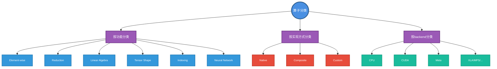
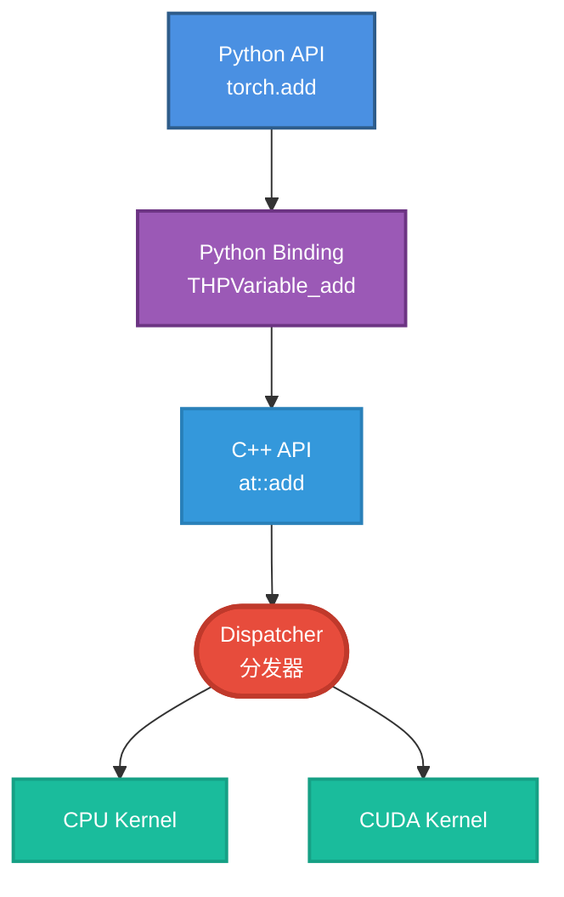
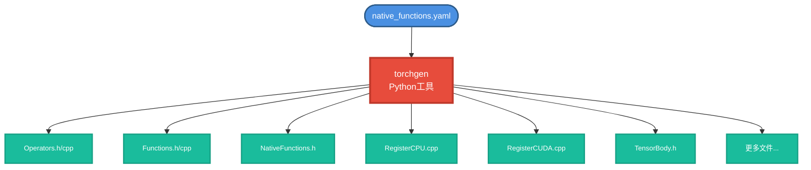
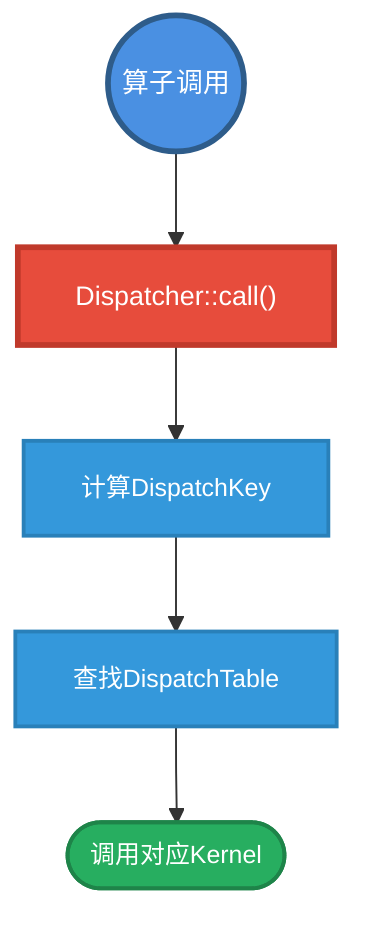
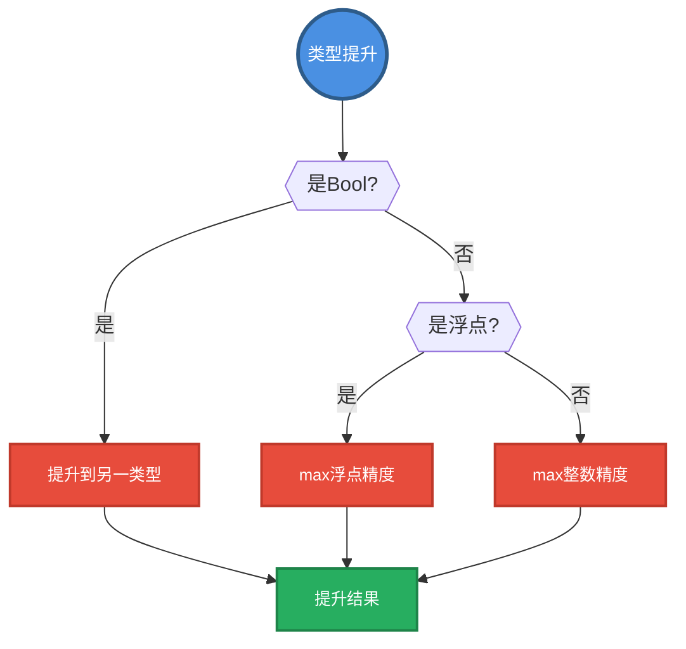
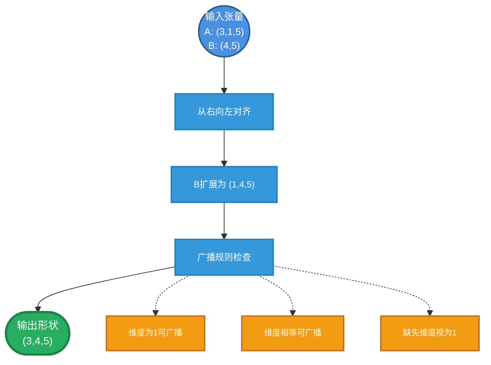
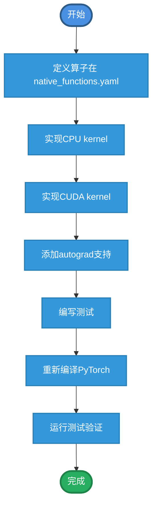
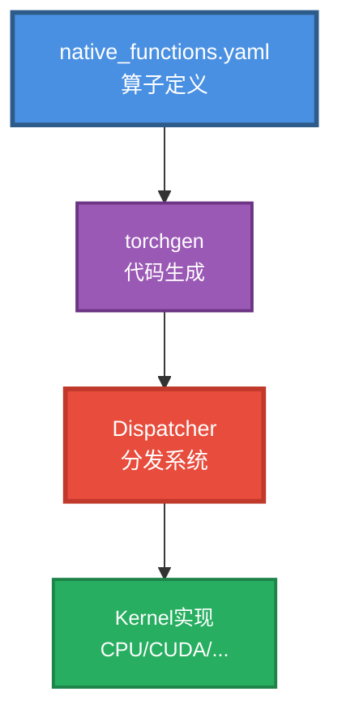

> 继续学习PyTorch的算子注册、分发机制和代码生成系统，掌握算子的完整生命周期

## 1. 算子系统概览

### 1.1 什么是算子（Operator）

算子是对张量进行操作的函数，PyTorch有3000+个算子。

```python
# 算子示例
x = torch.randn(3, 4)
y = torch.randn(3, 4)

# 这些都是算子调用
z = torch.add(x, y)      # add算子
z = x.relu()             # relu算子
z = torch.matmul(x, y.t())  # matmul算子
```

### 1.2 算子的分类



### 1.3 算子系统架构



## 2. native_functions.yaml

这是PyTorch算子定义的核心文件，所有算子在这里声明。

### 2.1 基本格式

```yaml
# aten/src/ATen/native/native_functions.yaml

# 简单算子定义
- func: add(Tensor self, Tensor other, *, Scalar alpha=1) -> Tensor
  variants: function, method
  dispatch:
    CPU: add_cpu
    CUDA: add_cuda
  
- func: add.out(Tensor self, Tensor other, *, Scalar alpha=1, Tensor(a!) out) -> Tensor(a!)
  variants: function
  dispatch:
    CPU: add_out_cpu
    CUDA: add_out_cuda
```

### 2.2 字段说明

```yaml
- func: 函数签名
  # 格式：name[.overload_name](参数列表) -> 返回值
  
  variants: function, method
  # function: 可以作为torch.add调用
  # method: 可以作为tensor.add调用
  
  dispatch:
    # 指定不同backend的实现
    CPU: cpu_kernel_name
    CUDA: cuda_kernel_name
    CompositeExplicitAutograd: composite_impl
    
  device_check: NoCheck
  # 设备检查策略
  
  autogen: name.out
  # 自动生成out变体
  
  manual_kernel_registration: True
  # 手动注册kernel，不自动生成
```

### 2.3 参数注解

```yaml
# Tensor注解
Tensor(a)       # 返回输入别名
Tensor(a!)      # 就地修改输入
Tensor?         # 可选张量
Tensor[]        # 张量列表

# 标量注解
Scalar alpha=1  # 带默认值
int? size       # 可选整数
bool pin_memory=False  # 布尔默认值

# 其他注解
*, Scalar alpha  # *后面的参数必须用关键字传递
```

### 2.4 实际示例

```yaml
# ReLU算子
- func: relu(Tensor self) -> Tensor
  variants: function, method
  dispatch:
    CPU, CUDA: relu
    MPS: relu_mps
    CompositeExplicitAutograd: relu_composite
  autogen: relu.out

# 就地版本
- func: relu_(Tensor(a!) self) -> Tensor(a!)
  variants: function, method
  dispatch:
    CPU, CUDA: relu_

# 矩阵乘法
- func: matmul(Tensor self, Tensor other) -> Tensor
  variants: function, method
  dispatch:
    CPU: matmul_cpu
    CUDA: matmul_cuda
    
# 卷积（复杂示例）
- func: conv2d(Tensor input, Tensor weight, Tensor? bias=None, 
               int[2] stride=1, int[2] padding=0, int[2] dilation=1, 
               int groups=1) -> Tensor
  variants: function
  dispatch:
    CPU: conv2d_cpu
    CUDA: conv2d_cuda
    MPS: conv2d_mps
```

## 3. 代码生成

PyTorch使用代码生成工具从`native_functions.yaml`生成大量模板代码。

### 3.1 代码生成流程



### 3.2 生成的代码示例

从`add`算子定义生成：

```cpp
// 生成的声明（Functions.h）
namespace at {
  TORCH_API Tensor add(
      const Tensor& self,
      const Tensor& other,
      const Scalar& alpha = 1);
      
  TORCH_API Tensor& add_out(
      const Tensor& self,
      const Tensor& other,
      const Scalar& alpha,
      Tensor& out);
}

// 生成的Tensor成员函数（TensorBody.h）
class Tensor {
  Tensor add(const Tensor& other, const Scalar& alpha = 1) const {
    return at::add(*this, other, alpha);
  }
  
  Tensor& add_(const Tensor& other, const Scalar& alpha = 1) {
    return at::add_(*this, other, alpha);
  }
};

// 生成的注册代码（RegisterCPU.cpp）
TORCH_LIBRARY_IMPL(aten, CPU, m) {
  m.impl("add", TORCH_FN(add_cpu));
  m.impl("add_", TORCH_FN(add_cpu_));
  m.impl("add.out", TORCH_FN(add_out_cpu));
}
```

### 3.3 torchgen工具

```bash
# torchgen位置
pytorch/torchgen/

# 主要模块
├── gen.py              # 主生成脚本
├── model.py            # 数据模型（算子表示）
├── api/                # API生成
│   ├── cpp.py          # C++ API
│   └── python.py       # Python绑定
├── packaged/           # 打包的代码生成器
└── dest/               # 目标文件生成器
```

运行代码生成：

```bash
# 在编译时自动运行
python setup.py build

# 手动运行（开发时）
python -m torchgen.gen \
  --source-path aten/src/ATen \
  --install-dir build/aten/src/ATen
```

## 4. Dispatcher

Dispatcher是PyTorch的核心调度系统，负责将算子调用路由到正确的实现。

### 4.1 Dispatcher架构



### 4.2 DispatchKey详解

DispatchKey决定调用哪个kernel。

```cpp
// c10/core/DispatchKey.h（简化）
enum class DispatchKey : uint16_t {
  Undefined = 0,
  
  // Backend keys
  CPU,
  CUDA,
  XLA,
  MPS,
  
  // Autograd keys
  Autograd,
  AutogradCPU,
  AutogradCUDA,
  
  // Functionality keys
  Sparse,
  SparseCPU,
  SparseCUDA,
  
  Quantized,
  
  // Mode keys
  FuncTorchBatched,
  
  // Fallback
  BackendSelect,
  
  // ...更多
};
```

### 4.3 DispatchKeySet

多个DispatchKey的集合，用位集表示。

```cpp
// 获取张量的DispatchKeySet
Tensor x = torch::randn({2, 3});
auto keys = x.key_set();

// 包含的key示例：
// - CPU（backend）
// - AutogradCPU（如果requires_grad=True）
// - ADInplaceOrView（如果需要）

// 分发时按优先级选择最高的key
DispatchKey key = keys.highestPriorityTypeId();
```

### 4.4 分发过程

```cpp
// at::add的调用过程（简化）
Tensor add(const Tensor& self, const Tensor& other, const Scalar& alpha) {
  // 1. 获取算子handle
  static auto op = Dispatcher::singleton()
      .findSchemaOrThrow("aten::add", "");
  
  // 2. 计算DispatchKeySet
  auto key_set = self.key_set() | other.key_set();
  
  // 3. 获取最高优先级的key
  auto key = key_set.highestPriorityTypeId();
  
  // 4. 查找并调用kernel
  return op.callBoxed(key, self, other, alpha);
}
```

实际实现更复杂，包含：
- 类型提升（type promotion）
- 设备检查（device check）
- Autograd包装
- 性能优化

### 4.5 Kernel注册

```cpp
// 方式1：使用TORCH_LIBRARY_IMPL宏
TORCH_LIBRARY_IMPL(aten, CPU, m) {
  m.impl("add", &add_kernel_cpu);
  m.impl("relu", &relu_kernel_cpu);
}

TORCH_LIBRARY_IMPL(aten, CUDA, m) {
  m.impl("add", &add_kernel_cuda);
  m.impl("relu", &relu_kernel_cuda);
}

// 方式2：使用REGISTER_DISPATCH
DEFINE_DISPATCH(add_stub);

// CPU实现
REGISTER_DISPATCH(add_stub, &add_kernel_cpu);

// CUDA实现（在.cu文件中）
REGISTER_DISPATCH(add_stub, &add_kernel_cuda);
```

## 5. 算子实现

### 5.1 CPU算子实现

```cpp
// aten/src/ATen/native/BinaryOps.cpp
Tensor add_cpu(const Tensor& self, const Tensor& other, const Scalar& alpha) {
  // 创建输出张量
  Tensor result = at::empty_like(self);
  
  // 使用TensorIterator
  auto iter = TensorIteratorConfig()
      .add_output(result)
      .add_input(self)
      .add_input(other)
      .build();
  
  // 调用kernel
  add_stub(iter.device_type(), iter, alpha);
  
  return result;
}

// CPU kernel实现
// aten/src/ATen/native/cpu/BinaryOpsKernel.cpp
void add_kernel(TensorIterator& iter, const Scalar& alpha) {
  AT_DISPATCH_ALL_TYPES_AND_COMPLEX(iter.dtype(), "add_cpu", [&] {
    cpu_kernel(iter, [alpha](scalar_t a, scalar_t b) -> scalar_t {
      return a + alpha.to<scalar_t>() * b;
    });
  });
}

// cpu_kernel使用向量化
template <typename func_t>
void cpu_kernel(TensorIterator& iter, func_t&& op) {
  using traits = function_traits<func_t>;
  
  // 向量化循环
  iter.for_each([&](char** data, const int64_t* strides, int64_t n) {
    // 使用SIMD指令加速
    basic_loop(data, strides, 0, n, op);
  });
}
```

### 5.2 CUDA算子实现

```cpp
// aten/src/ATen/native/cuda/BinaryAddSubKernel.cu
void add_kernel_cuda(TensorIterator& iter, const Scalar& alpha) {
  AT_DISPATCH_ALL_TYPES_AND_COMPLEX(iter.dtype(), "add_cuda", [&] {
    gpu_kernel_with_scalars(iter,
        [alpha] GPU_LAMBDA (scalar_t a, scalar_t b) -> scalar_t {
          return a + alpha.to<scalar_t>() * b;
        });
  });
}

// CUDA kernel启动
template <typename func_t>
void gpu_kernel_with_scalars(TensorIterator& iter, func_t&& op) {
  // 计算grid和block
  int64_t numel = iter.numel();
  const dim3 block = dim3(512);
  const dim3 grid = dim3((numel + block.x - 1) / block.x);
  
  // 启动kernel
  kernel_impl<<<grid, block, 0, stream>>>(
      iter, op, numel);
}

// 实际的CUDA kernel
template <typename func_t>
__global__ void kernel_impl(TensorIterator iter, func_t op, int64_t n) {
  int64_t idx = blockIdx.x * blockDim.x + threadIdx.x;
  if (idx < n) {
    auto a = iter.data_ptr<scalar_t>(0)[idx];
    auto b = iter.data_ptr<scalar_t>(1)[idx];
    iter.data_ptr<scalar_t>(2)[idx] = op(a, b);
  }
}
```

### 5.3 Composite算子

复合算子由其他算子组合而成，不需要为每个backend单独实现。

```cpp
// aten/src/ATen/native/TensorCompare.cpp
Tensor clamp(const Tensor& self, 
             const std::optional<Scalar>& min,
             const std::optional<Scalar>& max) {
  // 使用min和max算子实现
  Tensor result = self;
  if (min.has_value()) {
    result = at::max(result, *min);
  }
  if (max.has_value()) {
    result = at::min(result, *max);
  }
  return result;
}

// 在native_functions.yaml中标记
- func: clamp(Tensor self, Scalar? min=None, Scalar? max=None) -> Tensor
  variants: function, method
  dispatch:
    CompositeExplicitAutograd: clamp
```

### 5.4 Structured Kernel

新的kernel组织方式，分离元信息计算和数据计算。

```yaml
# native_functions.yaml
- func: add.out(Tensor self, Tensor other, *, Scalar alpha=1, Tensor(a!) out) -> Tensor(a!)
  structured: True
  structured_inherits: TensorIteratorBase
  dispatch:
    CPU, CUDA: add
```

```cpp
// 生成的structured kernel框架
struct structured_add_out : public TensorIteratorBase {
  // 元信息计算（形状、类型推断）
  void meta(const Tensor& self, const Tensor& other, const Scalar& alpha) {
    set_output(0, self.sizes(), self.options());
  }
  
  // 实际计算
  void impl(const Tensor& self, const Tensor& other, const Scalar& alpha) {
    add_stub(device_type(), *this, alpha);
  }
};
```

优势：
1. 元信息计算可复用
2. 支持Meta backend（只计算形状）
3. 代码更清晰

## 6. Type Promotion

不同类型的张量运算时，PyTorch自动提升类型。

### 6.1 提升规则



* 整数 + 浮点 -> 浮点
```python
a = torch.tensor([1], dtype=torch.int32)
b = torch.tensor([2.0], dtype=torch.float32)
c = a + b
print(c.dtype)  # torch.float32
```

* 低精度 + 高精度 -> 高精度
```python
a = torch.tensor([1.0], dtype=torch.float16)
b = torch.tensor([2.0], dtype=torch.float32)
c = a + b
print(c.dtype)  # torch.float32

# bool会提升为数值类型
a = torch.tensor([True, False])
b = torch.tensor([1, 2])
c = a + b
print(c.dtype)  # torch.int64
```

### 6.2 提升表

```cpp
// c10/core/ScalarType.cpp
// 简化的类型提升表
ScalarType promoteTypes(ScalarType a, ScalarType b) {
  // Bool优先级最低
  if (a == ScalarType::Bool) return b;
  if (b == ScalarType::Bool) return a;
  
  // 整数vs浮点
  if (isFloatingType(a) || isFloatingType(b)) {
    return isFloatingType(a) ? 
           (isFloatingType(b) ? max(a, b) : a) : b;
  }
  
  // 整数vs整数
  return max(a, b);
}
```

### 6.3 控制类型提升

```python
# 禁用类型提升，要求类型完全匹配
torch.set_default_dtype(torch.float32)

# 显式转换
a = torch.tensor([1, 2], dtype=torch.int32)
b = torch.tensor([1.0, 2.0], dtype=torch.float64)
c = a.to(b.dtype) + b  # 手动转换
```

## 7. 广播机制

PyTorch遵循NumPy的广播规则。

### 7.1 广播规则



```python
# 广播示例
a = torch.randn(3, 1, 5)
b = torch.randn(4, 5)
c = a + b
print(c.shape)  # torch.Size([3, 4, 5])

# 复杂广播
a = torch.randn(8, 1, 6, 1)
b = torch.randn(7, 1, 5)
c = a + b
print(c.shape)  # torch.Size([8, 7, 6, 5])
```

### 7.2 广播实现

```cpp
// aten/src/ATen/ExpandUtils.cpp

// NOTE: are_expandable did a similar check, please keep them sync if change is needed
template <typename Container, typename ArrayType>
Container infer_size_impl(ArrayType a, ArrayType b) {
  // Use ptrdiff_t to ensure signed comparison.
  auto dimsA = static_cast<ptrdiff_t>(a.size());
  auto dimsB = static_cast<ptrdiff_t>(b.size());
  auto ndim = dimsA > dimsB ? dimsA : dimsB;
  Container expandedSizes(ndim);

  for (ptrdiff_t i = ndim - 1; i >= 0; --i) {
    ptrdiff_t offset = ndim - 1 - i;
    ptrdiff_t dimA = dimsA - 1 - offset;
    ptrdiff_t dimB = dimsB - 1 - offset;
    auto sizeA = (dimA >= 0) ? a[dimA] : 1;
    auto sizeB = (dimB >= 0) ? b[dimB] : 1;

    TORCH_CHECK(
        sizeA == sizeB || sizeA == 1 || sizeB == 1,
        "The size of tensor a (", sizeA,
        ") must match the size of tensor b (", sizeB,
        ") at non-singleton dimension ", i);

      // 1s map to the other size (even 0).
      expandedSizes[i] = sizeA == 1 ? sizeB : sizeA;
  }

  return expandedSizes;
}
```

### 7.3 TensorIterator处理广播

```cpp
// TensorIterator自动处理广播
auto iter = TensorIteratorConfig()
    .add_output(output)
    .add_input(a)  // shape: [3, 1, 5]
    .add_input(b)  // shape: [4, 5]
    .build();

// 内部会：
// 1. 计算输出形状：[3, 4, 5]
// 2. 调整stride：维度为1的stride设为0
// 3. 迭代时重复使用相同元素
```

## 8. 算子优化技术

### 8.1 向量化（Vectorization）

```cpp
// 使用SIMD指令加速
#include <ATen/cpu/vec/vec.h>

void add_kernel_vectorized(
    const float* a,
    const float* b,
    float* out,
    int64_t size) {
  
  using Vec = at::vec::Vectorized<float>;
  constexpr int64_t kVecSize = Vec::size();
  
  // 向量化循环
  int64_t i = 0;
  for (; i + kVecSize <= size; i += kVecSize) {
    Vec va = Vec::loadu(a + i);
    Vec vb = Vec::loadu(b + i);
    Vec vc = va + vb;
    vc.store(out + i);
  }
  
  // 处理剩余元素
  for (; i < size; ++i) {
    out[i] = a[i] + b[i];
  }
}
```

### 8.2 并行化

```cpp
#include <ATen/Parallel.h>

// CPU并行
at::parallel_for(0, size, grain_size, [&](int64_t begin, int64_t end) {
  for (int64_t i = begin; i < end; ++i) {
    // 处理元素i
  }
});

// 设置线程数
at::set_num_threads(4);
```

### 8.3 算子融合（Operator Fusion）

JIT编译器可以融合多个算子。

```python
# 手动融合
@torch.jit.script
def fused_gelu(x):
    # GELU: x * 0.5 * (1 + tanh(sqrt(2/π) * (x + 0.044715 * x^3)))
    return x * 0.5 * (1.0 + torch.tanh(
        0.7978845608 * (x + 0.044715 * x * x * x)))

# 自动融合（需要开启）
with torch.jit.fuser("fuser2"):
    y = model(x)
```

### 8.4 内存优化

```python
# 就地操作（节省内存）
x.add_(y)  # 不分配新内存

# 视图操作（共享存储）
y = x.view(-1)  # 零拷贝

# 自动内存管理
with torch.no_grad():  # 不保存中间结果
    y = model(x)
```

## 9. 自定义算子

### 9.1 Python自定义算子

```python
import torch
from torch.autograd import Function

class MyReLU(Function):
    @staticmethod
    def forward(ctx, input):
        # 保存用于反向传播的值
        ctx.save_for_backward(input)
        return input.clamp(min=0)
    
    @staticmethod
    def backward(ctx, grad_output):
        input, = ctx.saved_tensors
        grad_input = grad_output.clone()
        grad_input[input < 0] = 0
        return grad_input

# 使用
my_relu = MyReLU.apply
x = torch.randn(3, 4, requires_grad=True)
y = my_relu(x)
y.sum().backward()
```

### 9.2 C++自定义算子

```cpp
// custom_ops.cpp
#include <torch/extension.h>

torch::Tensor my_add(torch::Tensor a, torch::Tensor b) {
  return a + b;
}

// Python绑定
PYBIND11_MODULE(TORCH_EXTENSION_NAME, m) {
  m.def("my_add", &my_add, "Custom add operation");
}

// setup.py
from setuptools import setup
from torch.utils.cpp_extension import CppExtension, BuildExtension

setup(
    name='custom_ops',
    ext_modules=[
        CppExtension('custom_ops', ['custom_ops.cpp'])
    ],
    cmdclass={'build_ext': BuildExtension}
)
```

### 9.3 注册自定义算子

```cpp
// 使用TORCH_LIBRARY注册
#include <torch/library.h>

TORCH_LIBRARY(my_ops, m) {
  m.def("add(Tensor a, Tensor b) -> Tensor", &my_add);
}

TORCH_LIBRARY_IMPL(my_ops, CPU, m) {
  m.impl("add", &my_add_cpu);
}

TORCH_LIBRARY_IMPL(my_ops, CUDA, m) {
  m.impl("add", &my_add_cuda);
}
```

```python
# Python中使用
import torch
torch.ops.load_library("libcustom_ops.so")

x = torch.randn(3, 4)
y = torch.randn(3, 4)
z = torch.ops.my_ops.add(x, y)
```

## 10. 算子调试

### 10.1 打印分发信息

```python
import torch

# 启用分发跟踪
torch._C._dispatch_trace_dump(True)

x = torch.randn(3, 4)
y = x + 1  # 会打印分发信息

# 输出示例：
# [dispatch] op=aten::add key=CPU
# [dispatch] calling kernel for key CPU
```

### 10.2 查看算子注册

```python
# 查看算子schema
print(torch._C._dispatch_dump("aten::add"))

# 输出示例：
# aten::add.Tensor(Tensor self, Tensor other, *, Scalar alpha=1) -> Tensor
# Registered kernels:
#   CPU: add_cpu
#   CUDA: add_cuda
#   Autograd: ADInplaceOrView
```

### 10.3 性能分析

```python
import torch
from torch.profiler import profile, ProfilerActivity

x = torch.randn(1000, 1000, device='cuda')

with profile(
    activities=[ProfilerActivity.CPU, ProfilerActivity.CUDA],
    record_shapes=True
) as prof:
    for _ in range(100):
        y = x.matmul(x)

print(prof.key_averages().table(sort_by="cuda_time_total"))
```

## 11. 算子开发工作流

### 11.1 添加新算子的步骤



### 11.2 示例：添加my_add算子

**步骤1：定义算子**

```yaml
# aten/src/ATen/native/native_functions.yaml
- func: my_add(Tensor self, Tensor other) -> Tensor
  variants: function, method
  dispatch:
    CPU: my_add_cpu
    CUDA: my_add_cuda
```

**步骤2：实现CPU kernel**

```cpp
// aten/src/ATen/native/MyOps.cpp
#include <ATen/ATen.h>
#include <ATen/NativeFunctions.h>

namespace at { namespace native {

Tensor my_add_cpu(const Tensor& self, const Tensor& other) {
  auto result = at::empty_like(self);
  auto iter = TensorIteratorConfig()
      .add_output(result)
      .add_input(self)
      .add_input(other)
      .build();
  
  AT_DISPATCH_ALL_TYPES(iter.dtype(), "my_add_cpu", [&] {
    cpu_kernel(iter, [](scalar_t a, scalar_t b) -> scalar_t {
      return a + b;
    });
  });
  
  return result;
}

}}  // namespace at::native
```

**步骤3：实现CUDA kernel**

```cpp
// aten/src/ATen/native/cuda/MyOps.cu
#include <ATen/cuda/CUDAContext.h>

namespace at { namespace native {

Tensor my_add_cuda(const Tensor& self, const Tensor& other) {
  auto result = at::empty_like(self);
  auto iter = TensorIteratorConfig()
      .add_output(result)
      .add_input(self)
      .add_input(other)
      .build();
  
  gpu_kernel(iter, [] GPU_LAMBDA (scalar_t a, scalar_t b) -> scalar_t {
    return a + b;
  });
  
  return result;
}

}}  // namespace at::native
```

**步骤4：添加测试**

```python
# test/test_ops.py
def test_my_add(self):
    x = torch.randn(3, 4)
    y = torch.randn(3, 4)
    
    result = torch.my_add(x, y)
    expected = x + y
    
    self.assertEqual(result, expected)
```

## 12. 总结

### 12.1 核心概念



### 12.2 关键点

1. **native_functions.yaml**：算子定义的唯一来源
2. **代码生成**：自动生成大量模板代码
3. **Dispatcher**：运行时分发到正确的kernel
4. **DispatchKey**：决定调用哪个实现
5. **TensorIterator**：统一处理广播、类型转换
6. **类型提升**：自动提升到兼容类型
7. **广播**：NumPy风格的自动扩展
8. **优化**：向量化、并行化、融合

## 13. 练习

### 练习1：分析算子调用

```python
# 跟踪这个操作的分发过程
x = torch.randn(3, 4, requires_grad=True)
y = torch.randn(3, 4)
z = x + y
z.sum().backward()

# 问题：
# 1. x + y调用了哪些DispatchKey？
# 2. backward时又调用了哪些？
# 3. 如何验证？
```

### 练习2：实现自定义算子

```python
# 实现一个自定义的sigmoid算子
# sigmoid(x) = 1 / (1 + exp(-x))

class MySigmoid(torch.autograd.Function):
    @staticmethod
    def forward(ctx, input):
        # TODO: 实现前向传播
        pass
    
    @staticmethod  
    def backward(ctx, grad_output):
        # TODO: 实现反向传播
        # sigmoid'(x) = sigmoid(x) * (1 - sigmoid(x))
        pass
```

### 练习3：优化性能

```python
# 比较不同实现的性能
import time

def benchmark(func, *args, n=100):
    torch.cuda.synchronize()
    start = time.time()
    for _ in range(n):
        func(*args)
    torch.cuda.synchronize()
    return (time.time() - start) / n

# 实现1：朴素实现
def naive_add(a, b):
    return a + b

# 实现2：就地操作
def inplace_add(a, b):
    a.add_(b)
    return a

# 比较性能
```

---