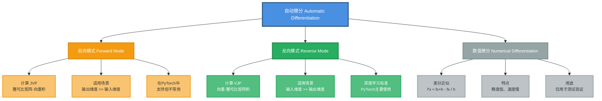
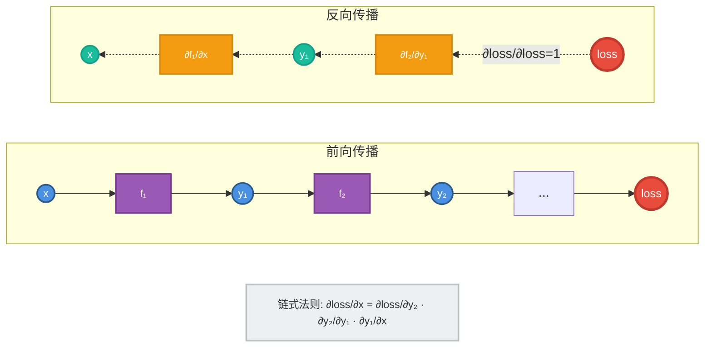
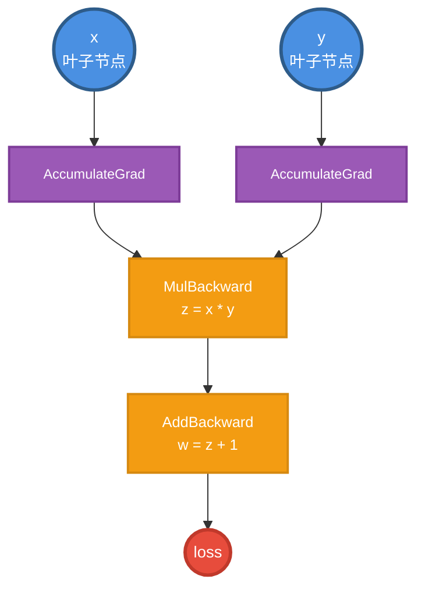
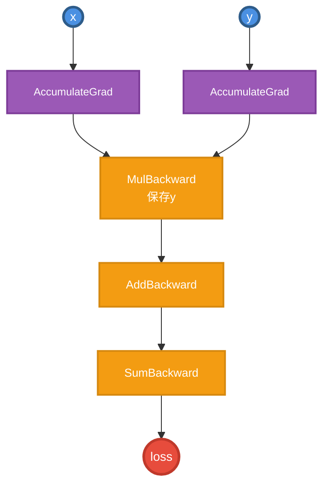
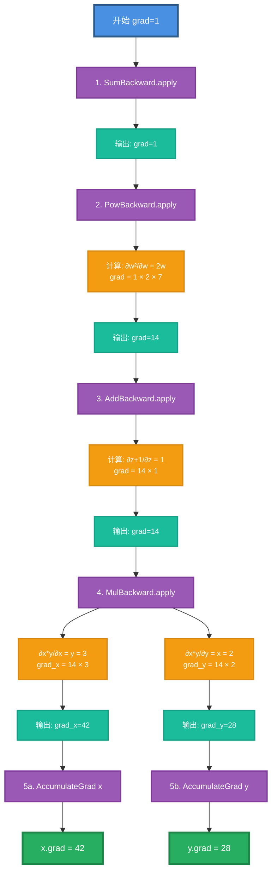
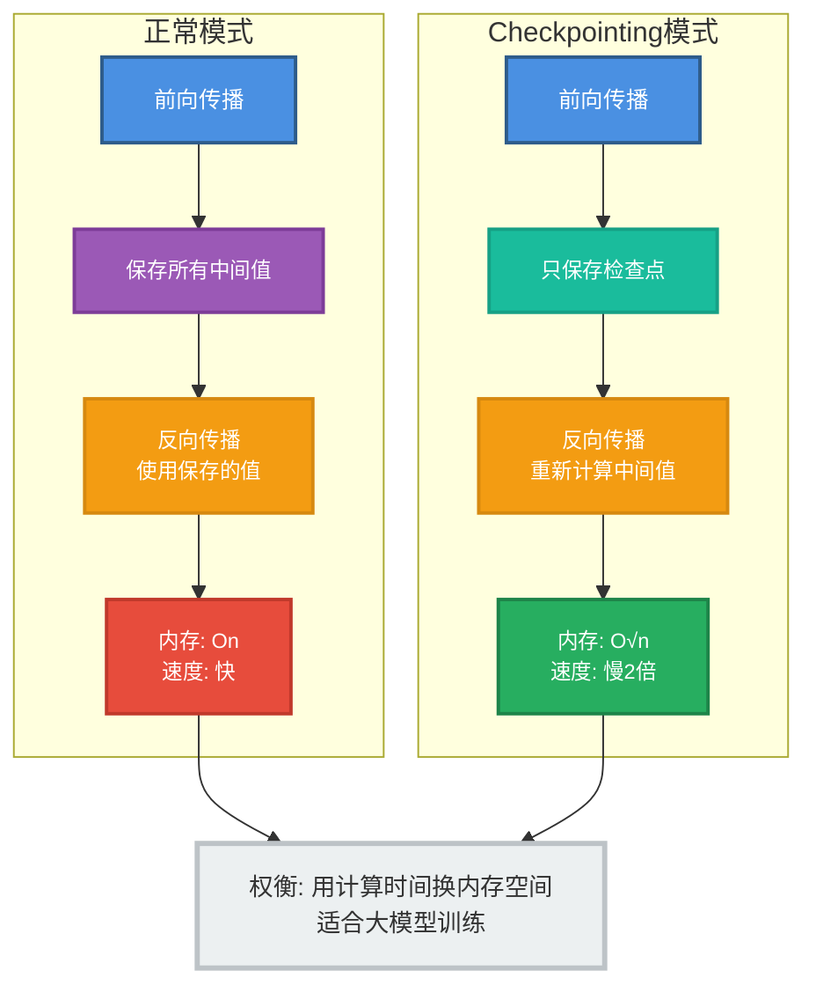
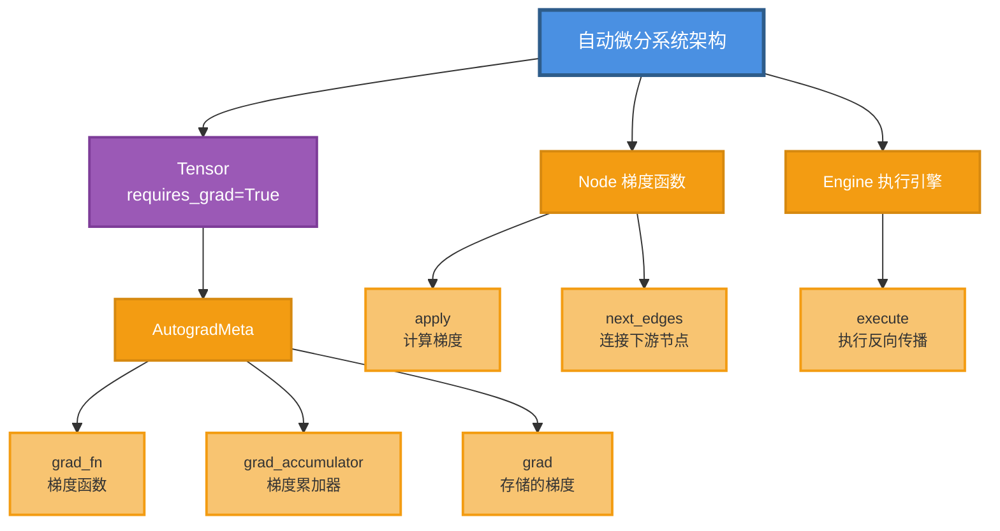

## 1. 自动微分概述

### 1.1 什么是自动微分

自动微分（Automatic Differentiation, AD）是PyTorch的核心功能，自动计算函数的导数。

```python
# 自动微分示例
x = torch.tensor([2.0], requires_grad=True)
y = x ** 2 + 3 * x + 1
y.backward()
print(x.grad)  # tensor([7.]) = 2*2 + 3
```

### 1.2 自动微分的类型



### 1.3 反向模式自动微分原理



## 2. 核心概念

### 2.1 Variable（已废弃，现为Tensor）

历史上，`Variable`是包装`Tensor`的类，现在已合并。

```cpp
// torch/csrc/autograd/variable.h
namespace torch::autograd {
  using Variable = at::Tensor;  // Variable就是Tensor
}
```

```python
# 现代写法（Variable已不需要）
x = torch.tensor([1.0], requires_grad=True)  # 直接用Tensor

# 旧写法（已废弃）
# from torch.autograd import Variable
# x = Variable(torch.tensor([1.0]), requires_grad=True)
```

### 2.2 AutogradMeta

每个需要梯度的Tensor都有一个`AutogradMeta`结构。

```cpp
// torch/csrc/autograd/variable.h
struct AutogradMeta {
  // 梯度函数（反向传播时调用）
  std::shared_ptr<Node> grad_fn_;
  
  // 梯度累加器（叶子节点）
  std::weak_ptr<Node> grad_accumulator_;
  
  // 存储的梯度
  Variable grad_;
  
  // 版本计数器（追踪就地修改）
  c10::VariableVersion version_counter_;
  
  // 是否需要梯度
  bool requires_grad_;
  
  // 是否保留计算图
  bool retain_grad_;
  
  // 是否是叶子节点
  bool is_view_;
  
  // 输出编号（在grad_fn的哪个输出）
  uint32_t output_nr_;
  
  // 钩子函数
  std::vector<std::unique_ptr<FunctionPreHook>> hooks_;
  std::unique_ptr<PostAccumulateGradHook> post_acc_grad_hooks_;
};
```

访问AutogradMeta：

```cpp
// 获取AutogradMeta（可能为nullptr）
AutogradMeta* meta = impl::get_autograd_meta(tensor);

// 获取或创建AutogradMeta
AutogradMeta* meta = impl::materialize_autograd_meta(tensor);

// 检查是否需要梯度
bool requires_grad = tensor.requires_grad();

// 获取grad_fn
Node* grad_fn = impl::grad_fn_unsafe(tensor);
```

### 2.3 Node（旧称Function）

`Node`表示计算图中的操作节点，存储反向传播的逻辑。

```cpp
// torch/csrc/autograd/function.h
struct Node : std::enable_shared_from_this<Node> {
  // 序列号（拓扑排序用）
  uint64_t sequence_nr_;
  
  // 输出边（指向下一个Node）
  edge_list next_edges_;
  
  // 输入元信息（形状、类型等）
  std::vector<InputMetadata> input_metadata_;
  
  // 钩子函数
  std::vector<std::unique_ptr<FunctionPreHook>> pre_hooks_;
  std::vector<std::unique_ptr<FunctionPostHook>> post_hooks_;
  
  // 核心方法：计算梯度
  virtual variable_list apply(variable_list&& inputs) = 0;
  
  // 获取节点名称
  virtual std::string name() const = 0;
  
  // 调用操作符（执行apply）
  variable_list operator()(variable_list&& inputs);
};
```

**关键子类**：

```cpp
// 梯度累加器（叶子节点）
struct AccumulateGrad : public Node {
  Variable variable;  // 累加梯度到这个变量
  
  variable_list apply(variable_list&& grads) override {
    // 累加梯度到variable.grad()
    if (variable.grad().defined()) {
      variable.grad() += grads[0];
    } else {
      variable.grad() = grads[0];
    }
    return {};
  }
};

// 加法反向传播
struct AddBackward : public Node {
  variable_list apply(variable_list&& grads) override {
    // ∂(a+b)/∂a = 1, ∂(a+b)/∂b = 1
    return {grads[0], grads[0]};
  }
};

// 乘法反向传播
struct MulBackward : public Node {
  SavedVariable other;  // 保存另一个操作数
  
  variable_list apply(variable_list&& grads) override {
    // ∂(a*b)/∂a = b
    return {grads[0] * other.unpack()};
  }
};
```

### 2.4 Edge

`Edge`连接计算图中的节点。

```cpp
// torch/csrc/autograd/edge.h
struct Edge {
  // 指向的函数节点
  std::shared_ptr<Node> function;
  
  // 输入索引（该边连接到function的第几个输入）
  uint32_t input_nr;
  
  Edge() : function(nullptr), input_nr(0) {}
  
  Edge(std::shared_ptr<Node> function_, uint32_t input_nr_)
      : function(std::move(function_)), input_nr(input_nr_) {}
};
```



### 2.5 SavedVariable

保存反向传播需要的中间变量。

```cpp
// torch/csrc/autograd/saved_variable.h
class SavedVariable {
  // 保存的数据（可能是tensor或tensor_data）
  at::Tensor data_;
  
  // 弱引用grad_fn（避免循环引用）
  std::weak_ptr<Node> weak_grad_fn_;
  
  // 版本号（检测就地修改）
  c10::VariableVersion version_counter_;
  uint32_t saved_version_;
  
  // 是否保存原始变量
  bool saved_original_;
  
  // 重建变量
  Variable unpack(std::shared_ptr<Node> saved_for = nullptr) const;
};
```

```cpp
// 使用示例
struct PowBackward : public Node {
  SavedVariable self;  // 保存输入
  Scalar exponent;     // 保存指数
  
  variable_list apply(variable_list&& grads) override {
    auto self_unpacked = self.unpack(shared_from_this());
    // ∂(x^n)/∂x = n * x^(n-1)
    return {grads[0] * exponent * at::pow(self_unpacked, exponent - 1)};
  }
};
```

## 3. 计算图构建

### 3.1 前向传播构建图

```python
x = torch.tensor([2.0], requires_grad=True)
y = torch.tensor([3.0], requires_grad=True)
z = x * y
w = z + 1
loss = w.sum()
```

构建过程：

```cpp
// 1. 创建x和y（叶子节点）
x.requires_grad = True
x.is_leaf = True
x.grad_fn = nullptr
x.grad_accumulator = AccumulateGrad(x)

// 2. z = x * y
// 创建MulBackward节点
auto mul_node = std::make_shared<MulBackward>();
mul_node->save_variable(y);  // 保存y用于反向传播
mul_node->next_edges = {
  Edge(x.grad_accumulator(), 0),  // 连接到x
  Edge(y.grad_accumulator(), 0)   // 连接到y
};
z.grad_fn = mul_node;
z.output_nr = 0;

// 3. w = z + 1
auto add_node = std::make_shared<AddBackward>();
add_node->next_edges = {Edge(mul_node, 0)};
w.grad_fn = add_node;

// 4. loss = w.sum()
auto sum_node = std::make_shared<SumBackward>();
sum_node->next_edges = {Edge(add_node, 0)};
loss.grad_fn = sum_node;
```

最终的计算图：



### 3.2 动态图 vs 静态图

```python
# PyTorch动态图
for epoch in range(100):
    # 每次迭代都重新构建计算图
    z = x * y
    if z.item() > 5:
        loss = z ** 2  # 不同的计算图
    else:
        loss = z + 1   # 不同的计算图
    loss.backward()
```

**优势**：
- 灵活：支持控制流、动态结构
- 易调试：可以用Python调试器
- 直观：所见即所得

**劣势**：
- 每次迭代重建图有开销
- 难以优化（JIT可以缓解）

### 3.3 就地操作与版本追踪

```python
x = torch.tensor([1.0], requires_grad=True)
y = x + 2
x.add_(1)  # 就地修改x
y.backward()  # 错误！x已被修改
```

```
RuntimeError: one of the variables needed for gradient 
computation has been modified by an inplace operation
```

版本追踪机制：

```cpp
// 每个Tensor有版本号
c10::VariableVersion version_counter_;

// 保存时记录版本
saved_variable.saved_version_ = tensor.version_counter_.current_version();

// 恢复时检查版本
void SavedVariable::unpack() {
  uint32_t current = version_counter_.current_version();
  if (current != saved_version_) {
    throw std::runtime_error("modified by inplace operation");
  }
}

// 就地操作增加版本
void bump_version(const Tensor& tensor) {
  version_counter_.increment();
}
```

## 4. 反向传播执行

### 4.1 Engine（引擎）

`Engine`负责执行反向传播。

```cpp
// torch/csrc/autograd/engine.h
struct Engine {
  // 执行反向传播
  variable_list execute(
      const edge_list& roots,        // 起始节点（通常是loss.grad_fn）
      const variable_list& inputs,   // 输入梯度（通常是1）
      bool keep_graph,               // 是否保留计算图
      bool create_graph,             // 是否创建新图（高阶导数）
      bool accumulate_grad,          // 是否累加梯度
      const edge_list& outputs = {}  // 计算到哪些输出
  );
  
  // 单例
  static Engine& get_default_engine();
};
```

### 4.2 反向传播算法

```cpp
// 简化的反向传播流程
void Engine::execute(...) {
  // 1. 初始化
  ReadyQueue ready_queue;
  std::unordered_map<Node*, int> dependencies;  // 依赖计数
  
  // 2. 将根节点入队
  for (auto& root : roots) {
    ready_queue.push(NodeTask(root.function, inputs));
  }
  
  // 3. 拓扑排序执行
  while (!ready_queue.empty()) {
    auto task = ready_queue.pop();
    auto fn = task.fn_;
    
    // 执行节点的apply函数
    auto outputs = (*fn)(task.inputs_);
    
    // 将梯度传递给下一个节点
    for (size_t i = 0; i < fn->next_edges().size(); ++i) {
      auto& edge = fn->next_edges()[i];
      if (edge.function) {
        // 累加梯度到输入缓冲区
        edge.function->add_input_gradient(edge.input_nr, outputs[i]);
        
        // 减少依赖计数
        if (--dependencies[edge.function.get()] == 0) {
          // 所有依赖都满足，入队
          ready_queue.push(NodeTask(edge.function, ...));
        }
      }
    }
  }
}
```

### 4.3 完整示例

```python
# 前向传播
x = torch.tensor([2.0], requires_grad=True)
y = torch.tensor([3.0], requires_grad=True)
z = x * y      # z = 6
w = z + 1      # w = 7
loss = w ** 2  # loss = 49

# 反向传播
loss.backward()

print(x.grad)  # tensor([84.])
print(y.grad)  # tensor([56.])
```

梯度计算过程：

```
前向传播：
x=2, y=3 → z=6 → w=7 → loss=49

反向传播：
∂loss/∂loss = 1

∂loss/∂w = ∂(w²)/∂w = 2w = 2*7 = 14

∂loss/∂z = ∂loss/∂w · ∂w/∂z = 14 * 1 = 14

∂loss/∂x = ∂loss/∂z · ∂z/∂x = 14 * y = 14 * 3 = 42
∂loss/∂y = ∂loss/∂z · ∂z/∂y = 14 * x = 14 * 2 = 28

等等，x.grad应该是42，但打印是84？
让我重新计算：

loss = (x*y + 1)²
∂loss/∂x = 2(x*y + 1) · y = 2(2*3 + 1) * 3 = 2*7*3 = 42
∂loss/∂y = 2(x*y + 1) · x = 2(2*3 + 1) * 2 = 2*7*2 = 28

啊不对，我算错了。让我用代码验证：
```

```python
# 验证
x = torch.tensor([2.0], requires_grad=True)
y = torch.tensor([3.0], requires_grad=True)
z = x * y
w = z + 1
loss = w ** 2
loss.backward()
print(f"x.grad = {x.grad}")  # x.grad = tensor([42.])
print(f"y.grad = {y.grad}")  # y.grad = tensor([28.])
```

梯度流动：



## 5. 梯度计算细节

### 5.1 叶子节点与非叶子节点

```python
x = torch.tensor([1.0], requires_grad=True)
y = x + 2
z = y * 3

print(x.is_leaf)  # True（用户创建）
print(y.is_leaf)  # False（操作结果）
print(z.is_leaf)  # False（操作结果）

# 默认只保留叶子节点的梯度
z.backward()
print(x.grad)  # tensor([3.])
print(y.grad)  # None（非叶子节点）
```

保留非叶子节点梯度：

```python
x = torch.tensor([1.0], requires_grad=True)
y = x + 2
y.retain_grad()  # 保留y的梯度
z = y * 3
z.backward()

print(x.grad)  # tensor([3.])
print(y.grad)  # tensor([3.])
```

### 5.2 多次反向传播

```python
x = torch.tensor([1.0], requires_grad=True)
y = x ** 2

# 第一次反向传播
y.backward(retain_graph=True)  # 保留计算图
print(x.grad)  # tensor([2.])

# 第二次反向传播（梯度累加）
y.backward()
print(x.grad)  # tensor([4.])，梯度累加了

# 清零梯度
x.grad.zero_()
y.backward()
print(x.grad)  # tensor([2.])
```

```cpp
// 不保留计算图的话，backward后节点被释放
y.backward();  // 默认retain_graph=False

// 再次调用会失败
y.backward();  // 错误！计算图已释放
```

### 5.3 梯度累加

```python
# 优化器通常需要清零梯度
optimizer.zero_grad()

# 多个loss累加梯度
loss1.backward()  # 第一次累加
loss2.backward()  # 第二次累加
optimizer.step()  # 使用累加的梯度更新参数
```

```cpp
// AccumulateGrad累加梯度
void AccumulateGrad::apply(variable_list&& grads) {
  auto& grad = variable.grad();
  if (grad.defined()) {
    grad = grad + grads[0];  // 累加
  } else {
    grad = grads[0];  // 第一次赋值
  }
}
```

### 5.4 高阶导数

```python
# 计算二阶导数
x = torch.tensor([1.0], requires_grad=True)
y = x ** 3

# 一阶导数
grad_y = torch.autograd.grad(
    y, x, 
    create_graph=True  # 创建新的计算图
)[0]
print(grad_y)  # tensor([3.])，因为 ∂(x³)/∂x = 3x² = 3*1² = 3

# 二阶导数
grad2_y = torch.autograd.grad(grad_y, x)[0]
print(grad2_y)  # tensor([6.])，因为 ∂²(x³)/∂x² = 6x = 6*1 = 6
```

## 6. 梯度模式控制

### 6.1 GradMode

```cpp
// torch/csrc/autograd/grad_mode.h
namespace at {
  struct GradMode {
    static bool is_enabled();
    static void set_enabled(bool enabled);
  };
  
  // RAII包装
  struct AutoGradMode {
    AutoGradMode(bool enabled) : prev(GradMode::is_enabled()) {
      GradMode::set_enabled(enabled);
    }
    ~AutoGradMode() {
      GradMode::set_enabled(prev);
    }
    bool prev;
  };
}
```

```python
# 全局禁用梯度
torch.set_grad_enabled(False)

# 上下文管理器
with torch.no_grad():
    # 不构建计算图
    y = x * 2
    print(y.requires_grad)  # False

with torch.enable_grad():
    # 强制启用梯度
    y = x * 2
    print(y.requires_grad)  # True
```

### 6.2 推理模式（Inference Mode）

比`no_grad`更快的推理模式。

```python
# no_grad：仍然追踪版本，允许视图
with torch.no_grad():
    y = x.view(-1)  # 可以创建视图

# inference_mode：完全禁用autograd
with torch.inference_mode():
    y = x * 2
    # y完全脱离autograd系统
```

```cpp
// 区别
// no_grad：
// - 禁用grad_fn创建
// - 仍然追踪版本
// - 允许视图

// inference_mode：
// - 禁用grad_fn
// - 不追踪版本
// - 禁止视图（除非显式允许）
// - 性能更好
```

### 6.3 局部禁用梯度

```python
# 方法1：detach
x = torch.tensor([1.0], requires_grad=True)
y = x ** 2
z = y.detach()  # z脱离计算图
w = z + 1
w.backward()  # 只会传播到z，不会传到x

# 方法2：requires_grad_(False)
x.requires_grad_(False)
y = x ** 2
print(y.requires_grad)  # False
```

## 7. 自定义反向传播

### 7.1 torch.autograd.Function

```python
import torch
from torch.autograd import Function

class Exp(Function):
    @staticmethod
    def forward(ctx, x):
        # ctx用于保存反向传播需要的值
        result = torch.exp(x)
        ctx.save_for_backward(result)
        return result
    
    @staticmethod
    def backward(ctx, grad_output):
        # 获取保存的值
        result, = ctx.saved_tensors
        # ∂(e^x)/∂x = e^x
        return grad_output * result

# 使用
exp = Exp.apply
x = torch.tensor([1.0], requires_grad=True)
y = exp(x)
y.backward()
print(x.grad)  # tensor([2.7183])，即e^1
```

### 7.2 多输入多输出

```python
class AddMul(Function):
    @staticmethod
    def forward(ctx, x, y, z):
        # 计算 (x + y) * z
        ctx.save_for_backward(x, y, z)
        return (x + y) * z
    
    @staticmethod
    def backward(ctx, grad_output):
        x, y, z = ctx.saved_tensors
        # ∂((x+y)*z)/∂x = z
        # ∂((x+y)*z)/∂y = z
        # ∂((x+y)*z)/∂z = x + y
        return grad_output * z, grad_output * z, grad_output * (x + y)

# 使用
add_mul = AddMul.apply
x = torch.tensor([1.0], requires_grad=True)
y = torch.tensor([2.0], requires_grad=True)
z = torch.tensor([3.0], requires_grad=True)
w = add_mul(x, y, z)
w.backward()
print(x.grad)  # tensor([3.])
print(y.grad)  # tensor([3.])
print(z.grad)  # tensor([3.])
```

### 7.3 不可微操作

```python
class Quantize(Function):
    @staticmethod
    def forward(ctx, x, bits=8):
        # 量化（不可微）
        scale = (2 ** bits - 1) / (x.max() - x.min())
        quantized = torch.round((x - x.min()) * scale)
        ctx.save_for_backward(x)
        return quantized / scale + x.min()
    
    @staticmethod
    def backward(ctx, grad_output):
        # 使用直通估计器（Straight-Through Estimator）
        # 梯度直接传递，忽略量化
        return grad_output, None  # None表示bits没有梯度

# 使用
quantize = Quantize.apply
x = torch.randn(10, requires_grad=True)
y = quantize(x, 8)
y.sum().backward()
print(x.grad)  # 梯度全为1
```

## 8. Hooks

### 8.1 Tensor Hook

```python
# 注册 Hook
def hook_fn(grad):
    print(f"Gradient: {grad}")
    return grad * 2  # 可以修改梯度

x = torch.tensor([1.0], requires_grad=True)
x.register_hook(hook_fn)

y = x ** 2
y.backward()
# 输出: Gradient: tensor([2.])
print(x.grad)  # tensor([4.])，梯度被hook修改了
```

### 8.2 Module Hook

```python
import torch.nn as nn

model = nn.Linear(10, 5)

# 前向 Hook
def forward_hook(module, input, output):
    print(f"Forward: {output.shape}")

# 反向 Hook
def backward_hook(module, grad_input, grad_output):
    print(f"Backward: {grad_output[0].shape}")

# 注册
handle1 = model.register_forward_hook(forward_hook)
handle2 = model.register_backward_hook(backward_hook)

# 使用
x = torch.randn(3, 10, requires_grad=True)
y = model(x)
y.sum().backward()

# 移除 Hook
handle1.remove()
handle2.remove()
```

### 8.3 调试 Hook

```python
# 检查梯度是否为NaN
def check_nan(grad):
    if torch.isnan(grad).any():
        raise ValueError("NaN gradient detected!")
    return grad

# 梯度裁剪
def clip_grad(grad):
    return torch.clamp(grad, -1, 1)

# 注册到所有参数
for param in model.parameters():
    param.register_hook(check_nan)
    param.register_hook(clip_grad)
```

## 9. 常见算子的反向传播

### 9.1 基础算子

```python
# 加法：∂(x+y)/∂x = 1, ∂(x+y)/∂y = 1
class AddBackward(Function):
    @staticmethod
    def forward(ctx, x, y):
        return x + y
    
    @staticmethod
    def backward(ctx, grad):
        return grad, grad

# 乘法：∂(x*y)/∂x = y, ∂(x*y)/∂y = x
class MulBackward(Function):
    @staticmethod
    def forward(ctx, x, y):
        ctx.save_for_backward(x, y)
        return x * y
    
    @staticmethod
    def backward(ctx, grad):
        x, y = ctx.saved_tensors
        return grad * y, grad * x

# 幂：∂(x^n)/∂x = n * x^(n-1)
class PowBackward(Function):
    @staticmethod
    def forward(ctx, x, n):
        ctx.save_for_backward(x)
        ctx.n = n
        return x ** n
    
    @staticmethod
    def backward(ctx, grad):
        x, = ctx.saved_tensors
        return grad * ctx.n * x ** (ctx.n - 1), None
```

### 9.2 激活函数

```python
# ReLU: ∂ReLU(x)/∂x = x > 0 ? 1 : 0
class ReLUBackward(Function):
    @staticmethod
    def forward(ctx, x):
        ctx.save_for_backward(x)
        return x.clamp(min=0)
    
    @staticmethod
    def backward(ctx, grad):
        x, = ctx.saved_tensors
        return grad * (x > 0).float()

# Sigmoid: ∂σ(x)/∂x = σ(x) * (1 - σ(x))
class SigmoidBackward(Function):
    @staticmethod
    def forward(ctx, x):
        result = 1 / (1 + torch.exp(-x))
        ctx.save_for_backward(result)
        return result
    
    @staticmethod
    def backward(ctx, grad):
        result, = ctx.saved_tensors
        return grad * result * (1 - result)

# Tanh: ∂tanh(x)/∂x = 1 - tanh²(x)
class TanhBackward(Function):
    @staticmethod
    def forward(ctx, x):
        result = torch.tanh(x)
        ctx.save_for_backward(result)
        return result
    
    @staticmethod
    def backward(ctx, grad):
        result, = ctx.saved_tensors
        return grad * (1 - result ** 2)
```

### 9.3 矩阵运算

```python
# 矩阵乘法：∂(AB)/∂A = grad·Bᵀ, ∂(AB)/∂B = Aᵀ·grad
class MatmulBackward(Function):
    @staticmethod
    def forward(ctx, A, B):
        ctx.save_for_backward(A, B)
        return A @ B
    
    @staticmethod
    def backward(ctx, grad):
        A, B = ctx.saved_tensors
        grad_A = grad @ B.t()
        grad_B = A.t() @ grad
        return grad_A, grad_B

# 转置：∂(Aᵀ)/∂A = gradᵀ
class TransposeBackward(Function):
    @staticmethod
    def forward(ctx, x):
        return x.t()
    
    @staticmethod
    def backward(ctx, grad):
        return grad.t()
```

### 9.4 归约运算

```python
# Sum：∂(Σx)/∂x = 1（广播）
class SumBackward(Function):
    @staticmethod
    def forward(ctx, x, dim=None, keepdim=False):
        ctx.shape = x.shape
        ctx.dim = dim
        ctx.keepdim = keepdim
        return x.sum(dim=dim, keepdim=keepdim)
    
    @staticmethod
    def backward(ctx, grad):
        # 梯度需要广播到原始形状
        if ctx.dim is None:
            return grad.expand(ctx.shape), None, None
        else:
            if not ctx.keepdim:
                grad = grad.unsqueeze(ctx.dim)
            return grad.expand(ctx.shape), None, None

# Mean：∂(mean(x))/∂x = 1/n
class MeanBackward(Function):
    @staticmethod
    def forward(ctx, x, dim=None, keepdim=False):
        ctx.shape = x.shape
        ctx.dim = dim
        ctx.keepdim = keepdim
        if dim is None:
            ctx.numel = x.numel()
        else:
            ctx.numel = x.shape[dim]
        return x.mean(dim=dim, keepdim=keepdim)
    
    @staticmethod
    def backward(ctx, grad):
        if ctx.dim is None:
            return (grad / ctx.numel).expand(ctx.shape), None, None
        else:
            if not ctx.keepdim:
                grad = grad.unsqueeze(ctx.dim)
            return (grad / ctx.numel).expand(ctx.shape), None, None
```

## 10. 性能优化

### 10.1 避免不必要的计算图

```python
# 错误：推理时仍构建计算图
def inference(model, x):
    return model(x)  # 浪费内存和时间

# 正确：禁用梯度
def inference(model, x):
    with torch.no_grad():
        return model(x)

# 更快：推理模式
def inference(model, x):
    with torch.inference_mode():
        return model(x)
```

### 10.2 梯度检查点（Gradient Checkpointing）

用计算换内存，适合大模型。

```python
from torch.utils.checkpoint import checkpoint

class MyModel(nn.Module):
    def __init__(self):
        super().__init__()
        self.layer1 = nn.Linear(1000, 1000)
        self.layer2 = nn.Linear(1000, 1000)
        self.layer3 = nn.Linear(1000, 1000)
    
    def forward(self, x):
        # 不保存layer1和layer2的中间激活
        # 反向传播时重新计算
        x = checkpoint(self.layer1, x)
        x = checkpoint(self.layer2, x)
        x = self.layer3(x)
        return x
```

工作原理：



### 10.3 累积梯度

```python
# 模拟大batch size
accumulation_steps = 4
optimizer.zero_grad()

for i, (x, y) in enumerate(dataloader):
    output = model(x)
    loss = criterion(output, y) / accumulation_steps
    loss.backward()  # 累积梯度
    
    if (i + 1) % accumulation_steps == 0:
        optimizer.step()
        optimizer.zero_grad()
```

### 10.4 混合精度训练

```python
from torch.cuda.amp import autocast, GradScaler

scaler = GradScaler()

for x, y in dataloader:
    optimizer.zero_grad()
    
    # 前向传播用FP16
    with autocast():
        output = model(x)
        loss = criterion(output, y)
    
    # 反向传播缩放梯度
    scaler.scale(loss).backward()
    scaler.step(optimizer)
    scaler.update()
```

## 11. 调试技巧

### 11.1 检测异常模式

```python
# 启用异常检测
torch.autograd.set_detect_anomaly(True)

try:
    x = torch.tensor([1.0], requires_grad=True)
    y = x ** 2
    z = 1 / (y - 1)  # 当y=1时除零
    z.backward()
except RuntimeError as e:
    print(e)  # 会显示出错的操作
```

### 11.2 梯度检查

数值验证梯度计算是否正确。

```python
from torch.autograd import gradcheck

def my_func(x):
    return x ** 3

x = torch.randn(5, dtype=torch.double, requires_grad=True)
test = gradcheck(my_func, x, eps=1e-6, atol=1e-4)
print(test)  # True表示梯度正确
```

### 11.3 可视化计算图

```python
from torchviz import make_dot

x = torch.randn(3, requires_grad=True)
y = x ** 2
z = y.mean()

# 生成计算图
dot = make_dot(z, params={'x': x})
dot.render('computation_graph', format='png')
```

### 11.4 打印梯度流

```python
def print_grad_flow(named_parameters):
    ave_grads = []
    layers = []
    for n, p in named_parameters:
        if p.requires_grad and p.grad is not None:
            layers.append(n)
            ave_grads.append(p.grad.abs().mean().item())
    
    # 绘制
    import matplotlib.pyplot as plt
    plt.plot(ave_grads, alpha=0.3, color="b")
    plt.hlines(0, 0, len(ave_grads)+1, linewidth=1, color="k")
    plt.xticks(range(0, len(ave_grads), 1), layers, rotation="vertical")
    plt.ylabel("average gradient")
    plt.title("Gradient flow")
    plt.grid(True)
    plt.show()

# 使用
model.zero_grad()
output = model(input)
loss = criterion(output, target)
loss.backward()
print_grad_flow(model.named_parameters())
```

## 12. 总结

### 12.1 核心组件



## 13. 练习

### 练习1：手动反向传播

```python
# 不使用autograd，手动计算梯度
# f(x, y) = (x² + y²) * (x + y)

x = 2.0
y = 3.0

# TODO: 计算 ∂f/∂x 和 ∂f/∂y
```

<details>
<summary>答案</summary>

```python
# f = (x² + y²)(x + y)
# ∂f/∂x = 2x(x+y) + (x²+y²)
# ∂f/∂y = 2y(x+y) + (x²+y²)

x, y = 2.0, 3.0
f = (x**2 + y**2) * (x + y)
df_dx = 2*x*(x+y) + (x**2 + y**2)
df_dy = 2*y*(x+y) + (x**2 + y**2)

print(f"f = {f}")        # 65.0
print(f"∂f/∂x = {df_dx}")  # 33.0
print(f"∂f/∂y = {df_dy}")  # 43.0

# 验证
x_t = torch.tensor([2.0], requires_grad=True)
y_t = torch.tensor([3.0], requires_grad=True)
f_t = (x_t**2 + y_t**2) * (x_t + y_t)
f_t.backward()
print(f"PyTorch: ∂f/∂x = {x_t.grad.item()}")  # 33.0
print(f"PyTorch: ∂f/∂y = {y_t.grad.item()}")  # 43.0
```
</details>

### 练习2：实现Softmax反向传播

```python
class Softmax(Function):
    @staticmethod
    def forward(ctx, x):
        # TODO: 实现softmax
        pass
    
    @staticmethod
    def backward(ctx, grad_output):
        # TODO: 实现梯度
        # 提示：∂softmax/∂x = softmax(x) * (I - softmax(x)ᵀ)
        pass
```

<details>
<summary>答案</summary>

```python
class Softmax(Function):
    @staticmethod
    def forward(ctx, x):
        exp_x = torch.exp(x - x.max())  # 数值稳定
        softmax = exp_x / exp_x.sum()
        ctx.save_for_backward(softmax)
        return softmax
    
    @staticmethod
    def backward(ctx, grad_output):
        softmax, = ctx.saved_tensors
        # Jacobian: ∂s_i/∂x_j = s_i(δ_ij - s_j)
        # grad = Σ_j (∂s_j/∂x_i) · grad_j
        #      = Σ_j s_j(δ_ji - s_i) · grad_j
        #      = s_i · grad_i - s_i · Σ_j(s_j · grad_j)
        return softmax * (grad_output - (softmax * grad_output).sum())

# 测试
softmax = Softmax.apply
x = torch.randn(5, requires_grad=True)
y = softmax(x)
y.sum().backward()
print(x.grad)

# 验证
x2 = x.detach().clone().requires_grad_()
y2 = torch.softmax(x2, dim=0)
y2.sum().backward()
print(x2.grad)
print(torch.allclose(x.grad, x2.grad))  # True
```
</details>

### 练习3：调试梯度消失

```python
# 这个网络有梯度消失问题，找出原因并修复
class DeepNetwork(nn.Module):
    def __init__(self):
        super().__init__()
        self.layers = nn.ModuleList([
            nn.Linear(100, 100) for _ in range(20)
        ])
    
    def forward(self, x):
        for layer in self.layers:
            x = torch.sigmoid(layer(x))
        return x

# TODO: 分析梯度流，找出问题并修复
```

<details>
<summary>答案</summary>

```python
# 问题：sigmoid饱和导致梯度消失
# sigmoid'(x) 在x很大或很小时接近0

# 解决方案1：使用ReLU
class DeepNetwork(nn.Module):
    def __init__(self):
        super().__init__()
        self.layers = nn.ModuleList([
            nn.Linear(100, 100) for _ in range(20)
        ])
    
    def forward(self, x):
        for layer in self.layers:
            x = torch.relu(layer(x))  # ReLU替代sigmoid
        return x

# 解决方案2：使用残差连接
class DeepNetwork(nn.Module):
    def __init__(self):
        super().__init__()
        self.layers = nn.ModuleList([
            nn.Linear(100, 100) for _ in range(20)
        ])
    
    def forward(self, x):
        for layer in self.layers:
            x = x + torch.sigmoid(layer(x))  # 残差连接
        return x

# 解决方案3：LayerNorm + 更好的初始化
class DeepNetwork(nn.Module):
    def __init__(self):
        super().__init__()
        self.layers = nn.ModuleList([
            nn.Sequential(
                nn.Linear(100, 100),
                nn.LayerNorm(100),
                nn.ReLU()
            ) for _ in range(20)
        ])
    
    def forward(self, x):
        for layer in self.layers:
            x = layer(x)
        return x
```
</details>

---