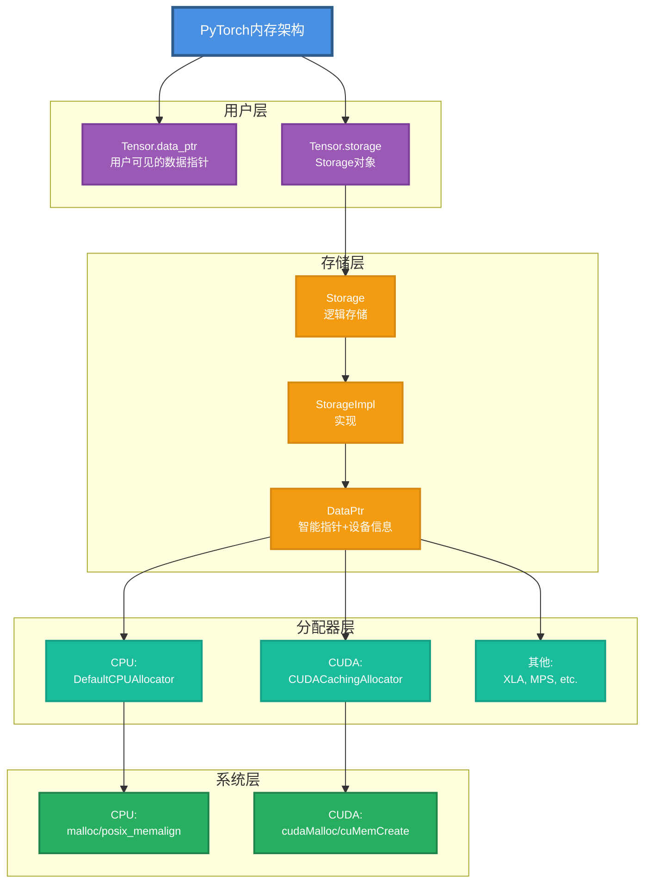
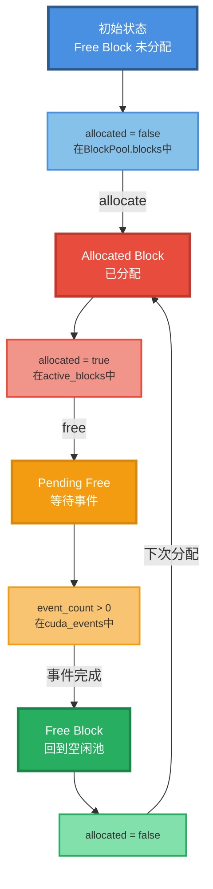
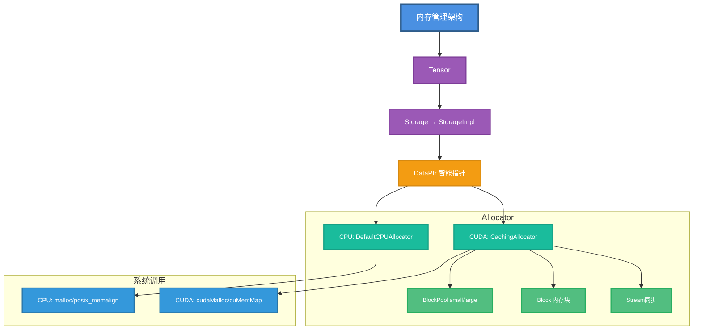

## 1. 内存管理概述

### 1.1 为什么需要内存管理

深度学习训练涉及大量内存操作：

```python
# 典型训练循环的内存使用
for epoch in range(100):
    for batch in dataloader:
        # 分配：前向传播的中间激活
        output = model(batch)
        
        # 分配：计算损失
        loss = criterion(output, target)
        
        # 分配：反向传播的梯度
        loss.backward()
        
        # 释放：清空梯度
        optimizer.zero_grad()
        
        # 重复使用：下一次迭代
```

**挑战**：
- 频繁的分配/释放导致性能下降
- GPU内存有限（通常8-80GB）
- 碎片化导致内存浪费
- cudaMalloc/cudaFree非常慢（毫秒级）

**解决方案**：缓存分配器（Caching Allocator）

### 1.2 内存层次



### 1.3 内存分类

```python
# 模型参数
model = nn.Linear(1000, 1000)
# 约 4MB (1000*1000*4字节)

# 优化器状态（Adam）
optimizer = optim.Adam(model.parameters())
# 约 12MB (参数 + momentum + variance)

# 激活值（前向传播）
x = torch.randn(32, 1000)  # batch_size=32
y = model(x)
# 约 0.5MB (32*1000*4字节)

# 梯度（反向传播）
y.sum().backward()
# 每个参数都有对应梯度，约 4MB

# 总计：约 20.5MB（单个层）
```

## 2. DataPtr与Allocator基类

### 2.1 DataPtr

智能指针，管理内存的生命周期。

```cpp
// c10/core/Allocator.h
class DataPtr {
  // 内部实际指针（带删除器）
  c10::detail::UniqueVoidPtr ptr_;
  
  // 设备信息
  Device device_;
  
public:
  // 构造
  DataPtr(void* data, void* ctx, DeleterFnPtr deleter, Device device)
      : ptr_(data, ctx, deleter), device_(device) {}
  
  // 获取数据指针
  void* get() const { return ptr_.get(); }
  
  // 获取设备
  Device device() const { return device_; }
  
  // 释放所有权
  void* release_context() { return ptr_.release_context(); }
  
  // 清空
  void clear() { ptr_.clear(); }
};
```

**关键特性**：
- RAII：自动管理生命周期
- 设备感知：知道数据在哪个设备
- 自定义删除器：不同设备有不同释放方式

```cpp
// 使用示例
void* raw_ptr = malloc(1024);
DataPtr data_ptr(
    raw_ptr,              // 数据指针
    raw_ptr,              // 上下文（通常相同）
    &free,                // 删除器（调用free）
    Device(DeviceType::CPU)  // CPU设备
);

// 自动释放
// ~DataPtr() → free(raw_ptr)
```

### 2.2 Allocator接口

所有分配器的基类。

```cpp
// c10/core/Allocator.h
struct Allocator {
  virtual ~Allocator() = default;
  
  // 分配内存（核心方法）
  virtual DataPtr allocate(size_t n) = 0;
  
  // 原始分配（无智能指针开销）
  virtual DeleterFnPtr raw_deleter() const {
    return nullptr;  // 默认不支持
  }
  
  void* raw_allocate(size_t n) {
    auto dptr = allocate(n);
    return dptr.release_context();
  }
  
  void raw_deallocate(void* ptr) {
    raw_deleter()(ptr);
  }
  
  // 拷贝数据
  virtual void copy_data(void* dest, const void* src, size_t n) const {
    std::memcpy(dest, src, n);
  }
};
```

## 3. CPU内存分配

### 3.1 DefaultCPUAllocator

```cpp
// c10/core/CPUAllocator.cpp
struct DefaultCPUAllocator final : at::Allocator {
  DataPtr allocate(size_t nbytes) override {
    void* data = nullptr;
    
    // 对齐到64字节（SIMD优化）
    constexpr size_t alignment = 64;
    
    #ifdef _WIN32
      data = _aligned_malloc(nbytes, alignment);
    #elif defined(__ANDROID__)
      data = memalign(alignment, nbytes);
    #else
      int ret = posix_memalign(&data, alignment, nbytes);
      TORCH_CHECK(ret == 0, "posix_memalign failed");
    #endif
    
    // 报告内存使用
    profiledCPUMemoryReporter().New(data, nbytes);
    
    return {
        data,
        data,
        &Delete,  // 删除器
        Device(DeviceType::CPU)
    };
  }
  
  static void Delete(void* ptr) {
    if (!ptr) return;
    
    profiledCPUMemoryReporter().Delete(ptr);
    
    #ifdef _WIN32
      _aligned_free(ptr);
    #else
      free(ptr);
    #endif
  }
  
  DeleterFnPtr raw_deleter() const override {
    return &Delete;
  }
};
```

### 3.2 对齐内存的优势

```cpp
// 未对齐
float* unaligned = (float*)malloc(1024);
// 地址可能是 0x12345678（任意）

// 对齐到64字节
float* aligned;
posix_memalign((void**)&aligned, 64, 1024);
// 地址是 0x12345680（64的倍数）

// SIMD向量化加载（需要对齐）
__m256 v = _mm256_load_ps(aligned);  // 快
// _mm256_load_ps(unaligned);  // 可能崩溃或变慢
```

**对齐的好处**：
- SIMD指令更快
- 缓存行对齐，减少false sharing
- 某些硬件要求对齐

### 3.3 内存统计

```cpp
class ProfiledCPUMemoryReporter {
  std::mutex mutex_;
  std::unordered_map<void*, size_t> size_table_;  // 指针→大小
  size_t allocated_ = 0;  // 总分配量
  
public:
  void New(void* ptr, size_t nbytes) {
    std::lock_guard<std::mutex> lock(mutex_);
    size_table_[ptr] = nbytes;
    allocated_ += nbytes;
    
    // 定期报告
    if (++log_cnt_ % 10000 == 0) {
      LOG(INFO) << "CPU memory: " << allocated_ / 1024 / 1024 << " MB";
    }
  }
  
  void Delete(void* ptr) {
    std::lock_guard<std::mutex> lock(mutex_);
    auto it = size_table_.find(ptr);
    if (it != size_table_.end()) {
      allocated_ -= it->second;
      size_table_.erase(it);
    }
  }
};
```

```python
# Python查看CPU内存
import psutil
process = psutil.Process()
print(f"CPU Memory: {process.memory_info().rss / 1024 / 1024:.2f} MB")
```

## 4. CUDA缓存分配器

这是PyTorch最复杂也最重要的内存管理组件。

### 4.1 设计动机

```python
# 朴素方法：每次都调用cudaMalloc
for i in range(1000):
    x = torch.randn(1000, 1000, device='cuda')  # cudaMalloc
    y = x * 2
    del x  # cudaFree

# 问题：
# - cudaMalloc很慢（~1ms）
# - 1000次迭代 = 1秒只在分配内存
# - GPU利用率极低
```

```python
# 缓存分配器方法
for i in range(1000):
    x = torch.randn(1000, 1000, device='cuda')  # 第一次cudaMalloc
    y = x * 2                                   # 后续从缓存获取
    del x  # 只是标记为空闲，不调用cudaFree

# 优势：
# - 只有第一次慢
# - 后续分配几乎免费（微秒级）
# - GPU利用率高
```

### 4.2 Block结构

内存块是缓存分配器的核心数据结构。

```cpp
// c10/cuda/CUDACachingAllocator.cpp
struct Block {
  c10::DeviceIndex device;     // GPU编号
  cudaStream_t stream;          // 分配流
  stream_set stream_uses;       // 使用该block的所有流
  
  size_t size;                  // block大小（字节）
  size_t requested_size;        // 用户请求大小
  
  BlockPool* pool;              // 所属内存池（small/large）
  void* ptr;                    // CUDA内存指针
  
  bool allocated;               // 是否被分配出去
  bool mapped;                  // 虚拟地址是否映射到物理内存
  
  Block* prev;                  // 前一个block（如果被分割）
  Block* next;                  // 后一个block（如果被分割）
  
  int event_count;              // 未完成的CUDA事件数
  int64_t gc_count_base;        // GC计数基准
  
  // 分配时的调用栈（调试用）
  std::shared_ptr<GatheredContext> context_when_allocated;
  
  // 可扩展段（高级功能）
  ExpandableSegment* expandable_segment_;
};
```

**Block状态转换**：



### 4.3 BlockPool

内存池，管理空闲块。

```cpp
struct BlockPool {
  // 是否是小块池
  bool small;
  
  // 空闲块集合（按大小排序）
  std::set<Block*, Comparison> blocks;
  
  // GC计数
  int64_t get_free_blocks_call_count = 0;
  
  BlockPool(bool small_) : small(small_) {}
  
  // 查找大小合适的block
  Block* find_free_block(size_t size) {
    // 查找 >= size 的最小block
    auto it = blocks.lower_bound(&key);
    if (it != blocks.end()) {
      return *it;
    }
    return nullptr;
  }
  
  // 插入空闲block
  void insert(Block* block) {
    block->gc_count_base = get_free_blocks_call_count;
    blocks.insert(block);
  }
  
  // 移除block
  void erase(Block* block) {
    blocks.erase(block);
  }
};
```

PyTorch维护两个池：
- **Small Pool**：<= 1MB的分配
- **Large Pool**：> 1MB的分配

```cpp
class DeviceCachingAllocator {
  BlockPool large_blocks;  // > 1MB
  BlockPool small_blocks;  // <= 1MB
  
  ska::flat_hash_set<Block*> active_blocks;  // 已分配的blocks
};
```

### 4.4 分配流程

```cpp
DataPtr CUDACachingAllocator::allocate(size_t size) {
  // 1. 确定使用哪个池
  BlockPool& pool = (size <= kSmallSize) ? small_blocks : large_blocks;
  
  // 2. 对齐大小
  size_t alloc_size = round_size(size);
  
  // 3. 尝试从池中查找
  Block* block = pool.find_free_block(alloc_size);
  
  if (block) {
    // 3a. 找到了，可能需要分割
    if (should_split(block, alloc_size)) {
      block = split_block(block, alloc_size);
    }
  } else {
    // 3b. 没找到，调用cudaMalloc
    void* ptr;
    cudaError_t err = cudaMalloc(&ptr, alloc_size);
    
    if (err == cudaErrorMemoryAllocation) {
      // 3c. OOM：尝试释放缓存
      free_cached_blocks();
      err = cudaMalloc(&ptr, alloc_size);
    }
    
    TORCH_CHECK(err == cudaSuccess, "CUDA out of memory");
    
    // 创建新block
    block = new Block(device, stream, alloc_size, &pool, ptr);
  }
  
  // 4. 标记为已分配
  block->allocated = true;
  block->requested_size = size;
  active_blocks.insert(block);
  
  // 5. 返回DataPtr
  return {block->ptr, block, &free_block, device};
}
```

**关键点**：
1. 先查找缓存
2. 缓存命中：直接复用
3. 缓存未命中：cudaMalloc
4. OOM：清理缓存后重试

### 4.5 释放流程

```cpp
void CUDACachingAllocator::free(Block* block) {
  // 1. 检查流同步
  if (block->stream_uses.size() > 0) {
    // 需要等待所有使用流完成
    insert_events(block);
    return;  // 延迟释放
  }
  
  // 2. 从active_blocks移除
  active_blocks.erase(block);
  
  // 3. 标记为空闲
  block->allocated = false;
  block->requested_size = 0;
  
  // 4. 尝试合并相邻空闲块
  merge_blocks(block);
  
  // 5. 加入空闲池
  block->pool->insert(block);
}
```

### 4.6 Block分割与合并

**分割**：大块分配给小请求。

```cpp
Block* split_block(Block* block, size_t size) {
  // 原始block: [==============================] (10MB)
  // 需要:      [=======] (3MB)
  
  size_t remaining = block->size - size;
  
  if (remaining < kMinBlockSize) {
    // 剩余太小，不分割
    return block;
  }
  
  // 创建新block表示剩余部分
  Block* remaining_block = new Block(
      block->device,
      block->stream,
      remaining,
      block->pool,
      (char*)block->ptr + size
  );
  
  // 调整原block大小
  block->size = size;
  
  // 链接
  remaining_block->prev = block;
  remaining_block->next = block->next;
  if (block->next) {
    block->next->prev = remaining_block;
  }
  block->next = remaining_block;
  
  // 结果:
  // block:           [=======] (3MB, allocated)
  // remaining_block:          [======================] (7MB, free)
  
  // 剩余块加入空闲池
  block->pool->insert(remaining_block);
  
  return block;
}
```

**合并**：相邻空闲块合并。

```cpp
void merge_blocks(Block* block) {
  // 尝试向前合并
  if (block->prev && !block->prev->allocated) {
    // [prev (free)] [block (free)] → [merged (free)]
    Block* prev = block->prev;
    prev->pool->erase(prev);
    
    prev->size += block->size;
    prev->next = block->next;
    if (block->next) {
      block->next->prev = prev;
    }
    
    delete block;
    block = prev;
  }
  
  // 尝试向后合并
  if (block->next && !block->next->allocated) {
    // [block (free)] [next (free)] → [merged (free)]
    Block* next = block->next;
    next->pool->erase(next);
    
    block->size += next->size;
    block->next = next->next;
    if (next->next) {
      next->next->prev = block;
    }
    
    delete next;
  }
}
```

### 4.7 流同步

CUDA内存可能被多个流使用，释放前必须确保所有流都完成。

```cpp
void insert_events(Block* block) {
  // 为每个使用流插入事件
  for (auto stream : block->stream_uses) {
    cudaEvent_t event;
    cudaEventCreate(&event);
    cudaEventRecord(event, stream);
    
    // 保存事件
    cuda_events[stream].push_back({event, block});
    block->event_count++;
  }
}

void process_events() {
  // 定期检查事件是否完成
  for (auto& [stream, events] : cuda_events) {
    while (!events.empty()) {
      auto [event, block] = events.front();
      
      if (cudaEventQuery(event) == cudaSuccess) {
        // 事件完成
        cudaEventDestroy(event);
        events.pop_front();
        
        if (--block->event_count == 0) {
          // 所有事件完成，真正释放
          free_block(block);
        }
      } else {
        break;  // 未完成，等待下次
      }
    }
  }
}
```

```python
# Python示例
x = torch.randn(1000, 1000, device='cuda')  # stream 0
y = x.to('cuda:0')  # stream 0

# 在另一个流上使用
with torch.cuda.stream(torch.cuda.Stream()):
    z = y * 2  # stream 1
    
# 此时y被两个流使用
del y  # 不会立即释放，等待stream 1完成
```

## 5. 内存统计

### 5.1 DeviceStats

```cpp
struct DeviceStats {
  // 各种统计指标
  StatArray allocation;        // 分配次数
  StatArray segment;           // cudaMalloc次数
  StatArray active;            // 活跃block数
  StatArray inactive_split;    // 空闲但已分割的block数
  
  StatArray allocated_bytes;   // 已分配字节数
  StatArray reserved_bytes;    // 从CUDA保留的总字节数
  StatArray active_bytes;      // 活跃block的字节数
  
  int64_t num_alloc_retries;   // OOM重试次数
  int64_t num_ooms;            // OOM次数
};

struct Stat {
  int64_t current;   // 当前值
  int64_t peak;      // 峰值
  int64_t allocated; // 总分配
  int64_t freed;     // 总释放
};
```

### 5.2 Python接口

```python
import torch

# 分配内存
x = torch.randn(1000, 1000, device='cuda')

# 查看内存统计
print(torch.cuda.memory_allocated())      # 已分配内存（字节）
print(torch.cuda.memory_reserved())       # 保留内存（字节）
print(torch.cuda.max_memory_allocated())  # 峰值分配

# 详细统计
stats = torch.cuda.memory_stats()
print(f"分配次数: {stats['num_alloc_retries']}")
print(f"活跃块: {stats['active.all.current']}")
print(f"空闲块: {stats['inactive_split.all.current']}")

# 重置统计
torch.cuda.reset_peak_memory_stats()
torch.cuda.reset_accumulated_memory_stats()

# 内存摘要
print(torch.cuda.memory_summary())
```

输出示例：

```
|===========================================================================|
|                  PyTorch CUDA memory summary, device ID 0                 |
|---------------------------------------------------------------------------|
|            CUDA OOMs: 0            |        cudaMalloc retries: 0         |
|===========================================================================|
|        Metric         | Cur Usage  | Peak Usage | Tot Alloc  | Tot Freed  |
|---------------------------------------------------------------------------|
| Allocated memory      |   38.0 MB  |   76.0 MB  |  152.0 MB  |  114.0 MB  |
|       from large pool |   34.0 MB  |   68.0 MB  |  136.0 MB  |  102.0 MB  |
|       from small pool |    4.0 MB  |    8.0 MB  |   16.0 MB  |   12.0 MB  |
|---------------------------------------------------------------------------|
| Active memory         |   38.0 MB  |   76.0 MB  |  152.0 MB  |  114.0 MB  |
|       from large pool |   34.0 MB  |   68.0 MB  |  136.0 MB  |  102.0 MB  |
|       from small pool |    4.0 MB  |    8.0 MB  |   16.0 MB  |   12.0 MB  |
|---------------------------------------------------------------------------|
```

## 6. 内存优化策略

### 6.1 清空缓存

```python
# 释放所有未使用的缓存内存
torch.cuda.empty_cache()

# 注意：这不会释放被tensor占用的内存
x = torch.randn(1000, 1000, device='cuda')
torch.cuda.empty_cache()  # x仍然占用内存
del x
torch.cuda.empty_cache()  # 现在释放了
```

```cpp
// C++实现
void empty_cache() {
  std::lock_guard<std::recursive_mutex> lock(mutex);
  
  // 释放所有空闲block
  free_blocks(large_blocks);
  free_blocks(small_blocks);
}

void free_blocks(BlockPool& pool) {
  auto it = pool.blocks.begin();
  while (it != pool.blocks.end()) {
    Block* block = *it;
    it++;
    
    if (!block->prev && !block->next) {
      // 独立的block，可以cudaFree
      pool.erase(block);
      cudaFree(block->ptr);
      delete block;
    }
  }
}
```

### 6.2 设置内存限制

```python
# 限制PyTorch最多使用50%的GPU内存
torch.cuda.set_per_process_memory_fraction(0.5, device=0)

# 等价于
total_memory = torch.cuda.get_device_properties(0).total_memory
torch.cuda.set_per_process_memory_limit(total_memory * 0.5)
```

```cpp
void set_memory_fraction(double fraction, int device) {
  size_t total = device_properties[device].totalGlobalMem;
  allowed_memory_maximum = static_cast<size_t>(fraction * total);
}

DataPtr allocate(size_t size) {
  // 检查限制
  if (total_allocated_memory + size > allowed_memory_maximum) {
    TORCH_CHECK(false, "CUDA out of memory (user limit)");
  }
  // ... 正常分配
}
```

### 6.3 梯度累积

减少内存使用，模拟大batch size。

```python
# 正常训练（32GB内存）
batch_size = 128
for batch in dataloader:  # batch_size=128
    output = model(batch)
    loss = criterion(output, target)
    loss.backward()
    optimizer.step()
    optimizer.zero_grad()

# 梯度累积（8GB内存）
accumulation_steps = 4
batch_size = 32  # 实际batch_size
optimizer.zero_grad()

for i, batch in enumerate(dataloader):  # batch_size=32
    output = model(batch)
    loss = criterion(output, target) / accumulation_steps
    loss.backward()  # 梯度累积
    
    if (i + 1) % accumulation_steps == 0:
        optimizer.step()  # 等效batch_size=128
        optimizer.zero_grad()
```

### 6.4 梯度检查点

用计算换内存。

```python
from torch.utils.checkpoint import checkpoint

class MyModel(nn.Module):
    def __init__(self):
        super().__init__()
        self.layers = nn.ModuleList([
            nn.Linear(1000, 1000) for _ in range(10)
        ])
    
    def forward(self, x):
        # 不保存中间激活
        for layer in self.layers:
            x = checkpoint(layer, x)
        return x

# 正常：保存10个中间激活 = 10 * 4MB = 40MB
# 检查点：只保存输入输出 = 2 * 4MB = 8MB
# 反向传播时重新计算中间激活（慢2倍）
```

### 6.5 混合精度训练

使用FP16减少内存。

```python
from torch.cuda.amp import autocast, GradScaler

model = MyModel().cuda()
optimizer = optim.Adam(model.parameters())
scaler = GradScaler()

for batch in dataloader:
    optimizer.zero_grad()
    
    # 前向传播用FP16
    with autocast():
        output = model(batch)  # FP16计算
        loss = criterion(output, target)
    
    # 梯度缩放（防止下溢）
    scaler.scale(loss).backward()
    scaler.step(optimizer)
    scaler.update()

# 内存节省：FP16是FP32的一半
# 激活: 4MB → 2MB
# 梯度: 4MB → 2MB
# 总计节省约50%
```

### 6.6 就地操作

```python
# 错误：创建新tensor
x = torch.randn(1000, 1000, device='cuda')  # 4MB
x = x + 1  # 再分配4MB，总计8MB

# 正确：就地修改
x = torch.randn(1000, 1000, device='cuda')  # 4MB
x += 1  # 仍然4MB（就地）
# 或
x.add_(1)
```

常见就地操作：
- `tensor.add_(value)` vs `tensor + value`
- `tensor.mul_(value)` vs `tensor * value`
- `tensor.copy_(other)` vs `tensor = other`
- `tensor.zero_()` vs `tensor = 0`

### 6.7 删除不需要的引用

```python
# 错误：保留所有中间结果
results = []
for batch in dataloader:
    output = model(batch)
    results.append(output)  # 内存持续增长！

# 正确：只保留需要的
for batch in dataloader:
    output = model(batch)
    # 使用output
    # output自动释放（离开作用域）
```

## 7. 内存碎片化

### 7.1 问题描述

```python
# 产生碎片
x1 = torch.randn(100, 1000, device='cuda')  # 0.4MB
x2 = torch.randn(100, 1000, device='cuda')  # 0.4MB
x3 = torch.randn(100, 1000, device='cuda')  # 0.4MB

# 内存布局: [x1][x2][x3]

del x2  # 释放中间block

# 内存布局: [x1][free][x3]

# 尝试分配1MB
x4 = torch.randn(250, 1000, device='cuda')  # 1MB
# 无法使用0.4MB的free空间！
# 必须cudaMalloc新的1MB
```

### 7.2 缓解策略

**策略1：Block合并**

```cpp
// 释放时自动合并相邻空闲块
void free_block(Block* block) {
  // 向前合并
  if (block->prev && !block->prev->allocated) {
    merge(block->prev, block);
  }
  
  // 向后合并
  if (block->next && !block->next->allocated) {
    merge(block, block->next);
  }
}
```

**策略2：可扩展段（Expandable Segments）**

```cpp
// 分配大段虚拟地址空间，按需映射物理内存
class ExpandableSegment {
  void* ptr_;               // 虚拟地址（256TB）
  size_t virtual_size_;     // 虚拟大小
  size_t mapped_size_;      // 已映射大小
  
  void expand(size_t new_size) {
    // 只映射新增部分
    cuMemMap(ptr_ + mapped_size_, new_size - mapped_size_, ...);
    mapped_size_ = new_size;
  }
  
  void shrink(size_t new_size) {
    // 取消映射
    cuMemUnmap(ptr_ + new_size, mapped_size_ - new_size);
    mapped_size_ = new_size;
  }
};
```

启用可扩展段：

```python
# 设置环境变量
import os
os.environ['PYTORCH_CUDA_ALLOC_CONF'] = 'expandable_segments:True'

import torch
# 现在使用可扩展段，碎片化大幅减少
```

## 8. 内存调试

### 8.1 内存快照

```python
# 启用内存历史记录
torch.cuda.memory._record_memory_history(
    enabled=True,
    max_entries=100000
)

# 运行代码
model = MyModel().cuda()
for batch in dataloader:
    output = model(batch)
    loss = criterion(output, target)
    loss.backward()

# 保存快照
snapshot = torch.cuda.memory._snapshot()

# 导出为文件
import pickle
with open('memory_snapshot.pickle', 'wb') as f:
    pickle.dump(snapshot, f)

# 停止记录
torch.cuda.memory._record_memory_history(enabled=False)
```

分析快照：

```python
# 加载快照
with open('memory_snapshot.pickle', 'rb') as f:
    snapshot = pickle.load(f)

# 查看segment
for seg in snapshot['segments']:
    print(f"地址: 0x{seg['address']:x}")
    print(f"大小: {seg['total_size'] / 1024 / 1024:.2f} MB")
    print(f"已分配: {seg['allocated_size'] / 1024 / 1024:.2f} MB")
    
    # 查看blocks
    for block in seg['blocks']:
        if block['allocated']:
            print(f"  Block: {block['size'] / 1024:.2f} KB")
            print(f"  调用栈: {block['frames']}")
```

### 8.2 OOM时自动快照

```python
# OOM时自动保存快照
torch.cuda.memory._record_memory_history(
    enabled=True,
    context='all'
)

try:
    # 可能OOM的代码
    huge_tensor = torch.randn(100000, 100000, device='cuda')
except RuntimeError as e:
    if 'out of memory' in str(e):
        # 保存快照用于分析
        torch.cuda.memory._dump_snapshot('oom_snapshot.pickle')
    raise
```

### 8.3 可视化内存使用

```python
import torch.cuda.memory as memory
import matplotlib.pyplot as plt

# 记录内存使用
allocated = []
reserved = []

for i in range(100):
    x = torch.randn(1000, 1000, device='cuda')
    allocated.append(memory.memory_allocated() / 1024**2)
    reserved.append(memory.memory_reserved() / 1024**2)
    
    if i % 10 == 0:
        del x  # 定期释放

# 绘图
plt.plot(allocated, label='Allocated')
plt.plot(reserved, label='Reserved')
plt.xlabel('Iteration')
plt.ylabel('Memory (MB)')
plt.legend()
plt.show()
```

## 9. 高级特性

### 9.1 CUDA Graphs与内存池

```python
# CUDA Graph捕获
g = torch.cuda.CUDAGraph()

# 捕获阶段
with torch.cuda.graph(g):
    output = model(input)
    loss = criterion(output, target)
    loss.backward()

# Graph有自己的私有内存池
# 避免与普通分配冲突

# 重放阶段（非常快）
for _ in range(100):
    g.replay()  # 重用相同的内存
```

### 9.2 多GPU内存管理

```python
# 每个GPU有独立的缓存分配器
x0 = torch.randn(1000, 1000, device='cuda:0')  # GPU 0
x1 = torch.randn(1000, 1000, device='cuda:1')  # GPU 1

# 查看每个GPU的内存
for i in range(torch.cuda.device_count()):
    print(f"GPU {i}: {torch.cuda.memory_allocated(i) / 1024**2:.2f} MB")

# 清空特定GPU
torch.cuda.empty_cache()  # 当前GPU
# 或
with torch.cuda.device(1):
    torch.cuda.empty_cache()  # GPU 1
```

### 9.3 Peer Access

GPU间直接访问（无需CPU）。

```python
# 检查是否支持
can_access = torch.cuda.can_device_access_peer(0, 1)
print(f"GPU 0 can access GPU 1: {can_access}")

# 启用peer access
if can_access:
    torch.cuda.set_device(0)
    torch.cuda.cudart().cudaDeviceEnablePeerAccess(1, 0)

# 现在可以高效传输
x = torch.randn(1000, 1000, device='cuda:0')
y = x.to('cuda:1')  # 使用peer-to-peer，不经过CPU
```

## 10. 性能分析

### 10.1 内存带宽测试

```python
import time

size = 1000
device = 'cuda'

# 测试分配速度
start = time.time()
for _ in range(1000):
    x = torch.randn(size, size, device=device)
end = time.time()
print(f"分配速度: {1000 / (end - start):.2f} 次/秒")

# 测试带宽
x = torch.randn(size, size, device=device)
y = torch.randn(size, size, device=device)

torch.cuda.synchronize()
start = time.time()
for _ in range(1000):
    z = x + y
torch.cuda.synchronize()
end = time.time()

bytes_transferred = size * size * 4 * 3 * 1000  # 3个tensor
bandwidth = bytes_transferred / (end - start) / 1e9
print(f"内存带宽: {bandwidth:.2f} GB/s")
```

### 10.2 缓存命中率

```python
stats = torch.cuda.memory_stats()

alloc_attempts = stats['allocation.all.allocated']
alloc_from_cache = alloc_attempts - stats['segment.all.allocated']

hit_rate = alloc_from_cache / alloc_attempts * 100
print(f"缓存命中率: {hit_rate:.2f}%")
```

## 12. 总结

### 12.1 核心概念


