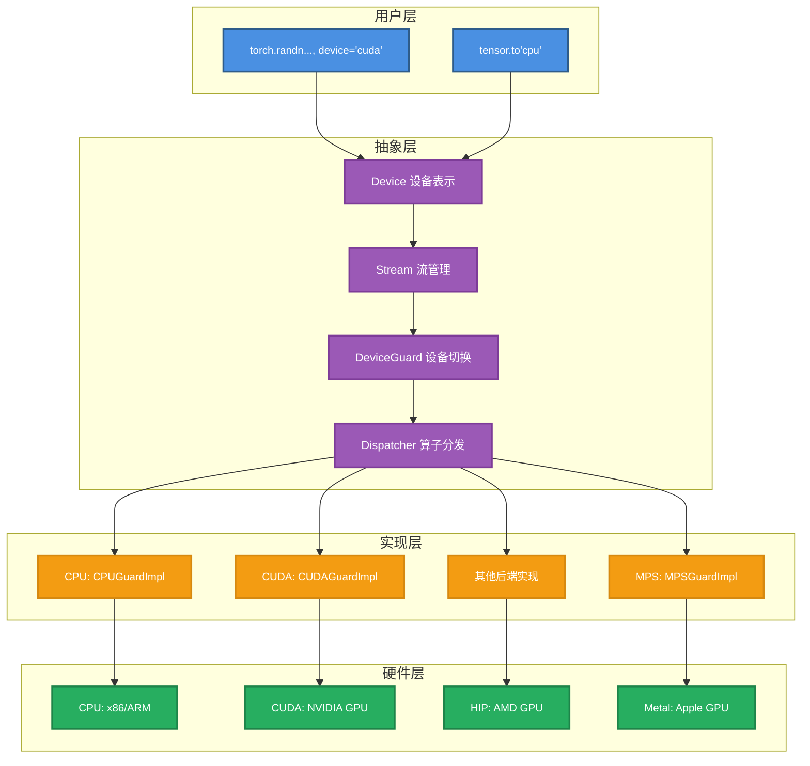

## 1. 设备抽象概述

### 1.1 为什么需要设备抽象

PyTorch支持多种计算设备：

```python
# 不同的设备
x_cpu = torch.randn(10, device='cpu')      # CPU
x_cuda = torch.randn(10, device='cuda')    # NVIDIA GPU
x_mps = torch.randn(10, device='mps')      # Apple Metal
x_xla = torch.randn(10, device='xla')      # Google TPU
x_hpu = torch.randn(10, device='hpu')      # Habana Gaudi
```

**挑战**：
- 每种设备有不同的API（CUDA、HIP、Metal等）
- 需要统一的接口给用户
- 运行时动态选择设备
- 新设备的可扩展性

**解决方案**：设备抽象层

### 1.2 设备抽象架构



### 1.3 核心组件

```cpp
// 设备抽象的四大组件

// 1. Device: 设备标识
Device device(DeviceType::CUDA, 0);  // GPU 0

// 2. Stream: 执行流
Stream stream = getCurrentStream(device);

// 3. DeviceGuard: RAII设备切换
{
  DeviceGuard guard(device);
  // 在这个作用域内使用device
}  // 自动恢复原设备

// 4. DeviceGuardImpl: 后端实现
struct CUDAGuardImpl : DeviceGuardImplInterface {
  Device getDevice() const override;
  void setDevice(Device) const override;
  // ...
};
```

## 2. Device类

### 2.1 DeviceType枚举

所有支持的设备类型。

```cpp
// c10/core/DeviceType.h
enum class DeviceType : int8_t {
  CPU = 0,           // x86/ARM CPU
  CUDA = 1,          // NVIDIA CUDA
  MKLDNN = 2,        // Intel MKL-DNN（已废弃）
  OPENGL = 3,        // OpenGL
  OPENCL = 4,        // OpenCL
  IDEEP = 5,         // Intel IDEEP
  HIP = 6,           // AMD HIP
  FPGA = 7,          // FPGA
  MAIA = 8,          // Microsoft MAIA
  XLA = 9,           // Google XLA/TPU
  Vulkan = 10,       // Vulkan
  Metal = 11,        // Apple Metal
  XPU = 12,          // Intel XPU
  MPS = 13,          // Apple MPS
  Meta = 14,         // Meta张量（无数据）
  HPU = 15,          // Habana HPU
  VE = 16,           // NEC SX-Aurora
  Lazy = 17,         // 懒执行
  IPU = 18,          // Graphcore IPU
  MTIA = 19,         // Meta MTIA
  PrivateUse1 = 20,  // 自定义后端
  
  COMPILE_TIME_MAX_DEVICE_TYPES = 21
};

// 常用常量
constexpr DeviceType kCPU = DeviceType::CPU;
constexpr DeviceType kCUDA = DeviceType::CUDA;
constexpr DeviceType kMPS = DeviceType::MPS;
// ...
```

### 2.2 Device类

设备由类型+索引唯一标识。

```cpp
// c10/core/Device.h
struct Device {
  DeviceType type_;     // 设备类型
  DeviceIndex index_;   // 设备索引（-1表示当前设备）
  
  // 构造
  Device(DeviceType type, DeviceIndex index = -1)
      : type_(type), index_(index) {}
  
  // 从字符串构造
  Device(const std::string& str);  // "cuda:0"
  
  // 访问器
  DeviceType type() const { return type_; }
  DeviceIndex index() const { return index_; }
  bool has_index() const { return index_ != -1; }
  
  // 类型检查
  bool is_cpu() const { return type_ == DeviceType::CPU; }
  bool is_cuda() const { return type_ == DeviceType::CUDA; }
  bool is_mps() const { return type_ == DeviceType::MPS; }
  // ...
  
  // 比较
  bool operator==(const Device& other) const {
    return type_ == other.type_ && index_ == other.index_;
  }
};
```

### 2.3 Python使用

```python
# 创建Device
import torch

# 方式1：字符串
device = torch.device('cuda')       # Device(type='cuda', index=-1)
device = torch.device('cuda:0')     # Device(type='cuda', index=0)
device = torch.device('cpu')        # Device(type='cpu', index=-1)

# 方式2：类型+索引
device = torch.device('cuda', 0)    # Device(type='cuda', index=0)

# 方式3：简写
x = torch.randn(10, device='cuda')  # 直接用字符串

# 获取tensor的设备
print(x.device)  # device(type='cuda', index=0)

# 设备转换
y = x.cpu()      # 转到CPU
z = x.cuda()     # 转到CUDA
w = x.to('mps')  # 转到MPS
```

### 2.4 设备验证

```cpp
void Device::validate() {
  // 索引必须 >= -1
  TORCH_CHECK(index_ >= -1, "Device index must be -1 or non-negative");
  
  // CPU设备索引必须是-1或0
  TORCH_CHECK(
      !is_cpu() || index_ <= 0,
      "CPU device index must be -1 or zero");
}
```

```python
# 有效
torch.device('cpu')       # OK
torch.device('cpu', -1)   # OK
torch.device('cpu', 0)    # OK
torch.device('cuda', 0)   # OK

# 无效
torch.device('cpu', 1)    # 错误！CPU只有一个"设备"
torch.device('cuda', -2)  # 错误！索引必须>=-1
```

## 3. Stream（流）

### 3.1 什么是Stream

Stream是异步执行的队列，同一stream上的操作顺序执行。

```python
# 默认stream（stream 0）
x = torch.randn(1000, 1000, device='cuda')
y = x * 2  # 在默认stream上执行
z = y + 1  # 等y完成后执行

# 多个stream并行
stream1 = torch.cuda.Stream()
stream2 = torch.cuda.Stream()

with torch.cuda.stream(stream1):
    a = torch.randn(1000, 1000, device='cuda')
    b = a * 2  # stream1

with torch.cuda.stream(stream2):
    c = torch.randn(1000, 1000, device='cuda')
    d = c * 2  # stream2，可能与stream1并行
```

### 3.2 Stream类

```cpp
// c10/core/Stream.h
class Stream {
  Device device_;    // 所属设备
  StreamId id_;      // 流ID
  
public:
  // 不安全构造（仅限内部使用）
  Stream(Unsafe, Device device, StreamId id)
      : device_(device), id_(id) {}
  
  // 默认stream
  Stream(Default, Device device)
      : device_(device), id_(0) {}
  
  // 访问器
  Device device() const { return device_; }
  DeviceType device_type() const { return device_.type(); }
  DeviceIndex device_index() const { return device_.index(); }
  StreamId id() const { return id_; }
  
  // 同步
  bool query() const;        // 检查是否完成
  void synchronize() const;  // 阻塞等待完成
  
  // 等待事件
  template <typename T>
  void wait(const T& event) const {
    event.block(*this);
  }
  
  // 比较
  bool operator==(const Stream& other) const {
    return device_ == other.device_ && id_ == other.id_;
  }
};
```

### 3.3 Stream操作

```python
import torch

# 获取当前stream
stream = torch.cuda.current_stream()
print(stream)  # <torch.cuda.Stream device=cuda:0 ...>

# 创建新stream
s1 = torch.cuda.Stream()
s2 = torch.cuda.Stream(priority=-1)  # 高优先级

# 切换stream
with torch.cuda.stream(s1):
    x = torch.randn(10, device='cuda')  # 在s1上执行

# 同步
s1.synchronize()  # 等待s1上所有操作完成
torch.cuda.synchronize()  # 等待当前设备所有stream

# 查询
if s1.query():
    print("Stream s1 已完成所有操作")
```

### 3.4 Stream同步示例

```python
# 演示stream并行
import time
import torch

def slow_kernel(x):
    # 模拟慢操作
    for _ in range(100):
        x = x * 1.01
    return x

# 顺序执行（一个stream）
start = time.time()
x = torch.randn(1000, 1000, device='cuda')
y = torch.randn(1000, 1000, device='cuda')
x = slow_kernel(x)
y = slow_kernel(y)
torch.cuda.synchronize()
print(f"顺序: {time.time() - start:.3f}s")  # ~0.2s

# 并行执行（两个stream）
start = time.time()
s1 = torch.cuda.Stream()
s2 = torch.cuda.Stream()
x = torch.randn(1000, 1000, device='cuda')
y = torch.randn(1000, 1000, device='cuda')

with torch.cuda.stream(s1):
    x = slow_kernel(x)

with torch.cuda.stream(s2):
    y = slow_kernel(y)

torch.cuda.synchronize()
print(f"并行: {time.time() - start:.3f}s")  # ~0.1s（快2倍）
```

## 4. DeviceGuard

RAII风格的设备切换器。

### 4.1 为什么需要DeviceGuard

```cpp
// 错误的做法：手动切换设备
void bad_example() {
  int old_device = cudaGetDevice();
  cudaSetDevice(1);
  
  // 操作...
  // 如果这里抛异常，设备不会恢复！
  
  cudaSetDevice(old_device);  // 可能不会执行
}

// 正确的做法：使用DeviceGuard
void good_example() {
  DeviceGuard guard(Device(DeviceType::CUDA, 1));
  
  // 操作...
  // 即使抛异常，guard析构时会自动恢复设备
  
}  // 自动恢复原设备
```

### 4.2 DeviceGuard实现

```cpp
// c10/core/DeviceGuard.h
struct DeviceGuard {
  // 禁止默认构造
  explicit DeviceGuard() = delete;
  
  // 切换到指定设备
  explicit DeviceGuard(Device device)
      : impl_(device.type()),
        original_device_(impl_->exchangeDevice(device)),
        current_device_(device) {}
  
  // 禁止拷贝
  DeviceGuard(const DeviceGuard&) = delete;
  DeviceGuard& operator=(const DeviceGuard&) = delete;
  
  // 析构时恢复
  ~DeviceGuard() {
    impl_->uncheckedSetDevice(original_device_);
  }
  
  // 获取原设备
  Device original_device() const { return original_device_; }
  
  // 获取当前设备
  Device current_device() const { return current_device_; }
  
  // 切换到新设备
  void set_device(Device device) {
    impl_->setDevice(device);
    current_device_ = device;
  }
  
private:
  const DeviceGuardImplInterface* impl_;  // 后端实现
  Device original_device_;                // 原设备
  Device current_device_;                 // 当前设备
};
```

### 4.3 OptionalDeviceGuard

可选的设备守护。

```cpp
struct OptionalDeviceGuard {
  // 可以默认构造（未初始化状态）
  explicit OptionalDeviceGuard() : guard_() {}
  
  // 可选设备
  explicit OptionalDeviceGuard(optional<Device> device_opt) {
    if (device_opt.has_value()) {
      guard_.emplace(device_opt.value());
    }
  }
  
  // 重置设备
  void reset_device(Device device) {
    guard_.emplace(device);
  }
  
  // 恢复原设备
  void reset() {
    guard_.reset();
  }
  
private:
  optional<DeviceGuard> guard_;
};
```

### 4.4 Python使用

```python
# 虽然Python没有直接的DeviceGuard，
# 但有类似的上下文管理器

# 临时切换设备
x = torch.randn(10)  # CPU
with torch.cuda.device(1):
    y = torch.randn(10)  # CUDA:1
    print(y.device)      # cuda:1
# 自动恢复

print(torch.cuda.current_device())  # 0（假设之前是0）
```

C++使用：

```cpp
// 确保在指定设备上执行
void my_kernel(const Tensor& input) {
  DeviceGuard guard(input.device());
  
  // 现在所有CUDA调用都在input的设备上
  auto output = at::empty_like(input);
  // ...
}
```

## 5. StreamGuard

RAII风格的流切换器。

### 5.1 StreamGuard实现

```cpp
// c10/core/StreamGuard.h
struct StreamGuard {
  explicit StreamGuard() = delete;
  
  // 切换到指定stream（同时切换设备）
  explicit StreamGuard(Stream stream)
      : guard_(stream) {}
  
  // 禁止拷贝和移动
  StreamGuard(const StreamGuard&) = delete;
  StreamGuard& operator=(const StreamGuard&) = delete;
  StreamGuard(StreamGuard&&) = delete;
  StreamGuard& operator=(StreamGuard&&) = delete;
  
  // 获取原stream
  Stream original_stream() const {
    return guard_.original_stream();
  }
  
  // 获取当前stream
  Stream current_stream() const {
    return guard_.current_stream();
  }
  
  // 获取当前设备
  Device current_device() const {
    return guard_.current_device();
  }
  
private:
  c10::impl::InlineStreamGuard<impl::VirtualGuardImpl> guard_;
};
```

### 5.2 使用示例

```cpp
// C++示例
void example() {
  Stream s1 = getStreamFromPool(/*isHighPriority=*/true);
  
  {
    StreamGuard guard(s1);
    // 所有操作在s1上执行
    auto x = at::randn({10, 10}, at::device(kCUDA));
  }  // 恢复原stream
}
```

```python
# Python示例
s = torch.cuda.Stream()

with torch.cuda.stream(s):
    # 所有操作在s上执行
    x = torch.randn(10, device='cuda')
    y = x * 2
# 自动恢复原stream
```

## 6. DeviceGuardImpl接口

各后端必须实现的接口。

### 6.1 接口定义

```cpp
// c10/core/impl/DeviceGuardImplInterface.h
struct DeviceGuardImplInterface {
  virtual ~DeviceGuardImplInterface() = default;
  
  // 返回设备类型
  virtual DeviceType type() const = 0;
  
  // 设备管理
  virtual Device exchangeDevice(Device) const = 0;
  virtual Device getDevice() const = 0;
  virtual void setDevice(Device) const = 0;
  virtual void uncheckedSetDevice(Device) const noexcept = 0;
  
  // 获取设备数量
  virtual DeviceIndex deviceCount() const noexcept = 0;
  
  // Stream管理
  virtual Stream getStream(Device) const noexcept = 0;
  virtual Stream getDefaultStream(Device) const = 0;
  virtual Stream getStreamFromGlobalPool(Device, bool high_priority) const = 0;
  virtual Stream exchangeStream(Stream) const noexcept = 0;
  
  // 事件管理
  virtual void record(void** event, const Stream&, ...) const = 0;
  virtual void block(void* event, const Stream&) const = 0;
  virtual bool queryEvent(void* event) const = 0;
  virtual void destroyEvent(void* event, DeviceIndex) const noexcept = 0;
  
  // Stream查询
  virtual bool queryStream(const Stream&) const = 0;
  virtual void synchronizeStream(const Stream&) const = 0;
};
```

### 6.2 CUDA实现

```cpp
// c10/cuda/impl/CUDAGuardImpl.h
struct CUDAGuardImpl final : DeviceGuardImplInterface {
  DeviceType type() const override {
    return DeviceType::CUDA;
  }
  
  Device exchangeDevice(Device new_device) const override {
    // 获取当前设备
    int old_device;
    C10_CUDA_CHECK(cudaGetDevice(&old_device));
    
    // 切换设备
    C10_CUDA_CHECK(cudaSetDevice(new_device.index()));
    
    return Device(DeviceType::CUDA, old_device);
  }
  
  Device getDevice() const override {
    int device;
    C10_CUDA_CHECK(cudaGetDevice(&device));
    return Device(DeviceType::CUDA, device);
  }
  
  void setDevice(Device device) const override {
    C10_CUDA_CHECK(cudaSetDevice(device.index()));
  }
  
  void uncheckedSetDevice(Device device) const noexcept override {
    // 不检查错误（用于析构函数）
    cudaSetDevice(device.index());
  }
  
  DeviceIndex deviceCount() const noexcept override {
    int count;
    cudaError_t err = cudaGetDeviceCount(&count);
    if (err != cudaSuccess) {
      return 0;  // 出错返回0
    }
    return static_cast<DeviceIndex>(count);
  }
  
  Stream getStream(Device device) const noexcept override {
    return getCurrentCUDAStream(device.index());
  }
  
  // ... 其他方法
};
```

### 6.3 CPU实现

```cpp
// c10/core/impl/CPUGuardImpl.h
struct CPUGuardImpl final : DeviceGuardImplInterface {
  DeviceType type() const override {
    return DeviceType::CPU;
  }
  
  Device exchangeDevice(Device) const override {
    // CPU只有一个设备，什么都不做
    return Device(DeviceType::CPU);
  }
  
  Device getDevice() const override {
    return Device(DeviceType::CPU);
  }
  
  void setDevice(Device device) const override {
    TORCH_CHECK(device.is_cpu(), "Expected CPU device");
    // CPU不需要切换
  }
  
  void uncheckedSetDevice(Device) const noexcept override {
    // CPU不需要切换
  }
  
  DeviceIndex deviceCount() const noexcept override {
    return 1;  // CPU只有一个"设备"
  }
  
  Stream getStream(Device) const noexcept override {
    // CPU没有stream概念，返回默认stream
    return Stream(Stream::DEFAULT, Device(DeviceType::CPU));
  }
  
  // Stream操作都是空实现
  Stream exchangeStream(Stream s) const noexcept override {
    return s;
  }
  
  void synchronizeStream(const Stream&) const override {
    // CPU操作是同步的，无需等待
  }
  
  // ... 其他方法
};
```

## 7. 设备注册与查找

### 7.1 DeviceGuardImpl注册

```cpp
// 全局注册表
C10_DECLARE_REGISTRY(
    DeviceGuardImplRegistry,
    DeviceGuardImplInterface,
    DeviceType);

// 注册CUDA实现
C10_REGISTER_GUARD_IMPL(CUDA, CUDAGuardImpl);

// 注册CPU实现
C10_REGISTER_GUARD_IMPL(CPU, CPUGuardImpl);

// 注册MPS实现
C10_REGISTER_GUARD_IMPL(MPS, MPSGuardImpl);
```

### 7.2 查找实现

```cpp
const DeviceGuardImplInterface* getDeviceGuardImpl(DeviceType type) {
  // 从注册表查找
  auto impl = DeviceGuardImplRegistry()->Create(type);
  TORCH_CHECK(impl, "No DeviceGuardImpl for ", type);
  return impl;
}

// 使用
Device device(DeviceType::CUDA, 0);
auto impl = getDeviceGuardImpl(device.type());
impl->setDevice(device);
```

### 7.3 虚拟 vs 直接调用

```cpp
// 虚拟调用（通过接口）
DeviceGuard generic_guard(device);  // 使用虚函数

// 直接调用（编译时已知类型）
CUDAGuard cuda_guard(device);  // 直接调用，无虚函数开销
```

**性能对比**：
- 虚拟调用：~5ns开销
- 直接调用：~1ns开销
- 对于热路径，直接调用更快

## 8. 多GPU编程

### 8.1 基础多GPU操作

```python
import torch

# 检查GPU数量
num_gpus = torch.cuda.device_count()
print(f"可用GPU数量: {num_gpus}")

# 查看每个GPU信息
for i in range(num_gpus):
    props = torch.cuda.get_device_properties(i)
    print(f"GPU {i}: {props.name}")
    print(f"  内存: {props.total_memory / 1024**3:.1f} GB")
    print(f"  计算能力: {props.major}.{props.minor}")

# 在不同GPU上创建tensor
x0 = torch.randn(10, device='cuda:0')  # GPU 0
x1 = torch.randn(10, device='cuda:1')  # GPU 1

# 获取当前GPU
current = torch.cuda.current_device()
print(f"当前GPU: {current}")

# 切换GPU
torch.cuda.set_device(1)
print(f"切换后: {torch.cuda.current_device()}")  # 1
```

### 8.2 数据并行

```python
# DataParallel（单机多卡）
model = MyModel()
if torch.cuda.device_count() > 1:
    model = nn.DataParallel(model)
model = model.cuda()

# 自动分发到多GPU
output = model(input)  # input在GPU 0，自动复制到所有GPU
```

### 8.3 模型并行

```python
# 不同层在不同GPU
class ModelParallel(nn.Module):
    def __init__(self):
        super().__init__()
        self.layer1 = nn.Linear(1000, 1000).to('cuda:0')
        self.layer2 = nn.Linear(1000, 1000).to('cuda:1')
    
    def forward(self, x):
        x = x.to('cuda:0')
        x = self.layer1(x)
        
        x = x.to('cuda:1')  # 跨GPU传输
        x = self.layer2(x)
        return x
```

### 8.4 Peer-to-Peer访问

```python
# 检查GPU间是否支持P2P
can_access = torch.cuda.can_device_access_peer(0, 1)
print(f"GPU 0能否直接访问GPU 1: {can_access}")

# 启用P2P（C++ API）
# cudaDeviceEnablePeerAccess(peer_device, flags)

# P2P传输更快（无需经过CPU）
x = torch.randn(1000, 1000, device='cuda:0')
y = x.to('cuda:1')  # 如果支持P2P，直接GPU间拷贝
```

## 9. 自定义后端

### 9.1 使用PrivateUse1

PyTorch预留了`PrivateUse1`用于自定义后端。

```cpp
// 步骤1：实现DeviceGuardImpl
struct MyBackendGuardImpl final : DeviceGuardImplInterface {
  DeviceType type() const override {
    return DeviceType::PrivateUse1;
  }
  
  Device exchangeDevice(Device new_device) const override {
    // 切换到新设备
    int old_device = my_backend_get_device();
    my_backend_set_device(new_device.index());
    return Device(DeviceType::PrivateUse1, old_device);
  }
  
  // ... 实现所有接口
};

// 步骤2：注册后端
C10_REGISTER_GUARD_IMPL(PrivateUse1, MyBackendGuardImpl);

// 步骤3：注册后端名称
c10::register_privateuse1_backend("mybackend");
```

### 9.2 注册算子

```cpp
// 注册算子实现
TORCH_LIBRARY_IMPL(aten, PrivateUse1, m) {
  m.impl("add.Tensor", &my_backend_add);
  m.impl("mul.Tensor", &my_backend_mul);
  // ...
}

// 实现算子
Tensor my_backend_add(const Tensor& a, const Tensor& b) {
  // 调用自定义后端的加法
  return my_backend::add(a, b);
}
```

### 9.3 Python使用

```python
import torch

# 使用自定义后端
x = torch.randn(10, device='privateuse1:0')
y = torch.randn(10, device='privateuse1:0')
z = x + y  # 调用my_backend_add

# 或使用注册的名称
x = torch.randn(10, device='mybackend:0')
```

## 10. 事件同步

### 10.1 Event基础

```python
# 创建event
event = torch.cuda.Event()

# 记录event（在当前stream）
event.record()

# 等待event
event.wait()  # 当前stream等待event

# 检查event是否完成
if event.query():
    print("Event已完成")

# 同步（阻塞CPU）
event.synchronize()
```

### 10.2 跨Stream同步

```python
s1 = torch.cuda.Stream()
s2 = torch.cuda.Stream()

event = torch.cuda.Event()

with torch.cuda.stream(s1):
    x = torch.randn(1000, 1000, device='cuda')
    y = x * 2
    event.record()  # 在s1上记录event

with torch.cuda.stream(s2):
    event.wait()  # s2等待s1的event
    z = y + 1  # 现在可以安全使用y
```

### 10.3 计时

```python
# 使用event计时
start = torch.cuda.Event(enable_timing=True)
end = torch.cuda.Event(enable_timing=True)

start.record()
# ... GPU操作
end.record()

torch.cuda.synchronize()
elapsed = start.elapsed_time(end)  # 毫秒
print(f"耗时: {elapsed:.3f} ms")
```

### 10.4 Event实现

```cpp
// CUDA Event包装
struct CUDAEvent {
  cudaEvent_t event_;
  
  CUDAEvent(bool enable_timing = false) {
    unsigned int flags = enable_timing ? 0 : cudaEventDisableTiming;
    C10_CUDA_CHECK(cudaEventCreateWithFlags(&event_, flags));
  }
  
  ~CUDAEvent() {
    cudaEventDestroy(event_);
  }
  
  void record(const Stream& stream) {
    C10_CUDA_CHECK(cudaEventRecord(event_, stream.stream()));
  }
  
  void block(const Stream& stream) {
    C10_CUDA_CHECK(cudaStreamWaitEvent(stream.stream(), event_, 0));
  }
  
  bool query() {
    cudaError_t err = cudaEventQuery(event_);
    if (err == cudaSuccess) {
      return true;
    } else if (err == cudaErrorNotReady) {
      return false;
    } else {
      C10_CUDA_CHECK(err);
      return false;  // unreachable
    }
  }
  
  void synchronize() {
    C10_CUDA_CHECK(cudaEventSynchronize(event_));
  }
  
  float elapsed_time(const CUDAEvent& other) {
    float time_ms;
    C10_CUDA_CHECK(cudaEventElapsedTime(&time_ms, event_, other.event_));
    return time_ms;
  }
};
```

## 11. 设备属性查询

### 11.1 CUDA设备属性

```python
# 获取设备属性
props = torch.cuda.get_device_properties(0)

print(f"名称: {props.name}")
print(f"计算能力: {props.major}.{props.minor}")
print(f"总内存: {props.total_memory / 1024**3:.2f} GB")
print(f"多处理器数: {props.multi_processor_count}")
print(f"时钟频率: {props.clock_rate / 1000} MHz")
print(f"内存时钟: {props.memory_clock_rate / 1000} MHz")
print(f"内存总线宽度: {props.memory_bus_width} bits")
print(f"L2缓存: {props.l2_cache_size / 1024} KB")
print(f"最大线程/块: {props.max_threads_per_block}")
print(f"最大块维度: {props.max_threads_dim}")
print(f"最大网格维度: {props.max_grid_size}")
```

### 11.2 C++查询

```cpp
// 查询设备属性
cudaDeviceProp prop;
cudaGetDeviceProperties(&prop, device_index);

std::cout << "Device: " << prop.name << "\n";
std::cout << "Compute Capability: " 
          << prop.major << "." << prop.minor << "\n";
std::cout << "Total Memory: " 
          << prop.totalGlobalMem / 1024 / 1024 << " MB\n";
std::cout << "SM Count: " 
          << prop.multiProcessorCount << "\n";
```

### 11.3 能力检查

```python
# 检查是否支持某些特性
def check_capabilities():
    if not torch.cuda.is_available():
        print("CUDA不可用")
        return
    
    device = torch.cuda.current_device()
    props = torch.cuda.get_device_properties(device)
    
    # 计算能力
    compute_capability = f"{props.major}.{props.minor}"
    print(f"计算能力: {compute_capability}")
    
    # 特性检查
    if props.major >= 7:
        print("✓ 支持Tensor Cores")
    
    if props.major >= 8:
        print("✓ 支持稀疏Tensor Cores")
    
    if props.major >= 9:
        print("✓ 支持FP8")
    
    # 内存检查
    total_gb = props.total_memory / 1024**3
    if total_gb >= 16:
        print(f"✓ 大内存GPU ({total_gb:.1f} GB)")
    
    # 多GPU
    if torch.cuda.device_count() > 1:
        print(f"✓ 多GPU ({torch.cuda.device_count()}个)")

check_capabilities()
```

## 12. 最佳实践

### 12.1 设备管理

```python
# 正确：使用DeviceGuard（C++）或上下文管理器（Python）
def process_on_device(tensor, device_id):
    with torch.cuda.device(device_id):
        # 所有操作在device_id上
        result = tensor * 2
        return result

# 错误：手动切换设备容易出错
def bad_process(tensor, device_id):
    old_device = torch.cuda.current_device()
    torch.cuda.set_device(device_id)
    result = tensor * 2
    torch.cuda.set_device(old_device)  # 异常时不会执行
    return result
```

### 12.2 跨设备操作

```python
# 正确：显式转换设备
x = torch.randn(10, device='cuda:0')
y = torch.randn(10, device='cuda:1')
z = x + y.to('cuda:0')  # 将y移到cuda:0

# 错误：不同设备直接操作
# z = x + y  # RuntimeError: Expected all tensors to be on the same device
```

### 12.3 Stream使用

```python
# 正确：合理使用多stream提高并行度
def parallel_processing(data_list):
    streams = [torch.cuda.Stream() for _ in range(4)]
    results = []
    
    for i, data in enumerate(data_list):
        stream = streams[i % 4]
        with torch.cuda.stream(stream):
            result = process(data)
            results.append(result)
    
    # 同步所有stream
    torch.cuda.synchronize()
    return results

# 错误：过度使用stream反而降低性能
# 创建太多stream增加开销
```

### 12.4 内存管理

```python
# 正确：及时释放不需要的tensor
def train_step(model, data):
    output = model(data)
    loss = criterion(output, target)
    loss.backward()
    
    # 不需要保留output和loss
    del output, loss
    
    optimizer.step()
    optimizer.zero_grad()

# 错误：保留所有中间结果
def bad_train_step(model, data):
    all_outputs = []
    all_losses = []
    
    for batch in data:
        output = model(batch)
        loss = criterion(output, target)
        all_outputs.append(output)  # 浪费内存！
        all_losses.append(loss)      # 浪费内存！
```

## 13. 总结

### 13.1 核心概念

```mermaid
graph TD
    Arch[设备抽象架构]
    
    Device[Device 设备标识]
    DevType[DeviceType 类型]
    DevIndex[DeviceIndex 索引]
    
    Stream[Stream 执行流]
    StreamAsync[异步执行]
    StreamOrder[顺序保证]
    
    DevGuard[DeviceGuard<br/>RAII设备切换]
    DevAuto[自动恢复]
    
    StmGuard[StreamGuard<br/>RAII流切换]
    StmAuto[自动恢复]
    
    Impl[DeviceGuardImpl<br/>后端实现]
    ImplCPU[CPU]
    ImplCUDA[CUDA]
    ImplMPS[MPS]
    ImplCustom[自定义后端]
    
    Arch --> Device
    Device --> DevType
    Device --> DevIndex
    
    Arch --> Stream
    Stream --> StreamAsync
    Stream --> StreamOrder
    
    Arch --> DevGuard
    DevGuard --> DevAuto
    
    Arch --> StmGuard
    StmGuard --> StmAuto
    
    Arch --> Impl
    Impl --> ImplCPU
    Impl --> ImplCUDA
    Impl --> ImplMPS
    Impl --> ImplCustom
    
    style Arch fill:#4A90E2,stroke:#2E5C8A,stroke-width:3px,color:#fff,font-size:15px
    style Device fill:#9B59B6,stroke:#7D3C98,stroke-width:2px,color:#fff,font-size:14px
    style Stream fill:#9B59B6,stroke:#7D3C98,stroke-width:2px,color:#fff,font-size:14px
    style DevGuard fill:#9B59B6,stroke:#7D3C98,stroke-width:2px,color:#fff,font-size:14px
    style StmGuard fill:#9B59B6,stroke:#7D3C98,stroke-width:2px,color:#fff,font-size:14px
    style Impl fill:#9B59B6,stroke:#7D3C98,stroke-width:2px,color:#fff,font-size:14px
    style DevType fill:#F39C12,stroke:#D68910,stroke-width:2px,color:#fff,font-size:12px
    style DevIndex fill:#F39C12,stroke:#D68910,stroke-width:2px,color:#fff,font-size:12px
    style StreamAsync fill:#F39C12,stroke:#D68910,stroke-width:2px,color:#fff,font-size:12px
    style StreamOrder fill:#F39C12,stroke:#D68910,stroke-width:2px,color:#fff,font-size:12px
    style DevAuto fill:#F39C12,stroke:#D68910,stroke-width:2px,color:#fff,font-size:12px
    style StmAuto fill:#F39C12,stroke:#D68910,stroke-width:2px,color:#fff,font-size:12px
    style ImplCPU fill:#1ABC9C,stroke:#16A085,stroke-width:2px,color:#fff,font-size:11px
    style ImplCUDA fill:#1ABC9C,stroke:#16A085,stroke-width:2px,color:#fff,font-size:11px
    style ImplMPS fill:#1ABC9C,stroke:#16A085,stroke-width:2px,color:#fff,font-size:11px
    style ImplCustom fill:#1ABC9C,stroke:#16A085,stroke-width:2px,color:#fff,font-size:11px
```



