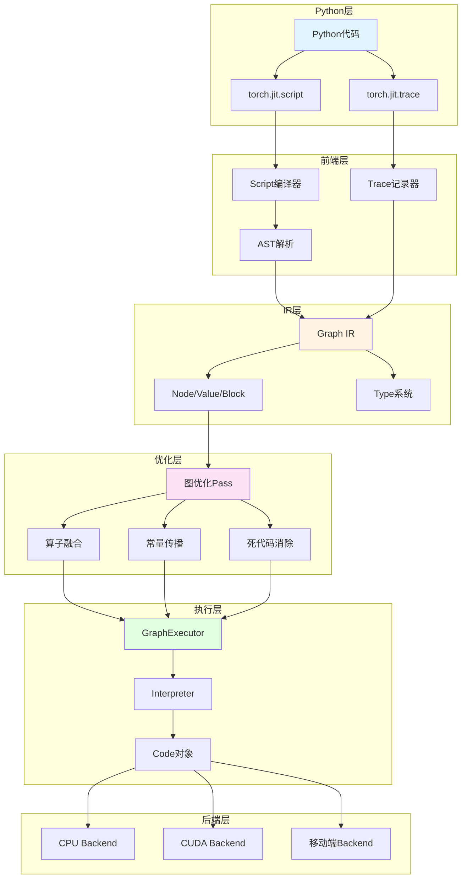
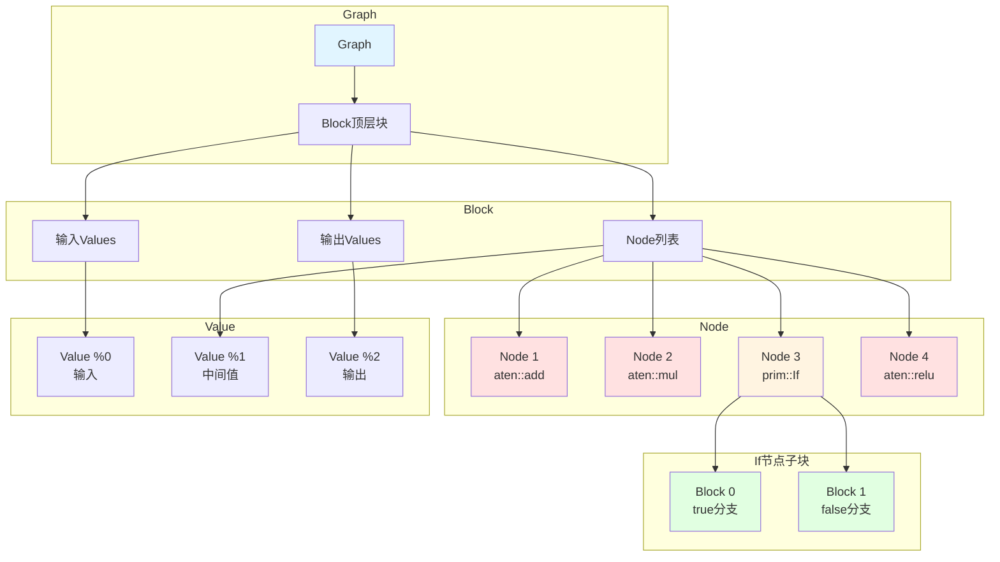
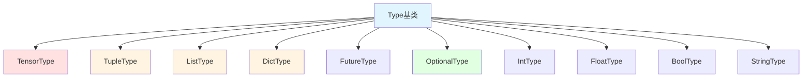
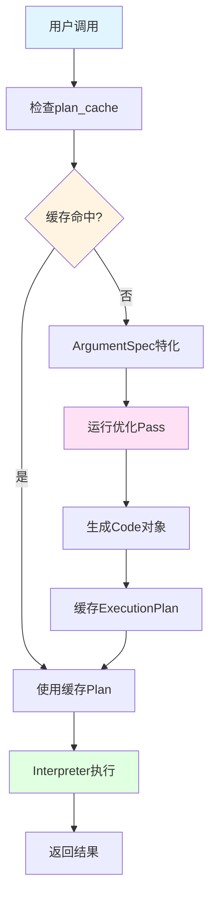
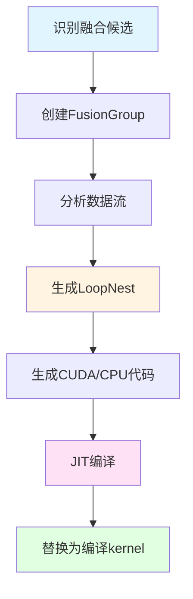

## 1 概述

PyTorch JIT（Just-In-Time）编译器是PyTorch从动态图转向静态图优化的关键组件。它允许将Python代码转换为优化的中间表示（IR），从而实现性能提升、部署便利和跨平台支持。

### 1.1 为什么需要JIT

**动态图的局限性**：
- 每次前向传播都重建计算图，开销大
- 难以进行全局优化（如算子融合）
- 不利于移动端/生产环境部署
- Python解释器开销显著

**JIT的优势**：
- **性能提升**：通过算子融合、常量折叠等优化减少计算开销
- **静态分析**：类型推断、形状特化提高执行效率
- **部署友好**：生成独立于Python的模型表示
- **跨平台**：支持移动端、服务器、嵌入式设备

### 1.2 TorchScript语言

TorchScript是Python的子集，专为深度学习模型设计：

```python
# TorchScript支持的Python特性
import torch

@torch.jit.script
def example_function(x: torch.Tensor, y: int) -> torch.Tensor:
    # 控制流
    if y > 0:
        result = x + y
    else:
        result = x * y
    
    # 循环
    for i in range(5):
        result = result * 2
    
    # 类型注解（必需）
    z: float = 3.14
    
    return result
```

**支持的特性**：
- 类型注解（强制要求）
- 控制流（if/else、for/while）
- 函数调用
- 类定义（`torch.jit.ScriptModule`）
- 元组、列表、字典等基本数据结构

**不支持的特性**：
- 动态属性访问
- 任意Python库（仅支持torch、math等）
- 复杂的元编程

## 2 JIT整体架构
    
### 2.1 系统分层



### 2.2 核心组件

| 组件 | 文件路径 | 功能 |
|------|---------|------|
| Graph IR | `torch/csrc/jit/ir/ir.h` | 中间表示的核心数据结构 |
| Tracer | `torch/csrc/jit/frontend/tracer.h` | 跟踪模式入口 |
| Script编译器 | `torch/csrc/jit/frontend/` | 脚本模式编译器 |
| GraphExecutor | `torch/csrc/jit/runtime/graph_executor.cpp` | 图执行器 |
| Interpreter | `torch/csrc/jit/runtime/interpreter.cpp` | 解释器 |
| Optimizer | `torch/csrc/jit/passes/` | 各种优化Pass |

## 3 Graph IR详解

### 3.1 IR核心概念

Graph IR是PyTorch JIT的中间表示，采用SSA（Static Single Assignment）形式。

**文件**: `torch/csrc/jit/ir/ir.h`

```cpp
struct Graph {
    std::shared_ptr<Block> block_;        // 顶层Block
    std::vector<Value*> inputs_;          // 输入
    std::vector<Value*> outputs_;         // 输出
    
    // 创建节点
    Node* create(Symbol kind, size_t num_outputs = 1);
    
    // 插入节点
    Node* insertNode(Node* n);
    
    // 获取/设置插入点
    Node* insertPoint();
    void setInsertPoint(Node* n);
};
```

### 3.2 Graph结构



### 3.3 Node节点

```cpp
struct Node {
    NodeKind kind_;                      // 节点类型（如aten::add）
    std::vector<Value*> inputs_;         // 输入Values
    std::vector<Value*> outputs_;        // 输出Values
    Block* owning_block_;                // 所属Block
    std::vector<Block*> blocks_;         // 子Block（用于控制流）
    
    // 属性
    std::map<Symbol, IValue> attributes_;
    
    // 链表结构
    Node* next_;
    Node* prev_;
};
```

**节点类型示例**：
- **算子节点**: `aten::add`, `aten::mm`, `aten::relu`
- **控制流**: `prim::If`, `prim::Loop`
- **特殊节点**: `prim::Constant`, `prim::ListConstruct`, `prim::TupleUnpack`

### 3.4 Value对象

```cpp
struct Value {
    Node* node_;                // 定义该Value的节点
    size_t offset_;             // 在node输出中的索引
    TypePtr type_;              // 类型信息
    std::vector<Use> uses_;     // 使用该Value的位置
    
    // 使用点（User, offset）
    struct Use {
        Node* user;             // 使用者节点
        size_t offset;          // 在输入列表中的位置
    };
};
```

**SSA特性**：
- 每个Value由唯一Node定义
- Value不可重新赋值
- 类似于LLVM IR的SSA形式

### 3.5 Block块

```cpp
struct Block {
    Graph* graph_;                      // 所属Graph
    Node* param_node_;                  // 伪参数节点
    Node* return_node_;                 // 伪返回节点
    std::vector<Node*> nodes_;          // 节点列表
    
    // 输入输出
    std::vector<Value*> inputs();
    std::vector<Value*> outputs();
    
    // 迭代器
    node_iterator begin();
    node_iterator end();
};
```

**控制流中的Block**：

```python
# Python代码
def conditional(x, y):
    if x.sum() > 0:
        return x + y
    else:
        return x * y
```

```
graph(%x : Tensor,
      %y : Tensor):
  %2 : int = prim::Constant[value=0]()
  %3 : Tensor = aten::sum(%x)
  %4 : Tensor = aten::gt(%3, %2)
  %result : Tensor = prim::If(%4)
    block0():  # true分支
      %6 : Tensor = aten::add(%x, %y)
      -> (%6)
    block1():  # false分支
      %8 : Tensor = aten::mul(%x, %y)
      -> (%8)
  return (%result)
```

### 3.6 Type类型系统

**核心类型**：

```cpp
// 文件: aten/src/ATen/core/jit_type.h

struct Type {
    virtual TypeKind kind() const = 0;
    virtual bool isSubtypeOf(const Type& rhs) const;
};

// 具体类型
struct TensorType : public Type {
    std::optional<at::ScalarType> scalar_type_;
    std::optional<at::Device> device_;
    std::optional<size_t> dim_;                  // 维度数量
    VaryingShape<int64_t> sizes_;                 // 形状
    VaryingShape<int64_t> strides_;               // 步长
    std::optional<bool> requires_grad_;
};

struct TupleType : public Type {
    std::vector<TypePtr> elements_;
};

struct ListType : public Type {
    TypePtr elem_type_;
};

struct DictType : public Type {
    TypePtr key_type_;
    TypePtr value_type_;
};
```

**类型层次**：



## 4 Script模式

### 4.1 Script编译流程


### 4.2 使用torch.jit.script

```python
import torch

# 1. 函数脚本化
@torch.jit.script
def scripted_fn(x: torch.Tensor, y: int) -> torch.Tensor:
    if y > 0:
        return x + y
    else:
        return x - y

# 2. 模块脚本化
class MyModule(torch.nn.Module):
    def __init__(self):
        super().__init__()
        self.linear = torch.nn.Linear(10, 20)
    
    def forward(self, x):
        return self.linear(x).relu()

# 脚本化模块
scripted_module = torch.jit.script(MyModule())

# 3. 查看生成的IR
print(scripted_fn.graph)
print(scripted_module.code)
```

### 4.3 Lexer词法分析

**文件**: `torch/csrc/jit/frontend/lexer.h`

```cpp
class Lexer {
public:
    // 主要方法
    Token next();               // 获取下一个Token
    Token cur();                // 当前Token
    Token lookahead();          // 向前看一个Token
    bool nextIf(int kind);      // 条件前进
    
private:
    std::string text_;          // 源代码文本
    size_t pos_;                // 当前位置
};

// Token类型
enum TokenKind {
    TK_IF,          // if关键字
    TK_ELSE,        // else
    TK_FOR,         // for
    TK_WHILE,       // while
    TK_DEF,         // def
    TK_RETURN,      // return
    TK_IDENT,       // 标识符
    TK_NUMBER,      // 数字
    TK_STRING,      // 字符串
    TK_NEWLINE,     // 换行
    TK_INDENT,      // 缩进
    TK_DEDENT,      // 反缩进
    // ...
};
```

**Token流示例**：

```python
def foo(x):
    return x + 1
```

Token流：
```
TK_DEF TK_IDENT(foo) ( TK_IDENT(x) ) : TK_NEWLINE
TK_INDENT TK_RETURN TK_IDENT(x) + TK_NUMBER(1) TK_NEWLINE
TK_DEDENT
```

### 4.4 Parser语法分析

**文件**: `torch/csrc/jit/frontend/parser.h`

```cpp
class Parser {
public:
    // 解析函数定义
    Def parseFunction();
    
    // 解析表达式
    Expr parseExp();
    
    // 解析语句
    Stmt parseStmt();
    
private:
    Lexer& lexer_;
    
    // Pratt解析器（处理运算符优先级）
    Expr parseBaseExp();
    Expr parseBinOp(Expr lhs, int min_prec);
};
```

**AST树表示**（Tree对象）：

```cpp
// 文件: torch/csrc/jit/frontend/tree.h

struct Tree {
    TokenKind kind_;                 // 节点类型
    SourceRange range_;              // 源码位置
    std::vector<Tree> subtrees_;     // 子树
    std::string string_value_;       // 叶子节点值
};

// Tree Views - 方便访问特定结构
struct Def : public TreeView {
    Ident name();                    // 函数名
    List<Param> params();            // 参数列表
    Maybe<Expr> return_type();       // 返回类型
    List<Stmt> statements();         // 函数体
};

struct Apply : public Expr {
    Expr callee();                   // 被调用函数
    List<Expr> inputs();             // 参数
    List<Attribute> attributes();    // 关键字参数
};
```

### 4.5 IR Emitter

**文件**: `torch/csrc/jit/frontend/ir_emitter.h`

```cpp
class IREmitter {
public:
    // 主入口
    void defineMethodsInModule(
        Module& module,
        const std::vector<Def>& definitions
    );
    
private:
    // 发射表达式
    Value* emitExpr(const Expr& tree);
    
    // 发射语句
    void emitStatements(const List<Stmt>& stmts);
    
    // 环境管理
    Environment environment_;
    
    // 当前构建的图
    std::shared_ptr<Graph> graph_;
};
```

**编译过程示例**：

```python
@torch.jit.script
def example(x: torch.Tensor, y: int) -> torch.Tensor:
    z = x + y
    return z.relu()
```

**生成的IR**：

```
graph(%x : Tensor,
      %y : int):
  %2 : int = prim::Constant[value=1]()
  %3 : Tensor = aten::add(%x, %y, %2)
  %4 : Tensor = aten::relu(%3)
  return (%4)
```

### 4.6 类型推断

```cpp
// 文件: torch/csrc/jit/passes/constant_propagation.h

// 传播类型信息
void PropagateInputShapes(Graph& graph);
void PropagateRequiresGrad(Graph& graph);

// 示例
void propagateShapes(Node* node) {
    // 根据输入类型推断输出类型
    if (node->kind() == aten::add) {
        auto lhs_type = node->input(0)->type()->cast<TensorType>();
        auto rhs_type = node->input(1)->type()->cast<TensorType>();
        
        if (lhs_type && rhs_type) {
            // 推断输出形状
            auto output_type = inferAddType(lhs_type, rhs_type);
            node->output()->setType(output_type);
        }
    }
}
```

## 5 Trace模式

### 5.1 Trace工作原理

Trace模式通过记录实际执行的算子来构建计算图：


### 5.2 使用torch.jit.trace

```python
import torch

class MyModel(torch.nn.Module):
    def __init__(self):
        super().__init__()
        self.conv = torch.nn.Conv2d(3, 64, 3)
        self.relu = torch.nn.ReLU()
    
    def forward(self, x):
        # 注意：trace模式会固化控制流
        if x.sum() > 0:  # 这个条件会被固化！
            x = self.conv(x)
        return self.relu(x)

model = MyModel()
example_input = torch.randn(1, 3, 224, 224)

# Trace模型
traced_model = torch.jit.trace(model, example_input)

# 查看生成的图
print(traced_model.graph)
```

### 5.3 TracingState

**文件**: `torch/csrc/jit/frontend/tracer.h`

```cpp
struct TracingState {
    std::shared_ptr<Graph> graph;         // 构建的图
    
    // IValue → Value映射
    void setValue(const IValue& v, Value* value);
    Value* getValue(const IValue& var);
    
    // 创建并插入节点
    Node* createNode(c10::Symbol op_name, size_t num_outputs);
    void insertNode(Node* node);
    
private:
    // 环境栈（处理嵌套作用域）
    std::vector<Frame> env_stack;
    
    using Frame = std::unordered_map<
        WeakIValue,          // Python对象
        Value*,              // Graph中的Value
        WeakIValueHasher,
        WeakIValueEq
    >;
};
```

### 5.4 算子Trace代码生成

**生成的Trace代码** (`tools/autograd/gen_variable_type.py`)：

```cpp
// 自动生成的add算子trace代码
at::Tensor traced_add(
    const at::Tensor& self,
    const at::Tensor& other,
    const at::Scalar& alpha
) {
    torch::jit::Node* node = nullptr;
    std::shared_ptr<jit::tracer::TracingState> tracer_state;
    
    if (jit::tracer::isTracing()) {
        tracer_state = jit::tracer::getTracingState();
        
        // 创建节点
        node = tracer_state->graph->create(
            jit::Symbol::fromQualString("aten::add"),
            /*num_outputs=*/0
        );
        
        // 添加输入
        jit::tracer::addInputs(node, "self", self);
        jit::tracer::addInputs(node, "other", other);
        jit::tracer::addInputs(node, "alpha", alpha);
        
        // 插入图中
        tracer_state->graph->insertNode(node);
        
        // 暂时禁用trace（执行实际操作）
        jit::tracer::setTracingState(nullptr);
    }
    
    // 执行实际计算
    at::Tensor result = at::native::add(self, other, alpha);
    
    if (tracer_state) {
        // 恢复trace状态
        jit::tracer::setTracingState(std::move(tracer_state));
        
        // 记录输出
        jit::tracer::addOutput(node, result);
    }
    
    return result;
}
```

**混合使用**：

```python
# Script中调用Traced函数 - 保留控制流
@torch.jit.script
def dynamic_model(x, use_branch: bool):
    if use_branch:
        # Traced函数被内联，保持优化
        y = traced_conv(x)
    else:
        y = x * 2
    return y

# Traced函数
def conv_block(x):
    return torch.nn.functional.conv2d(x, weight).relu()

traced_conv = torch.jit.trace(conv_block, example_input)
```

## 6 GraphExecutor与优化

### 6.1 GraphExecutor架构

**文件**: `torch/csrc/jit/runtime/graph_executor.cpp`

```cpp
class GraphExecutor {
public:
    // 执行入口
    void run(Stack& stack);
    
private:
    // 编译并缓存优化后的图
    const ExecutionPlan& getOrCompile(const ArgumentSpec& spec);
    
    // 原始图
    std::shared_ptr<Graph> graph_;
    
    // 优化计划缓存（按输入特化）
    std::unordered_map<ArgumentSpec, ExecutionPlan> plan_cache_;
};

struct ExecutionPlan {
    std::shared_ptr<Code> code;           // 可执行代码
    std::shared_ptr<Graph> graph;         // 优化后的图
};
```

### 6.2 执行流程



### 6.3 ArgumentSpec特化

```cpp
struct ArgumentSpec {
    // 记录输入的关键属性
    struct TensorInfo {
        at::ScalarType dtype;
        at::Device device;
        size_t dim;                   // 维度数（不含具体大小）
        bool requires_grad;
        bool defined;
    };
    
    std::vector<TensorInfo> tensor_info_;
    
    // 用作缓存key
    size_t hash() const;
    bool operator==(const ArgumentSpec& other) const;
};
```

**示例**：

```python
model = torch.jit.script(MyModel())

# 第一次调用：创建float32/CPU/2D的特化版本
x1 = torch.randn(3, 4)
model(x1)

# 第二次调用：复用缓存
x2 = torch.randn(5, 6)  # 形状不同但特征相同
model(x2)  # 使用相同的优化图

# 第三次调用：创建新的特化版本
x3 = torch.randn(3, 4, device='cuda')  # 设备不同
model(x3)  # 生成新的CUDA特化版本
```

## 7 优化Pass系统

### 7.1 Pass分类

**优化Pass时序**：


### 7.2 常量传播

**文件**: `torch/csrc/jit/passes/constant_propagation.h`

```cpp
// 常量折叠
void ConstantPropagation(std::shared_ptr<Graph>& graph);

// 示例
// 优化前：
// %2 = prim::Constant[value=2]()
// %3 = prim::Constant[value=3]()
// %4 = aten::add(%2, %3)
//
// 优化后：
// %4 = prim::Constant[value=5]()
```

**实现原理**：

```cpp
void runConstantPropagation(Node* node) {
    // 检查所有输入是否都是常量
    bool all_constant = true;
    std::vector<IValue> const_inputs;
    
    for (Value* input : node->inputs()) {
        if (auto const_val = toIValue(input)) {
            const_inputs.push_back(*const_val);
        } else {
            all_constant = false;
            break;
        }
    }
    
    if (all_constant) {
        // 直接计算结果
        Stack stack(const_inputs);
        runOperator(node->getOperator(), stack);
        
        // 替换为常量节点
        IValue result = stack.back();
        WithInsertPoint guard(node);
        Value* const_output = graph->insertConstant(result);
        node->output()->replaceAllUsesWith(const_output);
        node->destroy();
    }
}
```

### 7.3 死代码消除

**文件**: `torch/csrc/jit/passes/dead_code_elimination.h`

```cpp
void EliminateDeadCode(
    const std::shared_ptr<Graph>& graph,
    DCESideEffectPolicy policy = DONT_DELETE_NODES_WITH_SIDE_EFFECTS
);

// 算法：从输出反向标记活跃节点
void markLiveNodes(Graph& g) {
    std::unordered_set<Node*> live_nodes;
    std::queue<Value*> worklist;
    
    // 1. 输出必然是活跃的
    for (Value* output : g.outputs()) {
        worklist.push(output);
    }
    
    // 2. 反向遍历
    while (!worklist.empty()) {
        Value* v = worklist.front();
        worklist.pop();
        
        Node* producer = v->node();
        if (live_nodes.insert(producer).second) {
            // 首次访问，将输入加入队列
            for (Value* input : producer->inputs()) {
                worklist.push(input);
            }
        }
    }
    
    // 3. 删除非活跃节点
    for (Node* node : g.nodes()) {
        if (live_nodes.count(node) == 0 && 
            !node->hasSideEffects()) {
            node->destroy();
        }
    }
}
```

### 7.4 公共子表达式消除

**文件**: `torch/csrc/jit/passes/common_subexpression_elimination.h`

```cpp
bool EliminateCommonSubexpression(const std::shared_ptr<Graph>& graph);

// 示例
// 优化前：
// %1 = aten::add(%x, %y)
// %2 = aten::add(%x, %y)  # 重复计算
// %3 = aten::mul(%1, %2)
//
// 优化后：
// %1 = aten::add(%x, %y)
// %3 = aten::mul(%1, %1)  # 复用%1
```

### 7.5 算子融合

**文件**: `torch/csrc/jit/passes/tensorexpr_fuser.h`

算子融合将多个算子合并为单个kernel，减少内存访问和kernel启动开销：

```cpp
void FuseGraph(std::shared_ptr<Graph>& graph);

// 融合候选：逐元素操作
bool canFuse(Node* node) {
    static std::unordered_set<Symbol> fusible_ops = {
        aten::add, aten::sub, aten::mul, aten::div,
        aten::relu, aten::sigmoid, aten::tanh,
        aten::exp, aten::log, aten::sqrt,
        // ...
    };
    return fusible_ops.count(node->kind()) > 0;
}
```

**融合示例**：

```python
# 原始代码
def fused_ops(x, y, z):
    a = x + y
    b = a * z
    c = torch.relu(b)
    return c

# 优化前Graph
# %a = aten::add(%x, %y)
# %b = aten::mul(%a, %z)
# %c = aten::relu(%b)

# 优化后Graph（融合为单个kernel）
# %c = prim::TensorExprGroup_0(%x, %y, %z)
#   with prim::TensorExprGroup_0 = graph(%x, %y, %z):
#     %a = aten::add(%x, %y)
#     %b = aten::mul(%a, %z)
#     %c = aten::relu(%b)
#     return (%c)
```

**NNC Fuser架构**：



### 7.6 形状特化

```cpp
// 利用形状信息优化
void SpecializeForShapes(Graph& g) {
    for (Node* node : g.nodes()) {
        if (node->kind() == aten::view) {
            auto input_type = node->input(0)->type()->cast<TensorType>();
            
            if (input_type && input_type->sizes().concrete_sizes()) {
                // 已知输入形状，可以优化view操作
                optimizeView(node, *input_type->sizes().concrete_sizes());
            }
        }
    }
}
```

## 8 Interpreter解释器

### 8.1 Code对象

**文件**: `torch/csrc/jit/runtime/interpreter.cpp`

```cpp
struct Code {
    // 指令序列
    std::vector<Instruction> instructions_;
    
    // 常量池
    std::vector<IValue> constants_;
    
    // 算子引用
    std::vector<Operation> operators_;
    
    // 寄存器数量
    size_t num_registers_;
};

struct Instruction {
    OpCode op;                  // 操作码
    std::vector<int> inputs;    // 输入寄存器
    std::vector<int> outputs;   // 输出寄存器
    int offset;                 // 跳转偏移（用于控制流）
};
```

### 8.2 指令类型

```cpp
enum class OpCode {
    OP,             // 执行算子
    LOAD,           // 加载常量
    MOVE,           // 移动值
    STORE,          // 存储到输出
    STOREN,         // 存储多个值
    DROP,           // 丢弃值
    LOADC,          // 加载常量（直接）
    JF,             // 条件跳转（false）
    JMP,            // 无条件跳转
    LOOP,           // 循环
    RET,            // 返回
    WAIT,           // 等待Future
};
```

### 8.3 InterpreterState

```cpp
struct InterpreterState {
    // 寄存器文件
    std::vector<IValue> registers_;
    
    // 执行栈
    Stack stack_;
    
    // 程序计数器
    size_t pc_;
    
    // 执行指令
    bool run(Stack& stack);
    
private:
    const Code& code_;
};
```

### 8.4 执行循环

```cpp
bool InterpreterState::run(Stack& stack) {
    while (pc_ < code_.instructions_.size()) {
        const Instruction& inst = code_.instructions_[pc_];
        
        switch (inst.op) {
            case OpCode::OP: {
                // 1. 从寄存器收集输入到栈
                for (int reg : inst.inputs) {
                    stack.push_back(registers_[reg]);
                }
                
                // 2. 执行算子
                code_.operators_[inst.offset](stack);
                
                // 3. 从栈收集输出到寄存器
                for (int i = inst.outputs.size() - 1; i >= 0; --i) {
                    registers_[inst.outputs[i]] = stack.back();
                    stack.pop_back();
                }
                
                ++pc_;
                break;
            }
            
            case OpCode::JF: {
                // 条件跳转
                bool cond = stack.back().toBool();
                stack.pop_back();
                
                if (!cond) {
                    pc_ += inst.offset;  // 跳转
                } else {
                    ++pc_;
                }
                break;
            }
            
            case OpCode::LOADC: {
                // 加载常量
                registers_[inst.outputs[0]] = code_.constants_[inst.offset];
                ++pc_;
                break;
            }
            
            // ... 其他指令
        }
    }
    
    return true;
}
```

### 8.5 Graph到Code的转换

```cpp
Code compileGraph(const Graph& graph) {
    Code code;
    std::unordered_map<Value*, int> value_to_reg;
    int next_reg = 0;
    
    // 分配输入寄存器
    for (Value* input : graph.inputs()) {
        value_to_reg[input] = next_reg++;
    }
    
    // 为每个节点生成指令
    for (Node* node : graph.nodes()) {
        Instruction inst;
        inst.op = OpCode::OP;
        
        // 输入寄存器
        for (Value* input : node->inputs()) {
            inst.inputs.push_back(value_to_reg[input]);
        }
        
        // 分配输出寄存器
        for (Value* output : node->outputs()) {
            int reg = next_reg++;
            value_to_reg[output] = reg;
            inst.outputs.push_back(reg);
        }
        
        // 查找算子
        inst.offset = code.operators_.size();
        code.operators_.push_back(getOperationForNode(node));
        
        code.instructions_.push_back(inst);
    }
    
    code.num_registers_ = next_reg;
    return code;
}
```

## 9 模型保存与加载

### 9.1 序列化格式

PyTorch JIT使用TorchScript格式（基于ZIP）保存模型：

```python
# 保存
traced_model = torch.jit.trace(model, example_input)
torch.jit.save(traced_model, "model.pt")

# 加载
loaded_model = torch.jit.load("model.pt")
```

**文件结构**：

```
model.pt (ZIP压缩包)
├── code/
│   └── __torch__.py          # TorchScript代码
├── data/
│   ├── 0                     # Parameter数据
│   ├── 1
│   └── ...
├── constants.pkl             # 常量
├── version                   # 版本信息
└── model.json                # 模型元数据
```

### 9.2 序列化API

**文件**: `torch/csrc/jit/serialization/export.h`

```cpp
// 保存模块
void ExportModule(
    const Module& module,
    std::ostream& out,
    const ExtraFilesMap& extra_files = {}
);

// 加载模块
Module ImportModule(
    std::istream& in,
    std::optional<c10::Device> device = std::nullopt
);
```

### 9.3 Python Printer

Graph可以转换回Python代码：

```python
model = torch.jit.script(MyModel())
print(model.code)
```

输出：

```python
def forward(self,
    x: Tensor) -> Tensor:
  _0 = self.linear
  _1 = (_0).forward(x, )
  return torch.relu(_1)
```

## 10 调试与性能分析

### 10.1 JIT日志

```bash
# 启用特定文件的日志
export PYTORCH_JIT_LOG_LEVEL="dead_code_elimination"

# 多个文件
export PYTORCH_JIT_LOG_LEVEL="dead_code_elimination:constant_propagation"

# 详细调试
export PYTORCH_JIT_LOG_LEVEL=">alias_analysis"
```

### 10.2 可视化Graph

```python
import torch

model = torch.jit.script(MyModel())

# 打印Graph
print(model.graph)

# 获取优化后的Graph
print(model.graph_for(example_input))

# 导出为Graphviz格式
with open("graph.dot", "w") as f:
    f.write(str(model.graph))
```

### 10.3 性能Profiling

```python
import torch

model = torch.jit.script(MyModel())

# 启用profiling
with torch.autograd.profiler.profile(use_cuda=True) as prof:
    with torch.autograd.profiler.record_function("model_forward"):
        output = model(input_data)

print(prof.key_averages().table(sort_by="cuda_time_total"))
```

### 10.4 禁用优化

```python
# Python
torch._C._get_graph_executor_optimize(False)

# C++
torch::jit::setGraphExecutorOptimize(false);
```

## 1 高级主题

### 11.1 自定义算子注册

```cpp
// 注册自定义算子到JIT
TORCH_LIBRARY(my_ops, m) {
    m.def("my_custom_op(Tensor x, int y) -> Tensor");
}

TORCH_LIBRARY_IMPL(my_ops, CPU, m) {
    m.impl("my_custom_op", [](const Tensor& x, int64_t y) {
        return x + y;
    });
}
```

### 11.2 Autograd与JIT

JIT支持自动微分：

```python
@torch.jit.script
def differentiable_func(x: torch.Tensor) -> torch.Tensor:
    return (x ** 2).sum()

x = torch.randn(3, 4, requires_grad=True)
y = differentiable_func(x)
y.backward()
print(x.grad)
```

### 11.3 动态形状支持

```python
# 设置融合策略
torch._C._jit_set_fusion_strategy([
    ("STATIC", 2),      # 前2次使用静态形状
    ("DYNAMIC", 20),    # 之后使用动态形状
])
```
