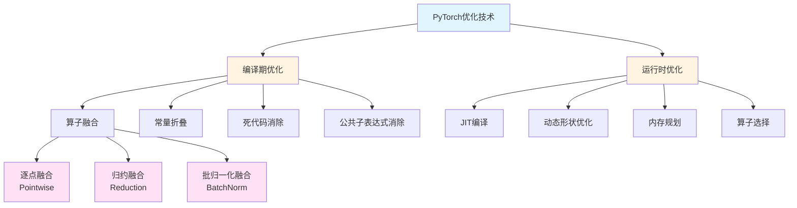
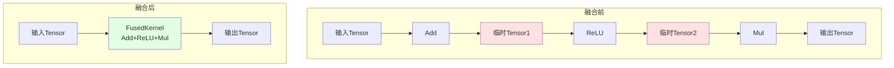
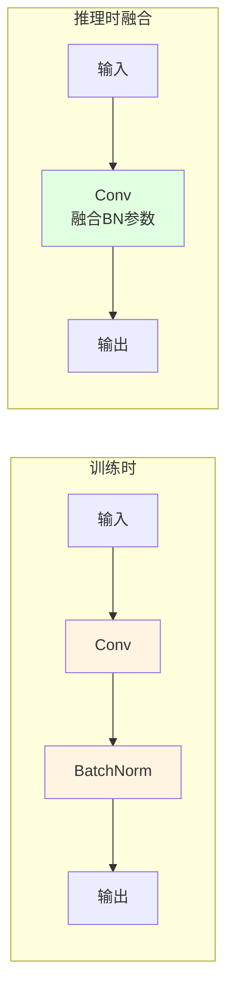
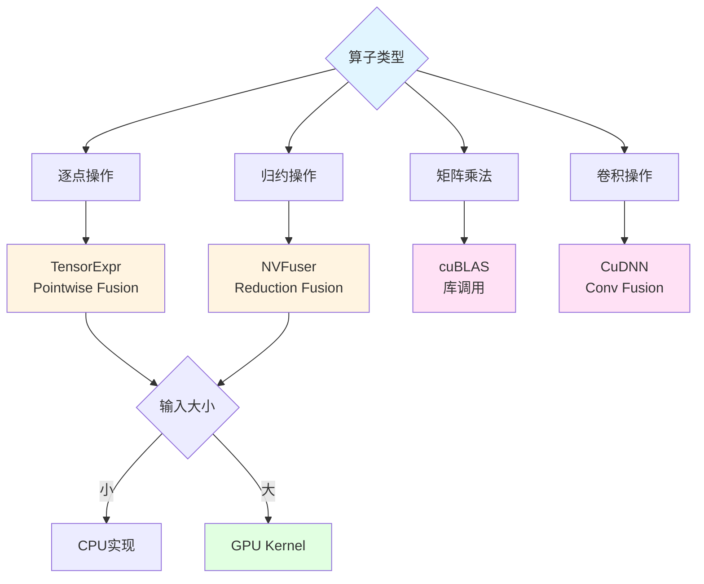
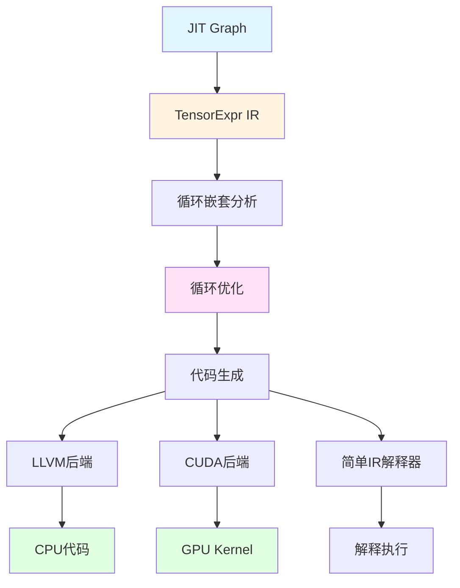
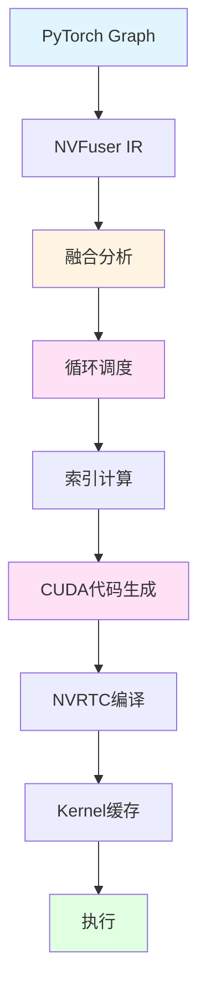
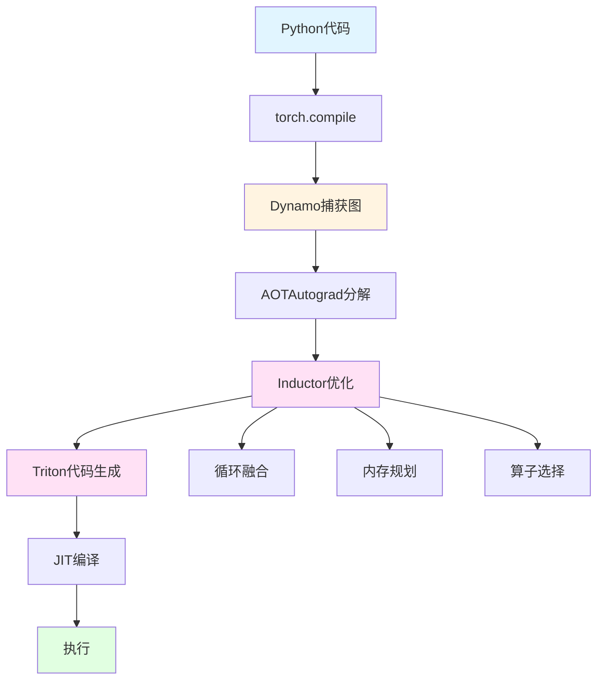
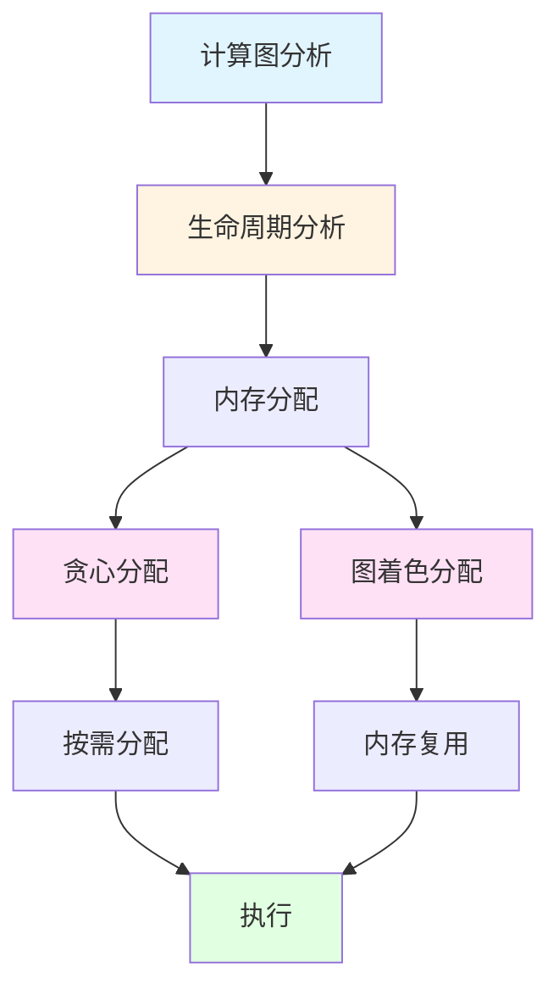
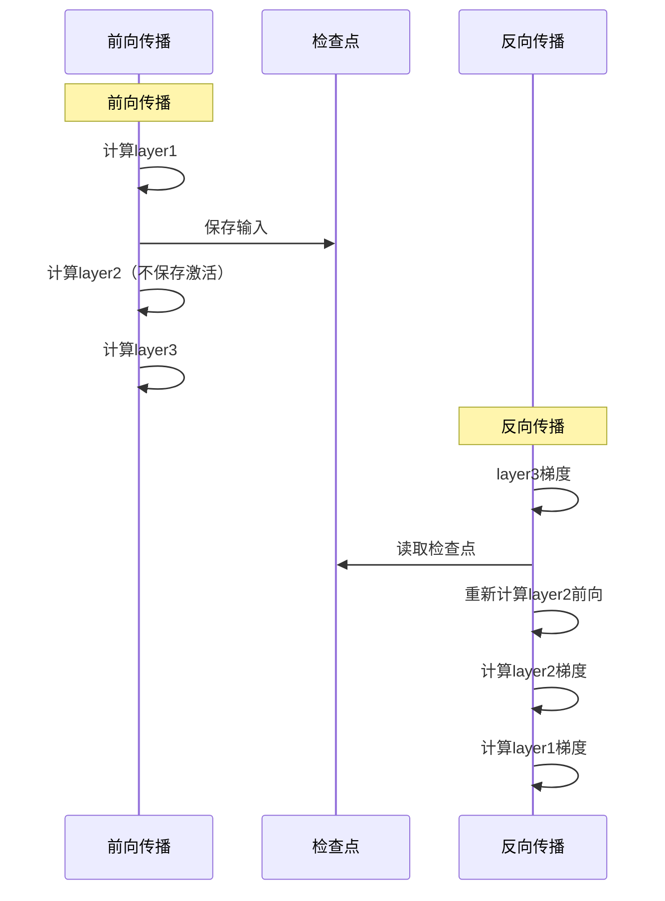

## 1 概述

算子融合是深度学习框架性能优化的关键技术，通过合并多个算子减少内存访问、提高计算效率。PyTorch提供了完整的图优化框架，支持编译期和运行时的算子融合。

### 1.1 为什么需要算子融合

**问题分析**：

```python
# 未融合的计算
x = input + bias          # Kernel 1: 读x, 写临时结果
y = torch.relu(x)         # Kernel 2: 读临时结果, 写y
z = y * scale             # Kernel 3: 读y, 写z

# 内存访问：3次读 + 3次写 = 6次内存访问
# GPU利用率：低（每个kernel单独启动）
```

**融合后的优势**：

```python
# 融合后的计算
z = fused_op(input, bias, scale)  # 一个Kernel完成

# 内存访问：1次读 + 1次写 = 2次内存访问
# GPU利用率：高（单次kernel启动）
# 性能提升：2-3倍
```

### 1.2 优化技术分类



### 1.3 核心组件

| 组件 | 文件路径 | 功能 |
|------|---------|------|
| Graph优化器 | `torch/csrc/jit/passes/` | 图优化Pass |
| Fuser | `torch/csrc/jit/codegen/fuser/` | 算子融合引擎 |
| NNC | `torch/csrc/jit/tensorexpr/` | TensorExpr编译器 |
| NVFuser | `third_party/nvfuser/` | NVIDIA融合器 |
| Inductor | `torch/_inductor/` | 新一代编译器 |

## 2 图优化Pass系统

### 2.1 Pass框架

**文件**: `torch/csrc/jit/passes/pass_manager.h`

```cpp
// Pass是对图的一次转换
using GraphPass = std::function<bool(std::shared_ptr<Graph>&)>;

class PassManager {
public:
    // 注册Pass
    void registerPass(const std::string& name, GraphPass pass) {
        passes_[name] = pass;
    }
    
    // 运行Pass
    bool runPass(const std::string& name, std::shared_ptr<Graph>& graph) {
        auto it = passes_.find(name);
        if (it != passes_.end()) {
            return it->second(graph);
        }
        return false;
    }
    
    // 运行所有Pass
    void runAllPasses(std::shared_ptr<Graph>& graph) {
        bool changed = true;
        while (changed) {
            changed = false;
            for (auto& [name, pass] : passes_) {
                changed |= pass(graph);
            }
        }
    }
    
private:
    std::unordered_map<std::string, GraphPass> passes_;
};
```

### 2.2 常见优化Pass

**1. 常量折叠（Constant Folding）**

```cpp
// 文件: torch/csrc/jit/passes/constant_folding.cpp

bool ConstantFolding(std::shared_ptr<Graph>& graph) {
    bool changed = false;
    
    for (Node* node : graph->nodes()) {
        // 检查所有输入是否为常量
        bool all_inputs_const = true;
        for (Value* input : node->inputs()) {
            if (!toIValue(input)) {
                all_inputs_const = false;
                break;
            }
        }
        
        if (all_inputs_const) {
            // 执行节点计算
            auto outputs = runNode(node);
            
            // 替换节点为常量
            for (size_t i = 0; i < outputs.size(); i++) {
                node->output(i)->replaceAllUsesWith(
                    graph->insertConstant(outputs[i])
                );
            }
            
            // 删除原节点
            node->destroy();
            changed = true;
        }
    }
    
    return changed;
}
```

**示例**：

```python
# 优化前
def forward(x):
    a = 2 + 3          # 常量表达式
    return x * a

# 优化后
def forward(x):
    return x * 5       # 常量折叠为5
```

**2. 死代码消除（Dead Code Elimination）**

```cpp
// 文件: torch/csrc/jit/passes/dead_code_elimination.cpp

bool EliminateDeadCode(std::shared_ptr<Graph>& graph) {
    bool changed = false;
    
    // 标记所有使用的值
    std::unordered_set<Value*> used_values;
    
    // 从输出开始反向遍历
    for (Value* output : graph->outputs()) {
        markUsed(output, used_values);
    }
    
    // 删除未使用的节点
    for (Node* node : graph->nodes()) {
        bool node_used = false;
        for (Value* output : node->outputs()) {
            if (used_values.count(output)) {
                node_used = true;
                break;
            }
        }
        
        if (!node_used && !node->hasSideEffects()) {
            node->destroy();
            changed = true;
        }
    }
    
    return changed;
}
```

**示例**：

```python
# 优化前
def forward(x):
    a = x + 1      # 未使用
    b = x * 2
    c = x - 1      # 未使用
    return b

# 优化后
def forward(x):
    b = x * 2
    return b
```

**3. 公共子表达式消除（CSE）**

```cpp
// 文件: torch/csrc/jit/passes/common_subexpression_elimination.cpp

bool EliminateCommonSubexpression(std::shared_ptr<Graph>& graph) {
    bool changed = false;
    
    // 表达式缓存: hash -> Node
    std::unordered_map<size_t, Node*> expr_cache;
    
    for (Node* node : graph->nodes()) {
        // 计算节点哈希
        size_t hash = hashNode(node);
        
        auto it = expr_cache.find(hash);
        if (it != expr_cache.end()) {
            Node* cached_node = it->second;
            
            // 检查是否完全相同
            if (nodesEqual(node, cached_node)) {
                // 替换使用
                node->replaceAllUsesWith(cached_node);
                node->destroy();
                changed = true;
                continue;
            }
        }
        
        expr_cache[hash] = node;
    }
    
    return changed;
}
```

**示例**：

```python
# 优化前
def forward(x, y):
    a = x + y
    b = x * 2
    c = x + y      # 重复计算
    return a + b + c

# 优化后
def forward(x, y):
    a = x + y
    b = x * 2
    return a + b + a  # 复用a
```

### 2.3 优化Pass流水线


## 3 算子融合

### 3.1 逐点融合（Pointwise Fusion）

**原理**：融合逐元素操作，减少内存往返。



**实现**: `torch/csrc/jit/codegen/fuser/kernel_cache.cpp`

```cpp
class FusionGroup {
public:
    // 判断节点是否可融合
    static bool canFuse(Node* node) {
        static const std::unordered_set<Symbol> fusible_ops = {
            aten::add,
            aten::mul,
            aten::sub,
            aten::div,
            aten::relu,
            aten::sigmoid,
            aten::tanh,
            aten::exp,
            aten::log,
            // ... 更多逐点操作
        };
        
        return fusible_ops.count(node->kind()) > 0;
    }
    
    // 创建融合组
    static Node* createFusionGroup(Graph* graph, ArrayRef<Node*> nodes) {
        // 创建子图
        auto subgraph = std::make_shared<Graph>();
        
        // 将节点复制到子图
        std::unordered_map<Value*, Value*> value_map;
        for (Node* node : nodes) {
            Node* new_node = subgraph->createClone(node, value_map);
            subgraph->appendNode(new_node);
        }
        
        // 创建融合节点
        Node* fusion_node = graph->create(prim::FusionGroup);
        fusion_node->g_(attr::Subgraph, subgraph);
        
        return fusion_node;
    }
    
    // 融合Pass
    static bool fuseOps(std::shared_ptr<Graph>& graph) {
        bool changed = false;
        
        // 查找可融合的节点序列
        for (Node* node : graph->nodes()) {
            if (!canFuse(node)) continue;
            
            std::vector<Node*> fusion_group = {node};
            
            // 向前扩展融合组
            for (Node* user : node->output()->uses()) {
                if (canFuse(user.user)) {
                    fusion_group.push_back(user.user);
                }
            }
            
            // 创建融合节点
            if (fusion_group.size() > 1) {
                Node* fused = createFusionGroup(graph.get(), fusion_group);
                graph->insertNode(fused);
                
                // 删除原节点
                for (Node* n : fusion_group) {
                    n->destroy();
                }
                
                changed = true;
            }
        }
        
        return changed;
    }
};
```

### 3.2 批归一化融合

**融合模式**：Conv + BN



**数学原理**：

```
# BatchNorm公式
y = γ * (x - μ) / √(σ² + ε) + β

# Conv公式
x = W * input + b

# 融合后
y = γ * (W * input + b - μ) / √(σ² + ε) + β
  = (γ * W / √(σ² + ε)) * input + (γ * (b - μ) / √(σ² + ε) + β)
  = W' * input + b'

# 其中
W' = γ * W / √(σ² + ε)
b' = γ * (b - μ) / √(σ² + ε) + β
```

**实现**: `torch/nn/utils/fusion.py`

```python
def fuse_conv_bn_eval(conv, bn):
    """融合Conv和BatchNorm（推理模式）"""
    assert not (conv.training or bn.training), "仅支持推理模式"
    
    # 获取参数
    conv_w = conv.weight
    conv_b = conv.bias if conv.bias is not None else torch.zeros_like(bn.running_mean)
    
    bn_running_mean = bn.running_mean
    bn_running_var = bn.running_var
    bn_eps = bn.eps
    bn_weight = bn.weight if bn.weight is not None else torch.ones_like(bn.running_mean)
    bn_bias = bn.bias if bn.bias is not None else torch.zeros_like(bn.running_mean)
    
    # 计算融合参数
    # W' = γ * W / √(σ² + ε)
    bn_var_rsqrt = torch.rsqrt(bn_running_var + bn_eps)
    
    # 形状调整用于广播
    shape = [conv.out_channels] + [1] * (conv_w.dim() - 1)
    
    fused_weight = conv_w * (bn_weight * bn_var_rsqrt).view(shape)
    
    # b' = γ * (b - μ) / √(σ² + ε) + β
    fused_bias = (conv_b - bn_running_mean) * bn_weight * bn_var_rsqrt + bn_bias
    
    # 创建融合后的Conv
    fused_conv = nn.Conv2d(
        conv.in_channels,
        conv.out_channels,
        conv.kernel_size,
        conv.stride,
        conv.padding,
        conv.dilation,
        conv.groups,
        bias=True
    )
    
    fused_conv.weight = nn.Parameter(fused_weight)
    fused_conv.bias = nn.Parameter(fused_bias)
    
    return fused_conv
```

### 3.3 LSTM融合

**融合模式**：多个矩阵乘法 + 激活函数

```python
# 未融合的LSTM单元
def lstm_cell(x, h, c, W_i, W_h, b):
    # 4个门的计算
    gates = x @ W_i + h @ W_h + b  # 矩阵乘法
    
    i, f, g, o = gates.chunk(4, dim=1)  # 切分
    
    i = torch.sigmoid(i)    # 输入门
    f = torch.sigmoid(f)    # 遗忘门
    g = torch.tanh(g)       # 候选值
    o = torch.sigmoid(o)    # 输出门
    
    c_new = f * c + i * g   # 新的细胞状态
    h_new = o * torch.tanh(c_new)  # 新的隐藏状态
    
    return h_new, c_new

# 融合后的LSTM（CuDNN实现）
h_new, c_new = torch._cudnn_rnn(
    x, [h, c], params, has_biases=True,
    num_layers=1, dropout=0, train=False, bidirectional=False
)
```

**性能提升**：
- 未融合：~10 TFlops
- 融合后：~40 TFlops（CuDNN优化）
- 提升：4倍

### 3.4 融合策略选择



## 4 TensorExpr编译器

### 4.1 TensorExpr架构

**文件**: `torch/csrc/jit/tensorexpr/`



### 4.2 TensorExpr IR

```cpp
// 文件: torch/csrc/jit/tensorexpr/ir.h

class Expr {
public:
    virtual ~Expr() = default;
};

// 变量
class Var : public Expr {
public:
    Var(const std::string& name, Dtype dtype)
        : name_(name), dtype_(dtype) {}
    
private:
    std::string name_;
    Dtype dtype_;
};

// 二元操作
class BinOp : public Expr {
public:
    enum OpKind { Add, Sub, Mul, Div, Mod, Max, Min };
    
    BinOp(OpKind op, ExprPtr lhs, ExprPtr rhs)
        : op_(op), lhs_(lhs), rhs_(rhs) {}
    
private:
    OpKind op_;
    ExprPtr lhs_, rhs_;
};

// 循环
class For : public Stmt {
public:
    For(VarPtr var, ExprPtr start, ExprPtr stop, StmtPtr body)
        : var_(var), start_(start), stop_(stop), body_(body) {}
    
private:
    VarPtr var_;
    ExprPtr start_, stop_;
    StmtPtr body_;
};

// 存储
class Store : public Stmt {
public:
    Store(BufPtr buf, std::vector<ExprPtr> indices, ExprPtr value)
        : buf_(buf), indices_(indices), value_(value) {}
    
private:
    BufPtr buf_;
    std::vector<ExprPtr> indices_;
    ExprPtr value_;
};
```

### 4.3 循环优化

**1. 循环展开（Loop Unrolling）**

```cpp
// 优化前
for (int i = 0; i < 4; i++) {
    c[i] = a[i] + b[i];
}

// 优化后
c[0] = a[0] + b[0];
c[1] = a[1] + b[1];
c[2] = a[2] + b[2];
c[3] = a[3] + b[3];
```

**2. 循环分块（Loop Tiling）**

```cpp
// 优化前
for (int i = 0; i < 1024; i++) {
    for (int j = 0; j < 1024; j++) {
        C[i][j] += A[i][j] * B[i][j];
    }
}

// 优化后（分块以利用缓存）
const int TILE = 32;
for (int ii = 0; ii < 1024; ii += TILE) {
    for (int jj = 0; jj < 1024; jj += TILE) {
        for (int i = ii; i < ii + TILE; i++) {
            for (int j = jj; j < jj + TILE; j++) {
                C[i][j] += A[i][j] * B[i][j];
            }
        }
    }
}
```

**3. 向量化（Vectorization）**

```cpp
// 优化前
for (int i = 0; i < n; i++) {
    c[i] = a[i] + b[i];
}

// 优化后（使用SIMD指令）
for (int i = 0; i < n; i += 8) {
    __m256 va = _mm256_loadu_ps(&a[i]);
    __m256 vb = _mm256_loadu_ps(&b[i]);
    __m256 vc = _mm256_add_ps(va, vb);
    _mm256_storeu_ps(&c[i], vc);
}
```

### 4.4 代码生成示例

```cpp
// 文件: torch/csrc/jit/tensorexpr/codegen.cpp

class CodeGen {
public:
    // 生成逐点融合kernel
    std::string generatePointwiseKernel(
        const std::vector<ExprPtr>& exprs,
        const std::vector<BufPtr>& inputs,
        const BufPtr& output
    ) {
        std::ostringstream code;
        
        // CUDA kernel头
        code << "__global__ void fused_kernel(\n";
        for (size_t i = 0; i < inputs.size(); i++) {
            code << "    const float* input" << i << ",\n";
        }
        code << "    float* output,\n";
        code << "    int n) {\n";
        
        // 线程索引
        code << "    int idx = blockIdx.x * blockDim.x + threadIdx.x;\n";
        code << "    if (idx < n) {\n";
        
        // 加载输入
        for (size_t i = 0; i < inputs.size(); i++) {
            code << "        float v" << i << " = input" << i << "[idx];\n";
        }
        
        // 计算表达式
        code << "        float result = ";
        code << exprToString(exprs[0]) << ";\n";
        
        // 存储输出
        code << "        output[idx] = result;\n";
        code << "    }\n";
        code << "}\n";
        
        return code.str();
    }
};
```

## 5 NVFuser

### 5.1 NVFuser架构

NVFuser是NVIDIA专门为PyTorch开发的GPU融合器，支持更复杂的融合模式。

**文件**: `third_party/nvfuser/`



### 5.2 支持的融合模式

**1. 广播融合**

```python
# 支持不同形状的张量融合
a = torch.randn(1024, 1)      # [1024, 1]
b = torch.randn(1, 512)       # [1, 512]
c = a + b                      # 广播到 [1024, 512]
# NVFuser自动生成高效的广播kernel
```

**2. 归约融合**

```python
# 融合归约操作
x = torch.randn(1024, 1024)
y = (x * 2 + 1).sum(dim=1)    # 融合 mul, add, sum
# 单个kernel完成所有操作
```

**3. Softmax融合**

```python
# 完整的softmax融合
def softmax_fused(x):
    # 融合: exp, sum, div
    exp_x = torch.exp(x - x.max(dim=-1, keepdim=True)[0])
    return exp_x / exp_x.sum(dim=-1, keepdim=True)
```

### 5.3 调度策略

```cpp
// 文件: third_party/nvfuser/csrc/scheduler/

class ReductionScheduler {
public:
    // 归约调度策略
    static void schedule(Fusion* fusion) {
        // 1. 分析归约维度
        auto reduction_tvs = findReductionTensors(fusion);
        
        // 2. 计算线程块配置
        const int threads_per_block = 256;
        const int blocks = ceilDiv(size, threads_per_block);
        
        // 3. 分配共享内存
        for (auto tv : reduction_tvs) {
            tv->split(0, threads_per_block);
            tv->axis(0)->parallelize(ParallelType::BIDx);
            tv->axis(1)->parallelize(ParallelType::TIDx);
            
            // 使用共享内存进行归约
            tv->setMemoryType(MemoryType::Shared);
        }
        
        // 4. 插入同步点
        insertSync(fusion);
    }
};
```

### 5.4 使用示例

```python
import torch

# 启用NVFuser
torch._C._jit_set_nvfuser_enabled(True)

@torch.jit.script
def fused_ops(x: torch.Tensor, y: torch.Tensor) -> torch.Tensor:
    # 这些操作会被NVFuser融合
    z = x * 2.0
    z = z + y
    z = torch.relu(z)
    z = z / z.sum()
    return z

# 编译和执行
x = torch.randn(1024, 1024, device='cuda')
y = torch.randn(1024, 1024, device='cuda')

# 第一次运行会触发编译
output = fused_ops(x, y)

# 后续运行使用缓存的kernel
output = fused_ops(x, y)
```

## 6 Inductor编译器

### 6.1 Inductor概述

Inductor是PyTorch 2.0引入的新一代编译器，基于Triton语言。

**特点**：
- 完全Python实现，易于调试
- 基于Triton，生成高效GPU代码
- 支持动态形状
- 集成到torch.compile

### 6.2 Inductor工作流程



### 6.3 Triton代码生成

**文件**: `torch/_inductor/codegen/triton.py`

```python
class TritonKernel:
    """生成Triton kernel代码"""
    
    def codegen_pointwise(self, nodes):
        """生成逐点融合kernel"""
        code = []
        
        # Kernel签名
        code.append("@triton.jit")
        code.append("def fused_kernel(")
        for i, inp in enumerate(self.inputs):
            code.append(f"    in{i}_ptr,")
        code.append(f"    out_ptr,")
        code.append(f"    n_elements,")
        code.append(f"    BLOCK_SIZE: tl.constexpr")
        code.append("):")
        
        # 计算索引
        code.append("    pid = tl.program_id(0)")
        code.append("    block_start = pid * BLOCK_SIZE")
        code.append("    offsets = block_start + tl.arange(0, BLOCK_SIZE)")
        code.append("    mask = offsets < n_elements")
        
        # 加载输入
        for i, inp in enumerate(self.inputs):
            code.append(f"    in{i} = tl.load(in{i}_ptr + offsets, mask=mask)")
        
        # 计算
        expr = self.generate_expr(nodes)
        code.append(f"    out = {expr}")
        
        # 存储输出
        code.append("    tl.store(out_ptr + offsets, out, mask=mask)")
        
        return "\n".join(code)
    
    def generate_expr(self, nodes):
        """生成计算表达式"""
        if len(nodes) == 1:
            node = nodes[0]
            if node.op == "add":
                return f"in0 + in1"
            elif node.op == "mul":
                return f"in0 * in1"
            elif node.op == "relu":
                return f"tl.maximum(in0, 0.0)"
        
        # 递归生成复杂表达式
        # ...
```

### 6.4 torch.compile使用

```python
import torch

# 方式1: 装饰器
@torch.compile
def foo(x, y):
    z = x + y
    z = torch.relu(z)
    z = z * 2
    return z

# 方式2: 函数包装
def bar(x, y):
    return x + y

bar_compiled = torch.compile(bar)

# 方式3: 模块编译
model = MyModel()
model_compiled = torch.compile(model)

# 执行
x = torch.randn(1024, 1024, device='cuda')
y = torch.randn(1024, 1024, device='cuda')

# 首次运行触发编译
output = foo(x, y)

# 后续运行使用编译后的代码
output = foo(x, y)
```

### 6.5 编译选项

```python
# 不同的编译模式
model = torch.compile(
    model,
    mode="default"      # 平衡编译时间和性能
    # mode="reduce-overhead"  # 减少Python开销
    # mode="max-autotune"     # 最大化性能（编译慢）
)

# 自定义后端
model = torch.compile(
    model,
    backend="inductor"  # 默认
    # backend="aot_eager"     # AOT Autograd + Eager
    # backend="cudagraphs"    # CUDA Graphs
)

# 动态形状
model = torch.compile(
    model,
    dynamic=True  # 支持动态输入形状
)
```

## 7 内存优化

### 7.1 内存规划



**生命周期分析**：

```cpp
// 文件: torch/csrc/jit/passes/liveness.cpp

class LivenessAnalysis {
public:
    // 分析张量的生命周期
    std::unordered_map<Value*, LiveRange> analyze(Graph* graph) {
        std::unordered_map<Value*, LiveRange> ranges;
        
        int time = 0;
        for (Node* node : graph->nodes()) {
            // 输入张量的使用时间
            for (Value* input : node->inputs()) {
                ranges[input].last_use = time;
            }
            
            // 输出张量的创建时间
            for (Value* output : node->outputs()) {
                ranges[output].first_def = time;
            }
            
            time++;
        }
        
        return ranges;
    }
    
    // 内存复用
    void reuseMemory(Graph* graph) {
        auto ranges = analyze(graph);
        
        // 按大小排序
        std::vector<Value*> values;
        for (auto& [val, _] : ranges) {
            values.push_back(val);
        }
        
        std::sort(values.begin(), values.end(), [](Value* a, Value* b) {
            return a->type()->expect<TensorType>()->sizes()[0] >
                   b->type()->expect<TensorType>()->sizes()[0];
        });
        
        // 分配内存池
        std::vector<MemoryPool> pools;
        
        for (Value* val : values) {
            auto& range = ranges[val];
            
            // 查找可复用的池
            MemoryPool* pool = nullptr;
            for (auto& p : pools) {
                if (p.canReuse(range)) {
                    pool = &p;
                    break;
                }
            }
            
            // 创建新池
            if (!pool) {
                pools.emplace_back();
                pool = &pools.back();
            }
            
            pool->allocate(val, range);
        }
    }
};
```

### 7.2 原地操作优化

```python
# 未优化
def forward(x):
    x = x + 1      # 分配新内存
    x = x * 2      # 分配新内存
    x = x - 1      # 分配新内存
    return x

# 优化为原地操作
def forward(x):
    x.add_(1)      # 原地操作
    x.mul_(2)      # 原地操作
    x.sub_(1)      # 原地操作
    return x
```

**自动原地化**：

```cpp
// 文件: torch/csrc/jit/passes/inplace_check.cpp

bool canMakeInplace(Node* node) {
    // 检查输出是否只有一个使用者
    if (node->output()->uses().size() != 1) {
        return false;
    }
    
    // 检查输入是否还会被使用
    Value* input = node->input(0);
    for (auto& use : input->uses()) {
        if (use.user != node && use.offset > node->offset()) {
            return false;
        }
    }
    
    return true;
}
```

### 7.3 梯度检查点

```python
# 使用检查点减少内存
from torch.utils.checkpoint import checkpoint

class MyModel(nn.Module):
    def __init__(self):
        super().__init__()
        self.layer1 = nn.Linear(1000, 1000)
        self.layer2 = nn.Linear(1000, 1000)
        self.layer3 = nn.Linear(1000, 1000)
    
    def forward(self, x):
        # 不保存layer1和layer2的中间激活
        x = checkpoint(self._forward_block, x)
        x = self.layer3(x)
        return x
    
    def _forward_block(self, x):
        x = self.layer1(x)
        x = torch.relu(x)
        x = self.layer2(x)
        x = torch.relu(x)
        return x
```

**工作原理**：



## 8 性能分析工具

### 8.1 PyTorch Profiler

```python
from torch.profiler import profile, ProfilerActivity

with profile(
    activities=[
        ProfilerActivity.CPU,
        ProfilerActivity.CUDA,
    ],
    record_shapes=True,
    profile_memory=True,
    with_stack=True,
) as prof:
    model(inputs)

# 查看结果
print(prof.key_averages().table(
    sort_by="cuda_time_total",
    row_limit=10
))

# 导出Chrome trace
prof.export_chrome_trace("trace.json")

# 导出内存时间线
prof.export_memory_timeline("memory.html")
```

### 8.2 算子性能分析

```python
# 分析单个算子
import torch.utils.benchmark as benchmark

def benchmark_op(op, *args):
    t = benchmark.Timer(
        stmt='op(*args)',
        globals={'op': op, 'args': args}
    )
    
    return t.blocked_autorange(min_run_time=1)

# 对比不同实现
x = torch.randn(1024, 1024, device='cuda')

# 未融合
result1 = benchmark_op(lambda x: torch.relu(x + 1), x)
print(f"未融合: {result1}")

# 融合
@torch.jit.script
def fused(x):
    return torch.relu(x + 1)

result2 = benchmark_op(fused, x)
print(f"融合: {result2}")
```

### 8.3 内存分析

```python
import torch.cuda

# 记录内存历史
torch.cuda.memory._record_memory_history(
    enabled='all',
    context='all',
)

# 运行模型
model(inputs)

# 导出内存快照
torch.cuda.memory._dump_snapshot("memory_snapshot.pickle")

# 停止记录
torch.cuda.memory._record_memory_history(enabled=None)
```

## 9 实战案例

### 9.1 手动融合优化

```python
# 优化前：分离的操作
class NaiveGELU(nn.Module):
    def forward(self, x):
        # GELU(x) = 0.5 * x * (1 + tanh(sqrt(2/π) * (x + 0.044715 * x^3)))
        a = 0.5 * x
        b = 1 + torch.tanh(
            0.7978845608 * (x + 0.044715 * x * x * x)
        )
        return a * b

# 优化后：融合kernel
@torch.jit.script
def gelu_fused(x):
    return 0.5 * x * (
        1.0 + torch.tanh(
            0.7978845608 * (x + 0.044715 * x * x * x)
        )
    )

# 进一步优化：使用Triton
import triton
import triton.language as tl

@triton.jit
def gelu_kernel(
    x_ptr, out_ptr,
    n_elements,
    BLOCK_SIZE: tl.constexpr,
):
    pid = tl.program_id(0)
    block_start = pid * BLOCK_SIZE
    offsets = block_start + tl.arange(0, BLOCK_SIZE)
    mask = offsets < n_elements
    
    x = tl.load(x_ptr + offsets, mask=mask)
    
    # 内联计算GELU
    x_cubed = x * x * x
    inner = 0.7978845608 * (x + 0.044715 * x_cubed)
    tanh_inner = tl.libdevice.tanh(inner)
    out = 0.5 * x * (1.0 + tanh_inner)
    
    tl.store(out_ptr + offsets, out, mask=mask)

def gelu_triton(x):
    output = torch.empty_like(x)
    n_elements = x.numel()
    
    grid = lambda meta: (triton.cdiv(n_elements, meta['BLOCK_SIZE']),)
    
    gelu_kernel[grid](
        x, output, n_elements,
        BLOCK_SIZE=1024
    )
    
    return output
```

### 9.2 Transformer优化

```python
class OptimizedTransformerBlock(nn.Module):
    def __init__(self, d_model, nhead):
        super().__init__()
        self.attn = nn.MultiheadAttention(d_model, nhead)
        self.norm1 = nn.LayerNorm(d_model)
        self.norm2 = nn.LayerNorm(d_model)
        self.ff = nn.Sequential(
            nn.Linear(d_model, 4 * d_model),
            nn.GELU(),
            nn.Linear(4 * d_model, d_model)
        )
    
    def forward(self, x):
        # 融合: attention + residual + norm
        x = self.norm1(x + self.attn(x, x, x)[0])
        
        # 融合: feedforward + residual + norm
        x = self.norm2(x + self.ff(x))
        
        return x

# 使用torch.compile自动优化
model = OptimizedTransformerBlock(512, 8).cuda()
model_compiled = torch.compile(model, mode="max-autotune")

# 性能对比
x = torch.randn(32, 128, 512, device='cuda')

# 未优化
with torch.no_grad():
    %timeit model(x)

# 优化后
with torch.no_grad():
    %timeit model_compiled(x)
```

### 9.3 自定义融合Pass

```python
# 自定义优化Pass
from torch.fx import symbolic_trace, GraphModule
from torch.fx.passes.infra.pass_base import PassBase

class CustomFusionPass(PassBase):
    def call(self, graph_module: GraphModule) -> GraphModule:
        graph = graph_module.graph
        
        # 查找模式: add -> relu
        for node in graph.nodes:
            if node.op == 'call_function' and node.target == torch.relu:
                prev_node = node.args[0]
                
                if (isinstance(prev_node, torch.fx.Node) and
                    prev_node.op == 'call_function' and
                    prev_node.target == torch.add):
                    
                    # 替换为融合操作
                    with graph.inserting_after(node):
                        fused_node = graph.call_function(
                            self.fused_add_relu,
                            args=prev_node.args
                        )
                        node.replace_all_uses_with(fused_node)
                    
                    graph.erase_node(node)
                    graph.erase_node(prev_node)
        
        graph.lint()
        graph_module.recompile()
        return graph_module
    
    @staticmethod
    @torch.jit.script
    def fused_add_relu(x, y):
        return torch.relu(x + y)

# 使用Pass
model = MyModel()
traced = symbolic_trace(model)

pass_instance = CustomFusionPass()
optimized = pass_instance(traced)
```

## 10 最佳实践

### 10.1 融合优化指南

1. **识别热点**：使用Profiler找到耗时操作
2. **选择策略**：
   - 逐点操作 → TensorExpr/Inductor
   - 归约操作 → NVFuser
   - 特殊模式 → 手动优化
3. **验证正确性**：对比融合前后的数值精度
4. **测量性能**：使用benchmark量化提升

### 10.2 常见陷阱

```python
# 错误：过度融合导致寄存器溢出
@torch.jit.script
def bad_fusion(x):
    # 太多中间变量
    y1 = x * 1
    y2 = x * 2
    # ... 100个中间变量
    y100 = x * 100
    return y1 + y2 + ... + y100

# 正确：适度融合
@torch.jit.script
def good_fusion(x):
    result = torch.zeros_like(x)
    for i in range(100):
        result += x * i
    return result
```

### 10.3 性能调优清单

- [ ] 使用torch.compile启用自动优化
- [ ] Profile识别瓶颈
- [ ] 融合逐点操作
- [ ] 使用原地操作减少内存
- [ ] 启用混合精度
- [ ] 使用梯度检查点（大模型）
- [ ] 考虑cuDNN/cuBLAS库函数
- [ ] 验证数值稳定性

---