## 1 概述

分布式训练是大规模深度学习的关键技术，PyTorch提供了完整的分布式训练框架，支持数据并行、模型并行、流水线并行等多种并行策略。

### 1.1 为什么需要分布式训练

**单机训练的瓶颈**：
- **内存限制**：大模型参数无法放入单GPU
- **计算瓶颈**：训练时间过长
- **数据规模**：海量数据需要并行处理
- **吞吐量**：单卡无法满足生产需求

**分布式训练的优势**：
- **加速训练**：线性扩展到多卡/多机
- **支持大模型**：参数切分到多设备
- **提高吞吐**：并行处理更多数据
- **容错性**：支持节点故障恢复

### 1.2 PyTorch分布式架构

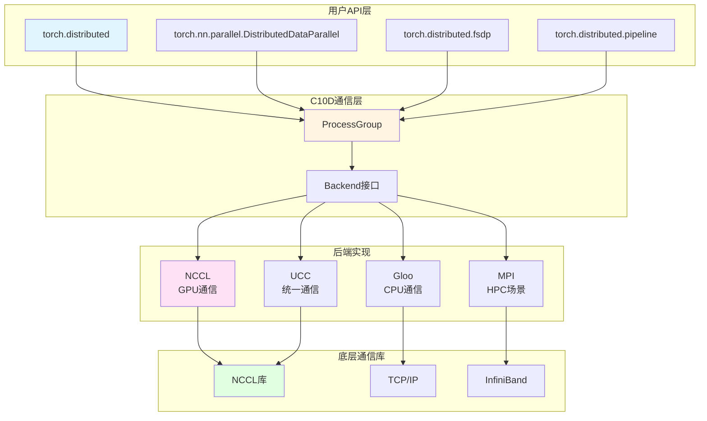

### 1.3 核心组件

| 组件 | 文件路径 | 功能 |
|------|---------|------|
| ProcessGroup | `torch/csrc/distributed/c10d/ProcessGroup.hpp` | 进程组抽象 |
| Store | `torch/csrc/distributed/c10d/Store.hpp` | 分布式KV存储 |
| DDP | `torch/nn/parallel/distributed.py` | 数据并行 |
| FSDP | `torch/distributed/fsdp/` | 全分片数据并行 |
| RPC | `torch/csrc/distributed/rpc/` | 远程过程调用 |
| Reducer | `torch/csrc/distributed/c10d/reducer.cpp` | 梯度同步 |

## 2 C10D通信库

### 2.1 C10D架构

C10D (Collective Communications for Distributed) 是PyTorch分布式通信的核心层。


**设计原则**：
- 后端无关的统一API
- 异步通信支持
- 多后端并存
- 灵活的进程组管理

### 2.2 ProcessGroup核心

**文件**: `torch/csrc/distributed/c10d/ProcessGroup.hpp`

```cpp
class ProcessGroup : public torch::CustomClassHolder {
public:
    // 后端类型
    enum BackendType {
        UNDEFINED = 0,
        GLOO = 1,      // CPU通信
        NCCL = 2,      // NVIDIA GPU通信
        UCC = 3,       // 统一通信
        MPI = 4,       // MPI通信
        CUSTOM = 6,    // 自定义后端
    };
    
    // 构造函数
    ProcessGroup(
        c10::intrusive_ptr<Store> store,
        int rank,      // 当前进程rank
        int size       // 总进程数
    );
    
    // 基本信息
    virtual int getRank() const;
    virtual int getSize() const;
    
    // 集合通信操作（返回Work对象）
    virtual c10::intrusive_ptr<Work> allreduce(
        std::vector<at::Tensor>& tensors,
        const AllreduceOptions& opts = AllreduceOptions()
    ) = 0;
    
    virtual c10::intrusive_ptr<Work> broadcast(
        std::vector<at::Tensor>& tensors,
        const BroadcastOptions& opts = BroadcastOptions()
    ) = 0;
    
    virtual c10::intrusive_ptr<Work> reduce(
        std::vector<at::Tensor>& tensors,
        const ReduceOptions& opts = ReduceOptions()
    ) = 0;
    
    virtual c10::intrusive_ptr<Work> allgather(
        std::vector<std::vector<at::Tensor>>& outputs,
        std::vector<at::Tensor>& inputs,
        const AllgatherOptions& opts = AllgatherOptions()
    ) = 0;
    
    virtual c10::intrusive_ptr<Work> scatter(
        std::vector<at::Tensor>& outputs,
        std::vector<std::vector<at::Tensor>>& inputs,
        const ScatterOptions& opts = ScatterOptions()
    ) = 0;
    
    virtual c10::intrusive_ptr<Work> reduce_scatter(
        std::vector<at::Tensor>& outputs,
        std::vector<std::vector<at::Tensor>>& inputs,
        const ReduceScatterOptions& opts = ReduceScatterOptions()
    ) = 0;
    
    virtual c10::intrusive_ptr<Work> send(
        std::vector<at::Tensor>& tensors,
        int dstRank,
        int tag
    ) = 0;
    
    virtual c10::intrusive_ptr<Work> recv(
        std::vector<at::Tensor>& tensors,
        int srcRank,
        int tag
    ) = 0;
    
protected:
    c10::intrusive_ptr<Store> store_;
    int rank_;
    int size_;
};
```

### 2.3 Work对象

Work表示一个异步操作：

```cpp
class Work : public torch::CustomClassHolder {
public:
    // 等待操作完成
    virtual bool wait(std::chrono::milliseconds timeout);
    
    // 检查是否完成
    virtual bool isCompleted();
    
    // 获取结果
    virtual std::vector<at::Tensor> result();
    
    // 异常处理
    virtual std::exception_ptr exception();
    
    // 取消操作
    virtual void abort();
    
protected:
    // 完成标志
    std::atomic<bool> completed_{false};
    
    // 异常指针
    std::exception_ptr exception_;
    
    // 条件变量（用于等待）
    std::condition_variable cv_;
    std::mutex mutex_;
};
```

### 2.4 集合通信操作

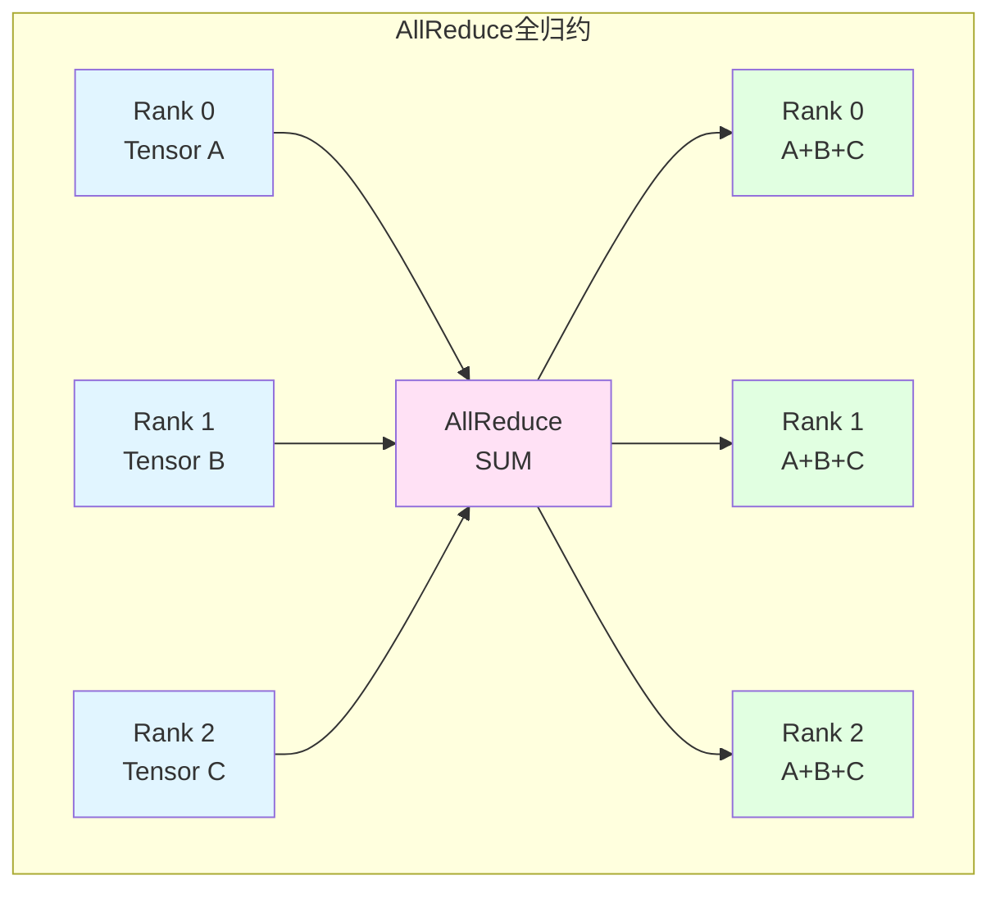

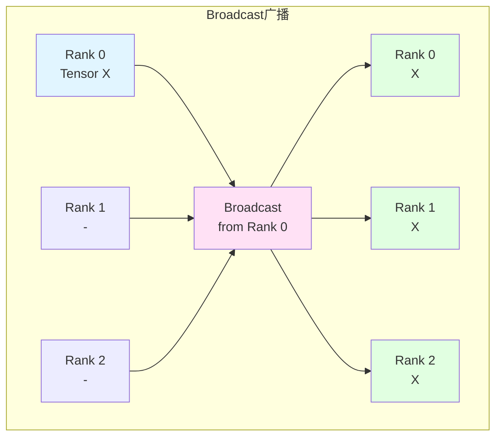

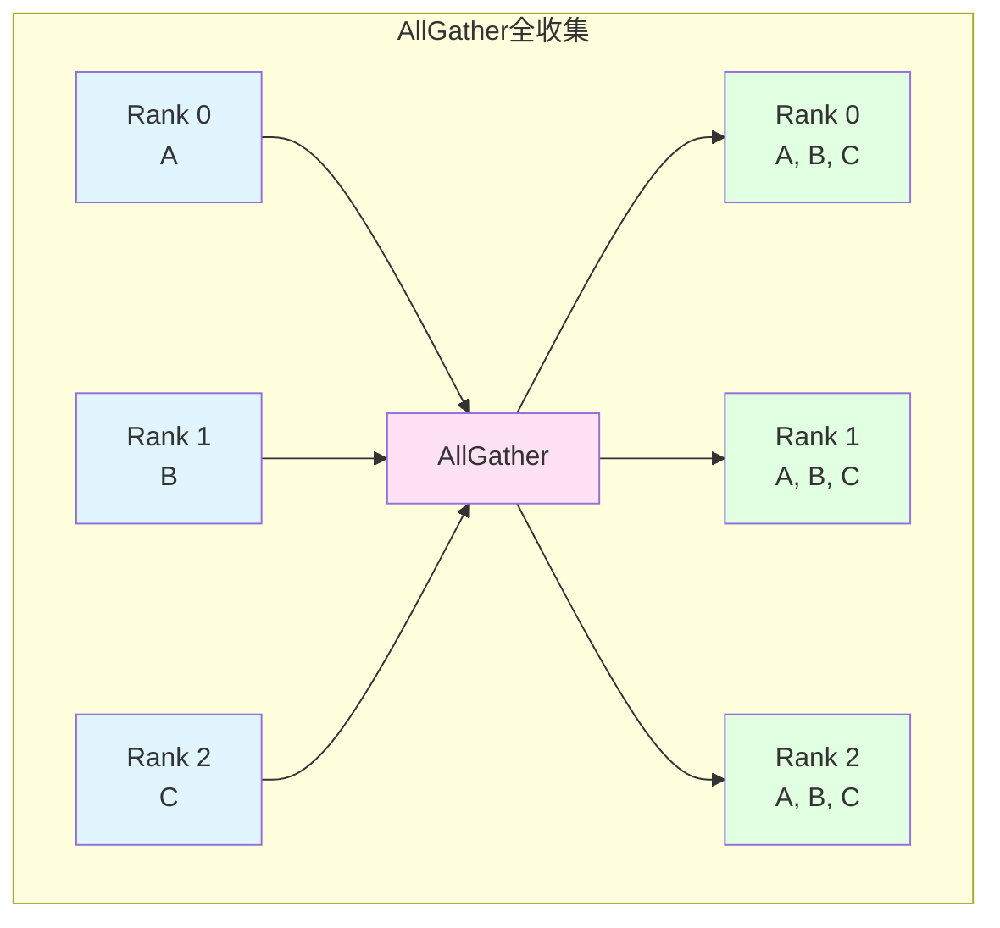

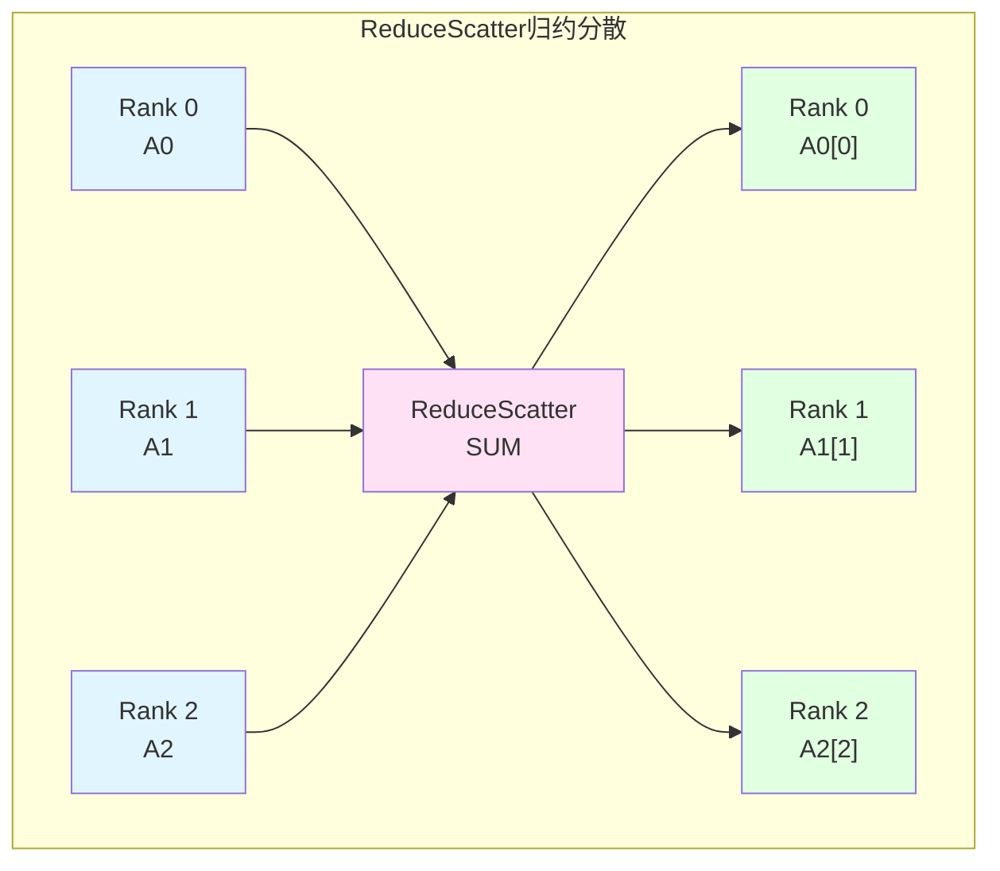

### 2.5 Store分布式存储

**文件**: `torch/csrc/distributed/c10d/Store.hpp`

```cpp
class Store : public torch::CustomClassHolder {
public:
    // KV存储操作
    virtual void set(const std::string& key, const std::vector<uint8_t>& value) = 0;
    virtual std::vector<uint8_t> get(const std::string& key) = 0;
    
    // 原子操作
    virtual int64_t add(const std::string& key, int64_t value) = 0;
    virtual int64_t compareSet(
        const std::string& key,
        const std::vector<uint8_t>& expectedValue,
        const std::vector<uint8_t>& desiredValue
    ) = 0;
    
    // 等待操作
    virtual void wait(const std::vector<std::string>& keys) = 0;
    virtual void wait(
        const std::vector<std::string>& keys,
        const std::chrono::milliseconds& timeout
    ) = 0;
    
    // 删除操作
    virtual bool deleteKey(const std::string& key) = 0;
    virtual bool check(const std::vector<std::string>& keys) = 0;
};
```

**Store实现**：

1. **TCPStore** - 基于TCP的分布式KV存储
2. **FileStore** - 基于文件系统
3. **HashStore** - 本地哈希表（单进程）
4. **PrefixStore** - 带前缀的Store包装

**TCPStore工作流程**：

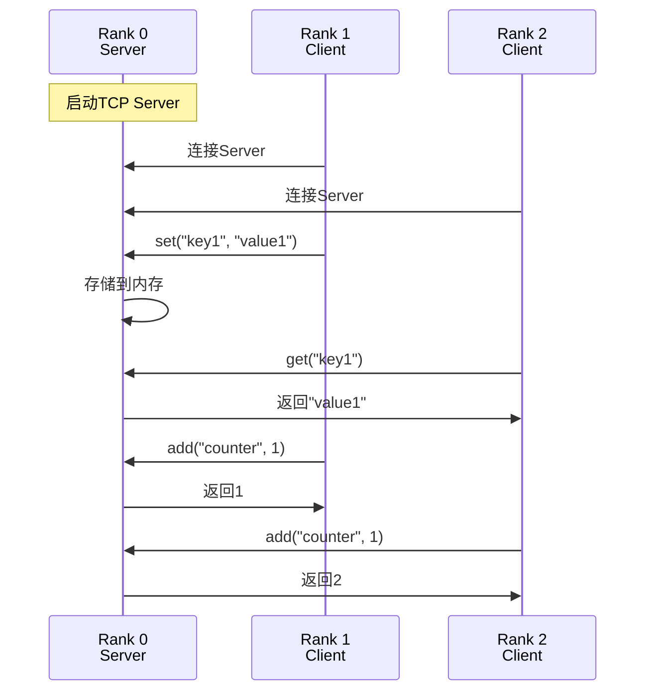

## 3 后端实现

### 3.1 NCCL后端

**NCCL** (NVIDIA Collective Communications Library) 是GPU间高性能通信库。

**文件**: `torch/csrc/distributed/c10d/ProcessGroupNCCL.cpp`

```cpp
class ProcessGroupNCCL : public ProcessGroup {
public:
    ProcessGroupNCCL(
        const c10::intrusive_ptr<Store>& store,
        int rank,
        int size,
        c10::intrusive_ptr<Options> options
    );
    
    // 实现集合通信
    c10::intrusive_ptr<Work> allreduce(
        std::vector<at::Tensor>& tensors,
        const AllreduceOptions& opts
    ) override {
        // 1. 检查张量在CUDA上
        check_gpu_tensors(tensors);
        
        // 2. 获取NCCL communicator
        auto comm = getNCCLComm(tensors[0].device());
        
        // 3. 启动NCCL操作
        ncclAllReduce(
            tensors[0].data_ptr(),
            tensors[0].data_ptr(),
            tensors[0].numel(),
            getNcclDataType(tensors[0].scalar_type()),
            getNcclReduceOp(opts.reduceOp),
            comm,
            at::cuda::getCurrentCUDAStream()
        );
        
        // 4. 返回Work对象
        return c10::make_intrusive<WorkNCCL>(tensors);
    }
    
private:
    // NCCL通信器管理
    std::unordered_map<int, ncclComm_t> ncclComms_;
    
    // 唯一ID（用于初始化）
    ncclUniqueId ncclId_;
};
```

**NCCL通信模式**：

- **Ring AllReduce**: 环形拓扑，适合大数据
- **Tree AllReduce**: 树形拓扑，适合小数据
- **Direct**: 直连，用于点对点通信

### 3.2 Gloo后端

**Gloo** 是Facebook开发的CPU通信库，支持TCP和InfiniBand。

**文件**: `torch/csrc/distributed/c10d/ProcessGroupGloo.cpp`

```cpp
class ProcessGroupGloo : public ProcessGroup {
public:
    ProcessGroupGloo(
        const c10::intrusive_ptr<Store>& store,
        int rank,
        int size,
        c10::intrusive_ptr<Options> options
    );
    
    c10::intrusive_ptr<Work> allreduce(
        std::vector<at::Tensor>& tensors,
        const AllreduceOptions& opts
    ) override {
        // 创建Gloo上下文
        auto context = getContext(tensors[0].device());
        
        // 创建算法
        std::unique_ptr<::gloo::AllreduceOptions> gloo_opts;
        if (opts.reduceOp == ReduceOp::SUM) {
            gloo_opts = ::gloo::AllreduceOptions::create<float>();
            gloo_opts->setReduceFunction(&::gloo::sum<float>);
        }
        
        // 执行allreduce
        ::gloo::allreduce(
            context,
            tensors[0].data_ptr<float>(),
            tensors[0].numel(),
            *gloo_opts
        );
        
        return c10::make_intrusive<WorkGloo>();
    }
    
private:
    std::shared_ptr<::gloo::Context> context_;
};
```

### 3.3 后端对比

| 特性 | NCCL | Gloo | MPI |
|------|------|------|-----|
| 设备 | NVIDIA GPU | CPU/GPU | CPU |
| 性能 | 极高（GPU） | 中等 | 高（HPC） |
| 易用性 | 简单 | 简单 | 复杂 |
| 依赖 | NCCL库 | 无 | MPI实现 |
| 跨机通信 | 支持 | 支持 | 支持 |
| 适用场景 | GPU训练 | CPU/混合 | HPC集群 |

## 4 DistributedDataParallel

### 4.1 DDP架构

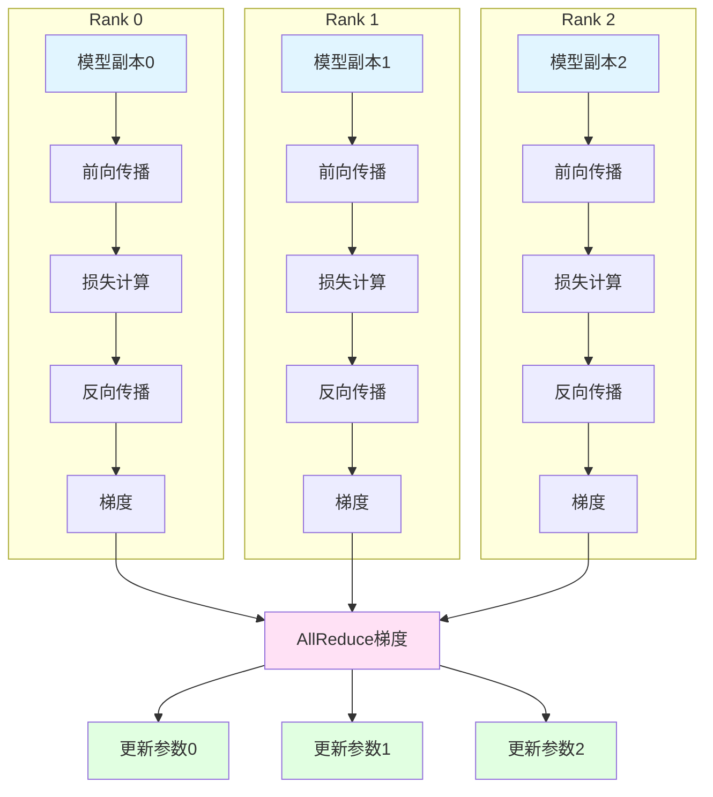

### 4.2 DDP核心类

**文件**: `torch/nn/parallel/distributed.py`

```python
class DistributedDataParallel(Module):
    def __init__(
        self,
        module: Module,
        device_ids: Optional[List[int]] = None,
        output_device: Optional[int] = None,
        dim: int = 0,
        broadcast_buffers: bool = True,
        process_group: Optional[ProcessGroup] = None,
        bucket_cap_mb: int = 25,
        find_unused_parameters: bool = False,
        check_reduction: bool = False,
        gradient_as_bucket_view: bool = False,
        static_graph: bool = False,
    ):
        super().__init__()
        
        # 包装的模型
        self.module = module
        
        # 进程组
        self.process_group = process_group or _get_default_group()
        
        # 梯度同步器
        self.reducer = None
        
        # 注册通信钩子
        self._register_comm_hook()
        
        # 初始化reducer
        self._ddp_init_helper()
    
    def forward(self, *inputs, **kwargs):
        # 1. 如果启用了broadcast_buffers，同步缓冲区
        if self.broadcast_buffers:
            self._sync_buffers()
        
        # 2. 前向传播
        outputs = self.module(*inputs, **kwargs)
        
        # 3. 如果需要梯度，注册反向传播钩子
        if torch.is_grad_enabled():
            self.reducer.prepare_for_backward(outputs)
        
        return outputs
    
    def _sync_buffers(self):
        """同步缓冲区（如BN的running_mean）"""
        buffers = list(self.module.buffers())
        if len(buffers) > 0:
            dist.broadcast_coalesced(
                buffers,
                src=0,
                group=self.process_group
            )
```

### 4.3 Reducer梯度同步

**文件**: `torch/csrc/distributed/c10d/reducer.cpp`

```cpp
class Reducer {
public:
    Reducer(
        std::vector<std::vector<at::Tensor>> replicas,
        std::vector<std::vector<size_t>> bucket_indices,
        c10::intrusive_ptr<ProcessGroup> process_group,
        bool expect_sparse_gradients
    );
    
    // 准备反向传播
    void prepare_for_backward(const at::Tensor& output);
    
    // 自动注册梯度钩子
    void autograd_hook(size_t index);
    
private:
    // 梯度桶（分组梯度以提高通信效率）
    struct Bucket {
        std::vector<at::Tensor> gradients;
        at::Tensor flattened;           // 展平的梯度
        size_t expected_count;           // 期望的梯度数量
        size_t current_count = 0;        // 当前收到的梯度数量
    };
    
    std::vector<Bucket> buckets_;
    
    // 标记梯度就绪
    void mark_gradient_ready(size_t index) {
        auto& bucket = find_bucket(index);
        bucket.current_count++;
        
        // 桶满时触发通信
        if (bucket.current_count == bucket.expected_count) {
            finalize_bucket(bucket);
        }
    }
    
    // 完成桶的通信
    void finalize_bucket(Bucket& bucket) {
        // 1. 展平梯度
        bucket.flattened = flatten_gradients(bucket.gradients);
        
        // 2. AllReduce
        auto work = process_group_->allreduce(
            {bucket.flattened},
            AllreduceOptions()
        );
        
        // 3. 等待完成
        work->wait();
        
        // 4. 平均梯度
        bucket.flattened.div_(process_group_->getSize());
        
        // 5. 拆分回原始梯度
        unflatten_gradients(bucket.flattened, bucket.gradients);
    }
};
```

### 4.4 梯度分桶策略

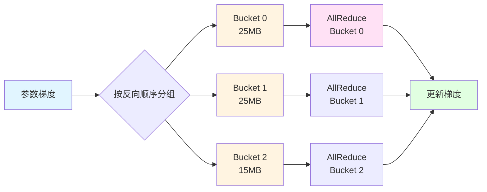

**分桶原理**：
1. 按反向传播顺序分组参数
2. 每个桶大小约25MB（可配置）
3. 桶满时立即启动AllReduce
4. 重叠计算和通信

### 4.5 使用示例

```python
import torch
import torch.distributed as dist
import torch.nn as nn
from torch.nn.parallel import DistributedDataParallel as DDP

# 1. 初始化进程组
dist.init_process_group(
    backend='nccl',           # 使用NCCL后端
    init_method='env://',     # 使用环境变量
    world_size=4,             # 总进程数
    rank=int(os.environ['RANK'])  # 当前进程rank
)

# 2. 创建模型并移到GPU
model = nn.Sequential(
    nn.Linear(1000, 500),
    nn.ReLU(),
    nn.Linear(500, 10)
).cuda()

# 3. 包装为DDP
ddp_model = DDP(
    model,
    device_ids=[torch.cuda.current_device()],
    bucket_cap_mb=25,
    find_unused_parameters=False,
    gradient_as_bucket_view=True  # 优化内存
)

# 4. 训练循环
optimizer = torch.optim.SGD(ddp_model.parameters(), lr=0.01)

for epoch in range(num_epochs):
    for batch in dataloader:
        inputs, targets = batch
        inputs = inputs.cuda()
        targets = targets.cuda()
        
        # 前向传播
        outputs = ddp_model(inputs)
        loss = criterion(outputs, targets)
        
        # 反向传播（自动同步梯度）
        optimizer.zero_grad()
        loss.backward()
        
        # 更新参数
        optimizer.step()

# 5. 清理
dist.destroy_process_group()
```

## 5 全分片数据并行(FSDP)

### 5.1 FSDP原理

FSDP (Fully Sharded Data Parallel) 是ZeRO优化的PyTorch实现。

**ZeRO优化级别**：

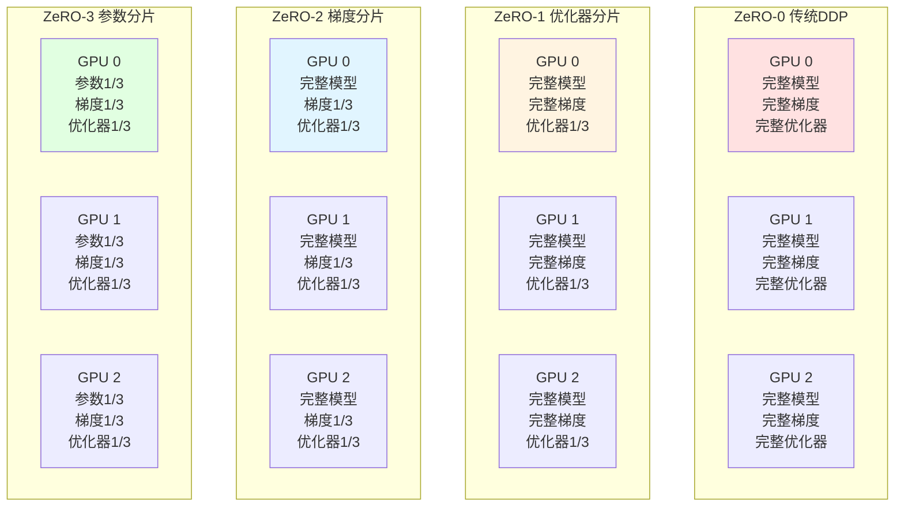

### 5.2 FSDP工作流程

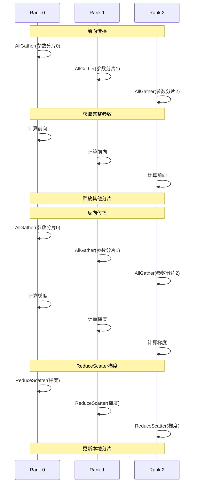

### 5.3 FSDP使用

```python
from torch.distributed.fsdp import FullyShardedDataParallel as FSDP
from torch.distributed.fsdp.wrap import size_based_auto_wrap_policy

# 1. 初始化分布式
dist.init_process_group(backend='nccl')

# 2. 创建模型
model = MyLargeModel().cuda()

# 3. 包装为FSDP
fsdp_model = FSDP(
    model,
    auto_wrap_policy=size_based_auto_wrap_policy,
    sharding_strategy=ShardingStrategy.FULL_SHARD,  # ZeRO-3
    cpu_offload=CPUOffload(offload_params=True),    # CPU卸载
    mixed_precision=MixedPrecision(
        param_dtype=torch.float16,
        reduce_dtype=torch.float16,
    ),
)

# 4. 训练
optimizer = torch.optim.Adam(fsdp_model.parameters(), lr=1e-4)

for batch in dataloader:
    outputs = fsdp_model(batch)
    loss = criterion(outputs, targets)
    
    optimizer.zero_grad()
    loss.backward()
    optimizer.step()
```

### 5.4 FSDP vs DDP

| 特性 | DDP | FSDP |
|------|-----|------|
| 内存占用 | 每卡完整模型 | 分片存储 |
| 通信量 | AllReduce梯度 | AllGather+ReduceScatter |
| 大模型支持 | 受限于单卡内存 | 支持超大模型 |
| 通信开销 | 低 | 中等 |
| 实现复杂度 | 简单 | 复杂 |
| 适用场景 | 中小模型 | 大模型（GPT、BERT） |

## 6 流水线并行

### 6.1 Pipeline Parallelism原理

将模型按层切分到不同设备，类似流水线：

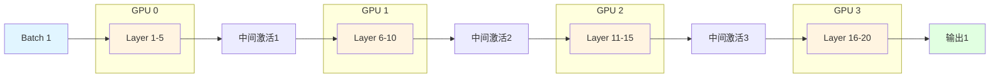

### 6.2 GPipe流水线

```mermaid
gantt
    title GPipe流水线调度
    dateFormat X
    axisFormat %L
    
    section GPU 0
    F1-Micro1: 0, 1
    B1-Micro1: 2, 3
    F1-Micro2: 1, 2
    B1-Micro2: 3, 4
    
    section GPU 1
    F2-Micro1: 1, 2
    B2-Micro1: 3, 4
    F2-Micro2: 2, 3
    B2-Micro2: 4, 5
    
    section GPU 2
    F3-Micro1: 2, 3
    B3-Micro1: 4, 5
    F3-Micro2: 3, 4
    B3-Micro2: 5, 6
```

**特点**：
- 将batch切分为micro-batch
- 前向和反向交替执行
- 减少气泡（空闲时间）

### 6.3 使用torch.distributed.pipeline

```python
from torch.distributed.pipeline.sync import Pipe

# 1. 定义模型
class MyModel(nn.Sequential):
    def __init__(self):
        super().__init__(
            nn.Linear(1000, 500),
            nn.ReLU(),
            nn.Linear(500, 250),
            nn.ReLU(),
            nn.Linear(250, 10)
        )

model = MyModel()

# 2. 划分到不同设备
model = Pipe(
    model,
    balance=[2, 2, 1],  # 每个设备的层数
    devices=[0, 1, 2],  # 设备ID
    chunks=8            # micro-batch数量
)

# 3. 训练
for inputs, targets in dataloader:
    outputs = model(inputs)
    loss = criterion(outputs, targets)
    loss.backward()
    optimizer.step()
```

## 7 张量并行

### 7.1 Megatron-LM张量并行

将单层的权重矩阵切分到多个GPU：

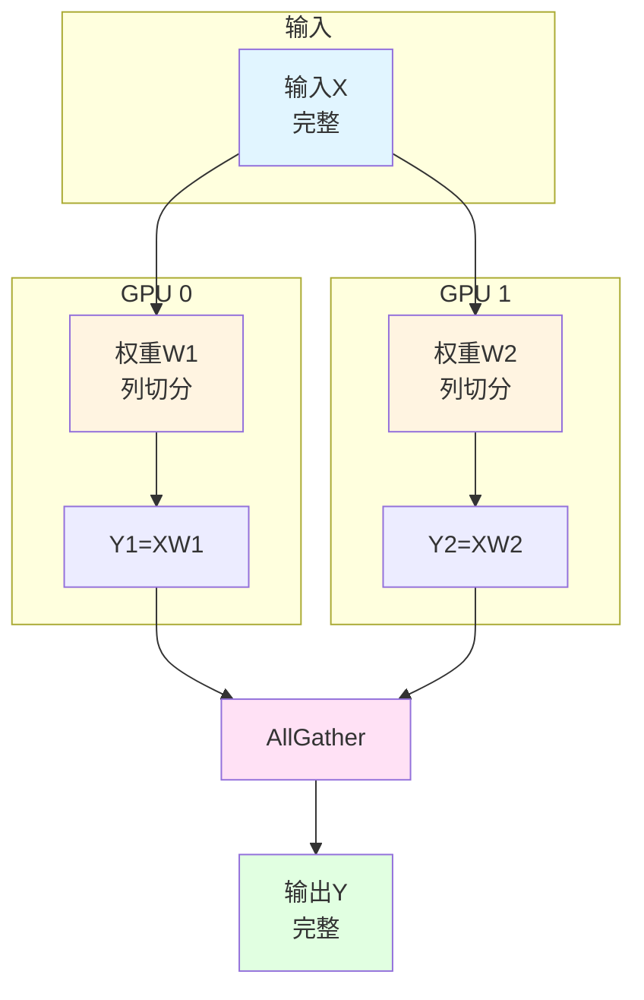

### 7.2 张量并行策略

**列并行**（Column Parallel）：
```python
# 原始：Y = XW
# 切分：Y = [XW1, XW2]（拼接）

class ColumnParallelLinear(nn.Module):
    def forward(self, x):
        # x: [batch, in_features]
        # 每个GPU持有W的部分列
        y_local = F.linear(x, self.weight)  # [batch, out_features/N]
        
        # AllGather收集
        y = all_gather(y_local, dim=-1)  # [batch, out_features]
        return y
```

**行并行**（Row Parallel）：
```python
# 原始：Y = XW
# 切分：Y = X1W1 + X2W2（求和）

class RowParallelLinear(nn.Module):
    def forward(self, x):
        # x: [batch, in_features]
        # 每个GPU持有W的部分行
        
        # 先切分输入
        x_local = scatter(x, dim=-1)  # [batch, in_features/N]
        
        # 本地计算
        y_local = F.linear(x_local, self.weight)  # [batch, out_features]
        
        # AllReduce求和
        y = all_reduce(y_local)  # [batch, out_features]
        return y
```

## 8 混合精度训练

### 8.1 自动混合精度(AMP)

```python
from torch.cuda.amp import autocast, GradScaler

model = MyModel().cuda()
optimizer = torch.optim.SGD(model.parameters(), lr=0.01)
scaler = GradScaler()

for inputs, targets in dataloader:
    optimizer.zero_grad()
    
    # 自动混合精度前向传播
    with autocast():
        outputs = model(inputs)
        loss = criterion(outputs, targets)
    
    # 缩放梯度
    scaler.scale(loss).backward()
    
    # 更新参数
    scaler.step(optimizer)
    scaler.update()
```

### 8.2 梯度缩放原理


## 9 通信优化

### 9.1 梯度压缩

```python
class PowerSGD(CommunicationHook):
    """PowerSGD梯度压缩"""
    def __init__(self, rank, error_feedback=True):
        self.rank = rank
        self.error_feedback = error_feedback
    
    def __call__(self, state, bucket):
        # 1. 获取梯度
        grad_matrix = bucket.buffer()
        
        # 2. 低秩分解
        M, N = grad_matrix.shape
        P = torch.randn(N, self.rank, device=grad_matrix.device)
        Q = grad_matrix @ P  # [M, rank]
        
        # 3. AllReduce低秩矩阵
        dist.all_reduce(Q)
        Q /= dist.get_world_size()
        
        # 4. 重构梯度
        grad_approx = Q @ P.T
        
        # 5. 误差反馈
        if self.error_feedback:
            error = grad_matrix - grad_approx
            state['error'] = error
        
        return grad_approx
```

### 9.2 通信调度

```python
# 重叠计算和通信
class OverlappedDDP(DDP):
    def forward(self, *inputs, **kwargs):
        # 1. 前向传播
        outputs = self.module(*inputs, **kwargs)
        
        # 2. 反向传播时重叠
        if torch.is_grad_enabled():
            # 注册钩子，每个bucket完成时立即通信
            def hook(bucket):
                bucket.allreduce()  # 异步通信
            
            self.reducer.register_comm_hook(hook)
        
        return outputs
```

## 10 容错与弹性训练

### 10.1 Elastic Training

```python
from torch.distributed.elastic import rendezvous
from torch.distributed.elastic.multiprocessing import Std, startgg_processes

def train_worker(rank, world_size):
    # 动态加入/退出
    dist.init_process_group(
        backend='nccl',
        init_method='etcd://...',
        world_size=world_size,
        rank=rank
    )
    
    # 训练循环
    for epoch in range(num_epochs):
        try:
            train_epoch(model, dataloader)
        except RuntimeError as e:
            # 节点故障，重新初始化
            if "NCCL" in str(e):
                dist.destroy_process_group()
                dist.init_process_group(...)
```

### 10.2 检查点保存

```python
# 分布式检查点
from torch.distributed.checkpoint import (
    save_state_dict,
    load_state_dict,
    StateDictOptions
)

# 保存
state_dict = {
    'model': model.state_dict(),
    'optimizer': optimizer.state_dict(),
    'epoch': epoch
}

save_state_dict(
    state_dict=state_dict,
    storage_writer=FileSystemWriter('checkpoints/'),
    no_dist=False  # 分布式保存
)

# 加载
load_state_dict(
    state_dict=state_dict,
    storage_reader=FileSystemReader('checkpoints/'),
    no_dist=False
)
```

## 11 性能分析

### 11.1 分布式性能指标

```python
import torch.distributed as dist
from torch.profiler import profile, ProfilerActivity

with profile(
    activities=[ProfilerActivity.CPU, ProfilerActivity.CUDA],
    record_shapes=True,
    with_stack=True
) as prof:
    for batch in dataloader:
        outputs = ddp_model(batch)
        loss.backward()
        optimizer.step()

# 查看通信时间
print(prof.key_averages().table(
    sort_by="cuda_time_total",
    row_limit=10
))
```

### 11.2 扩展效率

**强扩展**（固定问题规模）：
```
加速比 = T1 / TN
效率 = 加速比 / N
```

**弱扩展**（按GPU数增加问题规模）：
```
效率 = T1 / TN
```

## 12 实战案例

### 12.1 多机多卡训练脚本

```python
# train.py
import os
import torch
import torch.distributed as dist
from torch.nn.parallel import DistributedDataParallel as DDP
from torch.utils.data.distributed import DistributedSampler

def main():
    # 1. 环境变量
    rank = int(os.environ['RANK'])
    local_rank = int(os.environ['LOCAL_RANK'])
    world_size = int(os.environ['WORLD_SIZE'])
    
    # 2. 初始化进程组
    dist.init_process_group(
        backend='nccl',
        init_method='env://'
    )
    
    # 3. 设置设备
    torch.cuda.set_device(local_rank)
    
    # 4. 创建模型
    model = MyModel().cuda()
    ddp_model = DDP(model, device_ids=[local_rank])
    
    # 5. 分布式数据加载
    train_dataset = MyDataset()
    train_sampler = DistributedSampler(
        train_dataset,
        num_replicas=world_size,
        rank=rank
    )
    train_loader = DataLoader(
        train_dataset,
        batch_size=32,
        sampler=train_sampler
    )
    
    # 6. 训练
    optimizer = torch.optim.Adam(ddp_model.parameters())
    
    for epoch in range(num_epochs):
        train_sampler.set_epoch(epoch)  # 重要！
        
        for batch in train_loader:
            inputs, targets = batch
            inputs = inputs.cuda()
            targets = targets.cuda()
            
            outputs = ddp_model(inputs)
            loss = criterion(outputs, targets)
            
            optimizer.zero_grad()
            loss.backward()
            optimizer.step()
            
            # 打印（只在rank 0）
            if rank == 0 and batch_idx % 100 == 0:
                print(f'Epoch {epoch}, Loss: {loss.item()}')
    
    # 7. 清理
    dist.destroy_process_group()

if __name__ == '__main__':
    main()
```

### 12.2 启动脚本

```bash
# 单机多卡
python -m torch.distributed.launch \
    --nproc_per_node=8 \
    train.py

# 多机多卡（使用torchrun）
# 节点0
torchrun \
    --nnodes=4 \
    --nproc_per_node=8 \
    --node_rank=0 \
    --master_addr="192.168.1.1" \
    --master_port=29500 \
    train.py

# 节点1-3类似，修改node_rank
```

---