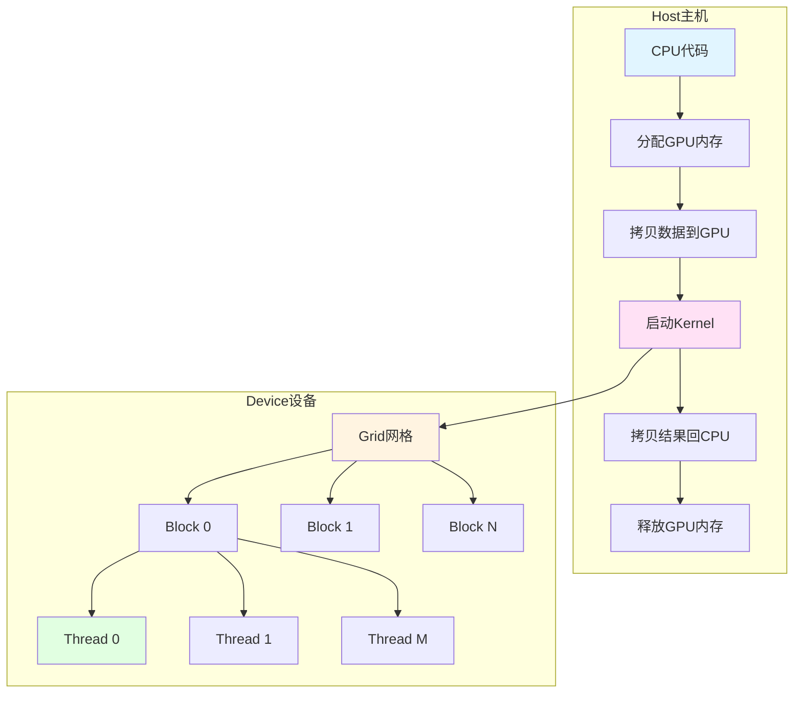
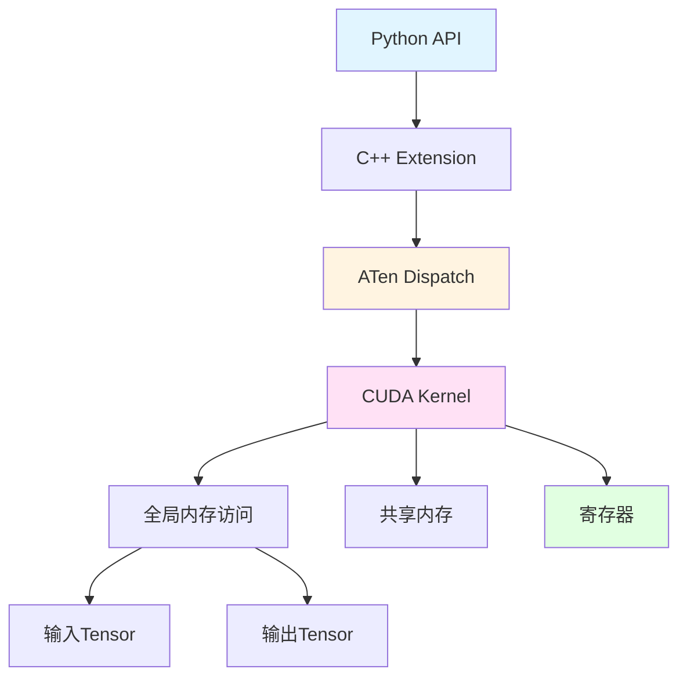
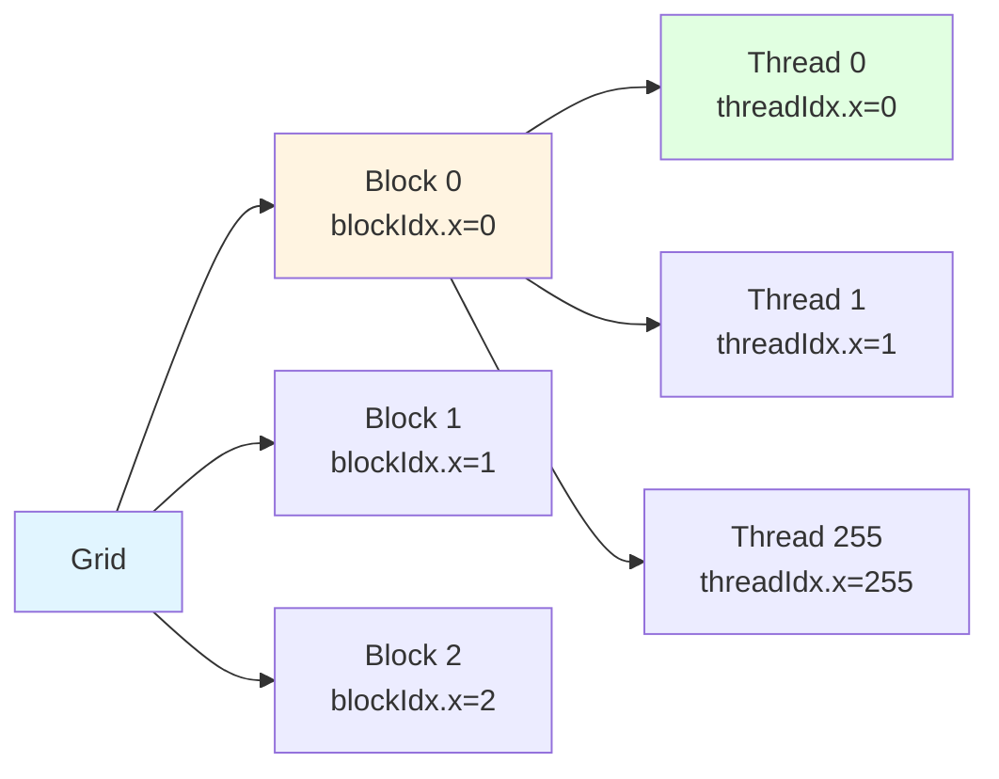
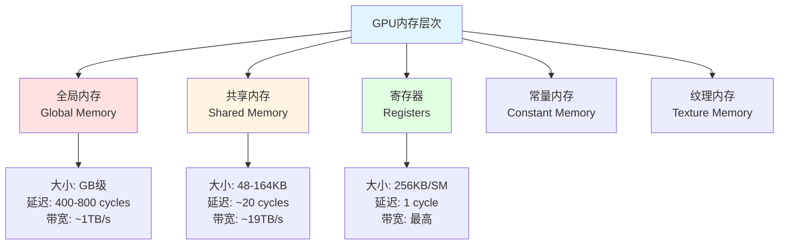
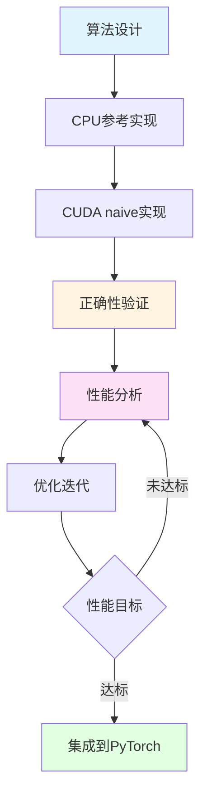
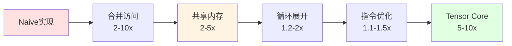

## 1 概述

CUDA算子是PyTorch GPU加速的核心，掌握CUDA编程能够实现高性能的自定义操作。本章将深入讲解PyTorch中CUDA算子的开发流程和优化技巧。

### 1.1 为什么需要自定义CUDA算子

**PyTorch内置算子的局限性**：
- 特定领域算法未内置（如自定义注意力机制）
- 性能瓶颈需要专门优化
- 需要融合多个操作以减少内存传输
- 研究新型算子架构

**自定义CUDA算子的优势**：
- 直接访问GPU硬件能力
- 精细控制内存访问模式
- 实现专用优化（如利用Tensor Core）
- 性能提升可达10-100倍

### 1.2 CUDA编程模型回顾



**核心概念**：
- **Grid（网格）**：整个kernel的执行空间
- **Block（块）**：线程组，共享内存和同步
- **Thread（线程）**：最小执行单元
- **Warp（束）**：32个线程的SIMD组

### 1.3 PyTorch CUDA算子架构



### 1.4 开发工具链

| 工具 | 用途 | 命令 |
|------|------|------|
| nvcc | CUDA编译器 | `nvcc -arch=sm_80` |
| cuda-gdb | CUDA调试器 | `cuda-gdb ./program` |
| Nsight Compute | 性能分析 | `ncu ./program` |
| Nsight Systems | 系统级分析 | `nsys profile ./program` |
| cuda-memcheck | 内存检查 | `cuda-memcheck ./program` |

## 2 第一个CUDA算子

### 2.1 向量加法示例

**目标**：实现 `C = A + B` 的向量加法。

**CUDA Kernel实现**：

```cpp
// 文件: vector_add_kernel.cu

#include <torch/extension.h>
#include <cuda.h>
#include <cuda_runtime.h>

// CUDA Kernel函数
__global__ void vector_add_kernel(
    const float* __restrict__ a,
    const float* __restrict__ b,
    float* __restrict__ c,
    int n
) {
    // 计算全局线程ID
    int idx = blockIdx.x * blockDim.x + threadIdx.x;
    
    // 边界检查
    if (idx < n) {
        c[idx] = a[idx] + b[idx];
    }
}

// C++封装函数
torch::Tensor vector_add_cuda(
    torch::Tensor a,
    torch::Tensor b
) {
    // 检查输入
    TORCH_CHECK(a.is_cuda(), "a must be a CUDA tensor");
    TORCH_CHECK(b.is_cuda(), "b must be a CUDA tensor");
    TORCH_CHECK(a.sizes() == b.sizes(), "Size mismatch");
    
    // 创建输出张量
    auto c = torch::empty_like(a);
    
    // 获取元素数量
    int n = a.numel();
    
    // 配置kernel启动参数
    const int threads = 256;
    const int blocks = (n + threads - 1) / threads;
    
    // 启动kernel
    vector_add_kernel<<<blocks, threads>>>(
        a.data_ptr<float>(),
        b.data_ptr<float>(),
        c.data_ptr<float>(),
        n
    );
    
    // 检查错误
    cudaError_t err = cudaGetLastError();
    TORCH_CHECK(err == cudaSuccess, 
                "CUDA kernel failed: ", cudaGetErrorString(err));
    
    return c;
}

// Python绑定
PYBIND11_MODULE(TORCH_EXTENSION_NAME, m) {
    m.def("vector_add", &vector_add_cuda, "Vector add (CUDA)");
}
```

### 2.2 编译和安装

**setup.py**：

```python
from setuptools import setup
from torch.utils.cpp_extension import BuildExtension, CUDAExtension

setup(
    name='vector_add_cuda',
    ext_modules=[
        CUDAExtension(
            name='vector_add_cuda',
            sources=['vector_add_kernel.cu'],
            extra_compile_args={
                'cxx': ['-O3'],
                'nvcc': [
                    '-O3',
                    '--use_fast_math',
                    '-arch=sm_80',  # 根据GPU架构调整
                ]
            }
        )
    ],
    cmdclass={
        'build_ext': BuildExtension
    }
)
```

**编译命令**：

```bash
python setup.py install
```

**Python使用**：

```python
import torch
import vector_add_cuda

a = torch.randn(1000000, device='cuda')
b = torch.randn(1000000, device='cuda')

# 调用自定义CUDA算子
c = vector_add_cuda.vector_add(a, b)

# 验证正确性
assert torch.allclose(c, a + b)
```

### 2.3 线程索引计算



**索引计算公式**：

```cpp
// 1D索引
int idx = blockIdx.x * blockDim.x + threadIdx.x;

// 2D索引
int row = blockIdx.y * blockDim.y + threadIdx.y;
int col = blockIdx.x * blockDim.x + threadIdx.x;

// 3D索引
int x = blockIdx.x * blockDim.x + threadIdx.x;
int y = blockIdx.y * blockDim.y + threadIdx.y;
int z = blockIdx.z * blockDim.z + threadIdx.z;
```

## 3 内存层次结构

### 3.1 GPU内存类型



### 3.2 全局内存访问模式

**合并访问（Coalesced Access）**：

```cpp
// ✅ 好的访问模式：连续访问
__global__ void coalesced_access(float* data, int n) {
    int idx = blockIdx.x * blockDim.x + threadIdx.x;
    if (idx < n) {
        // 线程0访问data[0]，线程1访问data[1]，...
        data[idx] = data[idx] * 2.0f;
    }
}

// ❌ 差的访问模式：跨步访问
__global__ void strided_access(float* data, int n, int stride) {
    int idx = blockIdx.x * blockDim.x + threadIdx.x;
    if (idx < n) {
        // 线程0访问data[0]，线程1访问data[stride]，...
        data[idx * stride] = data[idx * stride] * 2.0f;
    }
}
```

**性能对比**：
- 合并访问：~900 GB/s
- 跨步访问（stride=32）：~28 GB/s
- 性能差异：**32倍**

### 3.3 共享内存使用

**矩阵转置示例**：

```cpp
#define TILE_SIZE 32

__global__ void transpose_shared(
    const float* __restrict__ input,
    float* __restrict__ output,
    int width,
    int height
) {
    // 分配共享内存
    __shared__ float tile[TILE_SIZE][TILE_SIZE + 1];  // +1避免bank冲突
    
    // 计算全局坐标
    int x = blockIdx.x * TILE_SIZE + threadIdx.x;
    int y = blockIdx.y * TILE_SIZE + threadIdx.y;
    
    // 加载到共享内存（合并访问）
    if (x < width && y < height) {
        tile[threadIdx.y][threadIdx.x] = input[y * width + x];
    }
    
    // 同步确保所有数据加载完成
    __syncthreads();
    
    // 计算转置后的坐标
    x = blockIdx.y * TILE_SIZE + threadIdx.x;
    y = blockIdx.x * TILE_SIZE + threadIdx.y;
    
    // 从共享内存写回（合并访问）
    if (x < height && y < width) {
        output[y * height + x] = tile[threadIdx.x][threadIdx.y];
    }
}
```

**共享内存优势**：
- 延迟低：~20 cycles vs 400+ cycles
- 带宽高：~19 TB/s vs ~1 TB/s
- 线程间共享数据

### 3.4 寄存器优化

```cpp
// ❌ 未优化：重复从内存加载
__global__ void unoptimized(float* data, int n) {
    int idx = blockIdx.x * blockDim.x + threadIdx.x;
    if (idx < n) {
        data[idx] = data[idx] * 2.0f + data[idx] * 3.0f;
        //          ^^^^^^^^          ^^^^^^^^
        //          两次内存访问
    }
}

// ✅ 优化：使用寄存器缓存
__global__ void optimized(float* data, int n) {
    int idx = blockIdx.x * blockDim.x + threadIdx.x;
    if (idx < n) {
        float val = data[idx];  // 一次内存读取
        data[idx] = val * 2.0f + val * 3.0f;  // 从寄存器读取
    }
}
```

## 4 PyTorch CUDA算子集成

### 4.1 ATen张量操作

```cpp
#include <ATen/ATen.h>
#include <ATen/cuda/CUDAContext.h>

__global__ void relu_kernel(
    const float* __restrict__ input,
    float* __restrict__ output,
    int n
) {
    int idx = blockIdx.x * blockDim.x + threadIdx.x;
    if (idx < n) {
        output[idx] = fmaxf(input[idx], 0.0f);
    }
}

at::Tensor relu_cuda(const at::Tensor& input) {
    // 检查输入
    TORCH_CHECK(input.is_cuda(), "Input must be a CUDA tensor");
    TORCH_CHECK(input.is_contiguous(), "Input must be contiguous");
    
    // 创建输出张量
    auto output = at::empty_like(input);
    
    // 获取元素数量
    int n = input.numel();
    
    // Kernel配置
    const int threads = 256;
    const int blocks = (n + threads - 1) / threads;
    
    // 获取CUDA stream
    auto stream = at::cuda::getCurrentCUDAStream();
    
    // 启动kernel
    relu_kernel<<<blocks, threads, 0, stream>>>(
        input.data_ptr<float>(),
        output.data_ptr<float>(),
        n
    );
    
    return output;
}
```

### 4.2 多维张量处理

```cpp
// 2D卷积示例
__global__ void conv2d_kernel(
    const float* __restrict__ input,    // [N, C, H, W]
    const float* __restrict__ weight,   // [K, C, R, S]
    float* __restrict__ output,         // [N, K, H', W']
    int N, int C, int H, int W,
    int K, int R, int S,
    int H_out, int W_out
) {
    // 输出位置
    int n = blockIdx.z;
    int k = blockIdx.y;
    int h_out = blockIdx.x * blockDim.x + threadIdx.x;
    int w_out = threadIdx.y;
    
    if (h_out >= H_out || w_out >= W_out) return;
    
    float sum = 0.0f;
    
    // 卷积计算
    for (int c = 0; c < C; c++) {
        for (int r = 0; r < R; r++) {
            for (int s = 0; s < S; s++) {
                int h_in = h_out + r;
                int w_in = w_out + s;
                
                if (h_in < H && w_in < W) {
                    int input_idx = ((n * C + c) * H + h_in) * W + w_in;
                    int weight_idx = ((k * C + c) * R + r) * S + s;
                    
                    sum += input[input_idx] * weight[weight_idx];
                }
            }
        }
    }
    
    // 写入输出
    int output_idx = ((n * K + k) * H_out + h_out) * W_out + w_out;
    output[output_idx] = sum;
}

at::Tensor conv2d_cuda(
    const at::Tensor& input,
    const at::Tensor& weight
) {
    auto N = input.size(0);
    auto C = input.size(1);
    auto H = input.size(2);
    auto W = input.size(3);
    
    auto K = weight.size(0);
    auto R = weight.size(2);
    auto S = weight.size(3);
    
    auto H_out = H - R + 1;
    auto W_out = W - S + 1;
    
    // 创建输出
    auto output = at::empty({N, K, H_out, W_out}, input.options());
    
    // Kernel配置
    dim3 threads(16, 16);
    dim3 blocks(
        (H_out + threads.x - 1) / threads.x,
        K,
        N
    );
    
    // 启动kernel
    conv2d_kernel<<<blocks, threads>>>(
        input.data_ptr<float>(),
        weight.data_ptr<float>(),
        output.data_ptr<float>(),
        N, C, H, W, K, R, S, H_out, W_out
    );
    
    return output;
}
```

### 4.3 Autograd集成

```cpp
#include <torch/extension.h>

// 前向kernel
__global__ void sigmoid_forward_kernel(
    const float* __restrict__ x,
    float* __restrict__ y,
    int n
) {
    int idx = blockIdx.x * blockDim.x + threadIdx.x;
    if (idx < n) {
        y[idx] = 1.0f / (1.0f + expf(-x[idx]));
    }
}

// 反向kernel
__global__ void sigmoid_backward_kernel(
    const float* __restrict__ grad_output,
    const float* __restrict__ output,
    float* __restrict__ grad_input,
    int n
) {
    int idx = blockIdx.x * blockDim.x + threadIdx.x;
    if (idx < n) {
        float y = output[idx];
        grad_input[idx] = grad_output[idx] * y * (1.0f - y);
    }
}

// Autograd Function
class SigmoidCUDA : public torch::autograd::Function<SigmoidCUDA> {
public:
    static torch::Tensor forward(
        torch::autograd::AutogradContext* ctx,
        torch::Tensor input
    ) {
        auto output = torch::empty_like(input);
        
        int n = input.numel();
        const int threads = 256;
        const int blocks = (n + threads - 1) / threads;
        
        sigmoid_forward_kernel<<<blocks, threads>>>(
            input.data_ptr<float>(),
            output.data_ptr<float>(),
            n
        );
        
        // 保存输出用于反向传播
        ctx->save_for_backward({output});
        
        return output;
    }
    
    static torch::autograd::tensor_list backward(
        torch::autograd::AutogradContext* ctx,
        torch::autograd::tensor_list grad_outputs
    ) {
        auto saved = ctx->get_saved_variables();
        auto output = saved[0];
        auto grad_output = grad_outputs[0];
        
        auto grad_input = torch::empty_like(grad_output);
        
        int n = grad_output.numel();
        const int threads = 256;
        const int blocks = (n + threads - 1) / threads;
        
        sigmoid_backward_kernel<<<blocks, threads>>>(
            grad_output.data_ptr<float>(),
            output.data_ptr<float>(),
            grad_input.data_ptr<float>(),
            n
        );
        
        return {grad_input};
    }
};

// Python接口
torch::Tensor sigmoid_cuda(torch::Tensor input) {
    return SigmoidCUDA::apply(input);
}
```

## 5 Kernel启动优化

### 5.1 最优线程块配置

```cpp
// 计算最优线程块大小
int getOptimalBlockSize(int n, int max_threads = 1024) {
    // 常用的线程块大小
    const int candidates[] = {32, 64, 128, 256, 512, 1024};
    
    // 选择能最大化占用率的大小
    int best_size = 256;  // 默认值
    float best_occupancy = 0.0f;
    
    for (int size : candidates) {
        if (size > max_threads) continue;
        
        int blocks_needed = (n + size - 1) / size;
        float occupancy = calculateOccupancy(size, blocks_needed);
        
        if (occupancy > best_occupancy) {
            best_occupancy = occupancy;
            best_size = size;
        }
    }
    
    return best_size;
}

// 使用示例
void launch_kernel(const float* input, float* output, int n) {
    int threads = getOptimalBlockSize(n);
    int blocks = (n + threads - 1) / threads;
    
    my_kernel<<<blocks, threads>>>(input, output, n);
}
```

### 5.2 占用率计算

**占用率（Occupancy）**：实际活跃warp数 / 最大可能warp数

```cpp
#include <cuda_occupancy.h>

void analyze_kernel_occupancy() {
    int blockSize;
    int minGridSize;
    int gridSize;
    
    // 自动计算最优配置
    cudaOccupancyMaxPotentialBlockSize(
        &minGridSize,
        &blockSize,
        my_kernel,
        0,  // 动态共享内存大小
        0   // 每个块的最大线程数
    );
    
    printf("建议线程块大小: %d\n", blockSize);
    printf("建议网格大小: %d\n", minGridSize);
    
    // 计算实际占用率
    int maxActiveBlocks;
    cudaOccupancyMaxActiveBlocksPerMultiprocessor(
        &maxActiveBlocks,
        my_kernel,
        blockSize,
        0
    );
    
    int device;
    cudaDeviceProp props;
    cudaGetDevice(&device);
    cudaGetDeviceProperties(&props, device);
    
    float occupancy = (maxActiveBlocks * blockSize / 
                      (float)props.maxThreadsPerMultiProcessor) * 100;
    
    printf("占用率: %.2f%%\n", occupancy);
}
```

### 5.3 Grid-Stride循环

```cpp
// Grid-Stride循环模式
__global__ void grid_stride_kernel(float* data, int n) {
    // 每个线程处理多个元素
    for (int idx = blockIdx.x * blockDim.x + threadIdx.x;
         idx < n;
         idx += blockDim.x * gridDim.x) {
        
        data[idx] = data[idx] * 2.0f;
    }
}

// 启动少量线程块，每个处理多个元素
void launch_grid_stride(float* data, int n) {
    int threads = 256;
    int blocks = min(32 * 80, (n + threads - 1) / threads);  // 限制块数
    
    grid_stride_kernel<<<blocks, threads>>>(data, n);
}
```

**优势**：
- 减少kernel启动开销
- 更好的指令缓存利用
- 适应不同大小的输入

## 6 错误处理和调试

### 6.1 CUDA错误检查

```cpp
// 错误检查宏
#define CUDA_CHECK(call) \
    do { \
        cudaError_t err = call; \
        if (err != cudaSuccess) { \
            fprintf(stderr, "CUDA error in %s:%d: %s\n", \
                    __FILE__, __LINE__, cudaGetErrorString(err)); \
            exit(EXIT_FAILURE); \
        } \
    } while(0)

// Kernel错误检查
#define CUDA_KERNEL_CHECK() \
    do { \
        cudaError_t err = cudaGetLastError(); \
        if (err != cudaSuccess) { \
            fprintf(stderr, "CUDA kernel error: %s\n", \
                    cudaGetErrorString(err)); \
            exit(EXIT_FAILURE); \
        } \
        err = cudaDeviceSynchronize(); \
        if (err != cudaSuccess) { \
            fprintf(stderr, "CUDA sync error: %s\n", \
                    cudaGetErrorString(err)); \
            exit(EXIT_FAILURE); \
        } \
    } while(0)

// 使用示例
CUDA_CHECK(cudaMalloc(&d_data, size));
my_kernel<<<blocks, threads>>>(d_data, n);
CUDA_KERNEL_CHECK();
```

### 6.2 Kernel内部调试

```cpp
// 使用printf调试
__global__ void debug_kernel(float* data, int n) {
    int idx = blockIdx.x * blockDim.x + threadIdx.x;
    
    if (idx < n) {
        // 只在特定线程打印
        if (idx == 0 || idx == n - 1) {
            printf("Thread %d: data[%d] = %f\n", idx, idx, data[idx]);
        }
        
        data[idx] = data[idx] * 2.0f;
    }
}

// 使用assert断言
__global__ void assert_kernel(float* data, int n) {
    int idx = blockIdx.x * blockDim.x + threadIdx.x;
    
    if (idx < n) {
        // 运行时断言
        assert(data[idx] >= 0.0f && "Data must be non-negative");
        
        data[idx] = sqrtf(data[idx]);
    }
}
```

### 6.3 内存越界检查

```cpp
// 使用cuda-memcheck检测内存错误
// 命令: cuda-memcheck ./program

__global__ void potential_bug(float* data, int n) {
    int idx = blockIdx.x * blockDim.x + threadIdx.x;
    
    // 可能越界访问
    data[idx] = data[idx] * 2.0f;
    
    // 加边界检查
    if (idx < n) {
        data[idx] = data[idx] * 2.0f;
    }
}
```

### 6.4 竞态条件检测

```cpp
// cuda-racecheck检测竞态条件
// 命令: cuda-racecheck ./program

__global__ void race_condition_example(int* counter) {
    // 竞态条件：多个线程同时写
    *counter = *counter + 1;
    
    // 使用原子操作
    atomicAdd(counter, 1);
}
```

## 7 性能优化基础

### 7.1 内存访问优化

```cpp
// 案例：矩阵乘法优化

// 未优化版本
__global__ void matmul_naive(
    const float* A, const float* B, float* C,
    int M, int N, int K
) {
    int row = blockIdx.y * blockDim.y + threadIdx.y;
    int col = blockIdx.x * blockDim.x + threadIdx.x;
    
    if (row < M && col < N) {
        float sum = 0.0f;
        for (int k = 0; k < K; k++) {
            sum += A[row * K + k] * B[k * N + col];
            //     ^^^^^^^^^^^^^^^^   ^^^^^^^^^^^^^^^^
            //     非合并访问         非合并访问
        }
        C[row * N + col] = sum;
    }
}

// 使用共享内存优化
#define TILE_SIZE 16

__global__ void matmul_shared(
    const float* A, const float* B, float* C,
    int M, int N, int K
) {
    __shared__ float As[TILE_SIZE][TILE_SIZE];
    __shared__ float Bs[TILE_SIZE][TILE_SIZE];
    
    int row = blockIdx.y * TILE_SIZE + threadIdx.y;
    int col = blockIdx.x * TILE_SIZE + threadIdx.x;
    
    float sum = 0.0f;
    
    // 分块计算
    for (int t = 0; t < (K + TILE_SIZE - 1) / TILE_SIZE; t++) {
        // 加载A的tile到共享内存
        if (row < M && t * TILE_SIZE + threadIdx.x < K) {
            As[threadIdx.y][threadIdx.x] = 
                A[row * K + t * TILE_SIZE + threadIdx.x];
        } else {
            As[threadIdx.y][threadIdx.x] = 0.0f;
        }
        
        // 加载B的tile到共享内存
        if (col < N && t * TILE_SIZE + threadIdx.y < K) {
            Bs[threadIdx.y][threadIdx.x] = 
                B[(t * TILE_SIZE + threadIdx.y) * N + col];
        } else {
            Bs[threadIdx.y][threadIdx.x] = 0.0f;
        }
        
        __syncthreads();
        
        // 计算部分乘积
        for (int k = 0; k < TILE_SIZE; k++) {
            sum += As[threadIdx.y][k] * Bs[k][threadIdx.x];
        }
        
        __syncthreads();
    }
    
    // 写回结果
    if (row < M && col < N) {
        C[row * N + col] = sum;
    }
}
```

**性能对比**：
- naive版本：~100 GFlops
- shared版本：~800 GFlops
- cuBLAS：~8000 GFlops

### 7.2 循环展开

```cpp
// 手动循环展开
__global__ void reduce_unrolled(float* input, float* output, int n) {
    __shared__ float sdata[256];
    
    int tid = threadIdx.x;
    int idx = blockIdx.x * blockDim.x * 4 + threadIdx.x;
    
    // 加载并展开4个元素
    float sum = 0.0f;
    if (idx < n) sum += input[idx];
    if (idx + blockDim.x < n) sum += input[idx + blockDim.x];
    if (idx + 2 * blockDim.x < n) sum += input[idx + 2 * blockDim.x];
    if (idx + 3 * blockDim.x < n) sum += input[idx + 3 * blockDim.x];
    
    sdata[tid] = sum;
    __syncthreads();
    
    // 归约（展开最后几步）
    if (blockDim.x >= 512) {
        if (tid < 256) sdata[tid] += sdata[tid + 256];
        __syncthreads();
    }
    if (blockDim.x >= 256) {
        if (tid < 128) sdata[tid] += sdata[tid + 128];
        __syncthreads();
    }
    if (blockDim.x >= 128) {
        if (tid < 64) sdata[tid] += sdata[tid + 64];
        __syncthreads();
    }
    
    // Warp级归约（无需同步）
    if (tid < 32) {
        volatile float* smem = sdata;
        smem[tid] += smem[tid + 32];
        smem[tid] += smem[tid + 16];
        smem[tid] += smem[tid + 8];
        smem[tid] += smem[tid + 4];
        smem[tid] += smem[tid + 2];
        smem[tid] += smem[tid + 1];
    }
    
    if (tid == 0) output[blockIdx.x] = sdata[0];
}
```

### 7.3 指令级优化

```cpp
// 使用快速数学函数
__global__ void fast_math_kernel(float* data, int n) {
    int idx = blockIdx.x * blockDim.x + threadIdx.x;
    if (idx < n) {
        float x = data[idx];
        
        // 使用快速近似函数
        float y = __fdividef(1.0f, x);           // 快速除法
        float z = __expf(x);                     // 快速exp
        float w = rsqrtf(x);                     // 快速1/sqrt
        
        data[idx] = y + z + w;
    }
}

// 编译选项优化
// nvcc -O3 --use_fast_math -arch=sm_80 kernel.cu
```

## 8 实战案例

### 8.1 Softmax实现

```cpp
#include <torch/extension.h>
#include <cuda.h>
#include <cuda_runtime.h>

// Softmax kernel
__global__ void softmax_kernel(
    const float* __restrict__ input,
    float* __restrict__ output,
    int batch_size,
    int dim
) {
    int b = blockIdx.x;
    
    if (b >= batch_size) return;
    
    const float* input_row = input + b * dim;
    float* output_row = output + b * dim;
    
    // 1. 找最大值（数值稳定性）
    float max_val = -INFINITY;
    for (int i = threadIdx.x; i < dim; i += blockDim.x) {
        max_val = fmaxf(max_val, input_row[i]);
    }
    
    // 归约找全局最大值
    __shared__ float shared_max[256];
    shared_max[threadIdx.x] = max_val;
    __syncthreads();
    
    for (int stride = blockDim.x / 2; stride > 0; stride >>= 1) {
        if (threadIdx.x < stride) {
            shared_max[threadIdx.x] = fmaxf(
                shared_max[threadIdx.x],
                shared_max[threadIdx.x + stride]
            );
        }
        __syncthreads();
    }
    max_val = shared_max[0];
    
    // 2. 计算exp(x - max)并求和
    float sum = 0.0f;
    for (int i = threadIdx.x; i < dim; i += blockDim.x) {
        float exp_val = expf(input_row[i] - max_val);
        output_row[i] = exp_val;
        sum += exp_val;
    }
    
    // 归约求和
    __shared__ float shared_sum[256];
    shared_sum[threadIdx.x] = sum;
    __syncthreads();
    
    for (int stride = blockDim.x / 2; stride > 0; stride >>= 1) {
        if (threadIdx.x < stride) {
            shared_sum[threadIdx.x] += shared_sum[threadIdx.x + stride];
        }
        __syncthreads();
    }
    sum = shared_sum[0];
    
    // 3. 归一化
    for (int i = threadIdx.x; i < dim; i += blockDim.x) {
        output_row[i] /= sum;
    }
}

torch::Tensor softmax_cuda(torch::Tensor input) {
    TORCH_CHECK(input.is_cuda(), "Input must be CUDA tensor");
    TORCH_CHECK(input.dim() == 2, "Input must be 2D");
    
    auto batch_size = input.size(0);
    auto dim = input.size(1);
    
    auto output = torch::empty_like(input);
    
    const int threads = 256;
    const int blocks = batch_size;
    
    softmax_kernel<<<blocks, threads>>>(
        input.data_ptr<float>(),
        output.data_ptr<float>(),
        batch_size,
        dim
    );
    
    return output;
}
```

### 8.2 LayerNorm实现

```cpp
__global__ void layer_norm_kernel(
    const float* __restrict__ input,
    const float* __restrict__ gamma,
    const float* __restrict__ beta,
    float* __restrict__ output,
    int batch_size,
    int hidden_size,
    float eps
) {
    int b = blockIdx.x;
    if (b >= batch_size) return;
    
    const float* input_row = input + b * hidden_size;
    float* output_row = output + b * hidden_size;
    
    // 1. 计算均值
    float sum = 0.0f;
    for (int i = threadIdx.x; i < hidden_size; i += blockDim.x) {
        sum += input_row[i];
    }
    
    __shared__ float shared_sum[256];
    shared_sum[threadIdx.x] = sum;
    __syncthreads();
    
    for (int stride = blockDim.x / 2; stride > 0; stride >>= 1) {
        if (threadIdx.x < stride) {
            shared_sum[threadIdx.x] += shared_sum[threadIdx.x + stride];
        }
        __syncthreads();
    }
    float mean = shared_sum[0] / hidden_size;
    
    // 2. 计算方差
    float var_sum = 0.0f;
    for (int i = threadIdx.x; i < hidden_size; i += blockDim.x) {
        float diff = input_row[i] - mean;
        var_sum += diff * diff;
    }
    
    shared_sum[threadIdx.x] = var_sum;
    __syncthreads();
    
    for (int stride = blockDim.x / 2; stride > 0; stride >>= 1) {
        if (threadIdx.x < stride) {
            shared_sum[threadIdx.x] += shared_sum[threadIdx.x + stride];
        }
        __syncthreads();
    }
    float variance = shared_sum[0] / hidden_size;
    float inv_std = rsqrtf(variance + eps);
    
    // 3. 归一化并应用仿射变换
    for (int i = threadIdx.x; i < hidden_size; i += blockDim.x) {
        float normalized = (input_row[i] - mean) * inv_std;
        output_row[i] = gamma[i] * normalized + beta[i];
    }
}
```

### 8.3 性能测试

```python
import torch
import time

def benchmark_kernel(func, *args, warmup=10, iterations=100):
    # 预热
    for _ in range(warmup):
        func(*args)
    
    torch.cuda.synchronize()
    
    # 测试
    start = time.time()
    for _ in range(iterations):
        func(*args)
    torch.cuda.synchronize()
    
    elapsed = (time.time() - start) / iterations
    return elapsed * 1000  # 转换为毫秒

# 测试softmax
batch_size = 128
dim = 1024

x = torch.randn(batch_size, dim, device='cuda')

# PyTorch实现
time_pytorch = benchmark_kernel(torch.softmax, x, dim=1)
print(f"PyTorch Softmax: {time_pytorch:.3f} ms")

# 自定义CUDA实现
import softmax_cuda
time_custom = benchmark_kernel(softmax_cuda.forward, x)
print(f"Custom CUDA Softmax: {time_custom:.3f} ms")

# 验证正确性
y_pytorch = torch.softmax(x, dim=1)
y_custom = softmax_cuda.forward(x)
print(f"最大误差: {(y_pytorch - y_custom).abs().max().item():.6f}")
```

## 9 最佳实践

### 9.1 开发流程



### 9.2 优化清单

- [ ] 使用合并内存访问
- [ ] 利用共享内存减少全局内存访问
- [ ] 最大化占用率
- [ ] 循环展开减少分支
- [ ] 使用快速数学函数
- [ ] 避免warp divergence
- [ ] 使用Grid-Stride循环
- [ ] Profile识别瓶颈
- [ ] 验证数值精度

### 9.3 常见陷阱

```cpp
// 错误1：忘记同步
__global__ void bug_no_sync() {
    __shared__ float data[256];
    data[threadIdx.x] = threadIdx.x;
    // 缺少__syncthreads()
    float val = data[(threadIdx.x + 1) % 256];  // 可能读到未初始化的值
}

// 错误2：Bank冲突
__shared__ float bad_access[32][32];
bad_access[threadIdx.x][0] = 1.0f;  // 所有线程访问同一bank

// 修正：添加padding
__shared__ float good_access[32][33];  // +1避免冲突

// 错误3：寄存器溢出
__global__ void too_many_registers() {
    float temp[1000];  // 太多局部变量，溢出到本地内存
    // ...
}
```

## 10 总结

### 10.1 关键要点

1. **内存层次**：寄存器 > 共享内存 > 全局内存
2. **访问模式**：合并访问性能最优
3. **占用率**：平衡寄存器、共享内存使用
4. **同步开销**：最小化`__syncthreads()`
5. **Warp效率**：避免分支divergence

### 10.2 性能优化路线



---