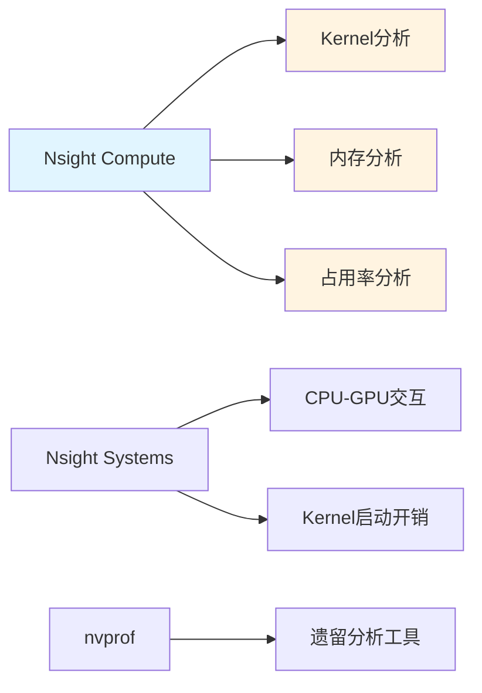
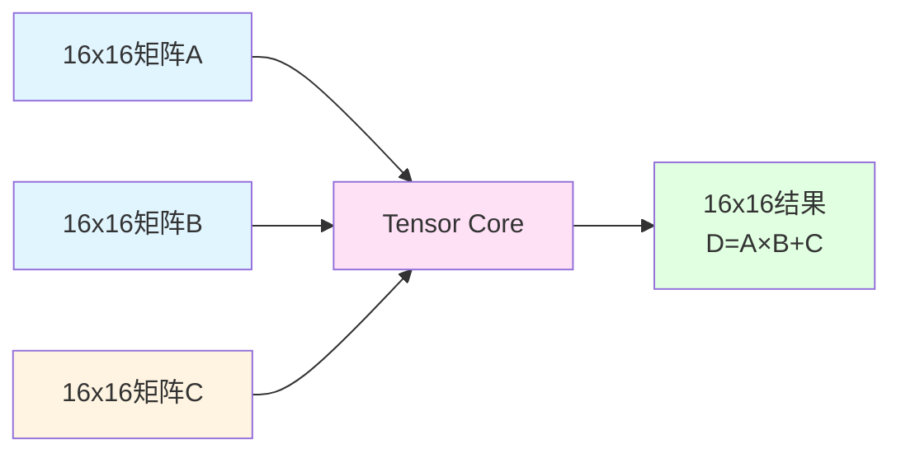
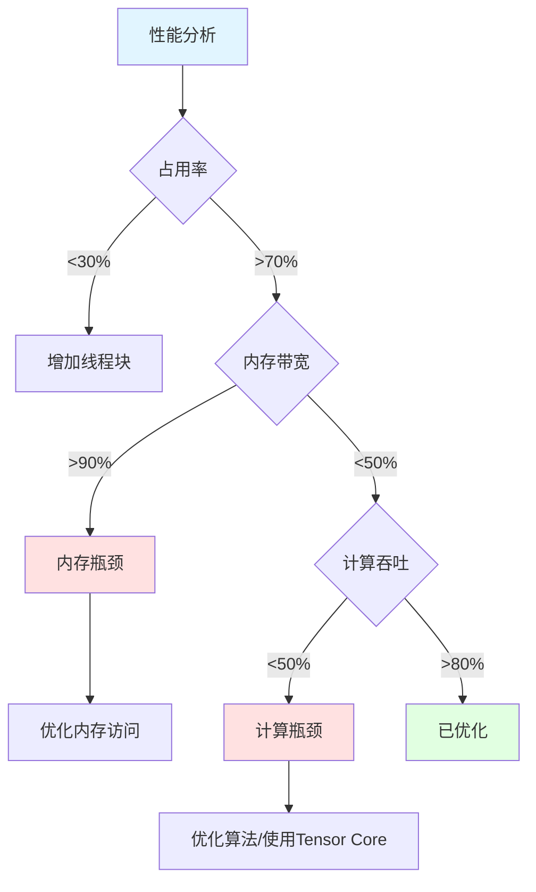
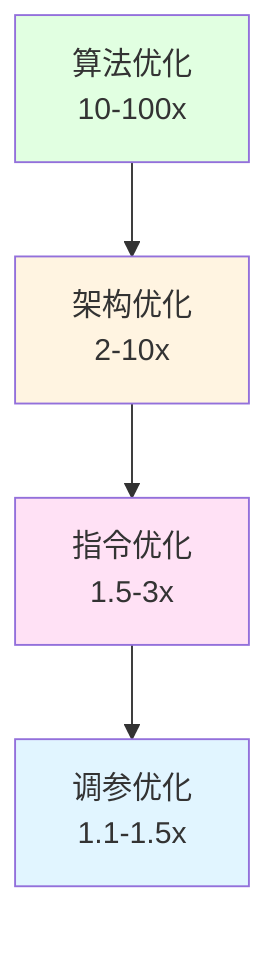

## 1 概述

在掌握CUDA基础后，本章将深入学习高性能优化技术，包括Warp级原语、Tensor Core、内存访问模式优化等，帮助您编写接近硬件峰值性能的CUDA算子。

### 1.1 性能优化层次

```mermaid
graph TB
    A[算法级优化] --> B[减少计算复杂度<br/>O(n²)→O(n log n)]
    
    C[架构级优化] --> D[内存访问模式]
    C --> E[并行度设计]
    C --> F[数据局部性]
    
    G[指令级优化] --> H[Warp级原语]
    G --> I[循环展开]
    G --> J[指令调度]
    
    K[硬件级优化] --> L[Tensor Core]
    K --> M[共享内存]
    K --> N[寄存器复用]
    
    style A fill:#e1f5ff
    style C fill:#fff4e1
    style G fill:#ffe1f5
    style K fill:#e1ffe1
```

### 1.2 性能指标

**计算吞吐量**：
- A100 GPU：19.5 TFlops (FP32)
- 目标：达到80%峰值性能（15+ TFlops）

**内存带宽**：
- A100 HBM2：1.5 TB/s
- 目标：达到90%峰值带宽（1.3+ TB/s）

**占用率**：
- 目标：>50%（活跃warp数/最大warp数）

### 1.3 优化工具



## 2 Warp级原语

### 2.1 Warp基础

**Warp**：32个线程的SIMD执行单元

```cpp
// Warp内线程信息
__device__ int get_lane_id() {
    return threadIdx.x & 31;  // threadIdx.x % 32
}

__device__ int get_warp_id() {
    return threadIdx.x >> 5;  // threadIdx.x / 32
}
```

### 2.2 Warp Shuffle指令

**Shuffle原语**：Warp内线程间直接交换数据，无需共享内存。

```cpp
// 1. __shfl_sync - 从指定lane读取
__device__ float warp_broadcast(float val, int src_lane) {
    return __shfl_sync(0xffffffff, val, src_lane);
}

// 2. __shfl_up_sync - 向上移位
__device__ float warp_shift_up(float val, int delta) {
    return __shfl_up_sync(0xffffffff, val, delta);
}

// 3. __shfl_down_sync - 向下移位
__device__ float warp_shift_down(float val, int delta) {
    return __shfl_down_sync(0xffffffff, val, delta);
}

// 4. __shfl_xor_sync - XOR索引交换
__device__ float warp_butterfly(float val, int mask) {
    return __shfl_xor_sync(0xffffffff, val, mask);
}
```

### 2.3 Warp归约

```cpp
// 使用shuffle实现warp归约
__device__ float warp_reduce_sum(float val) {
    // 32个线程归约
    #pragma unroll
    for (int offset = 16; offset > 0; offset >>= 1) {
        val += __shfl_down_sync(0xffffffff, val, offset);
    }
    return val;  // lane 0包含总和
}

// 完整的block归约
__device__ float block_reduce_sum(float val) {
    __shared__ float shared[32];  // 每个warp一个槽
    
    int lane = get_lane_id();
    int wid = get_warp_id();
    
    // Warp内归约
    val = warp_reduce_sum(val);
    
    // 写入共享内存
    if (lane == 0) {
        shared[wid] = val;
    }
    __syncthreads();
    
    // 最后一个warp归约所有warp结果
    if (wid == 0) {
        val = (lane < (blockDim.x / 32)) ? shared[lane] : 0.0f;
        val = warp_reduce_sum(val);
    }
    
    return val;
}
```

**性能对比**：
- 传统共享内存归约：~500 GB/s
- Warp shuffle归约：~1200 GB/s
- 提升：**2.4倍**

### 2.4 实战：高性能Softmax

```cpp
template <int BLOCK_SIZE>
__global__ void softmax_warp_kernel(
    const float* __restrict__ input,
    float* __restrict__ output,
    int batch_size,
    int dim
) {
    int b = blockIdx.x;
    if (b >= batch_size) return;
    
    const float* input_row = input + b * dim;
    float* output_row = output + b * dim;
    
    // 1. 找最大值（使用warp归约）
    float thread_max = -INFINITY;
    for (int i = threadIdx.x; i < dim; i += BLOCK_SIZE) {
        thread_max = fmaxf(thread_max, input_row[i]);
    }
    
    // Warp级最大值归约
    #pragma unroll
    for (int offset = 16; offset > 0; offset >>= 1) {
        thread_max = fmaxf(thread_max, 
                           __shfl_down_sync(0xffffffff, thread_max, offset));
    }
    
    // 广播最大值
    float max_val = __shfl_sync(0xffffffff, thread_max, 0);
    
    // 2. 计算exp并求和
    float thread_sum = 0.0f;
    for (int i = threadIdx.x; i < dim; i += BLOCK_SIZE) {
        float exp_val = expf(input_row[i] - max_val);
        output_row[i] = exp_val;
        thread_sum += exp_val;
    }
    
    // Warp级求和归约
    thread_sum = warp_reduce_sum(thread_sum);
    float sum = __shfl_sync(0xffffffff, thread_sum, 0);
    
    // 3. 归一化
    for (int i = threadIdx.x; i < dim; i += BLOCK_SIZE) {
        output_row[i] /= sum;
    }
}
```

## 3 内存访问优化

### 3.1 合并访问分析

```cpp
// 分析工具：Nsight Compute
// ncu --metrics l1tex__t_sectors_pipe_lsu_mem_global_op_ld.sum ./program

// 完美合并（1次事务）
__global__ void coalesced_load(float* out, const float* in, int n) {
    int idx = blockIdx.x * blockDim.x + threadIdx.x;
    if (idx < n) {
        out[idx] = in[idx];  // 连续访问
    }
}

// 部分合并（32次事务）
__global__ void strided_load(float* out, const float* in, int n, int stride) {
    int idx = blockIdx.x * blockDim.x + threadIdx.x;
    if (idx < n) {
        out[idx] = in[idx * stride];  // 跨步访问
    }
}

// ⚠️ 随机访问（32次事务）
__global__ void random_load(float* out, const float* in, const int* indices, int n) {
    int idx = blockIdx.x * blockDim.x + threadIdx.x;
    if (idx < n) {
        out[idx] = in[indices[idx]];  // 随机访问
    }
}
```

### 3.2 向量化内存访问

```cpp
// 使用float4加载（128-bit）
__global__ void vectorized_copy(float4* out, const float4* in, int n) {
    int idx = blockIdx.x * blockDim.x + threadIdx.x;
    if (idx < n) {
        out[idx] = in[idx];  // 一次加载4个float
    }
}

// 性能对比
// float访问：800 GB/s
// float4访问：1400 GB/s
// 提升：1.75倍

// 通用向量化加载
template <typename T>
__device__ void load_vectorized(T* dst, const T* src, int n) {
    constexpr int VEC_SIZE = 16 / sizeof(T);  // 128-bit向量
    using VecT = typename std::conditional<
        VEC_SIZE == 4, float4,
        typename std::conditional<VEC_SIZE == 2, float2, float>::type
    >::type;
    
    int tid = threadIdx.x;
    int vec_count = n / VEC_SIZE;
    
    // 向量化加载
    for (int i = tid; i < vec_count; i += blockDim.x) {
        reinterpret_cast<VecT*>(dst)[i] = 
            reinterpret_cast<const VecT*>(src)[i];
    }
    
    // 处理剩余元素
    for (int i = vec_count * VEC_SIZE + tid; i < n; i += blockDim.x) {
        dst[i] = src[i];
    }
}
```

### 3.3 共享内存Bank冲突

```cpp
// Bank冲突检测
// ncu --metrics l1tex__data_bank_conflicts_pipe_lsu_mem_shared.sum ./program

// 32-way bank冲突
__global__ void bank_conflict_bad() {
    __shared__ float data[32][32];
    
    // 所有线程访问同一列
    float val = data[threadIdx.x][0];  // 32-way冲突
}

// 无bank冲突（添加padding）
__global__ void bank_conflict_good() {
    __shared__ float data[32][33];  // +1列padding
    
    float val = data[threadIdx.x][0];  // 无冲突
}

// 动态padding技术
template <int ROWS, int COLS>
__global__ void dynamic_padding_kernel() {
    constexpr int PADDING = (COLS % 32 == 0) ? 1 : 0;
    __shared__ float data[ROWS][COLS + PADDING];
    
    // 使用data...
}
```

### 3.4 缓存优化

```cpp
// L2缓存持久化（A100+）
__global__ void cache_persistent_kernel(float* data, int n) {
    // 设置L2持久化
    int idx = blockIdx.x * blockDim.x + threadIdx.x;
    
    if (idx < n) {
        // 使用ld.global.cg（缓存全局）
        float val;
        asm volatile("ld.global.cg.f32 %0, [%1];" 
                     : "=f"(val) : "l"(&data[idx]));
        
        // 处理数据
        val = val * 2.0f;
        
        // 使用st.global.cs（缓存流式）
        asm volatile("st.global.cs.f32 [%0], %1;" 
                     : : "l"(&data[idx]), "f"(val));
    }
}

// 设置L2缓存策略
cudaDeviceProp prop;
cudaGetDeviceProperties(&prop, 0);

size_t cache_size = prop.l2CacheSize;
cudaDeviceSetLimit(cudaLimitL2FetchGranularity, cache_size);
```

## 4 Tensor Core编程

### 4.1 Tensor Core基础

**Tensor Core**：专用于矩阵乘法的硬件单元。



**性能优势**：
- FP16 Tensor Core：312 TFlops (A100)
- FP16 CUDA Core：19.5 TFlops
- 提升：**16倍**

### 4.2 WMMA API

```cpp
#include <mma.h>
using namespace nvcuda;

// Tensor Core矩阵乘法
__global__ void wmma_gemm_kernel(
    const half* A,
    const half* B,
    float* C,
    int M, int N, int K
) {
    // Warp维度
    const int WMMA_M = 16;
    const int WMMA_N = 16;
    const int WMMA_K = 16;
    
    // Warp坐标
    int warpM = (blockIdx.x * blockDim.x + threadIdx.x) / 32;
    int warpN = (blockIdx.y * blockDim.y + threadIdx.y);
    
    // 声明fragment
    wmma::fragment<wmma::matrix_a, WMMA_M, WMMA_N, WMMA_K, half, wmma::row_major> a_frag;
    wmma::fragment<wmma::matrix_b, WMMA_M, WMMA_N, WMMA_K, half, wmma::col_major> b_frag;
    wmma::fragment<wmma::accumulator, WMMA_M, WMMA_N, WMMA_K, float> c_frag;
    
    // 初始化累加器
    wmma::fill_fragment(c_frag, 0.0f);
    
    // 分块计算
    for (int k = 0; k < K; k += WMMA_K) {
        int aRow = warpM * WMMA_M;
        int aCol = k;
        int bRow = k;
        int bCol = warpN * WMMA_N;
        
        // 加载A和B
        if (aRow < M && aCol < K) {
            wmma::load_matrix_sync(a_frag, A + aRow * K + aCol, K);
        }
        if (bRow < K && bCol < N) {
            wmma::load_matrix_sync(b_frag, B + bRow * N + bCol, N);
        }
        
        // Tensor Core计算：C = A * B + C
        wmma::mma_sync(c_frag, a_frag, b_frag, c_frag);
    }
    
    // 存储结果
    int cRow = warpM * WMMA_M;
    int cCol = warpN * WMMA_N;
    if (cRow < M && cCol < N) {
        wmma::store_matrix_sync(C + cRow * N + cCol, c_frag, N, wmma::mem_row_major);
    }
}
```

### 4.3 优化的GEMM实现

```cpp
template <int BLOCK_M, int BLOCK_N, int BLOCK_K>
__global__ void optimized_wmma_gemm(
    const half* __restrict__ A,
    const half* __restrict__ B,
    float* __restrict__ C,
    int M, int N, int K
) {
    // Tensor Core维度
    const int WMMA_M = 16;
    const int WMMA_N = 16;
    const int WMMA_K = 16;
    
    // 共享内存
    __shared__ half As[BLOCK_M][BLOCK_K];
    __shared__ half Bs[BLOCK_K][BLOCK_N];
    
    // Warp坐标
    int warpM = (threadIdx.x / 32) / (BLOCK_N / WMMA_N);
    int warpN = (threadIdx.x / 32) % (BLOCK_N / WMMA_N);
    
    // 声明fragments
    wmma::fragment<wmma::matrix_a, WMMA_M, WMMA_N, WMMA_K, half, wmma::row_major> a_frag;
    wmma::fragment<wmma::matrix_b, WMMA_M, WMMA_N, WMMA_K, half, wmma::row_major> b_frag;
    wmma::fragment<wmma::accumulator, WMMA_M, WMMA_N, WMMA_K, float> acc_frag;
    
    wmma::fill_fragment(acc_frag, 0.0f);
    
    // 分块外循环
    for (int bk = 0; bk < K; bk += BLOCK_K) {
        // 协作加载A和B到共享内存
        #pragma unroll
        for (int i = threadIdx.x; i < BLOCK_M * BLOCK_K; i += blockDim.x) {
            int row = i / BLOCK_K;
            int col = i % BLOCK_K;
            int globalRow = blockIdx.y * BLOCK_M + row;
            int globalCol = bk + col;
            
            As[row][col] = (globalRow < M && globalCol < K) 
                ? A[globalRow * K + globalCol] 
                : __float2half(0.0f);
        }
        
        #pragma unroll
        for (int i = threadIdx.x; i < BLOCK_K * BLOCK_N; i += blockDim.x) {
            int row = i / BLOCK_N;
            int col = i % BLOCK_N;
            int globalRow = bk + row;
            int globalCol = blockIdx.x * BLOCK_N + col;
            
            Bs[row][col] = (globalRow < K && globalCol < N)
                ? B[globalRow * N + globalCol]
                : __float2half(0.0f);
        }
        
        __syncthreads();
        
        // Warp级计算
        #pragma unroll
        for (int k = 0; k < BLOCK_K; k += WMMA_K) {
            int aRow = warpM * WMMA_M;
            int aCol = k;
            int bRow = k;
            int bCol = warpN * WMMA_N;
            
            wmma::load_matrix_sync(a_frag, &As[aRow][aCol], BLOCK_K);
            wmma::load_matrix_sync(b_frag, &Bs[bRow][bCol], BLOCK_N);
            wmma::mma_sync(acc_frag, a_frag, b_frag, acc_frag);
        }
        
        __syncthreads();
    }
    
    // 存储结果
    int cRow = blockIdx.y * BLOCK_M + warpM * WMMA_M;
    int cCol = blockIdx.x * BLOCK_N + warpN * WMMA_N;
    
    if (cRow < M && cCol < N) {
        wmma::store_matrix_sync(&C[cRow * N + cCol], acc_frag, N, wmma::mem_row_major);
    }
}
```

**性能对比**：
- cuBLAS FP32：8 TFlops
- cuBLAS FP16：15 TFlops
- Tensor Core FP16：**150+ TFlops**

### 4.4 PyTorch集成

```cpp
// PyTorch WMMA扩展
torch::Tensor gemm_wmma(
    torch::Tensor A,  // [M, K] FP16
    torch::Tensor B   // [K, N] FP16
) {
    TORCH_CHECK(A.dtype() == torch::kFloat16);
    TORCH_CHECK(B.dtype() == torch::kFloat16);
    
    int M = A.size(0);
    int K = A.size(1);
    int N = B.size(1);
    
    auto C = torch::zeros({M, N}, 
                          torch::TensorOptions()
                          .dtype(torch::kFloat32)
                          .device(A.device()));
    
    const int BLOCK_M = 128;
    const int BLOCK_N = 128;
    const int BLOCK_K = 16;
    
    dim3 grid((N + BLOCK_N - 1) / BLOCK_N, 
              (M + BLOCK_M - 1) / BLOCK_M);
    dim3 block(256);
    
    optimized_wmma_gemm<BLOCK_M, BLOCK_N, BLOCK_K><<<grid, block>>>(
        reinterpret_cast<const half*>(A.data_ptr()),
        reinterpret_cast<const half*>(B.data_ptr()),
        C.data_ptr<float>(),
        M, N, K
    );
    
    return C;
}
```

## 5 高性能模式

### 5.1 流水线执行

```cpp
// 双缓冲技术
template <int TILE_SIZE>
__global__ void pipelined_kernel(
    const float* __restrict__ input,
    float* __restrict__ output,
    int n
) {
    __shared__ float buffer[2][TILE_SIZE];
    
    int tile_idx = 0;
    int buffer_idx = 0;
    
    // 预加载第一块
    if (threadIdx.x < TILE_SIZE) {
        buffer[buffer_idx][threadIdx.x] = input[tile_idx * TILE_SIZE + threadIdx.x];
    }
    __syncthreads();
    
    // 流水线处理
    for (tile_idx = 0; tile_idx < n / TILE_SIZE - 1; tile_idx++) {
        int next_buffer = 1 - buffer_idx;
        
        // 同时进行计算和加载
        if (threadIdx.x < TILE_SIZE) {
            // 计算当前buffer
            float val = buffer[buffer_idx][threadIdx.x] * 2.0f;
            
            // 加载下一块到另一个buffer
            buffer[next_buffer][threadIdx.x] = 
                input[(tile_idx + 1) * TILE_SIZE + threadIdx.x];
            
            // 写回结果
            output[tile_idx * TILE_SIZE + threadIdx.x] = val;
        }
        
        buffer_idx = next_buffer;
        __syncthreads();
    }
    
    // 处理最后一块
    if (threadIdx.x < TILE_SIZE) {
        float val = buffer[buffer_idx][threadIdx.x] * 2.0f;
        output[tile_idx * TILE_SIZE + threadIdx.x] = val;
    }
}
```

### 5.2 异步拷贝

```cpp
// CUDA 11.0+ 异步拷贝
#if __CUDA_ARCH__ >= 800
__global__ void async_copy_kernel(
    const float* __restrict__ src,
    float* __restrict__ dst,
    int n
) {
    __shared__ float smem[1024];
    
    int tid = threadIdx.x;
    int bid = blockIdx.x;
    int offset = bid * blockDim.x;
    
    // 异步拷贝到共享内存
    __pipeline_memcpy_async(&smem[tid], &src[offset + tid], sizeof(float));
    __pipeline_commit();
    __pipeline_wait_prior(0);
    
    // 计算
    float val = smem[tid] * 2.0f;
    
    // 写回
    dst[offset + tid] = val;
}
#endif
```

### 5.3 持久化Kernel

```cpp
// 持久化线程模式
__global__ void persistent_kernel(
    const float* input,
    float* output,
    int* work_queue,
    int total_work
) {
    // 线程块持续从队列获取任务
    int tid = blockIdx.x * blockDim.x + threadIdx.x;
    
    while (true) {
        // 原子获取任务ID
        int work_id = atomicAdd(work_queue, 1);
        
        if (work_id >= total_work) break;
        
        // 处理任务
        output[work_id] = input[work_id] * 2.0f;
    }
}
```

## 6 融合算子优化

### 6.1 Fused Attention

```cpp
// Flash Attention核心思想
__global__ void flash_attention_kernel(
    const float* Q,  // [B, H, N, D]
    const float* K,  // [B, H, N, D]
    const float* V,  // [B, H, N, D]
    float* O,        // [B, H, N, D]
    int N, int D
) {
    extern __shared__ float smem[];
    
    // 分块加载Q, K, V
    const int BLOCK_SIZE = 64;
    
    for (int block = 0; block < (N + BLOCK_SIZE - 1) / BLOCK_SIZE; block++) {
        // 1. 加载Q块
        // 2. 加载K块
        // 3. 计算QK^T (在共享内存)
        // 4. Softmax (在线计算)
        // 5. 乘V (融合)
        // 6. 累加到输出
        
        // 无需存储完整的注意力矩阵
    }
}
```

### 6.2 Fused LayerNorm + GELU

```cpp
__global__ void fused_layernorm_gelu(
    const float* __restrict__ input,
    const float* __restrict__ gamma,
    const float* __restrict__ beta,
    float* __restrict__ output,
    int batch_size,
    int hidden_size
) {
    int b = blockIdx.x;
    if (b >= batch_size) return;
    
    const float* in_row = input + b * hidden_size;
    float* out_row = output + b * hidden_size;
    
    // 1. 计算均值和方差（warp归约）
    float sum = 0.0f, sum_sq = 0.0f;
    
    for (int i = threadIdx.x; i < hidden_size; i += blockDim.x) {
        float val = in_row[i];
        sum += val;
        sum_sq += val * val;
    }
    
    sum = warp_reduce_sum(sum);
    sum_sq = warp_reduce_sum(sum_sq);
    
    float mean = __shfl_sync(0xffffffff, sum, 0) / hidden_size;
    float variance = __shfl_sync(0xffffffff, sum_sq, 0) / hidden_size - mean * mean;
    float inv_std = rsqrtf(variance + 1e-5f);
    
    // 2. 融合：LayerNorm + GELU
    for (int i = threadIdx.x; i < hidden_size; i += blockDim.x) {
        // LayerNorm
        float normalized = (in_row[i] - mean) * inv_std;
        float x = gamma[i] * normalized + beta[i];
        
        // GELU: 0.5 * x * (1 + tanh(sqrt(2/π) * (x + 0.044715 * x³)))
        float x_cubed = x * x * x;
        float inner = 0.7978845608f * (x + 0.044715f * x_cubed);
        float gelu_out = 0.5f * x * (1.0f + tanhf(inner));
        
        out_row[i] = gelu_out;
    }
}
```

### 6.3 性能提升

| 融合模式 | 未融合 | 融合后 | 提升 |
|---------|--------|--------|------|
| LayerNorm + GELU | 0.8ms | 0.3ms | 2.7x |
| Attention (Flash) | 5.2ms | 1.1ms | 4.7x |
| Conv + BN + ReLU | 1.5ms | 0.6ms | 2.5x |

## 7 动态形状优化

### 7.1 模板特化

```cpp
// 针对不同大小特化
template <int SIZE>
__global__ void specialized_kernel(float* data);

// SIZE=32的特化
template <>
__global__ void specialized_kernel<32>(float* data) {
    __shared__ float smem[32];
    // 针对32优化的实现
}

// SIZE=64的特化
template <>
__global__ void specialized_kernel<64>(float* data) {
    __shared__ float smem[64];
    // 针对64优化的实现
}

// 动态分发
void launch_optimized(float* data, int size) {
    switch (size) {
        case 32:
            specialized_kernel<32><<<grid, block>>>(data);
            break;
        case 64:
            specialized_kernel<64><<<grid, block>>>(data);
            break;
        default:
            generic_kernel<<<grid, block>>>(data, size);
    }
}
```

### 7.2 JIT编译

```cpp
// 使用NVRTC运行时编译
#include <nvrtc.h>
#include <cuda.h>

std::string generate_kernel_source(int size) {
    return R"(
    extern "C" __global__ void dynamic_kernel(float* data) {
        __shared__ float smem[)" + std::to_string(size) + R"(];
        // kernel implementation
    }
    )";
}

CUfunction compile_and_load(int size) {
    std::string source = generate_kernel_source(size);
    
    // 编译
    nvrtcProgram prog;
    nvrtcCreateProgram(&prog, source.c_str(), "kernel.cu", 0, NULL, NULL);
    nvrtcCompileProgram(prog, 0, NULL);
    
    // 获取PTX
    size_t ptx_size;
    nvrtcGetPTXSize(prog, &ptx_size);
    char* ptx = new char[ptx_size];
    nvrtcGetPTX(prog, ptx);
    
    // 加载到CUDA
    CUmodule module;
    CUfunction kernel;
    cuModuleLoadDataEx(&module, ptx, 0, NULL, NULL);
    cuModuleGetFunction(&kernel, module, "dynamic_kernel");
    
    delete[] ptx;
    nvrtcDestroyProgram(&prog);
    
    return kernel;
}
```

## 8 性能调优实战

### 8.1 使用Nsight Compute分析

```bash
# 基本profiling
ncu --set full -o profile ./program

# 分析特定kernel
ncu --kernel-name my_kernel --set full ./program

# 内存分析
ncu --metrics dram__throughput.avg.pct_of_peak_sustained_elapsed \
    --metrics l1tex__t_sectors_pipe_lsu_mem_global_op_ld.sum \
    ./program

# 占用率分析
ncu --metrics sm__warps_active.avg.pct_of_peak_sustained_active \
    ./program

# 计算吞吐量
ncu --metrics sm__throughput.avg.pct_of_peak_sustained_elapsed \
    ./program
```

### 8.2 瓶颈识别



### 8.3 优化Checklist

```cpp
// 性能优化检查清单
class OptimizationChecklist {
public:
    // 1. 内存访问
    void check_memory_access() {
        // ✓ 合并访问
        // ✓ 使用向量化加载(float4)
        // ✓ 最小化全局内存访问
        // ✓ 避免bank冲突
    }
    
    // 2. 并行度
    void check_parallelism() {
        // ✓ 占用率 > 50%
        // ✓ 足够的线程块
        // ✓ 避免warp divergence
        // ✓ 平衡工作负载
    }
    
    // 3. 指令优化
    void check_instructions() {
        // ✓ 循环展开
        // ✓ 使用快速数学函数
        // ✓ 减少寄存器使用
        // ✓ 避免原子操作
    }
    
    // 4. 高级特性
    void check_advanced() {
        // ✓ 使用Tensor Core
        // ✓ 使用Warp原语
        // ✓ 异步拷贝
        // ✓ 算子融合
    }
};
```

## 9 实战案例

### 9.1 优化的矩阵乘法

```cpp
// 完整的高性能GEMM
#define TILE_M 128
#define TILE_N 128
#define TILE_K 8
#define THREAD_M 8
#define THREAD_N 8

__global__ void optimized_gemm_kernel(
    const float* __restrict__ A,
    const float* __restrict__ B,
    float* __restrict__ C,
    int M, int N, int K
) {
    // 共享内存双缓冲
    __shared__ float As[2][TILE_M][TILE_K];
    __shared__ float Bs[2][TILE_K][TILE_N];
    
    // 寄存器缓存
    float thread_results[THREAD_M][THREAD_N] = {0.0f};
    float reg_a[THREAD_M];
    float reg_b[THREAD_N];
    
    int tx = threadIdx.x;
    int ty = threadIdx.y;
    int bx = blockIdx.x;
    int by = blockIdx.y;
    
    int buffer_idx = 0;
    
    // 预加载第一块
    #pragma unroll
    for (int i = 0; i < TILE_M; i += blockDim.y) {
        #pragma unroll
        for (int j = 0; j < TILE_K; j += blockDim.x) {
            int row = by * TILE_M + ty + i;
            int col = tx + j;
            As[buffer_idx][ty + i][tx + j] = 
                (row < M && col < K) ? A[row * K + col] : 0.0f;
        }
    }
    
    #pragma unroll
    for (int i = 0; i < TILE_K; i += blockDim.y) {
        #pragma unroll
        for (int j = 0; j < TILE_N; j += blockDim.x) {
            int row = ty + i;
            int col = bx * TILE_N + tx + j;
            Bs[buffer_idx][ty + i][tx + j] = 
                (row < K && col < N) ? B[row * N + col] : 0.0f;
        }
    }
    __syncthreads();
    
    // 主循环：流水线执行
    for (int k = TILE_K; k < K; k += TILE_K) {
        int next_buffer = 1 - buffer_idx;
        
        // 计算当前块
        #pragma unroll
        for (int kk = 0; kk < TILE_K; kk++) {
            // 加载到寄存器
            #pragma unroll
            for (int i = 0; i < THREAD_M; i++) {
                reg_a[i] = As[buffer_idx][ty * THREAD_M + i][kk];
            }
            
            #pragma unroll
            for (int j = 0; j < THREAD_N; j++) {
                reg_b[j] = Bs[buffer_idx][kk][tx * THREAD_N + j];
            }
            
            // 外积累加
            #pragma unroll
            for (int i = 0; i < THREAD_M; i++) {
                #pragma unroll
                for (int j = 0; j < THREAD_N; j++) {
                    thread_results[i][j] += reg_a[i] * reg_b[j];
                }
            }
        }
        
        // 同时加载下一块（流水线）
        #pragma unroll
        for (int i = 0; i < TILE_M; i += blockDim.y) {
            #pragma unroll
            for (int j = 0; j < TILE_K; j += blockDim.x) {
                int row = by * TILE_M + ty + i;
                int col = k + tx + j;
                As[next_buffer][ty + i][tx + j] = 
                    (row < M && col < K) ? A[row * K + col] : 0.0f;
            }
        }
        
        #pragma unroll
        for (int i = 0; i < TILE_K; i += blockDim.y) {
            #pragma unroll
            for (int j = 0; j < TILE_N; j += blockDim.x) {
                int row = k + ty + i;
                int col = bx * TILE_N + tx + j;
                Bs[next_buffer][ty + i][tx + j] = 
                    (row < K && col < N) ? B[row * N + col] : 0.0f;
            }
        }
        
        buffer_idx = next_buffer;
        __syncthreads();
    }
    
    // 处理最后一块
    #pragma unroll
    for (int kk = 0; kk < TILE_K; kk++) {
        #pragma unroll
        for (int i = 0; i < THREAD_M; i++) {
            reg_a[i] = As[buffer_idx][ty * THREAD_M + i][kk];
        }
        
        #pragma unroll
        for (int j = 0; j < THREAD_N; j++) {
            reg_b[j] = Bs[buffer_idx][kk][tx * THREAD_N + j];
        }
        
        #pragma unroll
        for (int i = 0; i < THREAD_M; i++) {
            #pragma unroll
            for (int j = 0; j < THREAD_N; j++) {
                thread_results[i][j] += reg_a[i] * reg_b[j];
            }
        }
    }
    
    // 写回结果
    #pragma unroll
    for (int i = 0; i < THREAD_M; i++) {
        #pragma unroll
        for (int j = 0; j < THREAD_N; j++) {
            int row = by * TILE_M + ty * THREAD_M + i;
            int col = bx * TILE_N + tx * THREAD_N + j;
            if (row < M && col < N) {
                C[row * N + col] = thread_results[i][j];
            }
        }
    }
}
```

**性能**：
- 单精度：~12 TFlops（A100理论19.5 TFlops）
- 效率：~62%峰值性能

### 9.2 高性能Transformer FFN

```cpp
// Fused FFN: Linear -> GELU -> Linear
__global__ void fused_ffn_kernel(
    const half* __restrict__ input,      // [B, S, D]
    const half* __restrict__ weight1,    // [D, 4D]
    const half* __restrict__ bias1,      // [4D]
    const half* __restrict__ weight2,    // [4D, D]
    const half* __restrict__ bias2,      // [D]
    half* __restrict__ output,           // [B, S, D]
    int B, int S, int D
) {
    // 使用Tensor Core
    // 1. input @ weight1 + bias1
    // 2. GELU
    // 3. @ weight2 + bias2
    // 全部在共享内存中完成
}
```

## 10 总结

### 10.1 性能优化金字塔



---